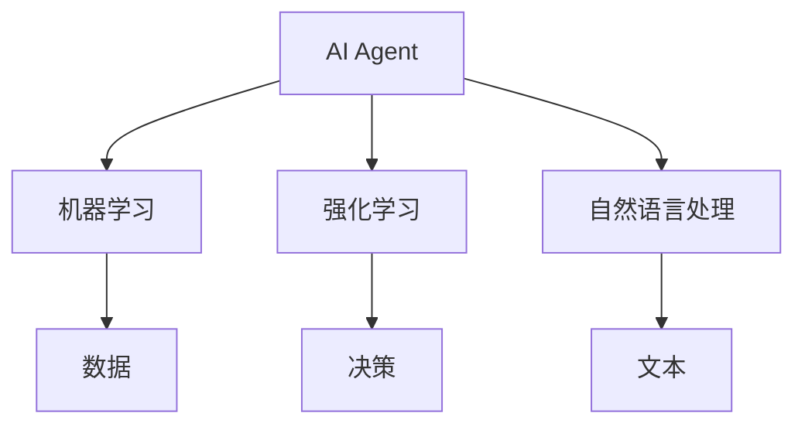
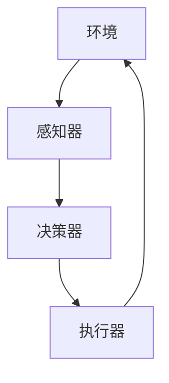
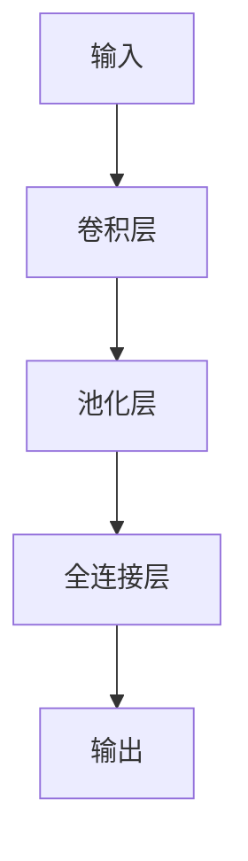
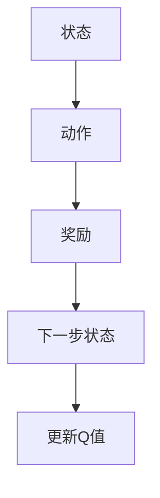
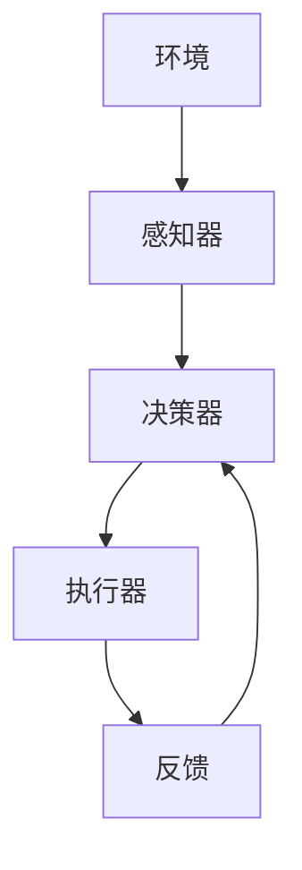

                 


# 开发具有复杂场景理解与决策能力的AI Agent

## 关键词：AI Agent，复杂场景，决策能力，机器学习，深度学习，强化学习，自然语言处理，系统架构，项目实战

## 摘要：  
本文深入探讨了开发具有复杂场景理解与决策能力的AI Agent的核心技术与方法。通过分析AI Agent的背景、核心概念、算法原理、系统架构及项目实战，全面阐述了如何构建一个能够理解复杂场景并做出智能决策的AI Agent。文章从理论到实践，结合具体案例和数学模型，为开发者提供了系统的指导和参考。

---

# 第一部分: AI Agent 的背景与概述

## 第1章: AI Agent 的核心概念与背景

### 1.1 AI Agent 的定义与特点

#### 1.1.1 AI Agent 的定义  
AI Agent（智能体）是指能够感知环境、做出决策并采取行动以实现目标的智能系统。与传统AI相比，AI Agent 更注重与环境的交互和自主决策能力。

#### 1.1.2 AI Agent 的核心特点  
- **自主性**：能够自主决策，无需外部干预。  
- **反应性**：能够实时感知环境并做出反应。  
- **学习能力**：通过数据和经验不断优化决策能力。  
- **复杂场景处理**：能够理解和处理多变、复杂的场景。  

#### 1.1.3 AI Agent 与传统 AI 的区别  
| **维度**       | **AI Agent**                     | **传统 AI**                     |  
|----------------|----------------------------------|----------------------------------|  
| **自主性**      | 高                               | 中                               |  
| **实时性**      | 高                               | 低                               |  
| **适应性**      | 高                               | 中                               |  

---

### 1.2 复杂场景理解与决策的必要性

#### 1.2.1 复杂场景的定义与挑战  
复杂场景指的是环境多变、信息不完整、目标冲突的场景，例如交通管理、机器人导航、智能客服等。  
- **挑战**：信息不确定性、决策风险、多目标冲突。  

#### 1.2.2 决策能力在 AI Agent 中的重要性  
- **核心目标**：通过决策能力实现目标的最优性。  
- **复杂场景中的决策**：需要综合考虑环境信息、历史数据和潜在风险。  

#### 1.2.3 复杂场景理解与决策的边界与外延  
- **边界**：AI Agent 的决策能力受到计算资源、数据质量和环境限制。  
- **外延**：复杂场景理解与决策能力可以扩展到更广泛的应用领域。  

---

### 1.3 AI Agent 的应用场景与价值

#### 1.3.1 复杂场景理解与决策的应用领域  
- **自动驾驶**：实时感知环境并做出驾驶决策。  
- **智能客服**：理解用户需求并提供个性化服务。  
- **机器人控制**：在复杂环境中完成任务。  

#### 1.3.2 AI Agent 在企业级应用中的价值  
- **效率提升**：通过自动化决策提高企业运营效率。  
- **成本降低**：减少人工干预，降低运营成本。  
- **用户体验优化**：提供更智能、更个性化的服务。  

#### 1.3.3 AI Agent 的未来发展趋势  
- **多模态交互**：结合视觉、听觉等多种感知方式。  
- **强化学习优化**：通过强化学习不断提升决策能力。  
- **人机协作**：AI Agent 与人类协同工作，实现更高效的决策。  

---

## 第2章: AI Agent 的核心概念与联系

### 2.1 AI Agent 的核心原理

#### 2.1.1 知识表示与推理  
- **知识表示**：将知识以符号或数据结构表示，例如逻辑推理、概率推理。  
- **推理机制**：通过推理算法从已知信息推导出新结论。  

#### 2.1.2 感知与决策机制  
- **感知**：通过传感器或数据输入获取环境信息。  
- **决策**：基于感知信息，结合目标和约束，做出决策。  

#### 2.1.3 学习与优化算法  
- **监督学习**：通过标记数据训练模型。  
- **无监督学习**：从无标记数据中发现模式。  
- **强化学习**：通过奖励机制优化决策策略。  

---

### 2.2 核心概念对比分析

#### 2.2.1 不同 AI 技术的特点对比（表格）  
| **技术**         | **特点**                           |  
|------------------|------------------------------------|  
| 机器学习         | 基于数据训练模型，预测结果。        |  
| 强化学习         | 基于奖励机制，优化决策策略。        |  
| 自然语言处理     | 处理文本数据，理解语言含义。        |  

#### 2.2.2 AI Agent 与其他技术的关系（Mermaid 图）  



---

### 2.3 AI Agent 的实体关系图

#### 2.3.1 实体关系图（Mermaid 图）  



---

# 第二部分: AI Agent 的算法原理

## 第3章: AI Agent 的感知算法

### 3.1 感知算法概述

#### 3.1.1 感知算法的定义与分类  
- **定义**：通过传感器或数据源获取环境信息。  
- **分类**：基于特征的感知、基于模型的感知。  

#### 3.1.2 常见感知算法的优缺点  
| **算法**       | **优点**                          | **缺点**                          |  
|----------------|-----------------------------------|-----------------------------------|  
| CNN            | 高精度图像识别                   | 对非结构化数据处理能力有限         |  
| RNN            | 处理序列数据                    | 并行计算能力较弱                   |  
| GNN            | 处理图结构数据                  | 对大规模数据计算能力有限           |  

---

### 3.2 基于深度学习的感知算法

#### 3.2.1 卷积神经网络（CNN）的感知原理  
- **数学模型**：  
  $$ \text{输出} = \text{输入} \times \text{卷积核} + \text{偏置} $$  

#### 3.2.2 循环神经网络（RNN）的感知原理  
- **数学模型**：  
  $$ h_t = \text{激活函数}(h_{t-1} \times w + b) $$  

#### 3.2.3 图神经网络（GNN）的感知原理  
- **数学模型**：  
  $$ z = \sum_{v \in N} \text{权重} \times x_v $$  

---

### 3.3 感知算法的数学模型

#### 3.3.1 CNN 的数学模型（Mermaid 图）  



---

## 第4章: AI Agent 的决策算法

### 4.1 决策算法概述

#### 4.1.1 决策算法的定义与分类  
- **定义**：基于感知信息做出选择和行动。  
- **分类**：基于规则的决策、基于模型的决策。  

#### 4.1.2 常见决策算法的优缺点  
| **算法**       | **优点**                          | **缺点**                          |  
|----------------|-----------------------------------|-----------------------------------|  
| Q-Learning     | 适合离散动作空间                | 需要大量样本数据                   |  
| DQN            | 能处理连续动作空间              | 训练时间较长                       |  

---

### 4.2 基于强化学习的决策算法

#### 4.2.1 Q-Learning 的决策原理  
- **数学模型**：  
  $$ Q(s, a) = Q(s, a) + \alpha (r + \gamma \max Q(s', a') - Q(s, a)) $$  

#### 4.2.2 DQN 的决策原理  
- **数学模型**：  
  $$ \text{目标} = \text{当前Q值} + \alpha (r + \gamma \max Q'(s', a') - \text{当前Q值}) $$  

---

### 4.3 决策算法的数学模型

#### 4.3.1 Q-Learning 的数学模型（Mermaid 图）  



---

## 第5章: AI Agent 的系统架构设计

### 5.1 系统功能设计

#### 5.1.1 领域模型设计（Mermaid 类图）  

```mermaid
classDiagram
    class 环境 {
        + 状态
        + 行动
        - 状态转移规则
        + 获取奖励
    }
    class 感知器 {
        + 获取环境信息
        - 处理信息
        + 输出特征
    }
    class 决策器 {
        + 接收特征
        - 计算决策
        + 输出动作
    }
    class 执行器 {
        + 执行动作
        - 获取反馈
    }
    环境 <-->> 感知器
    感知器 --> 决策器
    决策器 --> 执行器
    执行器 --> 环境
```

---

### 5.2 系统架构设计

#### 5.2.1 系统架构图（Mermaid 图）  



---

## 第6章: 项目实战

### 6.1 环境安装与配置

#### 6.1.1 安装依赖  
- 安装 Python 和相关库（如 TensorFlow、Keras）。  

#### 6.1.2 环境配置  
- 配置开发环境，例如 Jupyter Notebook 或 VS Code。  

---

### 6.2 系统核心实现

#### 6.2.1 感知器实现  
```python
class Perceptor:
    def __init__(self):
        self.model = self.build_model()

    def build_model(self):
        # 构建感知模型
        pass

    def perceive(self, input):
        return self.model.predict(input)
```

#### 6.2.2 决策器实现  
```python
class DecisionMaker:
    def __init__(self):
        self.model = self.build_model()

    def build_model(self):
        # 构建决策模型
        pass

    def decide(self, input):
        return self.model.predict(input)
```

---

### 6.3 代码应用解读与分析

#### 6.3.1 感知器代码解读  
- 感知器通过模型从环境中获取信息并进行处理。  

#### 6.3.2 决策器代码解读  
- 决策器基于感知信息做出决策并输出动作。  

---

## 第7章: 总结与展望

### 7.1 总结  
- 本文详细介绍了 AI Agent 的核心概念、算法原理和系统架构。  
- 通过项目实战，展示了如何开发一个具有复杂场景理解与决策能力的AI Agent。  

### 7.2 展望  
- 随着技术进步，AI Agent 将在更多领域得到应用。  
- 强化学习和多模态交互将是未来研究的重要方向。  

---

## 参考文献  
（此处列出相关文献和资源）  

---

通过以上内容，您可以根据实际需求扩展每个章节的具体内容，结合实际案例和更详细的代码实现，进一步完善文章。

