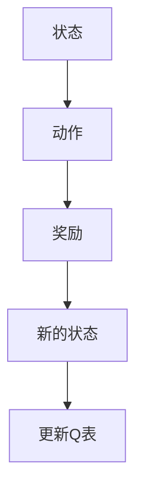
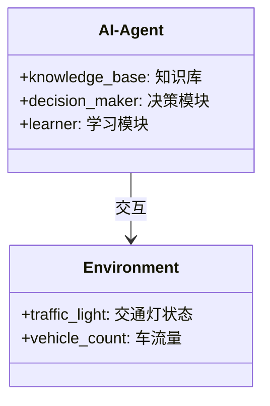
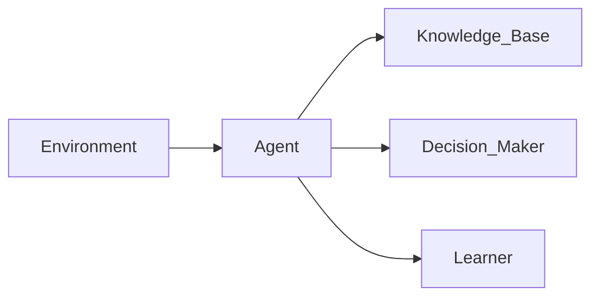
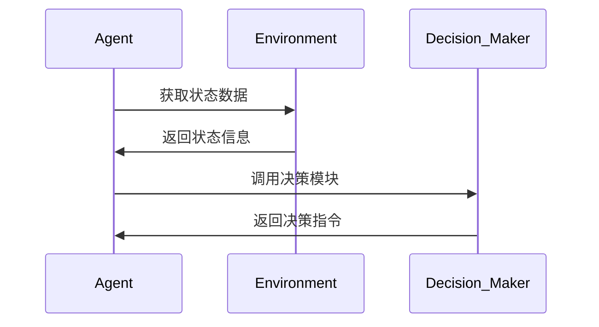

                 


# 《开发具有复杂系统建模能力的AI Agent》

**关键词：** AI Agent, 复杂系统建模, 人工智能, 强化学习, 知识表示, 系统架构

**摘要：**  
本文系统地探讨了开发具有复杂系统建模能力的AI Agent的关键技术与方法。从AI Agent的基本概念出发，深入分析其在复杂系统建模中的应用，涵盖算法原理、系统架构设计、项目实战及最佳实践等内容。通过详细讲解强化学习、知识表示、系统架构等核心模块，结合实际案例，为读者提供从理论到实践的全面指导。

---

# 第1章: AI Agent的背景与概念

## 1.1 AI Agent的基本概念
### 1.1.1 AI Agent的定义与特点
AI Agent（人工智能代理）是指能够感知环境、自主决策并执行任务的智能体。其核心特点包括自主性、反应性、目标导向和学习能力。

### 1.1.2 复杂系统建模的必要性
复杂系统建模是理解、预测和优化复杂系统行为的关键。AI Agent通过建模技术能够捕捉系统动态，提供高效的解决方案。

### 1.1.3 AI Agent在复杂系统中的角色
AI Agent在复杂系统中扮演建模工具、决策支持和自适应优化的角色，能够帮助系统更好地应对动态变化。

## 1.2 复杂系统建模的挑战
### 1.2.1 复杂系统的定义与特征
复杂系统由多个交互的组件组成，具有动态性、非线性和不确定性等特点，使得建模难度较高。

### 1.2.2 系统建模的常见挑战
包括数据不足、模型复杂度高、实时性要求高等问题，这些挑战需要结合多种技术进行解决。

### 1.2.3 AI Agent在复杂系统建模中的优势
AI Agent具备学习和自适应能力，能够处理复杂系统的动态性和不确定性。

## 1.3 相关技术与发展
### 1.3.1 机器学习与深度学习
机器学习技术为AI Agent提供了数据驱动的建模能力，深度学习则在特征提取和复杂模式识别方面表现出色。

### 1.3.2 知识图谱与符号推理
知识图谱为AI Agent提供了结构化的知识表示，符号推理技术则支持逻辑推理能力。

### 1.3.3 强化学习与决策过程
强化学习为AI Agent提供了决策优化的能力，能够通过试错学习找到最优策略。

### 1.3.4 复杂系统建模的最新进展
结合多种技术的混合建模方法成为趋势，例如强化学习与知识图谱的结合。

## 1.4 本章小结
本章介绍了AI Agent的基本概念、复杂系统建模的挑战以及相关技术的发展，为后续章节奠定了基础。

---

# 第2章: AI Agent的核心概念与联系

## 2.1 AI Agent的结构与能力
### 2.1.1 知识表示与推理能力
AI Agent需要通过知识表示技术来建模系统，并利用推理技术进行逻辑推断。

### 2.1.2 行为决策与执行能力
AI Agent能够根据环境反馈做出决策，并通过执行模块实现任务。

### 2.1.3 自适应与学习能力
AI Agent能够通过学习不断优化自身模型和策略，适应复杂系统的动态变化。

## 2.2 复杂系统建模的核心要素
### 2.2.1 系统组件与交互关系
复杂系统由多个组件组成，各组件之间的交互关系是建模的重点。

### 2.2.2 系统动态与演化规律
系统动态的建模需要考虑系统的演化过程和非线性关系。

### 2.2.3 系统目标与优化方向
明确系统目标并优化其实现是复杂系统建模的核心任务。

## 2.3 AI Agent与复杂系统的关系
### 2.3.1 AI Agent作为系统建模工具
AI Agent能够通过学习和推理技术，帮助建模复杂系统。

### 2.3.2 复杂系统对AI Agent的约束与影响
复杂系统的动态性和不确定性对AI Agent的设计和性能提出更高要求。

### 2.3.3 AI Agent在复杂系统中的应用案例
例如，在交通管理系统中，AI Agent能够优化交通流，提高效率。

## 2.4 核心概念对比表
| 概念       | 知识表示与推理能力 | 行为决策与执行能力 | 自适应与学习能力 |
|------------|---------------------|--------------------|-------------------|
| AI Agent   | 知识库的构建与推理 | 决策模块的调用     | 学习算法的优化   |
| 复杂系统   | 组件交互关系       | 系统动态演化       | 优化目标的实现   |

## 2.5 ER实体关系图
```mermaid
er
actor(AI Agent) --> knowledge_base: 使用知识库
actor(AI Agent) --> decision_maker: 调用决策模块
knowledge_base --> decision_maker: 提供决策支持
```

## 2.6 本章小结
本章详细探讨了AI Agent的核心概念及其在复杂系统建模中的应用，为后续章节的技术实现提供了理论基础。

---

# 第3章: AI Agent的算法原理与数学模型

## 3.1 强化学习算法
### 3.1.1 Q-learning算法
Q-learning是一种经典的强化学习算法，适用于离散动作空间的问题。



### 3.1.2 算法流程
```python
def q_learning(env):
    Q = defaultdict(lambda: defaultdict(int))
    for episode in range(num_episodes):
        state = env.reset()
        while not done:
            action = choose_action(Q, state)
            next_state, reward, done = env.step(action)
            Q[state][action] += reward + gamma * max(Q[next_state].values())
```

### 3.1.3 数学模型
Q-learning的更新公式为：
$$ Q(s, a) \leftarrow Q(s, a) + \alpha \left(r + \gamma \max Q(s', a') - Q(s, a)\right) $$

## 3.2 监督学习算法
### 3.2.1 线性回归
线性回归模型可以表示为：
$$ y = \beta_0 + \beta_1 x + \epsilon $$

### 3.2.2 神经网络
多层感知机（MLP）模型的数学表达为：
$$ y = \sigma(W_2 \sigma(W_1 x + b_1) + b_2) $$

## 3.3 无监督学习算法
### 3.3.1 K-means聚类
K-means的目标函数为：
$$ \arg \min_{Z, K} \sum_{i=1}^n \sum_{j=1}^k z_{ij} \|x_i - \mu_j\|^2 $$

## 3.4 本章小结
本章详细讲解了AI Agent中常用的强化学习、监督学习和无监督学习算法，并通过数学模型和流程图进行了分析。

---

# 第4章: 复杂系统建模的系统分析与架构设计

## 4.1 问题场景介绍
本章以交通流量预测为例，探讨AI Agent在复杂系统建模中的应用。

## 4.2 系统功能设计
### 4.2.1 领域模型


### 4.2.2 系统架构


## 4.3 系统接口设计
### 4.3.1 接口定义
- 输入接口：接收环境状态数据
- 输出接口：输出决策指令

### 4.3.2 交互序列图


## 4.4 本章小结
本章通过系统分析与架构设计，为AI Agent的开发提供了清晰的指导。

---

# 第5章: 项目实战与案例分析

## 5.1 项目环境安装
### 5.1.1 安装Python
```bash
python --version
pip install --upgrade pip
```

### 5.1.2 安装依赖库
```bash
pip install numpy pandas scikit-learn
```

## 5.2 核心实现源代码
### 5.2.1 知识表示模块
```python
class KnowledgeBase:
    def __init__(self):
        self.data = {}
    
    def addKnowledge(self, key, value):
        self.data[key] = value
```

### 5.2.2 决策模块
```python
class DecisionMaker:
    def makeDecision(self, knowledge_base):
        # 基于知识库做出决策
        pass
```

## 5.3 案例分析
以交通流量预测为例，详细分析AI Agent的实现过程，包括数据预处理、模型训练和结果分析。

## 5.4 本章小结
本章通过实际项目案例，展示了AI Agent在复杂系统建模中的应用，帮助读者掌握开发技巧。

---

# 第6章: 最佳实践与小结

## 6.1 最佳实践
### 6.1.1 数据预处理的重要性
确保数据质量和完整性，是建模成功的关键。

### 6.1.2 模型调参的注意事项
合理选择参数，避免过拟合和欠拟合。

## 6.2 小结
本文系统地介绍了AI Agent的开发过程，从理论到实践，为读者提供了全面的指导。

## 6.3 注意事项
在实际开发中，要注意系统的实时性和可扩展性，确保模型的稳定性和高效性。

## 6.4 拓展阅读
推荐相关书籍和论文，帮助读者深入学习AI Agent和复杂系统建模技术。

---

# 结语

通过本文的系统介绍，读者可以掌握开发具有复杂系统建模能力的AI Agent的关键技术与方法，为实际应用打下坚实基础。

