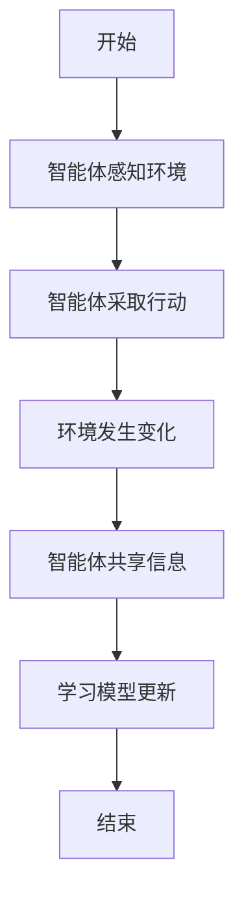
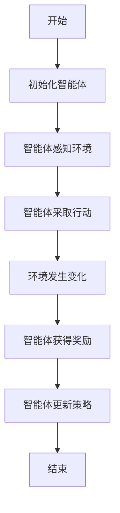
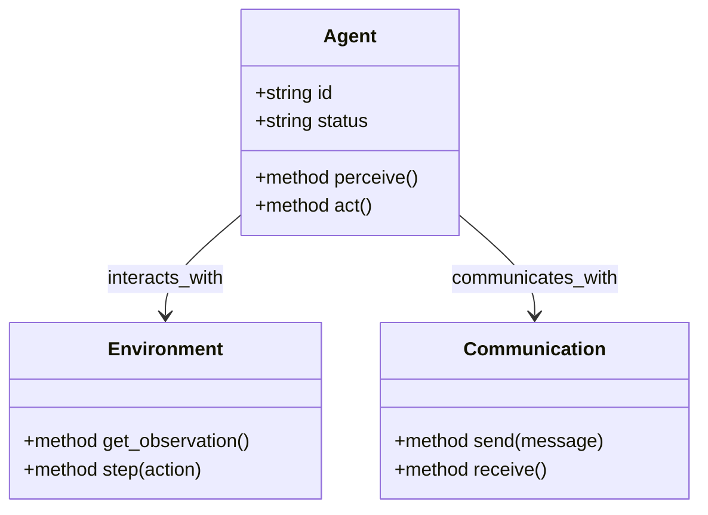
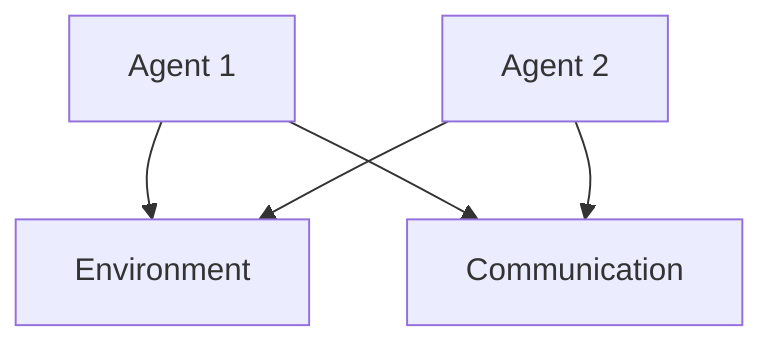
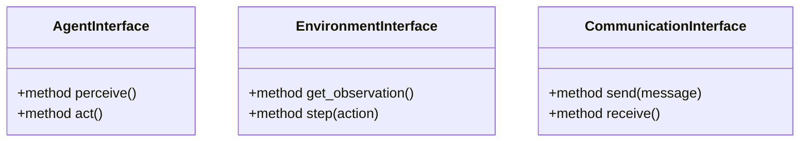

                 


# 开发具有多Agent协同学习能力的系统

> 关键词：多Agent系统，协同学习，分布式强化学习，系统架构，项目实战

> 摘要：本文详细介绍了开发具有多Agent协同学习能力的系统所需的核心概念、算法原理、系统架构设计、项目实战以及应用案例。通过逐步分析，帮助读者理解多Agent协同学习的原理和实现方法，并提供实际案例和代码实现，帮助开发者掌握相关技术。

---

## 第一部分：多Agent协同学习系统概述

### 第1章：多Agent协同学习的背景与概念

#### 1.1 多Agent系统的基本概念

##### 1.1.1 Agent的定义与特征
Agent（智能体）是指能够感知环境并采取行动以实现目标的实体。Agent可以是软件程序、机器人或其他智能系统。其主要特征包括：
- **自主性**：能够在没有外部干预的情况下独立运行。
- **反应性**：能够感知环境并实时调整行为。
- **目标导向性**：通过采取行动来实现预设目标。
- **社交能力**：能够与其他Agent或人类进行交互和协作。

##### 1.1.2 多Agent系统的定义
多Agent系统（Multi-Agent System, MAS）是由多个智能体组成的系统，这些智能体通过通信和协作完成复杂任务。多Agent系统的核心在于智能体之间的协同与合作。

##### 1.1.3 协同学习的定义与特点
协同学习（Collaborative Learning）是指多个智能体通过共享信息和经验，共同改进学习模型的过程。其特点是：
- **信息共享**：智能体之间共享数据和知识。
- **协作优化**：通过协作提高整体学习效果。
- **动态适应**：能够根据环境变化调整学习策略。

#### 1.2 多Agent协同学习的背景与意义

##### 1.2.1 当前AI发展的新趋势
人工智能技术的快速发展推动了多Agent系统的应用。传统的单智能体学习难以处理复杂场景，而多Agent协同学习能够更好地应对现实中的复杂问题。

##### 1.2.2 多Agent协同学习的优势
- **任务分解**：将复杂任务分解为多个子任务，由不同智能体协作完成。
- **鲁棒性**：通过多个智能体的协作，系统更具容错性和适应性。
- **知识共享**：智能体之间的知识共享能够提高整体学习效率。

##### 1.2.3 多Agent协同学习的应用场景
- **分布式计算**：如分布式计算任务的分配与优化。
- **机器人协作**：如工业机器人协同完成复杂任务。
- **游戏AI**：如多人在线游戏中的智能队友协作。

#### 1.3 多Agent协同学习的核心概念

##### 1.3.1 多Agent系统的组成结构
多Agent系统通常包括以下组成部分：
- **环境**：智能体所处的外部环境。
- **智能体**：多个具有自主性的智能体。
- **通信机制**：智能体之间交换信息的方式。
- **协作机制**：智能体之间协作完成任务的方式。

##### 1.3.2 协同学习的基本原理
协同学习的核心在于智能体之间的信息共享和协作。通过共享经验、知识和策略，多个智能体能够共同改进学习模型，从而提高整体性能。

##### 1.3.3 多Agent协同学习的分类与对比
多Agent协同学习可以分为以下几类：
- **基于通信的协同学习**：智能体之间通过通信共享信息。
- **基于状态的协同学习**：智能体根据环境状态进行协作。
- **基于任务的协同学习**：智能体根据任务需求进行协作。

---

### 第2章：多Agent协同学习的核心概念与联系

#### 2.1 多Agent系统的核心概念

##### 2.1.1 Agent的类型与特征
Agent可以根据多种标准进行分类，常见的分类方式包括：
- **按智能体的智能水平**：
  - 反应式智能体（Reactive Agent）：仅根据当前感知做出反应。
  - 规划式智能体（Deliberative Agent）：具有推理和规划能力。
- **按智能体的社交能力**：
  - 单智能体（Single-Agent）：独立完成任务。
  - 多智能体（Multi-Agent）：协作完成任务。

##### 2.1.2 多Agent系统的通信机制
通信机制是多Agent系统中智能体之间交换信息的方式。常见的通信机制包括：
- **直接通信**：智能体之间直接交换信息。
- **间接通信**：通过中间媒介（如共享数据库）进行信息交换。

##### 2.1.3 多Agent系统的协作机制
协作机制是多Agent系统中智能体之间协作完成任务的方式。常见的协作机制包括：
- **任务分配**：根据智能体的能力分配任务。
- **协同决策**：智能体共同决策以实现最优结果。

#### 2.2 多Agent系统中的实体关系

##### 2.2.1 ER实体关系图
以下是一个简单的ER实体关系图，展示了多Agent系统中的主要实体及其关系：

```mermaid
erDiagram
    actor User {
        +string username
        +string password
    }
    agent Agent {
        +string agent_id
        +string status
    }
    communication Communication {
        +string message
        +datetime timestamp
    }
    User --> Agent: controls
    Agent --> Communication: sends
    Communication --> Agent: receives
```

##### 2.2.2 Mermaid流程图
以下是一个多Agent系统中协作学习的流程图：



---

### 第3章：多Agent协同学习的算法原理

#### 3.1 分布式强化学习算法

##### 3.1.1 算法原理
分布式强化学习（Distributed Reinforcement Learning, DRL）是一种多Agent强化学习方法，通过多个智能体协作完成任务。以下是DRL的算法流程：



##### 3.1.2 算法实现
以下是DRL算法的Python实现示例：

```python
import numpy as np
import gym

class Agent:
    def __init__(self, env):
        self.env = env
        self.observation_space = env.observation_space
        self.action_space = env.action_space

    def perceive(self):
        return self.env.observation_space.sample()

    def act(self, action):
        return self.env.step(action)

def main():
    env = gym.make('CartPole-v0')
    agent = Agent(env)
    for _ in range(1000):
        observation = agent.perceive()
        action = agent.env.action_space.sample()
        reward, next_observation, done, info = agent.act(action)
        print(f"Reward: {reward}")

if __name__ == "__main__":
    main()
```

##### 3.1.3 数学模型与公式
以下是DRL算法的数学模型：

$$
Q(s, a) = Q(s, a) + \alpha (r + \gamma \max_{a'} Q(s', a') - Q(s, a))
$$

其中：
- \( Q(s, a) \) 表示状态 \( s \) 下采取行动 \( a \) 的价值函数。
- \( \alpha \) 表示学习率。
- \( r \) 表示奖励。
- \( \gamma \) 表示折扣因子。
- \( s' \) 表示下一个状态。

---

## 第四部分：系统分析与架构设计方案

### 第4章：多Agent协同学习的系统架构设计

#### 4.1 系统功能设计

##### 4.1.1 领域模型设计
以下是领域模型设计的类图：



#### 4.2 系统架构设计

##### 4.2.1 系统架构图
以下是系统架构设计的架构图：



#### 4.3 系统接口设计

##### 4.3.1 接口设计
以下是系统接口设计的类图：



#### 4.4 系统交互设计

##### 4.4.1 交互流程图
以下是系统交互设计的流程图：

```mermaid
flowchart TD
    A[Agent 1] --> B[Environment]: perceive
    B --> C[Agent 1]: receive_observation
    C --> D[Agent 1]: decide_action
    D --> E[Environment]: act
    E --> F[Agent 1]: receive_reward
```

---

## 第五部分：项目实战

### 第5章：多Agent协同学习的项目实战

#### 5.1 环境安装

##### 5.1.1 环境配置
以下是项目实战所需的环境配置：

```bash
pip install gym numpy matplotlib
```

#### 5.2 核心代码实现

##### 5.2.1 Python源代码实现
以下是多Agent协同学习的Python实现示例：

```python
import gym
import numpy as np

class MultiAgent:
    def __init__(self, env):
        self.env = env
        self.agents = [Agent(env) for _ in range(2)]

    def run(self):
        for _ in range(1000):
            for agent in self.agents:
                observation = agent.perceive()
                action = agent.act(observation)
                reward = self.env.get_reward(observation, action)
                agent.learn(reward)

def main():
    env = gym.make('CartPole-v0')
    multi_agent = MultiAgent(env)
    multi_agent.run()

if __name__ == "__main__":
    main()
```

##### 5.2.2 代码解读
- **MultiAgent类**：管理多个智能体的协作。
- **run方法**：协调多个智能体的行动和学习。
- **Agent类**：单个智能体的实现，包括感知、行动和学习方法。

#### 5.3 项目小结

##### 5.3.1 项目总结
通过该项目，我们实现了多个智能体的协作学习，验证了多Agent协同学习算法的有效性。

##### 5.3.2 实际案例分析
在CartPole环境中，两个智能体通过协作学习，能够更好地平衡杆子，提高奖励值。

---

## 第六部分：总结与展望

### 第6章：多Agent协同学习的应用案例与总结展望

#### 6.1 应用案例

##### 6.1.1 游戏AI
多Agent协同学习在游戏AI中的应用，如MOBA游戏中的智能队友协作。

##### 6.1.2 机器人协作
多Agent协同学习在机器人协作中的应用，如工业机器人协同完成复杂任务。

#### 6.2 总结与展望

##### 6.2.1 总结
通过本文的介绍，我们全面了解了多Agent协同学习的核心概念、算法原理、系统架构设计和项目实战。

##### 6.2.2 展望
未来，随着人工智能技术的不断发展，多Agent协同学习将在更多领域得到应用，如自动驾驶、智能城市等。

---

### 最佳实践 tips

- **性能优化**：在多Agent系统中，可以通过优化通信机制和学习算法来提高系统性能。
- **安全性考虑**：在多Agent系统中，需要考虑智能体之间的信任和安全问题。
- **可扩展性设计**：在系统设计中，需要考虑系统的可扩展性，以便未来添加更多智能体。

---

### 总结

通过本文的详细介绍，我们全面了解了多Agent协同学习的核心概念、算法原理、系统架构设计和项目实战。希望本文能够帮助读者更好地理解多Agent协同学习的技术原理和实现方法，并能够在实际项目中加以应用。

---

### 拓展阅读

- **相关论文**：建议阅读关于多Agent协同学习的经典论文，如“Multi-Agent Reinforcement Learning”。
- **技术博客**：关注相关技术博客，了解多Agent协同学习的最新进展。
- **工具与库**：学习使用相关的工具和库，如OpenAI Gym、TensorFlow等。

通过不断学习和实践，我们相信读者能够掌握多Agent协同学习的核心技术，并在实际项目中取得成功。

