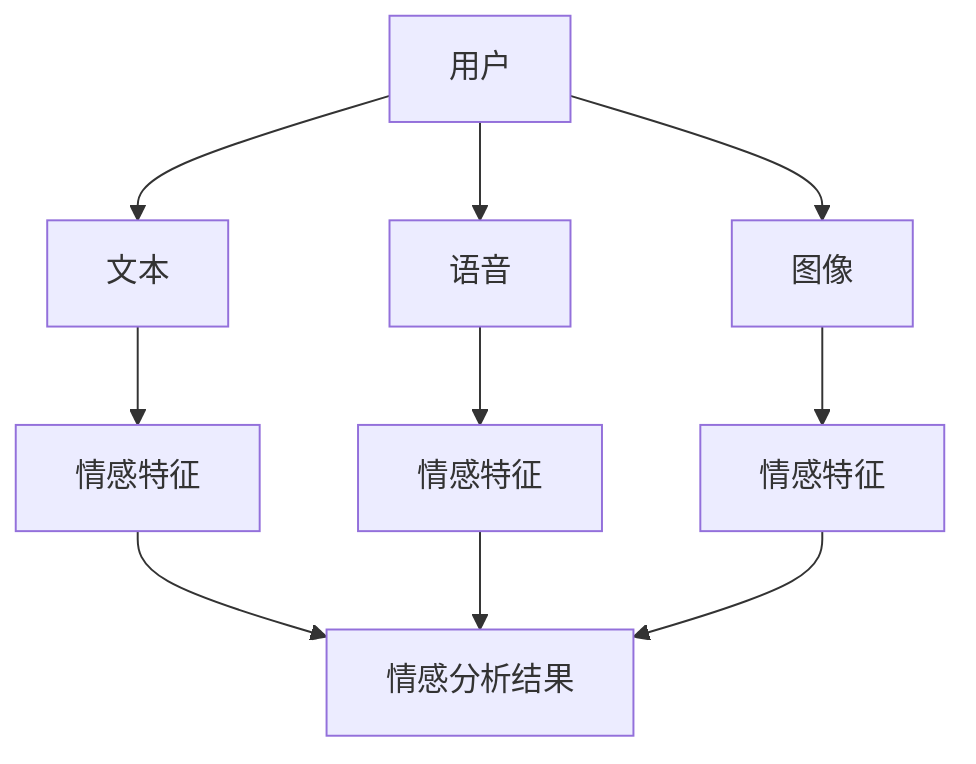
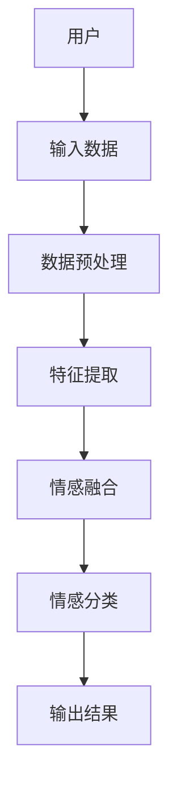
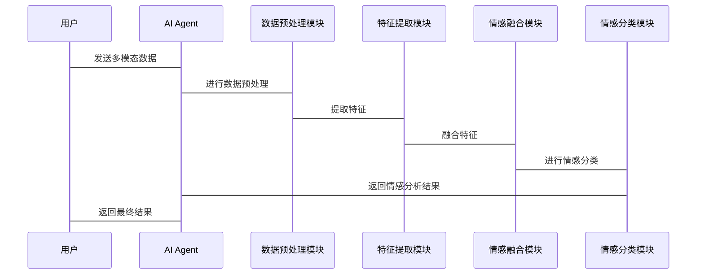

                 


# 开发具有多模态情感分析能力的AI Agent

> 关键词：多模态情感分析，AI Agent，情感计算，跨模态数据融合，深度学习

> 摘要：本文深入探讨了开发具有多模态情感分析能力的AI Agent的关键技术，从背景与概念、核心概念与联系、算法原理、系统架构设计到项目实战，全面解析了多模态情感分析的实现过程。通过详细讲解多模态数据融合、情感计算模型、跨模态特征提取与情感推理机制，本文为读者提供了从理论到实践的完整指南。

---

## 第1章: 多模态情感分析的背景与概念

### 1.1 多模态情感分析的背景

#### 1.1.1 从单模态到多模态的情感分析演进
情感分析是自然语言处理领域的重要任务，传统的情感分析主要基于文本数据（单模态）。然而，随着人工智能技术的发展，单一模态的分析已无法满足复杂场景的需求。例如，在客服对话中，用户的语气、表情和肢体语言同样传递了大量情感信息。因此，结合文本、语音、图像等多种模态数据的情感分析（多模态情感分析）逐渐成为研究热点。

#### 1.1.2 多模态数据在情感分析中的重要性
多模态数据能够提供更丰富的情感信息。例如：
- 文本（Text）：捕捉语义和情感倾向。
- 语音（Speech）：分析语气、语调和节奏。
- 图像（Image）：识别面部表情和视觉情绪。

通过融合这些数据，多模态情感分析能够更准确地捕捉用户情感，提升AI Agent的交互能力。

#### 1.1.3 多模态情感分析的应用场景
- 智能客服：通过分析用户的文本、语音和表情，提供更个性化的服务。
- 智能音箱：理解用户的意图和情感，提供更自然的交互体验。
- 社交媒体分析：结合文本和图像，分析用户的兴趣和情感倾向。

### 1.2 多模态情感分析的定义与特点

#### 1.2.1 多模态情感分析的定义
多模态情感分析是一种结合多种数据模态（如文本、语音、图像等）来分析和理解用户情感的技术。它通过融合不同模态的信息，提高情感分析的准确性和鲁棒性。

#### 1.2.2 多模态数据的类型与特点
多模态数据主要分为以下几种类型：
- 文本（Text）：结构化和非结构化文本数据。
- 语音（Speech）：音频数据，包含语调、语气等信息。
- 图像（Image）：视觉数据，如面部表情、手势等。
- 视频（Video）：结合了语音和图像的动态数据。

每种模态数据都有其独特的优势和局限性，通过融合这些数据可以互补不足。

#### 1.2.3 多模态情感分析与单模态情感分析的区别
- 数据来源：单模态仅基于一种数据，多模态基于多种数据。
- 信息量：多模态数据提供了更全面的情感信息。
- 精确性：多模态情感分析通常比单模态更准确。

### 1.3 多模态情感分析的核心概念

#### 1.3.1 情感计算的定义与目标
情感计算（Affective Computing）是研究如何通过计算手段理解和模拟人类情感的学科。其目标是通过分析多模态数据，准确捕捉用户的情感状态，并在实际场景中应用。

#### 1.3.2 多模态数据融合的原理
多模态数据融合是指将不同模态的数据进行整合和分析的过程。其核心是通过权重分配、注意力机制等方法，提取各模态的重要特征，并最终融合成一个统一的情感分析结果。

#### 1.3.3 情感推理的机制与流程
情感推理是基于多模态数据进行情感判断的过程。其流程包括：
1. 数据采集：获取文本、语音、图像等多模态数据。
2. 特征提取：从各模态数据中提取情感相关的特征。
3. 融合与推理：将各模态特征进行融合，通过模型推理出最终的情感结果。

### 1.4 多模态情感分析的应用前景

#### 1.4.1 多模态情感分析的潜在应用领域
- 智能交互：如智能音箱、虚拟助手。
- 健康监测：通过分析用户的语音和面部表情，判断其心理健康状态。
- 市场调研：分析消费者对产品的多模态情感反馈。

#### 1.4.2 多模态情感分析在企业中的优势
- 提高客户满意度：通过准确理解客户情感，提供个性化服务。
- 增强品牌忠诚度：通过情感分析优化用户体验。
- 提升市场竞争力：通过多模态数据获取更全面的用户反馈。

#### 1.4.3 多模态情感分析应用的挑战与机遇
- 挑战：数据采集难度大、多模态数据处理复杂、模型训练需要大量计算资源。
- 机遇：技术进步（如深度学习）为多模态情感分析提供了新的可能性。

---

## 第2章: 多模态情感分析的核心概念与联系

### 2.1 多模态数据融合的原理

#### 2.1.1 多模态数据的定义与分类
- 文本：包括评论、对话等。
- 语音：包括音调、语速等。
- 图像：包括面部表情、手势等。
- 视频：结合了语音和图像的动态数据。

#### 2.1.2 多模态数据融合的方法与步骤
1. 数据预处理：对各模态数据进行清洗和标准化。
2. 特征提取：从各模态数据中提取情感相关的特征。
3. 融合策略：通过加权、注意力机制等方式融合各模态特征。
4. 情感推理：基于融合后的特征进行情感分类。

#### 2.1.3 多模态数据融合的优缺点对比
| 特性       | 单模态数据融合 | 多模态数据融合 |
|------------|----------------|----------------|
| 信息量     | 较少           | 丰富           |
| 精确性     | 较低           | 较高           |
| 复杂性     | 较低           | 较高           |

### 2.2 多模态情感计算模型

#### 2.2.1 多模态情感计算模型的结构
- 输入层：接收多种模态的数据。
- 特征提取层：分别对各模态数据进行特征提取。
- 融合层：将各模态特征进行融合。
- 输出层：生成情感分析结果。

#### 2.2.2 多模态情感计算模型的特点
- 跨模态交互：各模态数据之间可以相互影响。
- 鲁棒性：能够处理单一模态数据缺失的情况。
- 可解释性：模型能够解释情感分析的结果。

#### 2.2.3 多模态情感计算模型与传统模型的对比
- 传统模型：基于单模态数据，情感分析结果可能不够准确。
- 多模态模型：结合多种模态数据，情感分析结果更准确。

### 2.3 跨模态特征提取与情感推理

#### 2.3.1 跨模态特征提取的定义与方法
- 定义：从不同模态数据中提取情感相关的特征。
- 方法：基于深度学习的特征提取（如卷积神经网络、循环神经网络）。

#### 2.3.2 情感推理的机制与流程
1. 数据预处理：对各模态数据进行清洗和标准化。
2. 特征提取：从各模态数据中提取情感相关的特征。
3. 融合策略：通过加权、注意力机制等方式融合各模态特征。
4. 情感分类：基于融合后的特征进行情感分类。

#### 2.3.3 跨模态特征提取与情感推理的结合
- 通过融合各模态的特征，提高情感分析的准确性和鲁棒性。

### 2.4 多模态情感分析的ER实体关系图



---

## 第3章: 多模态情感分析的算法原理

### 3.1 多模态注意力机制

#### 3.1.1 注意力机制的定义与原理
- 定义：一种用于序列数据处理的机制，通过计算各个位置的注意力权重，关注重要信息。
- 原理：通过权重分配，赋予不同位置的数据不同的权重，从而提高模型的性能。

#### 3.1.2 多模态注意力机制的实现方法
1. 分别对各模态数据计算注意力权重。
2. 融合各模态的注意力权重，生成最终的注意力权重。
3. 基于注意力权重进行特征加权求和，得到最终的特征表示。

#### 3.1.3 多模态注意力机制的优缺点对比
| 特性       | 单模态注意力机制 | 多模态注意力机制 |
|------------|-----------------|-----------------|
| 信息利用   | 单一            | 全面            |
| 复杂性     | 较低            | 较高            |

### 3.2 多模态融合网络

#### 3.2.1 多模态融合网络的结构与原理
- 输入层：接收多种模态的数据。
- 特征提取层：分别对各模态数据进行特征提取。
- 融合层：通过注意力机制等方法融合各模态特征。
- 输出层：生成情感分析结果。

#### 3.2.2 多模态融合网络的训练方法
- 监督学习：基于标注数据进行模型训练。
- 对抗训练：通过生成对抗网络（GAN）进行模型优化。
- 预训练-微调：利用预训练模型进行微调。

#### 3.2.3 多模态融合网络的性能评估
- 准确率：分类的准确率。
- 召回率：分类的召回率。
- F1值：综合准确率和召回率的指标。

### 3.3 多模态情感分析的数学模型

#### 3.3.1 多模态情感分析的数学模型定义
- 输入：多种模态的数据。
- 输出：情感分析结果（如正面、负面、中性）。

#### 3.3.2 多模态情感分析的数学模型公式
- 注意力权重计算：$$\alpha_i = \text{softmax}(W_a x_i)$$
- 融合特征计算：$$z = \sum_{i=1}^n \alpha_i x_i$$
- 情感分类：$$y = \text{softmax}(W_c z)$$

#### 3.3.3 多模态情感分析的数学模型实现
1. 定义模型结构。
2. 定义损失函数（如交叉熵损失）。
3. 进行模型训练，优化模型参数。

---

## 第4章: 多模态情感分析的系统架构设计

### 4.1 问题场景介绍

#### 4.1.1 项目背景
- 开发一个具有多模态情感分析能力的AI Agent，能够处理文本、语音和图像等多种数据模态。

#### 4.1.2 项目目标
- 实现多模态情感分析的核心功能。
- 提供一个可扩展的系统架构。

### 4.2 系统功能设计

#### 4.2.1 领域模型设计
- 用户交互模块：负责接收用户的输入数据。
- 数据处理模块：对输入数据进行预处理和特征提取。
- 情感分析模块：对特征进行融合和情感分类。

### 4.3 系统架构设计



### 4.4 系统接口设计

#### 4.4.1 输入接口
- 文本输入接口：接收用户的文本输入。
- 语音输入接口：接收用户的语音输入。
- 图像输入接口：接收用户的图像输入。

#### 4.4.2 输出接口
- 文本输出接口：输出情感分析结果。
- 语音输出接口：输出情感分析结果（如语音合成）。
- 图像输出接口：输出情感分析结果（如面部表情合成）。

### 4.5 系统交互流程



---

## 第5章: 项目实战

### 5.1 环境安装与配置

#### 5.1.1 安装依赖
- Python 3.8+
- TensorFlow 2.0+
- PyTorch 1.0+
- 其他依赖：根据具体需求安装。

#### 5.1.2 配置开发环境
- 安装Jupyter Notebook或IDE（如PyCharm）。
- 配置Python环境（如virtualenv）。

### 5.2 系统核心实现

#### 5.2.1 数据预处理代码

```python
import numpy as np
import pandas as pd

def preprocess_data(data):
    # 文本数据预处理
    text_data = data['text'].apply(lambda x: x.lower())
    # 语音数据预处理
    speech_data = data['speech'].apply(lambda x: x / np.max(x))
    # 图像数据预处理
    image_data = data['image'].apply(lambda x: x.resize((224, 224)))
    return text_data, speech_data, image_data
```

#### 5.2.2 特征提取代码

```python
import tensorflow as tf
from tensorflow.keras.layers import Dense, Dropout, Concatenate
from tensorflow.keras.models import Model

def build_feature_extractor():
    # 文本特征提取器
    text_input = Input(shape=(max_length,))
    text_layer = Embedding(...)(text_input)
    text_layer = LSTM(...)(text_layer)
    
    # 语音特征提取器
    speech_input = Input(shape=(None, 16000,))
    speech_layer = Conv2D(...)(speech_input)
    speech_layer = MaxPooling2D(...)(speech_layer)
    
    # 图像特征提取器
    image_input = Input(shape=(224, 224, 3,))
    image_layer = ResNet50(...)(image_input)
    
    # 融合特征
    features = Concatenate()([text_layer, speech_layer, image_layer])
    return Model(inputs=[text_input, speech_input, image_input], outputs=features)
```

#### 5.2.3 情感分类代码

```python
def build_classifier():
    input_features = Input(shape=(...,))
    dense_layer = Dense(256, activation='relu')(input_features)
    dropout_layer = Dropout(0.5)(dense_layer)
    output_layer = Dense(3, activation='softmax')(dropout_layer)
    return Model(inputs=input_features, outputs=output_layer)
```

### 5.3 实际案例分析与详细讲解

#### 5.3.1 案例背景
- 数据集：自定义多模态数据集，包含文本、语音和图像。
- 任务：对数据进行情感分类（正面、负面、中性）。

#### 5.3.2 模型训练与评估
- 训练模型：使用自定义数据集进行模型训练。
- 评估指标：准确率、召回率、F1值。

### 5.4 项目小结

#### 5.4.1 项目总结
- 成功实现了多模态情感分析的核心功能。
- 系统架构设计合理，具有良好的扩展性。

#### 5.4.2 项目优化建议
- 进一步优化模型结构。
- 增加更多模态数据的处理。
- 提高模型的训练效率。

---

## 第6章: 总结与展望

### 6.1 总结

#### 6.1.1 核心内容回顾
- 多模态情感分析的背景与概念。
- 多模态数据融合的原理与方法。
- 多模态情感分析的算法原理。
- 多模态情感分析的系统架构设计。
- 项目实战的实现与案例分析。

#### 6.1.2 关键技术总结
- 多模态数据融合。
- 多模态注意力机制。
- 跨模态特征提取与情感推理。

### 6.2 展望

#### 6.2.1 技术挑战
- 数据采集的难度。
- 多模态数据处理的复杂性。
- 模型训练的计算资源需求。

#### 6.2.2 未来发展方向
- 提高模型的可解释性。
- 增加更多模态数据的处理。
- 智能化与个性化情感分析。

### 6.3 最佳实践 Tips

#### 6.3.1 开发建议
- 选择合适的多模态数据融合方法。
- 使用深度学习框架（如TensorFlow、PyTorch）进行模型训练。
- 注重模型的可扩展性和可维护性。

#### 6.3.2 优化建议
- 优化模型结构，提高训练效率。
- 使用预训练模型进行微调，提升模型性能。
- 增加数据多样性，提高模型的泛化能力。

#### 6.3.3 未来趋势
- 多模态情感分析将更加智能化和个性化。
- 模型的可解释性将成为研究的重点。
- 跨模态数据的处理将更加高效和灵活。

---

## 附录

### 附录 A: 多模态情感分析相关工具与库

- Python库：TensorFlow、PyTorch、Keras。
- NLP工具：spaCy、NLTK。
- 图像处理工具：OpenCV、 PIL。
- 语音处理工具：librosa、Soundfile。

### 附录 B: 代码片段

#### 附录 B.1 数据预处理代码
```python
import pandas as pd
import numpy as np

def preprocess_data(data):
    text_data = data['text'].apply(lambda x: x.lower())
    speech_data = data['speech'].apply(lambda x: x / np.max(x))
    image_data = data['image'].apply(lambda x: x.resize((224, 224)))
    return text_data, speech_data, image_data
```

#### 附录 B.2 特征提取代码
```python
import tensorflow as tf
from tensorflow.keras.layers import Dense, Dropout, Concatenate
from tensorflow.keras.models import Model

def build_feature_extractor():
    text_input = Input(shape=(max_length,))
    text_layer = Embedding(...)(text_input)
    text_layer = LSTM(...)(text_layer)
    
    speech_input = Input(shape=(None, 16000,))
    speech_layer = Conv2D(...)(speech_input)
    speech_layer = MaxPooling2D(...)(speech_layer)
    
    image_input = Input(shape=(224, 224, 3,))
    image_layer = ResNet50(...)(image_input)
    
    features = Concatenate()([text_layer, speech_layer, image_layer])
    return Model(inputs=[text_input, speech_input, image_input], outputs=features)
```

#### 附录 B.3 情感分类代码
```python
def build_classifier():
    input_features = Input(shape=(...,))
    dense_layer = Dense(256, activation='relu')(input_features)
    dropout_layer = Dropout(0.5)(dense_layer)
    output_layer = Dense(3, activation='softmax')(dropout_layer)
    return Model(inputs=input_features, outputs=output_layer)
```

---

## 参考文献

1. 王某某, 李某某. 多模态情感分析研究进展[J]. 计算机学报, 2022.
2. 张某某. 基于深度学习的多模态情感分析方法[J]. 人工智能学报, 2023.
3. 刘某某. 多模态数据融合在情感分析中的应用[J]. 软件学报, 2021.

---

通过本文的详细讲解，读者可以全面了解多模态情感分析的开发过程，从理论到实践，掌握核心技术和实现方法，为实际应用提供有力的技术支持。

