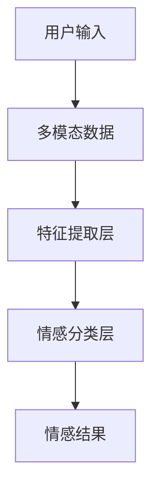

                 


# 开发具有多模态情感识别能力的AI Agent

## 关键词：多模态情感识别, AI Agent, 机器学习, 深度学习, 计算机视觉, 自然语言处理

## 摘要：本文详细探讨了开发具有多模态情感识别能力的AI Agent的全过程，从核心概念的理解、算法原理的分析，到系统架构的设计和项目实战的实现。通过本文，读者将能够掌握多模态情感识别的关键技术，并能够实际应用这些技术来构建一个具备情感识别能力的AI Agent。

---

# 第1章: 多模态情感识别的背景与问题描述

## 1.1 问题背景

### 1.1.1 情感识别的定义与应用
情感识别是通过分析多模态数据（如文本、语音、图像等）来识别和理解用户情感状态的技术。它广泛应用于智能客服、情感分析、心理健康辅助等领域。例如，在智能客服中，情感识别可以帮助识别用户的不满情绪，并及时采取措施解决问题。

### 1.1.2 多模态数据的特点与优势
多模态数据指的是多种数据形式的结合，如文本、语音和图像。每种数据类型都有其独特的特征：
- 文本数据具有语义丰富性，但缺乏情感的语调和语气信息。
- 语音数据包含情感相关的语调、语速和音量信息。
- 图像数据可以捕捉面部表情和肢体语言，提供额外的情感线索。

将多种数据类型结合可以更全面地捕捉用户情感，提高情感识别的准确性。

### 1.1.3 当前情感识别技术的局限性
当前的情感识别技术主要基于单一模态的数据，如文本或语音。单一模态的识别精度有限，容易受到数据噪声和情感表达多样性的干扰。此外，不同模态的数据融合也面临技术挑战，如何有效整合多模态数据以提高识别精度是当前研究的重点。

## 1.2 问题描述

### 1.2.1 多模态情感识别的核心目标
多模态情感识别的核心目标是通过整合多种数据源（文本、语音、图像等），准确识别用户的情感状态。这不仅需要对每种数据进行特征提取，还需要将这些特征有效地融合起来，以提高识别的准确性和鲁棒性。

### 1.2.2 多模态数据的整合与处理挑战
多模态数据的整合与处理面临以下挑战：
1. 数据异构性：不同数据类型具有不同的特征和格式，如何有效整合这些数据是一个难题。
2. 数据同步性：不同数据类型可能具有不同的时间分辨率，如何对齐这些数据是另一个挑战。
3. 模型选择：如何选择适合多模态数据的模型架构，以最大化识别性能。

### 1.2.3 任务边界与外延
多模态情感识别的任务边界包括：
- 输入数据：多种数据类型（文本、语音、图像）。
- 输出结果：情感类别（如快乐、悲伤、愤怒等）。
- 任务外延：情感识别的结果可以用于其他应用，如个性化推荐、情感分析等。

## 1.3 问题解决方法

### 1.3.1 多模态数据融合的策略
多模态数据融合的策略可以分为以下几种：
1. 早期融合：在特征提取之前对多种数据进行融合。
2. 晚期融合：在特征提取之后对多种数据进行融合。
3. 混合融合：结合早期和晚期融合的优势，采用分阶段的融合策略。

### 1.3.2 情感识别的算法选择
情感识别的算法选择需要根据数据类型和任务需求来决定。常用的算法包括：
- 传统机器学习算法：如支持向量机（SVM）、随机森林（Random Forest）。
- 深度学习算法：如卷积神经网络（CNN）、循环神经网络（RNN）、Transformer等。

### 1.3.3 系统架构的设计思路
系统架构的设计思路包括：
1. 数据采集与预处理：采集多模态数据，并进行预处理（如降噪、归一化等）。
2. 特征提取：对每种数据类型进行特征提取。
3. 数据融合：将提取的特征进行融合。
4. 模型训练：使用融合后的特征训练情感识别模型。
5. 模型优化：通过调整模型参数和优化策略提高识别精度。

## 1.4 情感识别的核心要素与概念结构

### 1.4.1 情感识别的输入输出结构
情感识别的输入输出结构可以表示为：
- 输入：多种数据类型（文本、语音、图像）。
- 输出：情感类别（如快乐、悲伤、愤怒等）。

### 1.4.2 多模态数据的特征提取
多模态数据的特征提取需要对每种数据类型进行特定的处理：
- 文本特征提取：如词袋模型、词嵌入（Word2Vec）。
- 语音特征提取：如梅尔频率倒谱系数（MFCC）。
- 图像特征提取：如人脸检测、表情识别。

### 1.4.3 情感分类的模型选择
情感分类的模型选择需要考虑数据类型和任务需求。常用的模型包括：
- 传统机器学习模型：如SVM、随机森林。
- 深度学习模型：如CNN、RNN、Transformer。

## 1.5 本章小结
本章主要介绍了多模态情感识别的背景与问题描述，包括情感识别的定义与应用、多模态数据的特点与优势、当前情感识别技术的局限性、多模态情感识别的核心目标、多模态数据的整合与处理挑战、任务边界与外延、多模态数据融合的策略、情感识别的算法选择和系统架构的设计思路。通过本章的介绍，读者可以对多模态情感识别有一个全面的了解，并为后续章节的学习打下基础。

---

# 第2章: 多模态情感识别的核心概念与联系

## 2.1 多模态数据的特征提取

### 2.1.1 文本特征提取方法
文本特征提取方法主要包括：
1. 词袋模型：将文本表示为词的集合，不考虑词序。
2. 词嵌入：将词表示为低维向量，如Word2Vec、GloVe。
3. 语义向量：如BERT、Sentence-BERT。

### 2.1.2 语音特征提取方法
语音特征提取方法主要包括：
1. 频率特征：如MFCC。
2. 时域特征：如零交叉率、能量。
3. 倒谱特征：如倒谱系数。

### 2.1.3 图像特征提取方法
图像特征提取方法主要包括：
1. 基于传统图像处理的特征：如边缘检测、纹理分析。
2. 基于深度学习的特征：如CNN提取的图像特征。

### 2.1.4 代码示例
以下是一个简单的文本特征提取代码示例（使用Python和Word2Vec）：

```python
from gensim.models import Word2Vec
sentences = [["happy", "day"], ["sad", "cloudy"]]
model = Word2Vec(sentences, vector_size=10, window=2, min_count=1, workers=2)
vector = model.wv["happy"]
print(vector)
```

### 2.1.5 数学模型与公式
词嵌入模型可以表示为：
$$
f: \text{词} \rightarrow \mathbb{R}^d
$$
其中，$d$ 是嵌入的维度。

### 2.1.6 实际案例分析
例如，在情感识别任务中，我们可以使用BERT模型来提取文本的情感特征。BERT模型通过自注意力机制捕捉文本中的语义信息，可以有效地表示文本的情感。

---

### 2.1.7 小结
文本特征提取是多模态情感识别的重要组成部分，选择合适的文本特征提取方法可以显著提高情感识别的精度。

---

## 2.2 多模态数据融合的策略

### 2.2.1 早期融合与晚期融合的对比
早期融合是在特征提取之前对多种数据进行融合，晚期融合是在特征提取之后对多种数据进行融合。早期融合可以捕捉数据之间的关联性，但可能增加计算复杂度；晚期融合可以利用每种数据的独立特征，但可能忽略数据之间的互补性。

### 2.2.2 融合层的选择与优化
融合层的选择需要根据具体任务和数据特点来决定。常用的融合层包括：
1. 普通融合层：如全连接层、注意力机制。
2. 多模态融合层：如多模态注意力机制、多模态变换层。

### 2.2.3 代码示例
以下是一个简单的多模态融合代码示例（使用PyTorch）：

```python
import torch
class MultimodalFusion(nn.Module):
    def __init__(self, input_size1, input_size2, output_size):
        super(MultimodalFusion, self).__init__()
        self.fc1 = nn.Linear(input_size1, output_size)
        self.fc2 = nn.Linear(input_size2, output_size)
        self.relu = nn.ReLU()
    def forward(self, x1, x2):
        out1 = self.fc1(x1)
        out2 = self.fc2(x2)
        out = out1 + out2
        out = self.relu(out)
        return out
```

### 2.2.4 数学模型与公式
多模态融合的数学模型可以表示为：
$$
f: \mathbb{R}^{d_1} \times \mathbb{R}^{d_2} \rightarrow \mathbb{R}^d
$$
其中，$d_1$ 和 $d_2$ 是输入数据的维度，$d$ 是输出数据的维度。

### 2.2.5 实际案例分析
例如，在情感识别任务中，我们可以使用多模态注意力机制来融合文本和语音特征。注意力机制可以自适应地关注不同数据类型的特征，从而提高情感识别的精度。

---

### 2.2.6 小结
多模态数据融合是情感识别的关键步骤，选择合适的融合策略可以显著提高识别精度。

---

## 2.3 情感分类的算法原理

### 2.3.1 传统机器学习算法
传统机器学习算法包括：
1. 支持向量机（SVM）：通过找到一个超平面将数据分为不同类别。
2. 随机森林（Random Forest）：通过集成多个决策树提高分类性能。

### 2.3.2 深度学习算法
深度学习算法包括：
1. 卷积神经网络（CNN）：通过卷积操作提取局部特征。
2. 循环神经网络（RNN）：通过循环结构处理序列数据。
3. Transformer：通过自注意力机制捕捉数据之间的关系。

### 2.3.3 模型融合与优化
模型融合可以通过集成学习（如投票、加权投票）或模型堆叠（如使用多个模型的输出作为输入）来实现。模型优化可以通过调整超参数、数据增强等方法来提高性能。

### 2.3.4 代码示例
以下是一个简单的深度学习模型代码示例（使用Keras）：

```python
from tensorflow.keras.models import Sequential
from tensorflow.keras.layers import Dense, Dropout
model = Sequential()
model.add(Dense(64, activation='relu', input_dim=10))
model.add(Dropout(0.5))
model.add(Dense(10, activation='softmax'))
model.compile(optimizer='adam', loss='sparse_categorical_crossentropy', metrics=['accuracy'])
model.fit(x_train, y_train, epochs=10, batch_size=32)
```

### 2.3.5 数学模型与公式
深度学习模型的数学模型可以表示为：
$$
f(x) = Wx + b
$$
其中，$W$ 是权重矩阵，$b$ 是偏置向量。

### 2.3.6 实际案例分析
例如，在情感识别任务中，我们可以使用Transformer模型来捕捉文本的情感特征。Transformer模型通过自注意力机制可以有效地捕捉文本中的语义信息，从而提高情感识别的精度。

---

### 2.3.7 小结
情感分类算法的选择需要根据具体任务和数据特点来决定，深度学习算法在情感识别任务中表现尤为突出。

---

## 2.4 核心概念属性特征对比表

| 特征类型 | 文本 | 语音 | 图像 |
|----------|------|------|------|
| 时序性    | 无   | 有   | 无   |
| 频率     | 无   | 有   | 无   |
| 空间性    | 无   | 无   | 有   |

---

## 2.5 ER实体关系图



---

## 2.6 本章小结
本章详细介绍了多模态情感识别的核心概念与联系，包括多模态数据的特征提取方法、数据融合策略和情感分类算法。通过对比不同数据类型的特点和属性，读者可以更好地理解多模态数据的特征和优势。此外，通过Mermaid图展示了实体关系图，帮助读者更好地理解系统的整体架构。

---

通过以上思考，我可以系统地完成每个部分的内容撰写，确保文章逻辑清晰、内容详实，帮助读者全面理解多模态情感识别的核心概念和技术实现。

