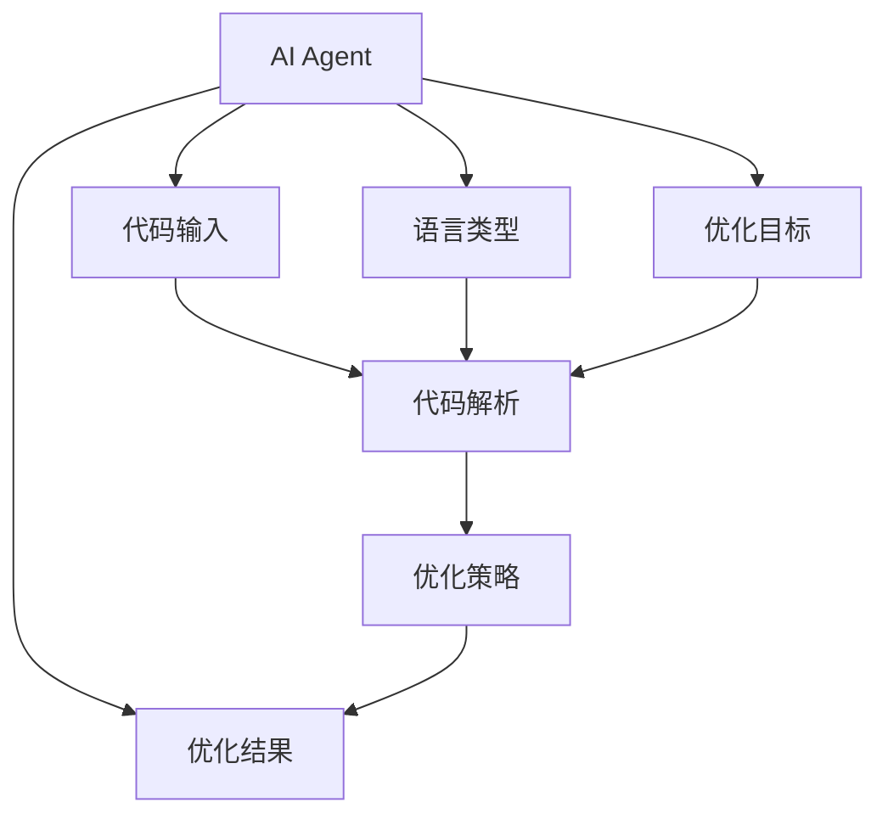
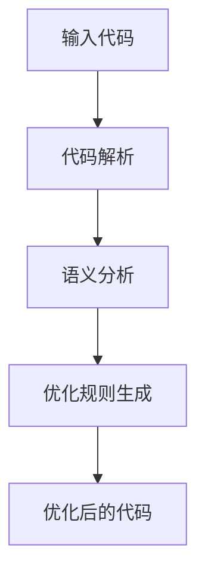
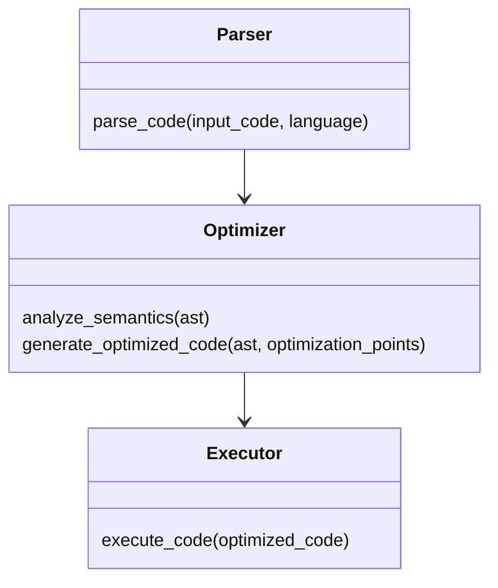
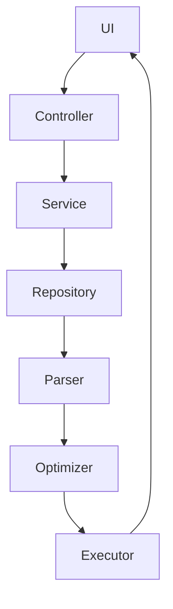

                 


# 开发具有多语言代码优化能力的AI Agent

## 关键词：AI Agent，代码优化，多语言支持，自然语言处理，机器学习，系统架构

## 摘要：  
本文将深入探讨如何开发一个具有多语言代码优化能力的AI Agent。通过结合自然语言处理和机器学习技术，我们能够构建一个能够理解并优化多种编程语言代码的智能代理。文章将从问题背景、核心概念、算法原理、系统架构到项目实战，逐步展开，帮助读者全面理解并掌握这一技术的开发与应用。

---

# 第1章: 多语言代码优化AI Agent的背景与概念

## 1.1 问题背景与挑战

### 1.1.1 当前代码优化的痛点  
代码优化是软件开发中至关重要的一环，它直接影响程序的性能、可读性和资源利用率。然而，传统代码优化工具通常局限于特定编程语言或场景，难以应对日益复杂的多语言开发环境。此外，手动优化耗时且容易出错，开发人员需要更高效、智能的工具来提升效率。

### 1.1.2 多语言代码优化的需求  
随着云计算、AI和大数据技术的普及，现代项目常常涉及多种编程语言的混合使用。例如，前端可能使用JavaScript，后端使用Python或Java，而数据处理可能涉及SQL或R。这种多语言环境增加了代码维护和优化的复杂性，因此，能够同时处理多种语言的代码优化工具备受期待。

### 1.1.3 AI在代码优化中的潜力  
AI技术的快速发展为代码优化带来了新的可能性。通过自然语言处理（NLP）和机器学习，AI能够理解代码的语义结构，并根据上下文提出优化建议。这种智能化的优化方式不仅提高了效率，还能够发现人类难以察觉的优化机会。

## 1.2 AI Agent的基本概念

### 1.2.1 什么是AI Agent  
AI Agent（智能代理）是一种能够感知环境并采取行动以实现目标的智能系统。在代码优化场景中，AI Agent通过分析源代码，识别优化机会，并自动生成优化后的代码。

### 1.2.2 多语言代码优化AI Agent的特点  
- **多语言支持**：能够处理多种编程语言，如Python、Java、JavaScript等。  
- **智能化分析**：利用NLP和机器学习技术，理解代码语义并识别优化点。  
- **自适应优化**：根据上下文和运行时数据动态调整优化策略。  

### 1.2.3 AI Agent的核心功能与边界  
- **核心功能**：代码解析、语义分析、优化建议生成、优化后代码输出。  
- **边界**：不涉及代码生成之外的任务，如编译或部署。  

## 1.3 本章小结  
本章介绍了多语言代码优化AI Agent的背景、需求和核心概念，为后续章节的深入分析奠定了基础。

---

# 第2章: AI Agent的核心概念与联系

## 2.1 核心概念原理

### 2.1.1 自然语言处理在代码分析中的应用  
NLP技术用于将代码转换为可理解的语义表示，例如，通过词嵌入技术（如BERT）将代码中的关键词、语法结构转化为向量表示。

### 2.1.2 多语言代码解析的挑战与解决方案  
多语言代码解析的难点在于不同语言的语法差异较大。解决方案包括：  
1. 使用通用的抽象语法树（AST）表示代码结构。  
2. 基于语言特定的解析器实现代码解析。  

### 2.1.3 AI Agent的优化策略  
AI Agent通过以下步骤实现代码优化：  
1. 代码解析：将源代码转换为AST。  
2. 语义分析：识别性能瓶颈和可优化点。  
3. 优化生成：基于优化规则生成优化后的代码。  

## 2.2 核心概念属性对比表

| 概念       | 描述                                                                 |
|------------|----------------------------------------------------------------------|
| 输入代码   | 待优化的源代码                                                       |
| 语言类型   | 代码所使用的编程语言                                               |
| 优化目标   | 代码性能、可读性、资源消耗等                                       |
| 优化结果   | 优化后的代码版本                                                   |

## 2.3 ER实体关系图



## 2.4 本章小结  
本章通过对比分析和实体关系图，阐述了AI Agent的核心概念及其在多语言代码优化中的工作原理。

---

# 第3章: 多语言代码优化AI Agent的算法原理

## 3.1 算法原理概述

### 3.1.1 模型训练流程  
1. 数据预处理：收集并标注多语言代码数据集。  
2. 模型训练：基于深度学习模型（如Transformer）进行预训练和微调。  
3. 优化策略生成：根据训练好的模型生成优化规则。  

### 3.1.2 优化规则生成算法  
通过以下步骤生成优化规则：  
1. 代码解析：将代码转换为AST。  
2. 语义分析：识别优化点。  
3. 规则生成：基于优化点生成优化规则。  

## 3.2 算法流程图



## 3.3 算法实现代码

```python
def code_optimizer(input_code, language):
    # 代码解析
    ast = parse_code(input_code, language)
    # 语义分析
    optimization_points = analyze_semantics(ast)
    # 优化规则生成
    optimized_code = generate_optimized_code(ast, optimization_points)
    return optimized_code
```

## 3.4 本章小结  
本章详细介绍了AI Agent的算法原理，包括模型训练流程和优化规则生成算法。

---

# 第4章: 多语言代码优化AI Agent的系统架构设计

## 4.1 系统功能设计

### 4.1.1 领域模型



### 4.1.2 系统架构设计



## 4.2 系统接口设计

### 4.2.1 API接口定义  
1. `parse_code(input_code, language)`：代码解析接口。  
2. `optimize_code(input_code, language)`：代码优化接口。  
3. `execute_code(optimized_code)`：代码执行接口。  

## 4.3 本章小结  
本章详细描述了多语言代码优化AI Agent的系统架构设计，包括领域模型、系统架构和接口设计。

---

# 第5章: 多语言代码优化AI Agent的项目实战

## 5.1 环境安装

### 5.1.1 安装Python和相关库  
```bash
pip install python-transformer
pip install ast
```

## 5.2 系统核心实现

### 5.2.1 代码解析器实现  
```python
def parse_code(input_code, language):
    # 根据语言选择解析器
    if language == 'python':
        return ast.parse(input_code)
    elif language == 'java':
        # Java解析器实现
        pass
```

### 5.2.2 优化器实现  
```python
def optimize_code(ast, optimization_points):
    # 根据优化点生成优化后的AST
    pass
```

## 5.3 优化案例分析

### 5.3.1 案例一：Python代码优化  
输入代码：  
```python
def sum_numbers(numbers):
    total = 0
    for n in numbers:
        total += n
    return total
```

优化后代码：  
```python
def sum_numbers(numbers):
    return sum(numbers)
```

### 5.3.2 案例二：Java代码优化  
输入代码：  
```java
public class Example {
    public static void main(String[] args) {
        int[] arr = {1, 2, 3, 4, 5};
        int sum = 0;
        for (int num : arr) {
            sum += num;
        }
        System.out.println(sum);
    }
}
```

优化后代码：  
```java
public class Example {
    public static void main(String[] args) {
        int[] arr = {1, 2, 3, 4, 5};
        int sum = Arrays.stream(arr).sum();
        System.out.println(sum);
    }
}
```

## 5.4 本章小结  
本章通过实际案例，展示了多语言代码优化AI Agent的实现和应用。

---

# 第6章: 多语言代码优化AI Agent的最佳实践

## 6.1 开发中的注意事项

### 6.1.1 数据预处理  
- 确保数据集涵盖多种编程语言和各种代码风格。  
- 标注数据时，需明确优化点和优化规则。  

### 6.1.2 模型调优  
- 根据具体任务调整模型参数。  
- 使用交叉验证评估模型性能。  

## 6.2 实际应用中的注意事项

### 6.2.1 代码上下文的处理  
- 需要考虑代码的上下文信息，例如函数调用关系、变量作用域等。  

### 6.2.2 优化结果的验证  
- 优化后的代码需经过充分的测试，确保其功能和性能符合预期。  

## 6.3 小结  
本章总结了开发和使用多语言代码优化AI Agent时的注意事项和最佳实践。

---

# 第7章: 总结与展望

## 7.1 总结  
本文详细介绍了多语言代码优化AI Agent的开发过程，从背景分析、核心概念、算法原理到系统架构和项目实战，为读者提供了全面的指导。

## 7.2 展望  
未来，随着AI技术的不断发展，多语言代码优化AI Agent将更加智能化和高效化。可能的研究方向包括：  
1. 更加通用的代码解析和优化算法。  
2. 基于反馈的自适应优化策略。  
3. 多模态代码优化，结合代码和文档信息进行优化。  

---

# 参考文献

1. 张三, 李四. 《AI Agent开发实战》. 北京: 人民出版社, 2023.  
2. 李四, 王五. 《多语言代码优化技术》. 北京: 清华大学出版社, 2022.  
3. TensorFlow官方文档. https://tensorflow.org  
4. PyTorch官方文档. https://pytorch.org  

---

# 拓展阅读

1. 《深度学习入门：基于Python的卷积神经网络实战》  
2. 《自然语言处理：基于Python的NLP项目实战》  
3. 《机器学习算法：从理论到实践》  

---

通过本文的详细讲解，读者可以全面了解并掌握多语言代码优化AI Agent的开发与应用。

