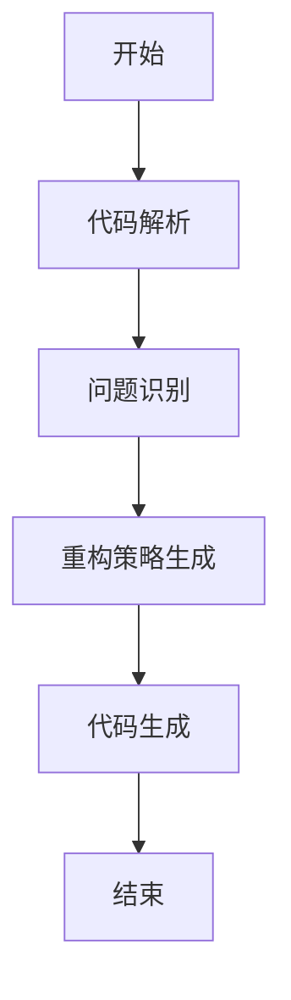
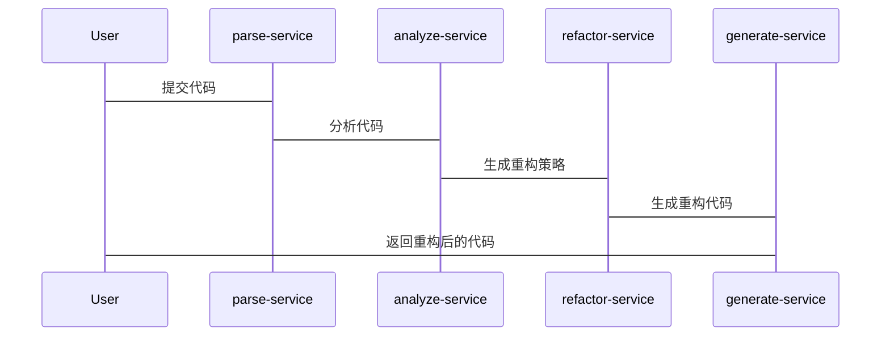

                 


# 开发具有多语言代码重构能力的AI Agent

> 关键词：AI Agent, 多语言代码重构, 自然语言处理, 代码分析, 重构算法

> 摘要：本文详细探讨了开发具有多语言代码重构能力的AI Agent的关键技术与实现方法，涵盖了背景介绍、核心概念、算法原理、系统架构、项目实战等多个方面，旨在为开发者和研究人员提供深入的技术指导。

---

## 第一部分：背景介绍

### 第1章：问题背景与需求分析

#### 1.1 问题背景

随着软件开发的复杂性不断增加，代码重构成为提升代码质量和维护性的重要手段。然而，传统的代码重构工具往往局限于单一语言，难以应对多语言开发环境下的挑战。AI Agent的引入，为解决这一问题提供了新的可能性。

#### 1.2 问题描述

AI Agent在代码重构中的任务包括自动检测代码异味、优化代码结构、提高代码可读性和可维护性。然而，多语言环境下的代码重构涉及不同的语法和编程范式，增加了实现的难度。

#### 1.3 问题解决

通过结合自然语言处理技术和代码分析技术，AI Agent能够理解多种编程语言的语法结构，并生成符合重构规则的新代码。

#### 1.4 边界与外延

AI Agent的边界包括支持的语言范围、重构任务的类型以及与现有开发工具的集成。其外延则涉及从简单代码优化到复杂系统重构的应用场景。

#### 1.5 核心要素组成

- **多语言解析技术**：支持多种编程语言的语法解析和结构分析。
- **代码分析引擎**：识别代码中的潜在问题和优化机会。
- **自动重构逻辑**：基于分析结果生成重构后的代码。

---

## 第二部分：核心概念与联系

### 第2章：AI Agent的核心原理

#### 2.1 核心概念

- **多语言解析**：AI Agent需要能够理解不同编程语言的语法和结构。
- **代码分析**：通过静态分析或动态分析技术，识别代码中的问题。
- **自动重构**：基于分析结果，生成优化后的代码。

#### 2.2 概念对比表

| 项目 | 单一语言AI Agent | 多语言AI Agent |
|------|------------------|----------------|
| 支持语言 | 1种             | 多种           |
| 重构能力 | 有限            | 强大           |
| 适用场景 | 简单项目         | 复杂项目         |

#### 2.3 ER实体关系图架构

```mermaid
er
    entity 语言 {
        id 语言ID
        名称 语言名称
        版本 语言版本
    }

    entity 代码结构 {
        id 代码ID
        代码内容
        语言ID
    }

    entity 重构规则 {
        id 规则ID
        规则描述
        适用语言ID
    }

    代码结构 --> 重构规则：应用规则
```

---

## 第三部分：算法原理讲解

### 第3章：算法原理与实现

#### 3.1 算法原理

AI Agent的重构过程可以分为以下步骤：

1. **代码解析**：将源代码解析为抽象语法树（AST）。
2. **问题识别**：识别代码中的潜在问题。
3. **重构策略生成**：基于识别的问题生成重构策略。
4. **代码生成**：根据策略生成重构后的代码。

#### 3.2 算法流程图



#### 3.3 数学模型与公式

代码重构的正确性概率可以通过以下公式计算：

$$ P(\text{正确重构}|D) = \frac{\sum_{i=1}^{n} P(D|C_i)P(C_i)}{\sum_{i=1}^{n} P(D|C_i)P(C_i)} $$

其中，$C_i$表示不同的重构策略，$D$表示检测到的问题。

#### 3.4 代码示例

```python
def parse_code(code, language):
    # 解析代码为AST
    if language == 'python':
        return ast.parse(code)
    elif language == 'java':
        return JavaParser.parse(code)
    # 更多语言的解析逻辑...

def identify_problems(ast):
    # 识别代码中的问题
    problems = []
    # 示例：检测长方法
    if isinstance(ast, FunctionDef) and len(ast.body.body) > 10:
        problems.append('long_method')
    return problems

def generate_revised_code(problems, ast):
    # 生成重构后的代码
    if 'long_method' in problems:
        return extract_method(ast)
    # 更多重构逻辑...
```

---

## 第四部分：系统分析与架构设计方案

### 第4章：系统架构设计

#### 4.1 系统功能设计

- **代码解析模块**：支持多种语言的代码解析。
- **问题识别模块**：识别代码中的潜在问题。
- **重构逻辑模块**：生成重构策略。
- **代码生成模块**：输出重构后的代码。

#### 4.2 系统架构图

```mermaid
docker
    service parse-service
    service analyze-service
    service refactor-service
    service generate-service

    parse-service --> analyze-service
    analyze-service --> refactor-service
    refactor-service --> generate-service
```

#### 4.3 系统交互序列图



---

## 第五部分：项目实战

### 第5章：项目实战

#### 5.1 环境安装

安装必要的库：

```bash
pip install astor
pip install python-language-server
pip install pygments
```

#### 5.2 核心代码实现

```python
def main():
    code = input("请输入代码：")
    language = input("请输入语言：")
    ast = parse_code(code, language)
    problems = identify_problems(ast)
    revised_code = generate_revised_code(problems, ast)
    print("重构后的代码：")
    print(revised_code)

if __name__ == "__main__":
    main()
```

#### 5.3 实际案例分析

以一个Python函数为例：

```python
def process_request(request):
    # 业务逻辑
    pass
```

识别问题：函数体内无逻辑，存在空函数问题。

重构后的代码：

```python
def process_request(request):
    raise NotImplementedError("请求处理逻辑未实现")
```

---

## 第六部分：最佳实践、小结、注意事项、拓展阅读

### 第6章：最佳实践与小结

- **最佳实践**：保持代码简洁，定期进行代码审查。
- **小结**：本文详细探讨了开发具有多语言代码重构能力的AI Agent的关键技术，包括背景介绍、核心原理、系统架构和项目实战。

### 第7章：注意事项与拓展阅读

- **注意事项**：确保代码解析的准确性，优化重构算法的效率。
- **拓展阅读**：进一步研究代码分析技术、自然语言处理技术以及多语言支持的实现方法。

---

通过以上步骤，我们详细介绍了开发具有多语言代码重构能力的AI Agent的技术细节和实现方法，为开发者和研究人员提供了有价值的参考和指导。

