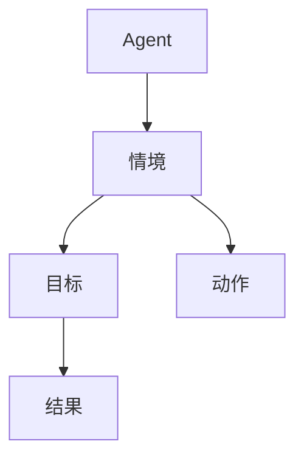
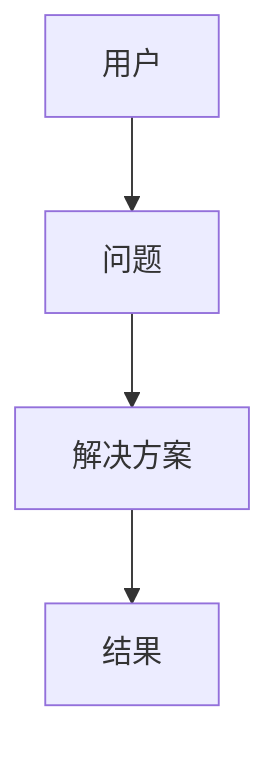

                 

# 开发具有情境模拟能力的AI Agent

> 关键词：AI Agent、情境模拟、知识表示、逻辑推理、强化学习

> 摘要：本文详细探讨了开发具有情境模拟能力的AI Agent的必要性及其方法。通过分析情境模拟的核心原理，包括知识表示、逻辑推理和强化学习，展示了如何构建能够理解、推理和自适应的智能系统。文章还通过实际案例分析和系统架构设计，深入阐述了情境模拟在AI Agent中的应用，为读者提供了从理论到实践的全面指导。

---

## 第一部分: AI Agent与情境模拟的背景介绍

### 第1章: AI Agent的基本概念

#### 1.1 AI Agent的定义与特点
- **AI Agent的定义**：AI Agent是一种智能体，能够感知环境、自主决策并执行任务，以实现特定目标。
- **AI Agent的核心特点**：
  - 自主性：能够在没有外部干预的情况下独立运作。
  - 反应性：能够实时感知环境并做出反应。
  - 社会性：能够与其他Agent或人类进行交互和协作。
  - 学习能力：能够通过经验改进自身的性能。

- **AI Agent与传统程序的区别**：
  - 传统程序：基于预定义的规则和逻辑执行任务，缺乏自主性和适应性。
  - AI Agent：具备自主决策、学习和适应能力，能够处理复杂和动态的环境。

#### 1.2 情境模拟的定义与应用
- **情境模拟的定义**：情境模拟是指通过建模和推理，模拟真实或虚拟环境中可能发生的各种情况，以便AI Agent能够更好地理解和应对这些情况。
- **情境模拟的核心要素**：
  - 知识表示：将环境中的信息以结构化的方式表示。
  - 情境推理：根据当前情境推断出可能的结果或最佳行动方案。
  - 情境学习：通过经验改进情境模拟的能力。

- **情境模拟在AI Agent中的作用**：
  - 提高AI Agent的决策能力。
  - 增强AI Agent在复杂环境中的适应性。
  - 使AI Agent能够处理不确定性问题。

- **情境模拟的应用场景**：
  - 智能对话系统：通过模拟对话情境，提供更自然的交互体验。
  - 智能推荐系统：根据用户行为和偏好，推荐相关内容。
  - 智能监控系统：实时监控环境并做出预警或响应。

---

### 第2章: AI Agent的情境模拟能力

#### 2.1 情境模拟的核心概念
- **知识表示与情境建模**：
  - 知识表示：将环境中的信息以符号、语义网络或知识图谱的形式表示。
  - 情境建模：通过模型描述环境中的实体、关系和事件。
  - 示例：将一个对话情境表示为图结构，其中节点表示对话参与者，边表示对话关系。

- **情境推理与决策**：
  - 情境推理：基于当前情境和知识库，推断出可能的结果或最佳行动方案。
  - 示例：在智能客服系统中，推理出客户的需求并提供相应的解决方案。

- **情境学习与自适应**：
  - 情境学习：通过与环境的交互，学习新的知识和经验，以提高情境模拟的能力。
  - 自适应：根据环境的变化，动态调整自身的知识和推理模型。

#### 2.2 情境模拟的实现方式
- **基于规则的模拟**：
  - 使用预定义的规则和逻辑，描述可能的情况及其对应的处理方式。
  - 示例：在智能交通系统中，预定义交通规则，模拟车辆的行驶情况。

- **基于逻辑推理的模拟**：
  - 使用逻辑推理算法，如演绎推理和归纳推理，推断出可能的情况。
  - 示例：在医疗诊断系统中，通过逻辑推理推断出可能的疾病。

- **基于机器学习的模拟**：
  - 使用机器学习算法，如神经网络和强化学习，从数据中学习情境模拟的能力。
  - 示例：在游戏AI中，通过强化学习学习如何在游戏环境中做出最优决策。

#### 2.3 情境模拟的应用场景
- **智能对话系统**：
  - 通过情境模拟，理解对话的上下文和情感，提供更智能的回复。
  - 示例：智能音箱能够根据用户的语境和历史对话，提供更相关的建议。

- **智能推荐系统**：
  - 通过情境模拟，分析用户的行为和偏好，推荐相关内容。
  - 示例：推荐系统根据用户的浏览历史和当前情境，推荐可能感兴趣的产品。

- **智能监控系统**：
  - 通过情境模拟，实时监控环境并做出预警或响应。
  - 示例：智能安防系统能够识别异常情况并触发警报。

---

## 第三部分: 情境模拟的核心概念与联系

### 第3章: 情境模拟的核心原理

#### 3.1 情境模拟的数学模型
- **状态空间模型**：
  - 定义：将环境中的所有可能状态表示为一个集合。
  - 示例：在迷宫中，每个位置是一个状态，移动规则定义了状态之间的转换。
- **动作空间模型**：
  - 定义：将AI Agent在每个状态下可能执行的动作表示为一个集合。
  - 示例：在国际象棋中，每个棋子在某个位置可能的移动方式。
- **奖励函数模型**：
  - 定义：定义了AI Agent执行某个动作后所获得的奖励，用于指导学习过程。
  - 示例：在强化学习中，奖励函数根据动作的结果给予正向或负向的反馈。

#### 3.2 情境模拟的算法原理
- **基于概率的推理算法**：
  - 示例：贝叶斯网络，用于计算在不确定条件下的概率分布。
  - 公式：$P(A|B) = \frac{P(B|A)P(A)}{P(B)}$
- **基于逻辑的推理算法**：
  - 示例：演绎推理，从一般性的前提出发，推导出具体结论。
  - 公式：如果 $A \rightarrow B$ 且 $A$ 为真，则 $B$ 为真。
- **基于强化学习的模拟算法**：
  - 示例：Q-learning算法，通过探索和利用策略，学习最优动作。
  - 公式：$Q(s,a) = Q(s,a) + \alpha [r + \max Q(s',a') - Q(s,a)]$

#### 3.3 情境模拟的ER实体关系图
- **实体关系图的定义**：用于描述系统中实体及其关系的结构化模型。
- **情境模拟的实体关系图**：

---

### 第4章: 情境模拟的核心概念对比

#### 4.1 情境模拟与知识图谱的对比
- **知识图谱的定义与特点**：
  - 知识图谱：一种结构化的知识表示形式，通常以图的形式表示实体及其关系。
  - 特点：广泛、结构化、可扩展。
- **情境模拟与知识图谱的联系**：
  - 情境模拟可以利用知识图谱中的知识进行推理和决策。
- **情境模拟与知识图谱的区别**：
  - 知识图谱侧重于知识的存储和表示，而情境模拟侧重于知识的使用和推理。

#### 4.2 情境模拟与逻辑推理的对比
- **逻辑推理的定义与特点**：
  - 逻辑推理：通过逻辑规则从已知事实中推导出新的结论。
  - 特点：确定性、精确性。
- **情境模拟与逻辑推理的联系**：
  - 情境模拟可以利用逻辑推理进行情境推理和决策。
- **情境模拟与逻辑推理的区别**：
  - 逻辑推理侧重于确定性的推理，而情境模拟侧重于处理不确定性和动态性。

---

### 第5章: 情境模拟的ER实体关系图

#### 5.1 实体关系图的定义
- 实体关系图是一种用于描述系统中实体及其关系的结构化模型。
- 示例：在智能客服系统中，实体包括用户、问题、解决方案等。

#### 5.2 情境模拟的实体关系图

---

## 总结

通过以上详细的内容，我们探讨了开发具有情境模拟能力的AI Agent的核心概念、算法原理和系统架构。情境模拟作为AI Agent的重要能力，能够帮助AI Agent更好地理解和应对复杂环境中的各种情况。未来，随着技术的不断发展，情境模拟将在更多领域得到广泛应用，推动AI Agent技术的进步。

---

### Tips:
1. **小结**：情境模拟是AI Agent的重要能力，能够帮助AI Agent更好地理解和应对复杂环境中的各种情况。
2. **注意事项**：
   - 在实际开发中，需要根据具体场景选择合适的情境模拟方法。
   - 确保知识表示的准确性和完整性，以提高情境模拟的效果。
3. **拓展阅读**：
   - 推荐阅读《人工智能：一种现代方法》（Russell & Norvig）以深入理解AI Agent的基本概念。
   - 推荐阅读《强化学习导论》（Sutton & Barto）以进一步学习强化学习在情境模拟中的应用。

---

通过本文的分析和讲解，希望读者能够对开发具有情境模拟能力的AI Agent有更深入的理解，并能够在实际项目中加以应用。

