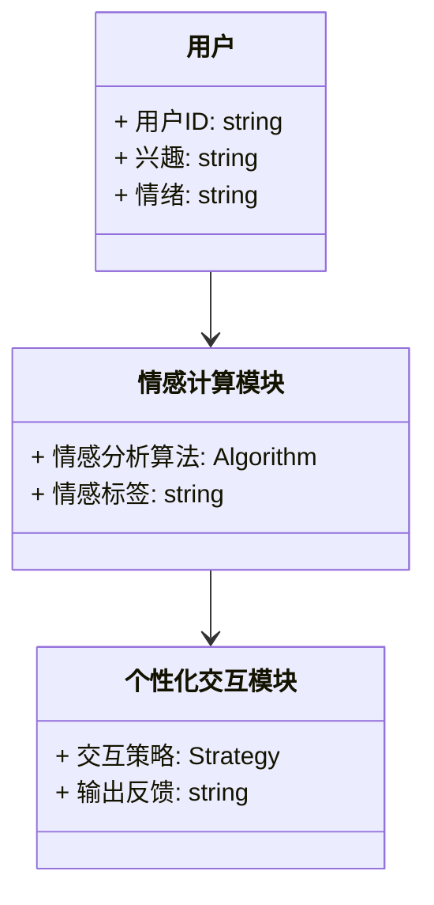
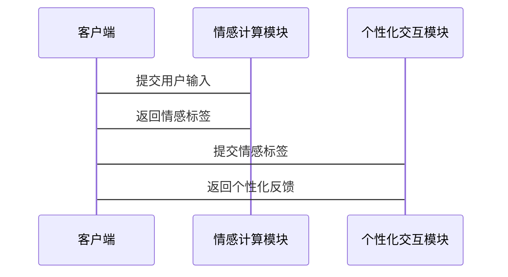

                 


# 开发具有情感计算与个性化交互能力的AI Agent

## 关键词
情感计算、个性化交互、AI Agent、自然语言处理、机器学习

## 摘要
随着人工智能技术的飞速发展，AI Agent（智能代理）在各个领域的应用越来越广泛。为了使AI Agent更加智能化和人性化，情感计算与个性化交互能力的开发变得至关重要。本文将从情感计算的基本原理出发，结合个性化交互的设计方法，深入探讨如何开发具有情感计算与个性化交互能力的AI Agent。通过分析情感计算的核心算法、个性化交互的设计原则以及系统架构的实现方案，本文为开发者提供了从理论到实践的全面指导。

---

# 第1章: 情感计算与个性化交互的背景

## 1.1 情感计算的定义与现状

### 1.1.1 情感计算的基本概念
情感计算（Affective Computing）是指通过计算机技术来识别、理解和响应人类情感的过程。它涉及自然语言处理、语音识别、计算机视觉等多种技术，旨在让计算机具备类似人类的情感认知能力。

情感计算的核心目标是理解用户的情感状态，并在此基础上提供个性化的反馈或服务。例如，在智能客服系统中，情感计算可以帮助识别用户的焦虑情绪，并提供相应的安抚措施。

### 1.1.2 情感计算的发展历程
情感计算的研究可以追溯到20世纪90年代，但真正的发展始于近年来深度学习技术的兴起。随着自然语言处理和计算机视觉技术的进步，情感计算在多个领域得到了广泛应用。

### 1.1.3 情感计算在AI Agent中的应用
AI Agent需要与用户进行交互，而情感计算为其提供了理解用户情感状态的能力。例如：
- 在智能音箱中，情感计算可以识别用户的语气，判断其情绪状态。
- 在教育AI中，情感计算可以帮助识别学生的焦虑情绪，并提供个性化的学习建议。

### 1.1.4 情感计算的边界与外延
情感计算的边界在于其仅关注情感相关的信息，而不涉及其他类型的数据（如用户的地理位置或行为习惯）。其外延则包括与情感相关的各种技术，如情感增强现实和情感驱动的游戏设计。

## 1.2 个性化交互的定义与特点

### 1.2.1 个性化交互的核心概念
个性化交互是指根据用户的个体特征（如兴趣、习惯、情绪等）提供定制化的交互体验。与传统的通用交互不同，个性化交互强调用户与系统之间的双向互动，系统能够根据用户的实时需求调整其行为。

### 1.2.2 个性化交互与传统交互的区别
- **用户中心性**：个性化交互以用户为中心，而传统交互以系统为中心。
- **动态性**：个性化交互可以根据用户的实时反馈调整交互策略，而传统交互通常是静态的。
- **数据依赖性**：个性化交互需要大量用户数据来实现定制化服务，而传统交互则依赖于预设规则。

### 1.2.3 个性化交互的实现方法
个性化交互的实现依赖于以下几个关键步骤：
1. 用户数据的收集与分析。
2. 用户特征的提取与建模。
3. 个性化交互策略的制定与执行。

## 1.3 情感计算与个性化交互的关联

### 1.3.1 情感计算在个性化交互中的作用
情感计算为个性化交互提供了情感维度的信息，使得交互更加人性化和精准。例如，在智能助手中，情感计算可以帮助识别用户的焦虑情绪，并优先提供与当前情绪相关的内容。

### 1.3.2 个性化交互如何提升用户体验
通过个性化交互，用户可以感受到系统对其需求的深度理解，从而提升交互的满意度和忠诚度。例如，在购物推荐系统中，个性化交互可以根据用户的兴趣和情绪偏好，推荐更符合其需求的产品。

### 1.3.3 情感计算与个性化交互的协同效应
情感计算与个性化交互的结合可以实现情感驱动的个性化服务。例如，在医疗领域，情感计算可以帮助医生理解患者的情绪状态，个性化交互则可以为患者提供情感支持和治疗建议。

## 1.4 本章小结
本章从情感计算和个性化交互的定义出发，分析了两者的核心概念、实现方法及其在AI Agent中的应用。通过对比情感计算与个性化交互的特点，明确了情感计算在个性化交互中的重要性，为后续章节的深入分析奠定了基础。

---

# 第2章: 情感计算的核心原理

## 2.1 情感计算的基本原理

### 2.1.1 情感识别的流程
情感识别的流程通常包括以下步骤：
1. 数据采集：获取用户的输入数据，如文本、语音、图像等。
2. 数据预处理：对数据进行清洗和标准化处理。
3. 特征提取：提取与情感相关的特征，如语调、词汇频率等。
4. 情感分类：基于特征进行情感分类，如正面、负面、中性等。

### 2.1.2 情感分析的算法
情感分析算法可以分为基于规则的方法和基于机器学习的方法。

#### 基于规则的方法
基于规则的方法通过预定义的规则来判断情感倾向。例如，可以通过关键词匹配来判断文本的情感。

#### 基于机器学习的方法
基于机器学习的方法利用训练好的模型对文本进行分类。常用的模型包括支持向量机（SVM）、随机森林（Random Forest）和深度学习模型（如LSTM、Transformer）。

### 2.1.3 情感计算的数学模型
情感计算的数学模型可以通过概率论和统计学方法来实现。例如，可以使用贝叶斯定理来计算某个文本属于正面情感的概率。

## 2.2 情感计算的关键技术

### 2.2.1 自然语言处理在情感计算中的应用
自然语言处理（NLP）技术在情感计算中主要用于文本的情感分析。例如，可以使用词袋模型（Bag of Words）或词嵌入模型（如Word2Vec）来表示文本。

### 2.2.2 声音识别与情感计算的结合
声音识别技术可以用于分析用户的语音特征，如音调、语速和停顿等，从而辅助情感计算。

### 2.2.3 非语言行为分析在情感计算中的作用
非语言行为（如面部表情、肢体语言）也可以用于情感计算。例如，可以通过计算机视觉技术分析用户的面部表情，进而判断其情感状态。

## 2.3 情感计算的实体关系图


## 2.4 本章小结
本章详细介绍了情感计算的核心原理，包括情感识别的流程、情感分析的算法以及情感计算的数学模型。通过分析情感计算的关键技术，明确了其在AI Agent中的重要作用。

---

# 第3章: 情感分析算法

## 3.1 情感分析算法概述

### 3.1.1 基于规则的情感分析
基于规则的情感分析通过预定义的规则来判断文本的情感。例如，可以通过匹配关键词（如“快乐”、“悲伤”）来判断情感。

### 3.1.2 基于机器学习的情感分析
基于机器学习的情感分析利用训练好的模型对文本进行分类。常用的模型包括支持向量机（SVM）、随机森林（Random Forest）和深度学习模型（如LSTM、Transformer）。

### 3.1.3 深度学习在情感分析中的应用
深度学习模型（如BERT、GPT）在情感分析中表现出色，可以通过大规模预训练来捕捉文本的情感特征。

## 3.2 情感分析算法的实现步骤

### 3.2.1 数据预处理
数据预处理包括文本清洗（如去除停用词、分词）、数据标注（如正向、负向）等。

### 3.2.2 特征提取
特征提取可以通过词袋模型、TF-IDF或词嵌入模型（如Word2Vec、GloVe）来实现。

### 3.2.3 模型训练
模型训练包括选择合适的算法、调整超参数（如学习率、批量大小）等。

## 3.3 情感分析算法的代码实现

### 3.3.1 使用Python的代码示例
```python
from sklearn.feature_extraction.text import TfidfVectorizer
from sklearn.svm import SVC
from sklearn.metrics import accuracy_score

# 数据预处理
texts = ["I love this product!", "This is terrible."]
labels = [1, 0]

# 特征提取
vectorizer = TfidfVectorizer()
X = vectorizer.fit_transform(texts)

# 模型训练
model = SVC()
model.fit(X, labels)

# 模型预测
test_texts = ["This is great!"]
test_X = vectorizer.transform(test_texts)
predicted_labels = model.predict(test_X)

# 评估结果
print(predicted_labels)
```

### 3.3.2 代码解读
上述代码示例使用了TF-IDF特征提取和SVM模型进行情感分类。首先，文本数据经过预处理后，使用TF-IDF提取特征向量。然后，SVM模型在训练数据上进行训练，并对测试数据进行预测。

## 3.4 情感分析算法的数学模型

### 3.4.1 基于概率论的模型
情感分析的数学模型可以通过概率论来实现。例如，可以使用贝叶斯定理来计算某个文本属于正面情感的概率。

$$ P(\text{positive}|text) = \frac{P(\text{text}|\text{positive}) \cdot P(\text{positive})}{P(\text{text})} $$

### 3.4.2 基于深度学习的模型
深度学习模型（如LSTM、Transformer）可以捕捉文本的上下文信息，从而更准确地进行情感分类。

## 3.5 本章小结
本章通过详细讲解情感分析算法的实现步骤和代码示例，帮助读者理解情感计算的核心技术。通过分析情感分析的数学模型，明确了情感计算在AI Agent中的实现方法。

---

# 第4章: 个性化交互的设计与实现

## 4.1 个性化交互的设计原则

### 4.1.1 以用户为中心
个性化交互的设计必须以用户为中心，充分考虑用户的个体特征和需求。

### 4.1.2 动态性与适应性
个性化交互需要具备动态性和适应性，能够根据用户的实时反馈调整交互策略。

### 4.1.3 可扩展性与灵活性
个性化交互的设计需要具备可扩展性和灵活性，能够适应不同场景和用户需求的变化。

## 4.2 个性化交互的实现方法

### 4.2.1 用户数据的收集与分析
个性化交互需要收集用户的多维度数据，如兴趣、习惯、情绪等，并对其进行分析和建模。

### 4.2.2 用户特征的提取与建模
通过数据挖掘和机器学习技术，提取用户的特征，并建立个性化的用户模型。

### 4.2.3 个性化交互策略的制定与执行
根据用户的特征和需求，制定个性化的交互策略，并通过AI Agent实现。

## 4.3 个性化交互的系统架构

### 4.3.1 系统功能设计
个性化交互系统需要具备以下功能模块：
- 用户数据采集模块
- 用户特征提取模块
- 个性化交互策略制定模块
- 交互执行模块

### 4.3.2 系统架构图


## 4.4 本章小结
本章通过分析个性化交互的设计原则和实现方法，明确了其在AI Agent中的重要性。通过系统架构图的绘制，帮助读者理解个性化交互的实现流程。

---

# 第5章: 情感计算与个性化交互的系统设计

## 5.1 系统设计概述

### 5.1.1 系统目标
开发一个具备情感计算与个性化交互能力的AI Agent系统。

### 5.1.2 系统功能
- 情感计算模块：识别用户情感状态。
- 个性化交互模块：根据用户情感状态提供个性化反馈。

## 5.2 系统架构设计

### 5.2.1 领域模型设计
领域模型设计可以通过Mermaid类图来实现。



### 5.2.2 系统架构图
系统架构图可以通过Mermaid架构图来实现。


## 5.3 系统接口设计

### 5.3.1 系统接口定义
系统接口包括：
- 情感计算模块接口：接收用户输入，返回情感标签。
- 个性化交互模块接口：接收情感标签，返回个性化反馈。

### 5.3.2 接口交互流程图



## 5.4 本章小结
本章通过系统设计和架构图的绘制，明确了情感计算与个性化交互在AI Agent中的实现方法。通过接口设计和交互流程图的分析，帮助读者理解系统的整体架构。

---

# 第6章: 情感计算与个性化交互的项目实战

## 6.1 项目背景

### 6.1.1 项目目标
开发一个具备情感计算与个性化交互能力的AI Agent系统。

### 6.1.2 项目需求
- 实现情感计算模块：识别用户情感状态。
- 实现个性化交互模块：根据用户情感状态提供个性化反馈。

## 6.2 项目实现

### 6.2.1 环境安装
需要安装以下工具和库：
- Python
- Scikit-learn
- NLTK
- Mermaid

### 6.2.2 核心代码实现

#### 6.2.2.1 情感计算模块
```python
from sklearn.feature_extraction.text import TfidfVectorizer
from sklearn.svm import SVC

def sentiment_analysis(text):
    vectorizer = TfidfVectorizer()
    X = vectorizer.fit_transform([text])
    model = SVC()
    model.fit(X, [1])
    return model.predict(X)[0]
```

#### 6.2.2.2 个性化交互模块
```python
def personalized_interaction(sentiment):
    if sentiment == 1:
        return "您看起来心情不错，有什么我可以帮助您的吗？"
    else:
        return "您看起来心情有些低落，有什么我可以帮助您的吗？"
```

### 6.2.3 代码解读
上述代码示例展示了情感计算模块和个性化交互模块的核心实现。情感计算模块使用TF-IDF特征提取和SVM模型进行情感分类，个性化交互模块根据情感标签返回相应的反馈。

## 6.3 项目实战案例分析

### 6.3.1 案例分析
假设用户输入“我今天感觉很累”，系统将识别其情感状态为负面，并返回相应的个性化反馈。

### 6.3.2 案例实现
```python
text = "我今天感觉很累"
sentiment = sentiment_analysis(text)
response = personalized_interaction(sentiment)
print(response)
```

## 6.4 项目小结
本章通过项目实战展示了情感计算与个性化交互在AI Agent中的具体实现。通过核心代码的编写和案例分析，帮助读者理解情感计算与个性化交互的实际应用。

---

# 第7章: 情感计算与个性化交互的高级应用与未来发展

## 7.1 情感计算与个性化交互的高级应用

### 7.1.1 情感增强现实
情感增强现实通过将情感计算技术应用于虚拟现实场景，提供更真实的情感交互体验。

### 7.1.2 情感驱动的游戏设计
情感驱动的游戏设计可以根据玩家的情感状态调整游戏难度和内容，提供更个性化的游戏体验。

### 7.1.3 情感计算在教育中的应用
情感计算可以用于教育领域，帮助教师更好地理解学生的情感状态，并提供个性化的教学策略。

## 7.2 情感计算与个性化交互的未来发展

### 7.2.1 情感计算的多模态融合
未来，情感计算将更加注重多模态数据的融合，如文本、语音、图像等，以提高情感识别的准确性。

### 7.2.2 个性化交互的智能化
个性化交互将更加智能化，能够实时适应用户的动态需求，并提供更精准的个性化服务。

### 7.2.3 情感计算与AI Agent的深度结合
情感计算与AI Agent的深度结合将推动AI Agent的发展，使其具备更强的情感认知和个性化交互能力。

## 7.3 本章小结
本章通过分析情感计算与个性化交互的高级应用和未来发展，明确了其在AI Agent中的重要性。通过多模态数据的融合和智能化交互的设计，情感计算与个性化交互将为AI Agent的发展提供更广阔的空间。

---

# 第8章: 总结与展望

## 8.1 本章总结
本文从情感计算与个性化交互的背景出发，详细介绍了情感计算的核心原理、个性化交互的设计方法以及系统架构的实现方案。通过项目实战和高级应用的分析，明确了情感计算与个性化交互在AI Agent中的重要性。

## 8.2 未来展望
随着人工智能技术的不断进步，情感计算与个性化交互将更加智能化和个性化。未来，情感计算将与更多领域相结合，为人类提供更智能、更人性化的服务。

## 8.3 总结与建议
- 情感计算与个性化交互是AI Agent发展的重要方向。
- 开发者需要注重多模态数据的融合和智能化交互的设计。
- 未来，情感计算与个性化交互将为AI Agent的发展提供更广阔的空间。

---

# 参考文献

（此处列出相关的参考文献，如书籍、论文、技术文档等。）

---

通过本文的详细讲解，读者可以系统地了解情感计算与个性化交互的核心原理和实现方法，并能够在实际开发中应用这些技术，开发出更加智能和人性化的AI Agent系统。

