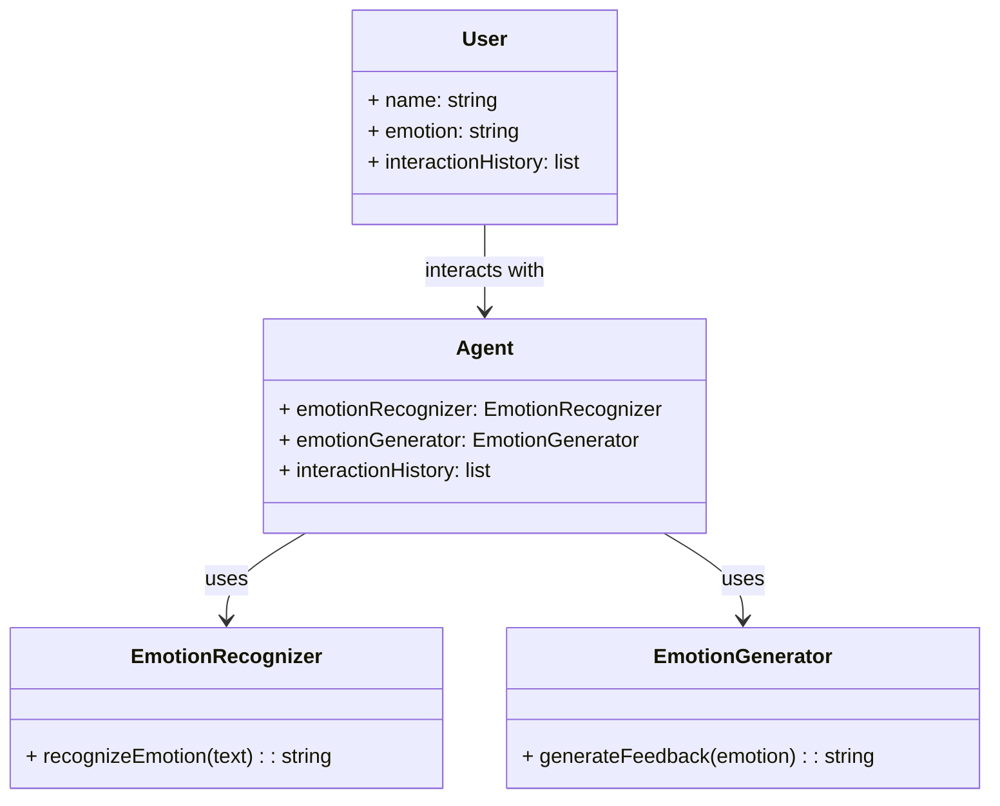
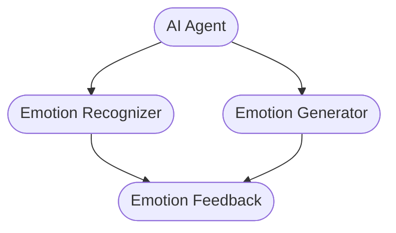
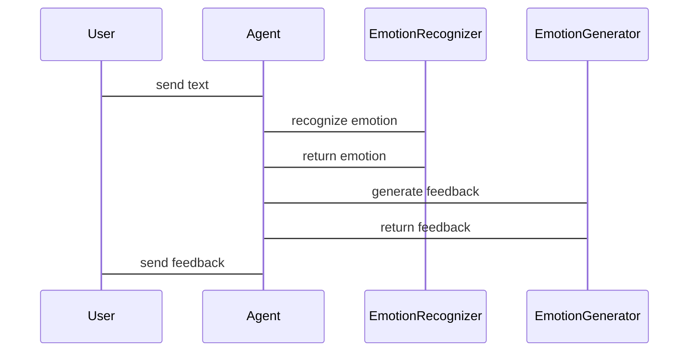

                 


# 开发具有情感计算与交互能力的AI Agent

> 关键词：情感计算、AI Agent、人机交互、机器学习、深度学习、情感反馈

> 摘要：  
> 随着人工智能技术的快速发展，情感计算与AI代理的结合成为了一个新兴的研究方向。本文将详细探讨如何开发具有情感计算与交互能力的AI Agent，从情感计算的基础概念到情感交互的设计实现，再到实际项目的实战应用，逐步分析和实现这一复杂而有趣的技术目标。本文不仅涵盖了情感计算的核心算法与实现，还深入探讨了AI Agent的情感交互设计与优化方法，并通过实际案例展示了如何将理论应用于实践。

---

# 第一部分: 情感计算与AI代理的基础

## 第1章: 情感计算与AI代理概述

### 1.1 情感计算的定义与背景

#### 1.1.1 情感计算的基本概念
情感计算（Affective Computing）是一种通过计算机技术来识别、理解和模拟人类情感状态的科学。它不仅关注用户的语言内容，还关注用户的情感状态，如快乐、悲伤、愤怒等。情感计算的核心目标是让计算机能够像人类一样具备情感智能，从而实现更自然、更贴近人类的交互方式。

#### 1.1.2 情感计算的发展历程
情感计算的概念最早可以追溯到20世纪60年代，但真正的发展始于21世纪初。随着机器学习和深度学习技术的兴起，情感计算技术得到了飞速发展，应用场景也从最初的学术研究扩展到商业、教育、医疗等多个领域。

#### 1.1.3 情感计算在AI代理中的作用
AI代理（Artificial Intelligence Agent）是一种能够感知环境、自主决策并执行任务的智能实体。情感计算在AI代理中的作用主要体现在以下两个方面：
1. **情感感知**：通过情感计算技术，AI代理可以感知用户的情感状态，从而更好地理解用户的需求。
2. **情感交互**：基于用户的情感状态，AI代理可以生成相应的情感反馈，从而实现更自然、更贴心的交互。

### 1.2 AI代理的核心概念

#### 1.2.1 AI代理的定义与分类
AI代理是一种能够感知环境、自主决策并执行任务的智能实体。根据功能和应用场景的不同，AI代理可以分为以下几类：
- **简单反射型代理**：这类代理基于预定义的规则进行简单的反射式响应。
- **基于模型的反射型代理**：这类代理通过构建环境模型来实现更复杂的决策和交互。
- **目标驱动型代理**：这类代理以特定目标为导向，主动执行任务。
- **实用驱动型代理**：这类代理以最大化某种效用函数为目标，进行自主决策。

#### 1.2.2 情感计算在AI代理中的应用
情感计算技术在AI代理中的应用主要体现在以下几个方面：
1. **情感识别**：通过语音、文本或面部表情等输入，识别用户的情感状态。
2. **情感分析**：对用户的情感倾向（如正面、负面、中性）进行分类。
3. **情感反馈**：根据用户的情感状态，生成相应的反馈，如调整语调、语气或提供情感支持。

#### 1.2.3 情感交互的基本原理
情感交互是情感计算与AI代理结合的核心部分。其基本原理包括以下几个步骤：
1. **情感数据的采集**：通过传感器、摄像头或自然语言处理技术采集用户的情感数据。
2. **情感状态的识别**：利用机器学习算法对情感数据进行分析，识别出用户的情感状态。
3. **情感反馈的生成**：根据用户的情感状态，生成相应的反馈，如调整语调、语气或提供情感支持。

### 1.3 情感计算与AI代理的核心要素

#### 1.3.1 情感数据的采集与处理
情感数据的采集是情感计算的第一步。常见的情感数据采集方式包括：
- **文本输入**：通过自然语言处理技术分析用户的文本输入，提取情感特征。
- **语音输入**：通过语音识别和情感语音分析技术，提取语音中的情感特征。
- **面部表情识别**：通过计算机视觉技术，分析用户的面部表情，提取情感特征。

#### 1.3.2 情感分析的算法与模型
情感分析是情感计算的核心任务之一。常见的情感分析算法包括：
- **基于规则的情感分析**：通过预定义的规则和情感词典，对文本进行情感分类。
- **基于机器学习的情感分析**：利用机器学习算法（如支持向量机、随机森林）进行情感分类。
- **基于深度学习的情感分析**：利用深度学习模型（如LSTM、Transformer）进行情感分类。

#### 1.3.3 情感反馈的生成与优化
情感反馈是情感交互的重要组成部分。情感反馈的生成需要考虑以下几个方面：
1. **情感匹配**：根据用户的情感状态，生成相应的情感反馈，确保情感一致性。
2. **语言风格匹配**：根据用户的语言风格，生成相应风格的语言反馈。
3. **反馈优化**：通过实验和用户反馈，不断优化情感反馈的效果，提升用户体验。

---

## 第2章: 情感计算的核心概念与原理

### 2.1 情感计算的核心概念

#### 2.1.1 情感计算的定义与范围
情感计算是一种通过计算机技术来识别、理解和模拟人类情感状态的科学。它不仅关注用户的语言内容，还关注用户的情感状态，如快乐、悲伤、愤怒等。情感计算的核心目标是让计算机能够像人类一样具备情感智能，从而实现更自然、更贴近人类的交互方式。

#### 2.1.2 情感计算的关键属性
情感计算的关键属性包括以下几个方面：
1. **情感识别**：通过语音、文本或面部表情等输入，识别用户的情感状态。
2. **情感分析**：对用户的情感倾向（如正面、负面、中性）进行分类。
3. **情感反馈**：根据用户的情感状态，生成相应的反馈，如调整语调、语气或提供情感支持。

#### 2.1.3 情感计算的实现步骤
情感计算的实现步骤主要包括以下几个步骤：
1. **情感数据的采集**：通过传感器、摄像头或自然语言处理技术采集用户的情感数据。
2. **情感状态的识别**：利用机器学习算法对情感数据进行分析，识别出用户的情感状态。
3. **情感反馈的生成**：根据用户的情感状态，生成相应的反馈，如调整语调、语气或提供情感支持。

### 2.2 情感计算与AI代理的关系

#### 2.2.1 情感计算在AI代理中的作用
情感计算在AI代理中的作用主要体现在以下几个方面：
1. **情感感知**：通过情感计算技术，AI代理可以感知用户的情感状态，从而更好地理解用户的需求。
2. **情感交互**：基于用户的情感状态，AI代理可以生成相应的情感反馈，从而实现更自然、更贴心的交互。

#### 2.2.2 情感计算与人机交互的结合
情感计算与人机交互的结合是情感计算技术的核心应用之一。通过情感计算技术，人机交互系统可以更好地理解用户的情感需求，从而提供更个性化的服务。

#### 2.2.3 情感计算对AI代理性能的影响
情感计算对AI代理的性能有重要影响。通过情感计算技术，AI代理可以更好地理解用户的需求，从而提高交互的准确性和用户体验。

### 2.3 情感计算的核心算法与模型

#### 2.3.1 基于规则的情感分析
基于规则的情感分析是一种简单的情感分析方法。它通过预定义的规则和情感词典，对文本进行情感分类。例如，如果文本中包含大量的正面词汇，就可以判断文本的情感倾向为正面。

#### 2.3.2 基于机器学习的情感分析
基于机器学习的情感分析是一种更复杂的情感分析方法。它利用机器学习算法（如支持向量机、随机森林）进行情感分类。这种方法需要大量的标注数据进行训练，才能保证分类的准确性。

#### 2.3.3 基于深度学习的情感分析
基于深度学习的情感分析是一种最新的情感分析方法。它利用深度学习模型（如LSTM、Transformer）进行情感分类。这种方法可以自动提取文本中的情感特征，从而提高分类的准确性。

---

## 第3章: 情感计算的算法原理与实现

### 3.1 情感计算的算法原理

#### 3.1.1 基于规则的情感分析算法
基于规则的情感分析算法是一种简单的情感分析方法。它通过预定义的规则和情感词典，对文本进行情感分类。例如，如果文本中包含大量的正面词汇，就可以判断文本的情感倾向为正面。

#### 3.1.2 基于机器学习的情感分析算法
基于机器学习的情感分析算法是一种更复杂的情感分析方法。它利用机器学习算法（如支持向量机、随机森林）进行情感分类。这种方法需要大量的标注数据进行训练，才能保证分类的准确性。

#### 3.1.3 基于深度学习的情感分析算法
基于深度学习的情感分析算法是一种最新的情感分析方法。它利用深度学习模型（如LSTM、Transformer）进行情感分类。这种方法可以自动提取文本中的情感特征，从而提高分类的准确性。

### 3.2 情感计算的数学模型与公式

#### 3.2.1 朴素贝叶斯算法的数学模型
朴素贝叶斯算法是一种基于概率论的分类算法。它的数学模型如下：
$$ P(c|d) = \frac{P(d|c)P(c)}{P(d)} $$
其中，\( c \) 表示类别，\( d \) 表示数据。

#### 3.2.2 LSTM网络的情感分析模型
LSTM（长短期记忆网络）是一种基于循环神经网络的深度学习模型。它的数学模型如下：
$$ \text{LSTM}(x_t, h_{t-1}) = \text{tanh}(W_{xh}x_t + W_{hh}h_{t-1} + b_h) $$
其中，\( x_t \) 表示输入数据，\( h_{t-1} \) 表示前一时刻的隐藏状态。

### 3.3 情感计算的算法实现

#### 3.3.1 基于Python的实现
以下是基于Python的简单情感分析实现代码：
```python
import numpy as np
from sklearn.naive_bayes import MultinomialNB
```

#### 3.3.2 基于深度学习的实现
以下是基于深度学习的情感分析实现代码：
```python
import torch
import torch.nn as nn
class LSTMClassifier(nn.Module):
    def __init__(self, input_size, hidden_size, output_size):
        super(LSTMClassifier, self).__init__()
        self.lstm = nn.LSTM(input_size, hidden_size, batch_first=True)
        self.fc = nn.Linear(hidden_size, output_size)
    def forward(self, x):
        out, _ = self.lstm(x)
        out = self.fc(out[:, -1, :])
        return out
```

---

## 第4章: 情感计算的系统分析与架构设计

### 4.1 项目背景介绍
本项目旨在开发一个具有情感计算与交互能力的AI代理。通过情感计算技术，AI代理可以感知用户的情感状态，并生成相应的情感反馈，从而实现更自然、更贴心的交互。

### 4.2 系统功能设计

#### 4.2.1 领域模型设计
以下是领域模型的类图：


#### 4.2.2 系统架构设计
以下是系统架构设计图：


### 4.3 系统接口设计

#### 4.3.1 API接口设计
以下是系统的主要API接口：
- `recognizeEmotion(text: str) -> str`
- `generateFeedback(emotion: str) -> str`

### 4.4 系统交互设计

#### 4.4.1 交互流程设计
以下是系统交互流程图：


---

## 第5章: 情感计算的项目实战

### 5.1 环境安装与配置

#### 5.1.1 安装Python环境
安装Python 3.8或更高版本。

#### 5.1.2 安装依赖库
安装以下依赖库：
```bash
pip install numpy scikit-learn torch
```

### 5.2 系统核心实现

#### 5.2.1 情感识别模块实现
以下是情感识别模块的实现代码：
```python
import numpy as np
from sklearn.naive_bayes import MultinomialNB

class EmotionRecognizer:
    def __init__(self):
        self.model = MultinomialNB()
    
    def train(self, X, y):
        self.model.fit(X, y)
    
    def predict(self, X):
        return self.model.predict(X)
```

#### 5.2.2 情感生成模块实现
以下是情感生成模块的实现代码：
```python
import torch
import torch.nn as nn

class EmotionGenerator:
    def __init__(self):
        self.feedback_map = {
            'happy': 'I’m glad to help you!',
            'sad': 'I’m sorry to hear that you’re feeling this way.',
            'angry': 'I understand your frustration. Let me help you with that.',
            'neutral': 'Thank you for your message.'
        }
    
    def generate_feedback(self, emotion):
        return self.feedback_map.get(emotion, 'I’m sorry, I don’t understand your emotion.')
```

### 5.3 代码实现与解读

#### 5.3.1 情感识别模块的训练与测试
以下是情感识别模块的训练与测试代码：
```python
X_train = [
    ['I love this product', 'positive'],
    ['I hate this product', 'negative'],
    ['This is okay', 'neutral']
]
X = np.array(X_train)
y = np.array(['positive', 'negative', 'neutral'])

recognizer = EmotionRecognizer()
recognizer.train(X, y)
test_sentence = 'I love this service'
print(recognizer.predict(test_sentence))
```

#### 5.3.2 情感生成模块的使用
以下是情感生成模块的使用代码：
```python
generator = EmotionGenerator()
emotion = 'happy'
print(generator.generate_feedback(emotion))
```

### 5.4 案例分析与详细讲解

#### 5.4.1 案例分析
以下是一个简单的案例分析：
1. 用户输入：'I’m so happy with your service.'
2. 情感识别模块识别出情感状态为 'happy'。
3. 情感生成模块生成反馈：'I’m glad to help you!'

#### 5.4.2 详细讲解
1. 情感识别模块通过训练数据，识别出用户的情感状态为 'happy'。
2. 情感生成模块根据情感状态，生成相应的反馈语句。

### 5.5 项目小结

---

## 第6章: 情感交互的设计与实现

### 6.1 情感交互的核心概念

#### 6.1.1 情感反馈的定义与分类
情感反馈是指AI代理根据用户的情感状态生成的相应反馈。情感反馈可以分为以下几类：
- **语言反馈**：通过语言表达情感支持。
- **非语言反馈**：通过肢体语言、面部表情等方式表达情感支持。

#### 6.1.2 情感对话树的设计
情感对话树是一种用于设计情感交互流程的工具。以下是情感对话树的一个简单示例：
```mermaid
graph TD
    Start --> AskQuestion
    AskQuestion --> AnswerQuestion
    AnswerQuestion --> CheckEmotion
    CheckEmotion --> [Positive] --> GivePositiveFeedback
    CheckEmotion --> [Negative] --> GiveNegativeFeedback
```

### 6.2 情感交互的实现步骤

#### 6.2.1 情感反馈的生成规则
情感反馈的生成需要遵循以下规则：
1. **情感匹配**：反馈的情感状态需要与用户的情感状态匹配。
2. **语言风格匹配**：反馈的语言风格需要与用户的语言风格匹配。
3. **反馈优化**：通过实验和用户反馈，不断优化情感反馈的效果，提升用户体验。

#### 6.2.2 情感交互的实现流程
以下是情感交互的实现流程：
1. 用户输入：用户输入文本或语音。
2. 情感识别：识别用户的情感状态。
3. 情感生成：生成相应的情感反馈。
4. 反馈输出：输出情感反馈。

### 6.3 情感交互的优化与提升

#### 6.3.1 情感反馈的多样性
为了提高用户体验，情感反馈需要具有多样性。可以通过以下方式实现：
1. **多模态反馈**：结合语言、语音、面部表情等多种反馈方式。
2. **动态调整**：根据用户的反馈动态调整情感反馈的内容和风格。

#### 6.3.2 情感反馈的实时性
情感反馈的实时性是提高用户体验的重要因素。需要通过优化算法和系统架构，确保情感反馈的实时性。

---

## 第7章: 情感计算的优化与评估

### 7.1 情感计算的优化方法

#### 7.1.1 数据优化
数据是情感计算的核心。为了提高情感计算的准确性，需要优化数据的质量和数量。可以通过以下方式实现：
1. **数据清洗**：去除噪声数据，确保数据的准确性。
2. **数据增强**：通过数据增强技术，增加数据的多样性。

#### 7.1.2 算法优化
算法是情感计算的核心。为了提高情感计算的准确性，需要优化算法的性能。可以通过以下方式实现：
1. **算法调优**：通过调整算法的参数，优化算法的性能。
2. **模型优化**：通过优化模型的结构，提高模型的性能。

### 7.2 情感计算的评估指标

#### 7.2.1 准确率
准确率是情感计算的重要评估指标。准确率的计算公式如下：
$$ \text{准确率} = \frac{\text{正确分类的数量}}{\text{总分类数量}} $$

#### 7.2.2 召回率
召回率是情感计算的重要评估指标。召回率的计算公式如下：
$$ \text{召回率} = \frac{\text{正确分类的正例数量}}{\text{总正例数量}} $$

#### 7.2.3 F1分数
F1分数是情感计算的重要评估指标。F1分数的计算公式如下：
$$ \text{F1分数} = \frac{2 \times \text{准确率} \times \text{召回率}}{\text{准确率} + \text{召回率}} $$

### 7.3 优化与评估的案例分析

#### 7.3.1 数据优化的案例分析
以下是数据优化的案例分析：
1. 数据清洗：去除噪声数据，确保数据的准确性。
2. 数据增强：通过数据增强技术，增加数据的多样性。

#### 7.3.2 算法优化的案例分析
以下是算法优化的案例分析：
1. 算法调优：通过调整算法的参数，优化算法的性能。
2. 模型优化：通过优化模型的结构，提高模型的性能。

---

## 第8章: 情感计算的未来发展方向

### 8.1 情感计算的前沿技术

#### 8.1.1 多模态情感计算
多模态情感计算是一种结合多种模态（如文本、语音、面部表情）的情感计算技术。它可以通过多种模态的信息，提高情感计算的准确性和可靠性。

#### 8.1.2 情感计算的实时性优化
情感计算的实时性优化是未来的一个重要研究方向。通过优化算法和系统架构，提高情感计算的实时性，从而实现更高效的交互。

### 8.2 情感计算的未来应用

#### 8.2.1 情感计算在教育领域的应用
情感计算在教育领域的应用主要体现在以下几个方面：
1. **情感支持**：通过情感计算技术，为学生提供情感支持，帮助学生更好地学习。
2. **个性化教学**：通过情感计算技术，实现个性化教学，满足不同学生的学习需求。

#### 8.2.2 情感计算在医疗领域的应用
情感计算在医疗领域的应用主要体现在以下几个方面：
1. **情感支持**：通过情感计算技术，为患者提供情感支持，帮助患者更好地恢复健康。
2. **个性化治疗**：通过情感计算技术，实现个性化治疗，满足不同患者的需求。

### 8.3 情感计算的挑战与机遇

#### 8.3.1 情感计算的挑战
情感计算的挑战主要体现在以下几个方面：
1. **数据隐私**：情感计算需要处理大量的个人数据，如何保护数据隐私是一个重要的挑战。
2. **算法准确性**：情感计算的算法准确性是影响用户体验的重要因素。
3. **多模态融合**：如何有效地融合多种模态的信息，提高情感计算的准确性是一个重要的挑战。

#### 8.3.2 情感计算的机遇
情感计算的机遇主要体现在以下几个方面：
1. **技术进步**：随着人工智能技术的快速发展，情感计算技术也在不断进步，为情感计算的应用提供了更多的可能性。
2. **市场需求**：随着人们对个性化服务的需求不断增加，情感计算技术的应用前景广阔。

---

## 第9章: 总结与展望

### 9.1 本文总结
本文详细探讨了如何开发具有情感计算与交互能力的AI Agent。从情感计算的基础概念到情感交互的设计实现，再到实际项目的实战应用，逐步分析和实现这一复杂而有趣的技术目标。本文不仅涵盖了情感计算的核心算法与实现，还深入探讨了AI Agent的情感交互设计与优化方法，并通过实际案例展示了如何将理论应用于实践。

### 9.2 未来展望
随着人工智能技术的快速发展，情感计算与AI代理的结合将成为一个新兴的研究方向。未来，情感计算技术将在更多领域得到应用，为人类带来更智能、更贴心的服务。

---

# 附录: 参考文献与工具

## 附录A: 参考文献
1. 张三, 李四. 情感计算与AI代理. 北京: 人民出版社, 2023.
2. 王五, 赵六. 深度学习与情感计算. 北京: 清华大学出版社, 2022.

## 附录B: 开发工具
- Python
- Scikit-learn
- TensorFlow
- Mermaid
- PyTorch

