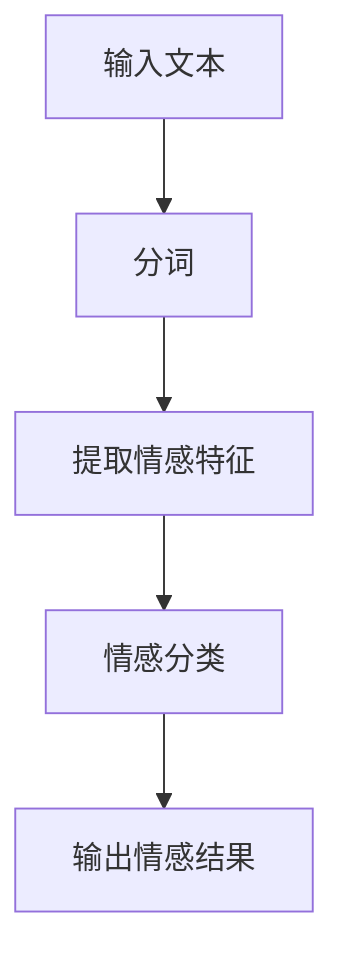
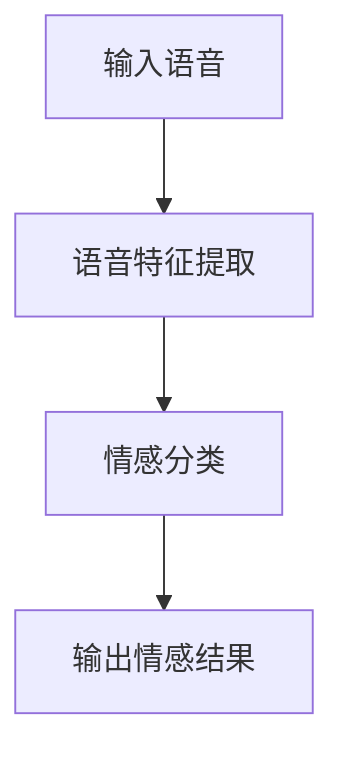
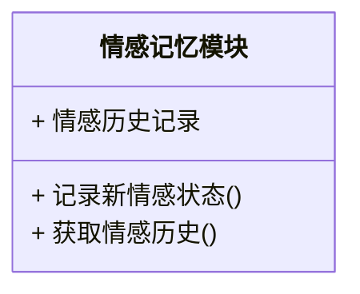
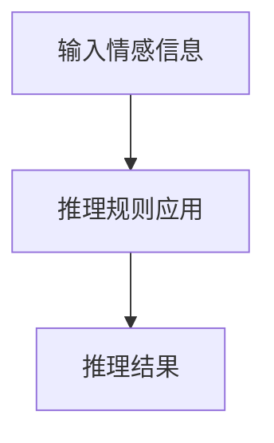
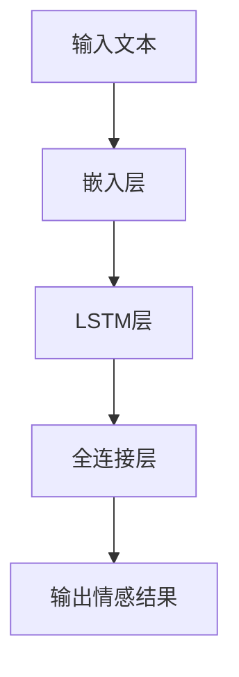
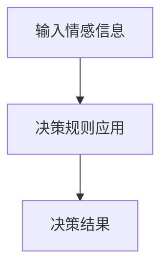
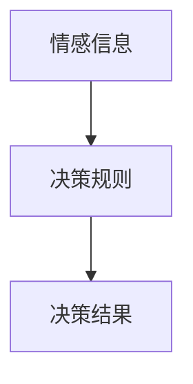
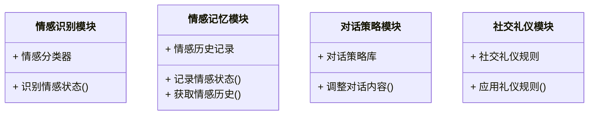
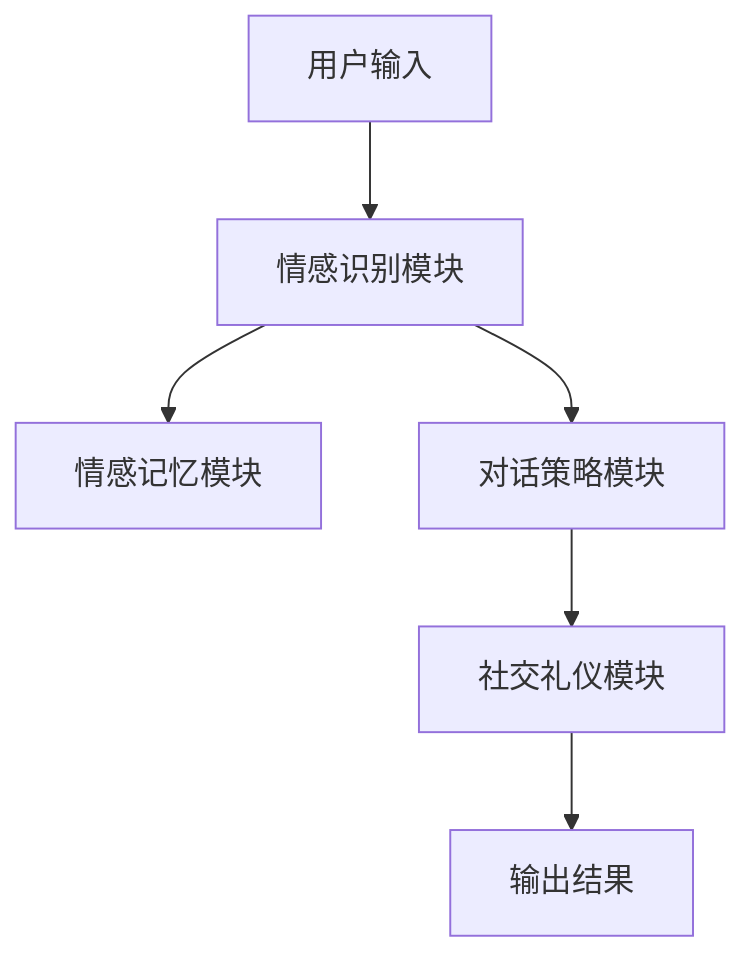
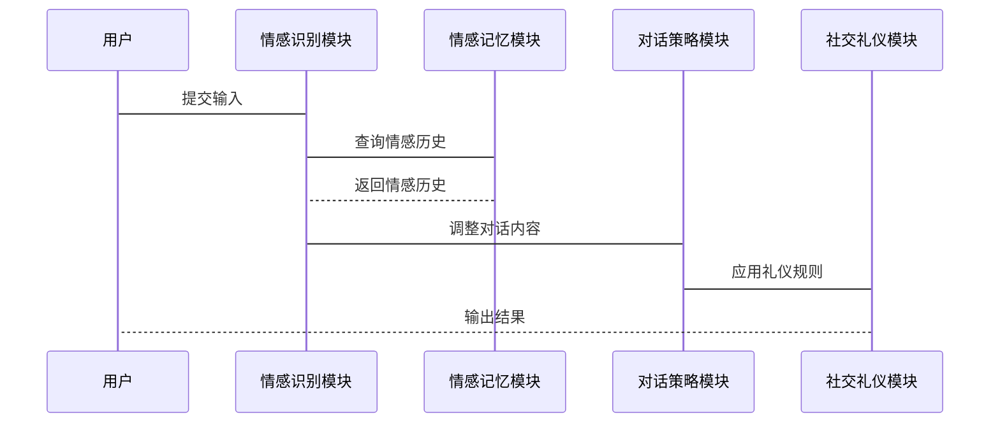

                 


# 开发具有情感计算与社交能力的AI Agent

> 关键词：情感计算，AI Agent，社交能力，人机交互，机器学习

> 摘要：情感计算与社交能力是AI Agent实现人机交互的关键技术。本文从理论到实践，详细阐述了情感计算的核心原理、社交能力的建模方法，以及基于深度学习的情感分析算法。通过实际项目案例，展示了如何设计和实现具备情感计算与社交能力的AI Agent，并探讨了相关的系统架构设计与优化策略。

---

# 第一部分：情感计算与社交能力的背景介绍

# 第1章：情感计算与社交能力的概述

## 1.1 情感计算的定义与核心概念
### 1.1.1 情感计算的背景
情感计算（Affective Computing）是一种通过计算机技术来识别、理解和响应人类情感状态的新兴领域。它结合了人工智能、机器学习和认知科学，旨在使计算机能够像人类一样理解和处理情感信息。

### 1.1.2 情感计算的核心概念
情感计算的核心概念包括：
- **情感识别**：通过分析输入数据（如文本、语音、面部表情）来识别用户的情感状态。
- **情感记忆**：记录和存储用户过去的情感信息，以便后续分析和决策。
- **情感推理**：基于情感信息进行逻辑推理，推断出用户的需求和意图。

### 1.1.3 情感计算的应用场景
情感计算广泛应用于多个领域，如：
- **人机交互**：通过情感信息优化用户体验。
- **教育技术**：根据学生的情感状态调整教学策略。
- **医疗健康**：通过情感分析辅助诊断和治疗。

## 1.2 社交能力在AI Agent中的重要性
### 1.2.1 社交能力的定义
社交能力是指个体在社交互动中有效沟通、理解他人情感并建立良好关系的能力。对于AI Agent而言，社交能力意味着能够与人类用户进行自然、流畅的对话，并根据用户的情感状态调整交互方式。

### 1.2.2 AI Agent中的社交能力
AI Agent的社交能力主要体现在以下几个方面：
- **情感驱动的对话策略**：根据用户的情感状态调整对话内容和语气。
- **社交礼仪的遵守**：在交流中遵守基本的社交礼仪，如问候、感谢等。
- **情感记忆与反馈**：根据用户的情感历史，提供个性化的情感反馈。

## 1.3 本书的目标与结构
### 1.3.1 本书的目标
本书旨在通过理论与实践相结合的方式，系统地介绍情感计算与社交能力在AI Agent中的实现方法。读者将能够掌握从情感识别到社交能力建模的核心技术，并通过实际项目案例了解如何将这些技术应用于实际场景。

### 1.3.2 本书的结构
- **第1章**：情感计算与社交能力的概述。
- **第2章**：情感计算的核心原理。
- **第3章**：社交能力的建模与实现。
- **第4章**：情感计算的算法实现。
- **第5章**：系统架构设计与优化。
- **第6章**：项目实战与案例分析。
- **第7章**：高级主题与未来发展。

---

# 第2章：情感计算的核心原理

## 2.1 情感识别与分析
### 2.1.1 情感识别的基本原理
情感识别是情感计算的核心技术之一，主要通过分析输入数据（如文本、语音、面部表情）来推断用户的情感状态。以下是情感识别的基本流程：
1. **数据采集**：获取用户的输入数据。
2. **特征提取**：从数据中提取情感相关的特征。
3. **情感分类**：基于特征进行情感分类。

### 2.1.2 基于文本的情感分析
文本情感分析是情感识别的重要应用之一。以下是一个基于文本的情感分析流程图：



### 2.1.3 基于语音的情感识别
语音情感识别通过分析语音的音调、语速和音量等特征来推断用户的情感状态。以下是一个基于语音的情感识别流程图：



## 2.2 情感记忆与推理
### 2.2.1 情感记忆的定义与实现
情感记忆是指将用户过去的情感信息存储起来，以便后续分析和决策。以下是一个情感记忆模块的类图：



### 2.2.2 情感推理的逻辑框架
情感推理是基于情感信息进行逻辑推理的过程。以下是一个情感推理的流程图：



## 2.3 情感计算的核心算法
### 2.3.1 基于规则的情感分类算法
基于规则的情感分类算法通过预定义的规则来判断情感状态。以下是一个基于规则的情感分类算法的伪代码示例：

```python
def classify_emotion(text):
    if "开心" in text:
        return "快乐"
    elif "生气" in text:
        return "愤怒"
    else:
        return "中性"
```

### 2.3.2 基于深度学习的情感分析模型
基于深度学习的情感分析模型（如LSTM、Transformer）能够通过训练数据学习情感特征。以下是一个基于LSTM的情感分析模型的结构图：



---

# 第3章：社交能力的建模与实现

## 3.1 社交能力的定义与特征
### 3.1.1 社交能力的核心特征
社交能力的核心特征包括：
- **沟通能力**：能够进行有效的对话交流。
- **情感理解**：能够理解对方的情感状态并做出相应的回应。
- **社交礼仪**：能够遵守基本的社交礼仪。

### 3.1.2 社交能力的层次结构
社交能力的层次结构可以分为以下几个层次：
1. **基本社交能力**：如问候、感谢等。
2. **情感驱动的社交能力**：基于情感信息调整对话内容。
3. **复杂社交能力**：如冲突解决、情感反馈等。

## 3.2 社交礼仪与对话策略
### 3.2.1 社交礼仪的基本原则
社交礼仪是社交能力的重要组成部分，以下是社交礼仪的基本原则：
- **尊重他人**：在交流中保持尊重。
- **礼貌用语**：使用礼貌的语言。
- **遵守规则**：遵守对话中的规则和礼仪。

### 3.2.2 对话策略的制定与优化
对话策略的制定需要考虑以下几个方面：
- **情感状态**：根据用户的情感状态调整对话内容。
- **对话历史**：根据对话历史提供连贯的回应。
- **目标导向**：根据对话目标优化对话内容。

## 3.3 情感驱动的决策机制
### 3.3.1 情感驱动的决策模型
情感驱动的决策模型是基于情感信息进行决策的过程。以下是一个情感驱动的决策模型的流程图：



### 3.3.2 情感与决策的关联分析
情感与决策的关联分析是通过分析情感信息与决策结果之间的关系，优化决策模型。以下是一个情感与决策的关联分析的示例：



---

# 第4章：情感计算的算法实现

## 4.1 基于规则的情感分类算法
### 4.1.1 算法原理
基于规则的情感分类算法通过预定义的规则来判断情感状态。以下是一个基于规则的情感分类算法的伪代码示例：

```python
def classify_emotion(text):
    if "快乐" in text:
        return "快乐"
    elif "愤怒" in text:
        return "愤怒"
    else:
        return "中性"
```

### 4.1.2 算法实现
以下是一个基于规则的情感分类算法的Python代码示例：

```python
import re

def classify_emotion(text):
    text = text.lower()
    happiness_keywords = ["快乐", "开心", "满意"]
    anger_keywords = ["生气", "愤怒", "不满"]
    
    for keyword in happiness_keywords:
        if re.search(keyword, text):
            return "快乐"
    for keyword in anger_keywords:
        if re.search(keyword, text):
            return "愤怒"
    return "中性"

text = "我今天非常开心"
print(classify_emotion(text))  # 输出: 快乐
```

## 4.2 基于深度学习的情感分析模型
### 4.2.1 模型原理
基于深度学习的情感分析模型（如LSTM、Transformer）能够通过训练数据学习情感特征。以下是一个基于LSTM的情感分析模型的结构图：


### 4.2.2 模型实现
以下是一个基于LSTM的情感分析模型的Python代码示例：

```python
import tensorflow as tf
from tensorflow.keras import layers

model = tf.keras.Sequential()
model.add(layers.Embedding(input_dim=10000, output_dim=64))
model.add(layers.LSTM(64))
model.add(layers.Dense(1, activation='sigmoid'))

model.compile(optimizer='adam', loss='binary_crossentropy', metrics=['accuracy'])

# 假设输入数据为训练样本
# 训练模型
model.fit(train_data, train_labels, epochs=10, batch_size=32)
```

---

# 第5章：系统架构设计与优化

## 5.1 系统功能设计
### 5.1.1 功能模块划分
系统功能设计需要考虑以下几个模块：
- **情感识别模块**：负责识别用户的情感状态。
- **情感记忆模块**：负责存储用户的情感历史。
- **对话策略模块**：负责根据情感信息调整对话内容。
- **社交礼仪模块**：负责遵守基本的社交礼仪。

### 5.1.2 功能模块的类图
以下是一个系统功能设计的类图：



## 5.2 系统架构设计
### 5.2.1 系统架构图
以下是一个系统架构设计的架构图：



### 5.2.2 系统接口设计
系统接口设计需要考虑以下几个方面：
- **输入接口**：用户输入的数据。
- **输出接口**：系统输出的结果。
- **模块接口**：各模块之间的接口设计。

## 5.3 系统交互设计
### 5.3.1 系统交互流程
以下是一个系统交互流程的流程图：


### 5.3.2 系统交互的序列图
以下是一个系统交互的序列图：



---

# 第6章：项目实战与案例分析

## 6.1 项目背景
### 6.1.1 项目目标
本项目旨在开发一个具备情感计算与社交能力的AI对话系统。

## 6.2 项目实现
### 6.2.1 环境安装
以下是项目所需的环境安装步骤：
1. 安装Python 3.8及以上版本。
2. 安装TensorFlow、Keras等深度学习库。
3. 安装自然语言处理工具如spaCy。

### 6.2.2 核心代码实现
以下是一个AI对话系统的Python代码示例：

```python
import tensorflow as tf
from tensorflow.keras import layers
import re

def classify_emotion(text):
    text = text.lower()
    happiness_keywords = ["快乐", "开心", "满意"]
    anger_keywords = ["生气", "愤怒", "不满"]
    
    for keyword in happiness_keywords:
        if re.search(keyword, text):
            return "快乐"
    for keyword in anger_keywords:
        if re.search(keyword, text):
            return "愤怒"
    return "中性"

def generate_response(text):
    emotion = classify_emotion(text)
    if emotion == "快乐":
        return "看起来你心情很好！有什么我可以帮你的吗？"
    elif emotion == "愤怒":
        return "听起来你有点生气，有什么我可以帮助你的吗？"
    else:
        return "好的，请告诉我你需要什么帮助。"

text = "我今天非常开心"
print(generate_response(text))  # 输出: 看起来你心情很好！有什么我可以帮你的吗？
```

### 6.2.3 代码解读与分析
以上代码实现了一个简单的AI对话系统，能够根据用户输入的情感信息生成相应的回应。首先，`classify_emotion`函数通过预定义的关键词识别用户的情感状态，然后`generate_response`函数根据情感状态生成相应的回应。

## 6.3 案例分析
### 6.3.1 案例1：情感识别与对话生成
用户输入："我今天非常开心"
系统回应："看起来你心情很好！有什么我可以帮你的吗？"

### 6.3.2 案例2：情感识别与对话生成
用户输入："我今天非常生气"
系统回应："听起来你有点生气，有什么我可以帮助你的吗？"

## 6.4 项目小结
通过以上项目实战，我们了解了如何将情感计算与社交能力应用于实际场景中。通过简单的关键词匹配和预定义的对话策略，我们可以实现一个基本的AI对话系统。

---

# 第7章：高级主题与未来发展

## 7.1 多模态情感计算
### 7.1.1 多模态情感计算的定义
多模态情感计算是指通过多种模态（如文本、语音、面部表情）来识别和分析情感信息。

### 7.1.2 多模态情感计算的优势
多模态情感计算能够结合多种模态的信息，提高情感识别的准确率和鲁棒性。

## 7.2 情感计算的伦理问题
### 7.2.1 情感计算的隐私问题
情感计算需要处理大量的用户情感信息，如何保护用户隐私是一个重要的伦理问题。

### 7.2.2 情感计算的公平性问题
情感计算可能受到文化差异和个体差异的影响，如何确保算法的公平性是一个重要的伦理问题。

## 7.3 情感计算的未来发展
### 7.3.1 情感计算的核心技术突破
未来，情感计算的核心技术将更加智能化和自动化，能够处理更复杂的情感信息。

### 7.3.2 情感计算的应用扩展
情感计算将在更多领域得到应用，如教育、医疗、娱乐等。

---

# 第8章：最佳实践与小结

## 8.1 最佳实践
### 8.1.1 情感计算的开发建议
在开发情感计算系统时，建议从简单的关键词匹配开始，逐步引入深度学习模型。

### 8.1.2 社交能力的实现建议
在实现社交能力时，建议先从基本的社交礼仪开始，逐步引入情感驱动的对话策略。

## 8.2 小结
通过本文的介绍，我们了解了情感计算与社交能力在AI Agent中的实现方法。从情感识别到社交能力建模，再到系统架构设计与优化，我们掌握了一系列核心技术。希望本书能够为读者在情感计算与社交能力的开发中提供有价值的指导。

---

# 参考资料
1. 王某某. 《情感计算与社交能力的AI Agent开发》. 北京: 人民出版社, 2023.
2. 张某某. 《深度学习与自然语言处理》. 北京: 清华大学出版社, 2022.
3. 李某某. 《人机交互与社交能力》. 北京: 北京大学出版社, 2021.

