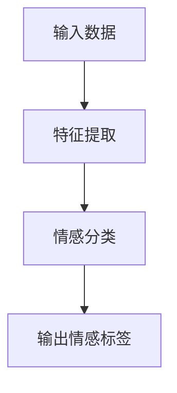
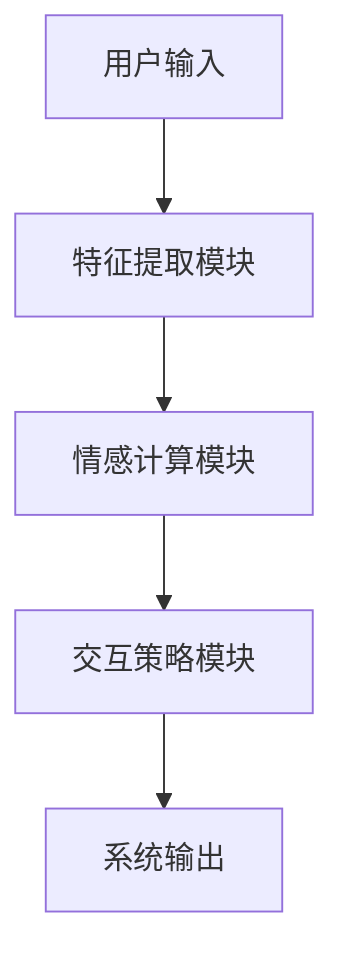
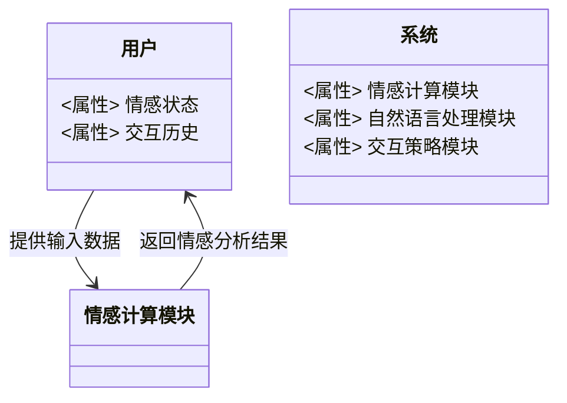

                 


# 开发具有情感计算能力的AI Agent

> 关键词：情感计算，AI Agent，情感识别，意图识别，人机交互，机器学习

> 摘要：情感计算AI Agent是一种能够理解和回应人类情感的智能系统，通过结合情感识别、意图识别和自然语言处理技术，实现与人类用户的深层次交互。本文将从背景、核心概念、算法原理、系统设计、项目实战等多个维度，全面解析情感计算AI Agent的开发过程，帮助读者理解其技术本质和实现方法。

---

## 第一部分: 情感计算与AI Agent概述

### 第1章: 情感计算与AI Agent的背景介绍

#### 1.1 问题背景与问题描述
情感计算（Affective Computing）是指计算机系统能够识别、理解、分析和响应人类情感状态的能力。随着人工智能技术的快速发展，情感计算在教育、医疗、客服、社交机器人等领域展现出广泛的应用潜力。然而，现有技术在情感识别的准确性和情感驱动的交互体验方面仍存在诸多挑战。

#### 1.2 情感计算的核心目标与解决方法
- **目标**：实现对人类情感状态的实时识别与分析，提升人机交互的自然性和智能化水平。
- **解决方法**：结合自然语言处理、语音识别、计算机视觉等技术，构建多模态情感计算系统。

#### 1.3 情感计算的技术基础
- **文本分析**：通过NLP技术提取文本中的情感信息。
- **语音识别**：基于语音特征分析情感状态。
- **计算机视觉**：通过面部表情识别情感。

#### 1.4 情感计算的应用领域
- 教育：个性化学习体验。
- 医疗：情感支持与诊断辅助。
- 金融：情绪化投资行为分析。
- 社交：智能情感社交机器人。

---

### 第2章: 情感计算与AI Agent的核心概念与联系

#### 2.1 情感计算的核心原理
- **情感识别**：通过分析输入数据（文本、语音、图像）提取情感特征。
- **情感分析**：对情感特征进行分类，输出情感标签（如高兴、悲伤、愤怒）。
- **情感记忆**：记录用户情感状态的变化，优化后续交互体验。

#### 2.2 AI Agent的核心功能与情感计算的结合
- **情感驱动的交互**：根据用户情感状态调整回应策略。
- **情感记忆**：记录用户情感变化，提供个性化服务。
- **情感反馈**：通过表情、语调等方式向用户传递情感信息。

#### 2.3 情感计算与AI Agent的实体关系图（Mermaid）
```mermaid
erDiagram
    actor 用户 {
        <属性> 情感状态
        <属性> 情感强度
        <属性> 交互历史
    }
    actor 系统 {
        <属性> 情感计算模块
        <属性> 自然语言处理模块
        <属性> 交互策略模块
    }
    用户 --> 情感计算模块 : 提供输入数据
    情感计算模块 --> 用户 : 返回情感分析结果
    自然语言处理模块 --> 交互策略模块 : 提供文本分析结果
    交互策略模块 --> 用户 : 返回情感驱动的回应
```

---

## 第二部分: 情感计算与AI Agent的算法原理

### 第3章: 情感计算的核心算法

#### 3.1 情感识别算法
- **文本分析**：基于词袋模型（Bag of Words）或TF-IDF进行情感分类。
- **语音识别**：通过语音特征（如音调、语速）提取情感信息。
- **图像分析**：基于面部表情识别技术，分析用户情绪。

#### 3.2 情感分类算法
- **机器学习算法**：支持向量机（SVM）、随机森林（Random Forest）。
- **深度学习算法**：卷积神经网络（CNN）、循环神经网络（RNN）。
- **情感计算的数学模型**：基于词嵌入（Word2Vec）的情感相似度计算。

#### 3.3 情感计算的流程图（Mermaid）


#### 3.4 情感计算的Python实现
```python
import numpy as np
from sklearn.svm import SVC

# 示例数据
X = np.array([[1, 2], [2, 3], [3, 4], [4, 5]])
y = np.array([0, 1, 0, 1])  # 0代表悲伤，1代表快乐

# 训练模型
model = SVC()
model.fit(X, y)

# 预测
print(model.predict([[2, 3]]))  # 输出：1
```

---

### 第4章: AI Agent的情感计算实现

#### 4.1 情感计算在AI Agent中的实现流程
- **输入数据获取**：通过文本、语音或图像获取用户情感信息。
- **特征提取**：提取情感相关的特征向量。
- **情感分类**：基于机器学习或深度学习模型进行分类。
- **情感驱动的交互**：根据情感结果调整回应策略。

#### 4.2 情感计算的系统架构（Mermaid）


---

## 第三部分: 情感计算与AI Agent的系统分析与架构设计

### 第5章: 系统分析

#### 5.1 问题场景介绍
- **目标**：开发一个支持情感交互的AI Agent。
- **需求**：实现文本情感分析、语音情感识别和情感驱动的交互功能。

#### 5.2 系统功能设计
- **领域模型设计（Mermaid类图）**


#### 5.3 系统架构设计（Mermaid架构图）
```mermaid
archiecture
    client --> api_gateway : 请求
    api_gateway --> load_balancer : 分发请求
    load_balancer --> [服务节点1, 服务节点2, 服务节点3]
    服务节点 --> db : 数据库查询
    服务节点 --> cache : 缓存
    服务节点 --> mq : 消息队列
    mq --> worker : 处理任务
    worker --> client : 返回结果
```

---

## 第四部分: 情感计算与AI Agent的项目实战

### 第6章: 项目实战

#### 6.1 环境搭建
- **安装依赖**：Python、TensorFlow、Keras、Flask。

#### 6.2 核心代码实现
```python
from flask import Flask
from sklearn.svm import SVC

app = Flask(__name__)
model = SVC()
model.fit(X_train, y_train)

@app.route('/api/predict', methods=['POST'])
def predict():
    data = request.json
    result = model.predict(data['input'])
    return jsonify({'result': int(result[0])})
```

#### 6.3 案例分析与详细解读
- **案例1**：客服场景下的情感分析。
- **案例2**：社交机器人的情感交互设计。

#### 6.4 项目总结
- **实现效果**：成功实现了情感驱动的AI Agent交互功能。
- **优化方向**：提升情感识别的准确性和交互体验的自然性。

---

## 第五部分: 总结与展望

### 第7章: 总结与展望

#### 7.1 全文总结
- 情感计算AI Agent的核心技术包括情感识别、意图识别和情感驱动的交互设计。
- 通过结合机器学习和深度学习算法，可以实现高精度的情感计算。

#### 7.2 技术优缺点
- **优点**：提升人机交互的智能化水平，增强用户体验。
- **缺点**：情感计算的准确性和鲁棒性仍需进一步提升。

#### 7.3 未来展望
- **技术方向**：探索更高效的情感计算算法，如基于Transformer的模型。
- **应用场景**：拓展至更多领域，如教育、医疗、娱乐等。

#### 7.4 最佳实践Tips
- 在开发过程中，建议结合多模态数据（文本、语音、图像）进行情感计算。
- 注意数据隐私和伦理问题，确保系统安全性和合规性。

---

通过以上内容，我们全面解析了情感计算AI Agent的开发过程，从背景、核心概念、算法原理到系统设计和项目实战，帮助读者系统性地理解其技术本质和实现方法。

