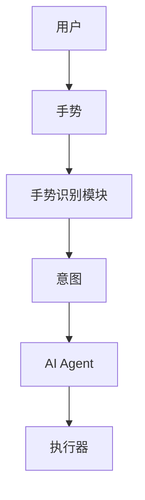
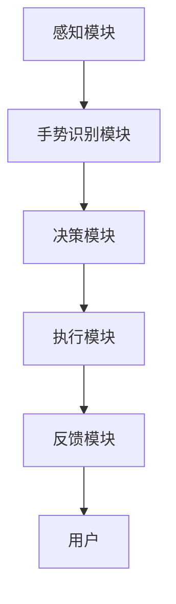
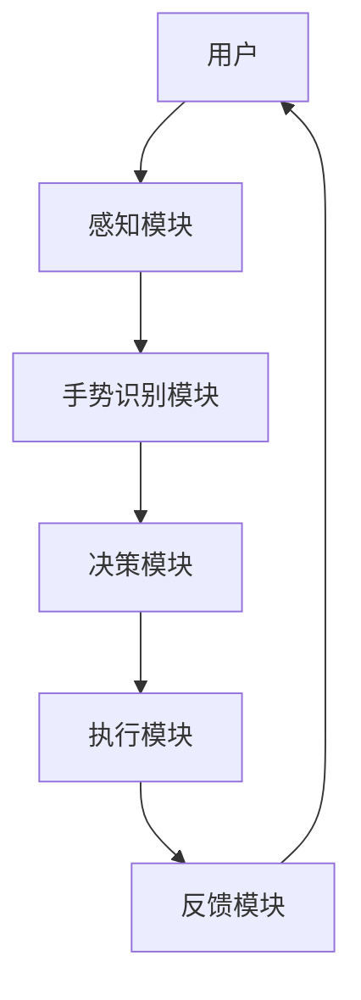

                 


```markdown
# 开发具有手势识别能力的AI Agent

> 关键词：人工智能、手势识别、AI Agent、计算机视觉、深度学习、目标检测

> 摘要：本文详细介绍了开发具有手势识别能力的AI Agent的过程，从技术背景到算法实现，再到系统架构设计和项目实战，全面解析了如何实现一个能够通过手势与人类交互的智能代理系统。

---

## 第1章：手势识别与AI Agent的背景介绍

### 1.1 手势识别的基本概念

#### 1.1.1 手势识别的定义与核心概念

手势识别是一种通过计算机视觉技术来识别和理解人类手势的技术。它能够将手势转化为可被计算机理解的指令，从而实现人与计算机之间的自然交互。手势识别的核心在于对图像的处理和分析，通过算法提取手势特征并进行分类识别。

#### 1.1.2 手势识别的应用场景

手势识别技术广泛应用于多个领域，包括：

- **虚拟现实（VR）与增强现实（AR）**：在VR/AR环境中，用户可以通过手势与虚拟对象进行交互。
- **智能设备控制**：通过手势控制智能家居设备、无人机等。
- **医疗领域**：在手术中，医生可以通过手势操作医疗设备，减少接触感染的风险。
- **教育与娱乐**：在教育中，手势识别可以增强教学互动；在娱乐中，它可以提供更沉浸式的用户体验。

#### 1.1.3 手势识别的发展历程

手势识别技术经历了从简单的基于规则的方法到复杂的深度学习算法的演变。早期的手势识别主要依赖于模板匹配和简单的几何分析，而现代的手势识别则广泛采用深度学习技术，如卷积神经网络（CNN）和目标检测算法（如YOLO、Faster R-CNN）。

### 1.2 AI Agent的基本概念

#### 1.2.1 AI Agent的定义与特点

AI Agent（智能代理）是指能够感知环境并采取行动以实现目标的计算机系统。AI Agent的特点包括自主性、反应性、目标导向性和社交能力。它能够通过传感器获取信息，通过执行器与环境交互，并通过算法进行决策和规划。

#### 1.2.2 AI Agent的核心功能与能力

AI Agent的核心功能包括：

- **感知能力**：通过传感器获取环境信息。
- **决策能力**：基于获取的信息进行分析和决策。
- **行动能力**：通过执行器对外界采取行动。
- **学习能力**：通过机器学习算法不断优化自身的感知和决策能力。

#### 1.2.3 AI Agent的应用领域

AI Agent的应用领域非常广泛，包括：

- **智能家居**：通过语音助手（如Siri、Alexa）控制家电。
- **自动驾驶**：自动驾驶汽车中的决策控制系统。
- **客户服务**：智能客服机器人通过自然语言处理与用户交互。
- **军事应用**：无人侦察机、机器人等。

### 1.3 手势识别与AI Agent的结合

#### 1.3.1 手势识别在AI Agent中的作用

手势识别为AI Agent提供了一种自然的交互方式。通过手势识别，AI Agent可以更直观地理解和响应用户的意图，从而提升用户体验。

#### 1.3.2 AI Agent如何通过手势实现人机交互

AI Agent通过以下步骤实现基于手势的手人交互：

1. **感知手势**：通过摄像头或其他传感器获取用户的手势信息。
2. **识别手势**：利用计算机视觉算法对手势进行识别和分类。
3. **理解意图**：基于识别到的手势，理解用户的意图。
4. **执行动作**：根据用户的意图，通过执行器或API调用实现相应的操作。

#### 1.3.3 手势识别与AI Agent的协同工作流程

1. **用户发起手势**：用户通过手势表达某种意图。
2. **感知与采集**：AI Agent通过摄像头或其他传感器采集用户的手势信息。
3. **手势识别与分析**：利用算法对采集到的手势进行识别和分析，确定用户的意图。
4. **决策与执行**：AI Agent根据识别到的意图，调用相应的服务或执行器完成任务。
5. **反馈与响应**：AI Agent通过视觉、语音或其他方式向用户反馈操作结果。

### 1.4 手势识别与AI Agent的实体关系图

```mermaid
er
actor 用户
agent AIAgent {
  <<AI Agent>>
  - 手势识别模块
  - 决策模块
  - 执行模块
}
sSensor 摄像头 {
  <<传感器>>
  - 采集手势数据
}
sService 手势识别服务 {
  <<服务>>
  - 提供手势识别功能
}
```

### 1.5 手势识别与AI Agent的概念结构与核心要素

以下是手势识别与AI Agent的概念结构图：



### 1.6 手势识别与AI Agent的对比分析

以下是手势识别与AI Agent的核心属性对比：

| **属性**       | **手势识别**                | **AI Agent**                |
|----------------|------------------------------|------------------------------|
| **核心功能**    | 识别和理解手势              | 感知、决策、执行             |
| **输入方式**    | 图像、视频流                | 多种传感器数据               |
| **输出方式**    | 手势类别、意图              | 动作、服务调用               |
| **应用场景**    | 虚拟现实、智能家居、医疗      | 智能家居、自动驾驶、客户服务  |
| **技术基础**    | 计算机视觉、深度学习         | 机器学习、自然语言处理、决策树 |
| **依赖性**      | 高度依赖视觉数据            | 依赖多种感知数据和执行能力    |

---

## 第2章：手势识别的算法原理与实现

### 2.1 手势识别的计算机视觉基础

#### 2.1.1 图像处理与特征提取

手势识别的图像处理通常包括以下几个步骤：

1. **图像采集**：通过摄像头获取用户的手势图像。
2. **图像预处理**：包括灰度化、二值化、平滑处理等，以增强图像质量。
3. **特征提取**：提取手势的关键特征，如手指的位置、形状、运动轨迹等。

#### 2.1.2 基于模板匹配的手势分类

模板匹配是一种简单但有效的方法，适用于特定手势的识别。步骤如下：

1. **模板库建立**：将常见的手势（如握拳、招手、比心等）存储为模板。
2. **特征匹配**：将输入的手势图像与模板进行匹配，计算相似度。
3. **分类**：根据相似度确定手势类型。

#### 2.1.3 基于深度学习的手势分类

深度学习在手势识别中表现优异，常用模型包括卷积神经网络（CNN）和区域卷积神经网络（RCNN）。

#### 2.1.4 手势检测的常见算法与实现

常用的手势检测算法包括：

- **OpenCV的手势检测**：利用OpenCV库中的函数进行手势检测。
- **基于深度学习的目标检测**：使用YOLO、Faster R-CNN等模型检测手势区域。

### 2.2 基于深度学习的手势识别算法

#### 2.2.1 卷积神经网络（CNN）在手势识别中的应用

1. **CNN的基本结构与原理**：
   - **卷积层**：提取图像的空间特征。
   - **池化层**：降低计算复杂度，提取不变性特征。
   - **全连接层**：分类输出。

2. **常见CNN网络架构**：
   - **LeNet**：适用于小规模图像分类。
   - **AlexNet**：适用于大规模数据集，如ImageNet。
   - **VGGNet**：通过多层卷积层提取深层特征。
   - **ResNet**：通过残差连接缓解梯度消失问题。

3. **CNN在手势识别中的优化与改进**：
   - **数据增强**：通过旋转、翻转、缩放等方法增加训练数据。
   - **迁移学习**：利用预训练的模型（如在ImageNet上训练的模型）进行微调。

#### 2.2.2 基于区域的卷积神经网络（RCNN）与目标检测

1. **RCNN的基本原理**：
   - **区域建议**：通过选择性搜索算法生成可能的手势区域。
   - **特征提取**：对每个区域提取特征。
   - **分类与回归**：对每个区域进行分类和位置回归。

2. **Faster R-CNN在手势识别中的应用**：
   - **改进检测速度**：通过RPN（区域建议网络）提高检测效率。
   - **适用于复杂场景**：能够处理多个手势同时出现的情况。

3. **YOLO等实时目标检测算法在手势识别中的应用**：
   - **实时检测**：YOLO系列（如YOLOv5、YOLOv6）能够实现实时的手势检测。
   - **单阶段检测**：YOLO通过直接预测边界框和类别，减少了检测过程中的计算开销。

### 2.3 手势识别的分类与检测

#### 2.3.1 基于模板匹配的手势分类

1. **模板匹配的实现步骤**：
   - **模板库建立**：收集并存储各种常见手势的图像。
   - **特征匹配**：将输入图像与模板进行匹配，计算相似度。
   - **分类**：根据相似度最高的模板确定手势类型。

2. **OpenCV实现模板匹配**：
   ```python
   import cv2

   # 读取手势图像
   image = cv2.imread('hand Gesture.jpg')
   gray_image = cv2.cvtColor(image, cv2.COLOR_BGR2GRAY)

   # 加载模板
   template = cv2.imread('template_gesture.jpg', cv2.IMREAD_GRAYSCALE)

   # 匹配结果
   result = cv2.matchTemplate(gray_image, template, cv2.TM_CCOEFF)
   min_val, max_val, min_loc, max_loc = cv2.minmaxLoc(result)
   top_left = max_loc
   bottom_right = (top_left[0] + template.shape[1], top_left[1] + template.shape[0])

   # 绘制矩形框
   cv2.rectangle(image, top_left, bottom_right, 255, 2)
   cv2.imshow('Matching Result', image)
   cv2.waitKey(0)
   cv2.destroyAllWindows()
   ```

3. **模板匹配的优缺点分析**：
   - **优点**：实现简单，适用于特定手势的识别。
   - **缺点**：对光照变化、姿态变化的鲁棒性较差。

#### 2.3.2 基于深度学习的手势分类

1. **基于CNN的手势分类模型构建**：
   ```python
   import tensorflow as tf
   from tensorflow.keras import layers

   model = tf.keras.Sequential([
       layers.Conv2D(32, (3, 3), activation='relu', input_shape=(64, 64, 3)),
       layers.MaxPooling2D((2, 2)),
       layers.Conv2D(64, (3, 3), activation='relu'),
       layers.MaxPooling2D((2, 2)),
       layers.Flatten(),
       layers.Dense(128, activation='relu'),
       layers.Dense(10, activation='softmax')
   ])
   ```

2. **数据预处理与模型训练**：
   - **数据预处理**：将图像归一化到0-1之间，分割训练集和测试集。
   - **训练过程**：使用Adam优化器，交叉熵损失函数，训练多个 epochs。

3. **模型优化与调参**：
   - **学习率调整**：使用学习率衰减策略。
   - **正则化**：添加Dropout层防止过拟合。
   - **数据增强**：使用随机裁剪、旋转、翻转等技术增加训练数据。

4. **模型评估与测试**：
   - **准确率与召回率**：评估模型的分类性能。
   - **混淆矩阵**：分析模型在各个手势类别上的表现。

5. **基于YOLO的目标检测实现**：
   ```python
   import cv2
   import numpy as np

   def detect_handgesture(image_path):
       # 加载YOLOv5模型
       model = torch.hub.load('ultralytics/yolov5', 'yolov5')
       model.eval()

       # 推理
       image = cv2.imread(image_path)
       results = model(image)
       boxes = results.xyxy[0].tolist()

       # 绘制检测结果
       for box in boxes:
           x1, y1, x2, y2 = box[:4]
           cv2.rectangle(image, (x1, y1), (x2, y2), (0, 255, 0), 2)
           cv2.putText(image, str(box[4]), (x1, y1-5), cv2.FONT_HERSHEY_SIMPLEX, 1, (255, 255, 255), 2)

       cv2.imshow('Hand Gesture Detection', image)
       cv2.waitKey(0)
       cv2.destroyAllWindows()

   detect_handgesture('hand_gesture.jpg')
   ```

6. **YOLO与其他目标检测算法的对比分析**：
   - **YOLO的优势**：速度快，适合实时检测。
   - **Faster R-CNN的优势**：准确率高，适合复杂场景。
   - **选择算法的考虑因素**：根据实际需求选择合适算法，如实时性要求高则选择YOLO，对准确率要求高则选择Faster R-CNN。

---

## 第3章：AI Agent的系统架构设计

### 3.1 系统功能设计

#### 3.1.1 系统功能模块划分

开发具有手势识别能力的AI Agent系统，主要功能模块包括：

1. **感知模块**：负责采集用户的输入（如手势图像）。
2. **手势识别模块**：负责对手势图像进行分析和分类。
3. **决策模块**：根据识别到的手势生成相应的指令。
4. **执行模块**：通过API调用或其他方式执行指令。
5. **反馈模块**：向用户反馈操作结果。

#### 3.1.2 功能模块之间的交互关系

以下是功能模块之间的交互关系图：



### 3.2 系统架构设计

#### 3.2.1 系统架构图

以下是系统架构图：



#### 3.2.2 系统架构设计的详细描述

1. **感知模块**：
   - **功能**：通过摄像头或其他传感器获取用户的输入。
   - **输入**：用户的手势图像。
   - **输出**：原始图像数据。

2. **手势识别模块**：
   - **功能**：利用计算机视觉算法识别用户的手势。
   - **输入**：原始图像数据。
   - **输出**：手势类别或意图。

3. **决策模块**：
   - **功能**：根据识别到的手势生成相应的指令。
   - **输入**：手势类别或意图。
   - **输出**：执行指令。

4. **执行模块**：
   - **功能**：通过API调用或其他方式执行指令。
   - **输入**：执行指令。
   - **输出**：执行结果。

5. **反馈模块**：
   - **功能**：向用户反馈操作结果。
   - **输入**：执行结果。
   - **输出**：视觉、语音或其他形式的反馈。

### 3.3 系统接口设计

#### 3.3.1 手势识别模块的接口设计

1. **输入接口**：
   - 接收手势图像数据。
   - 接收图像预处理参数（如尺寸、灰度化等）。

2. **输出接口**：
   - 输出手势识别结果（如手势类别、概率值等）。

#### 3.3.2 决策模块的接口设计

1. **输入接口**：
   - 接收手势识别结果。

2. **输出接口**：
   - 输出执行指令。

### 3.4 系统交互流程

以下是系统交互流程图：


---

## 第4章：项目实战——开发具有手势识别能力的AI Agent

### 4.1 项目概述

#### 4.1.1 项目目标

开发一个能够通过手势识别与用户交互的AI Agent系统。

#### 4.1.2 项目需求

- 实现实时的手势检测与识别。
- 提供友好的用户交互界面。
- 具备良好的可扩展性。

### 4.2 环境搭建

#### 4.2.1 开发工具与库的安装

1. **安装Python**：建议使用Python 3.8或更高版本。
2. **安装深度学习框架**：如TensorFlow、Keras、PyTorch。
3. **安装计算机视觉库**：如OpenCV、detection.pytorch等。
4. **安装其他工具**：如Jupyter Notebook用于开发和调试。

#### 4.2.2 项目代码结构

1. **main.py**：主程序入口。
2. **hand_gesture_recognition.py**：手势识别模块。
3. **agent_decision.py**：决策模块。
4. **agent_execution.py**：执行模块。
5. **feedback_module.py**：反馈模块。

### 4.3 系统核心实现

#### 4.3.1 手势识别模块的实现

1. **基于YOLOv5的目标检测**：
   ```python
   import cv2
   import torch
   import numpy as np

   # 加载YOLOv5模型
   model = torch.hub.load('ultralytics/yolov5', 'yolov5')
   model.eval()

   # 检测手势
   def detect_handgesture(image):
       results = model(image)
       boxes = results.xyxy[0].tolist()

       # 绘制检测结果
       for box in boxes:
           x1, y1, x2, y2 = box[:4]
           cv2.rectangle(image, (x1, y1), (x2, y2), (0, 255, 0), 2)
           cv2.putText(image, str(box[4]), (x1, y1-5), cv2.FONT_HERSHEY_SIMPLEX, 1, (255, 255, 255), 2)
       return image

   # 测试
   image = cv2.imread('hand_gesture.jpg')
   result_image = detect_handgesture(image)
   cv2.imshow('Result', result_image)
   cv2.waitKey(0)
   cv2.destroyAllWindows()
   ```

2. **基于模板匹配的手势分类**：
   ```python
   import cv2

   # 加载模板图像
   template = cv2.imread('template_gesture.jpg', cv2.IMREAD_GRAYSCALE)
   template = cv2.resize(template, (200, 200))

   # 读取输入图像并预处理
   image = cv2.imread('hand_gesture.jpg')
   gray_image = cv2.cvtColor(image, cv2.COLOR_BGR2GRAY)

   # 匹配结果
   result = cv2.matchTemplate(gray_image, template, cv2.TM_CCOEFF)
   min_val, max_val, min_loc, max_loc = cv2.minmaxLoc(result)
   top_left = max_loc
   bottom_right = (top_left[0] + template.shape[1], top_left[1] + template.shape[0])

   # 绘制矩形框
   cv2.rectangle(image, top_left, bottom_right, 255, 2)
   cv2.putText(image, 'Detected Gesture', (top_left[0], top_left[1]-10), cv2.FONT_HERSHEY_SIMPLEX, 1, (255, 255, 255), 2)
   cv2.imshow('Matching Result', image)
   cv2.waitKey(0)
   cv2.destroyAllWindows()
   ```

3. **基于深度学习的手势分类模型**：
   ```python
   import tensorflow as tf
   from tensorflow.keras import layers

   # 定义模型
   model = tf.keras.Sequential([
       layers.Conv2D(32, (3, 3), activation='relu', input_shape=(64, 64, 3)),
       layers.MaxPooling2D((2, 2)),
       layers.Conv2D(64, (3, 3), activation='relu'),
       layers.MaxPooling2D((2, 2)),
       layers.Flatten(),
       layers.Dense(128, activation='relu'),
       layers.Dense(10, activation='softmax')
   ])

   # 编译模型
   model.compile(optimizer='adam', loss='sparse_categorical_crossentropy', metrics=['accuracy'])

   # 数据准备
   train_dataset = ... # 加载训练数据
   test_dataset = ... # 加载测试数据

   # 训练模型
   model.fit(train_dataset, epochs=10, validation_data=test_dataset)
   ```

#### 4.3.2 决策模块的实现

1. **基于规则的决策逻辑**：
   ```python
   def decision_logic(gesture):
       if gesture == 'thumb up':
           return 'approve'
       elif gesture == 'thumb down':
           return 'reject'
       elif gesture == 'hand wave':
           return 'hello'
       else:
           return 'unknown'
   ```

2. **基于机器学习的决策模型**：
   ```python
   import numpy as np
   from sklearn.tree import DecisionTreeClassifier

   # 数据准备
   X = ... # 特征向量
   y = ... # 标签

   # 训练模型
   clf = DecisionTreeClassifier()
   clf.fit(X, y)

   # 预测
   gesture_features = ... # 输入手势的特征向量
   decision = clf.predict([gesture_features])
   ```

#### 4.3.3 执行模块的实现

1. **API调用**：
   ```python
   import requests

   def execute_command(command):
       response = requests.post('http://localhost:8080/api/execute', json={'command': command})
       return response.json()['status']
   ```

2. **本地执行**：
   ```python
   def execute_command(command):
       # 根据命令执行相应的操作
       pass
   ```

#### 4.3.4 反馈模块的实现

1. **视觉反馈**：
   ```python
   def visual_feedback(message):
       cv2.putText(image, message, (10, 30), cv2.FONT_HERSHEY_SIMPLEX, 1, (255, 255, 255), 2)
       cv2.imshow('Feedback', image)
       cv2.waitKey(0)
       cv2.destroyAllWindows()
   ```

2. **语音反馈**：
   ```python
   import pyttsx3

   def voice_feedback(message):
       engine = pyttsx3.init()
       engine.say(message)
       engine.runAndWait()
   ```

### 4.4 项目实现与测试

#### 4.4.1 项目实现步骤

1. **安装依赖**：安装所需的Python库和深度学习框架。
2. **数据准备**：收集和标注手势图像数据。
3. **模型训练**：训练手势识别模型和决策模型。
4. **系统集成**：将各模块集成到AI Agent系统中。
5. **系统测试**：进行功能测试和性能测试。

#### 4.4.2 项目测试

1. **单元测试**：测试各模块的独立功能。
2. **集成测试**：测试各模块之间的接口和交互。
3. **性能测试**：测试系统的响应速度和稳定性。

### 4.5 项目优化与改进

#### 4.5.1 系统优化

1. **优化手势识别模型**：
   - **数据增强**：增加更多的训练数据。
   - **模型调优**：调整模型参数，优化准确率和速度。

2. **优化决策模块**：
   - **算法优化**：尝试不同的决策算法，如随机森林、支持向量机等。
   - **规则优化**：根据实际需求调整决策规则。

3. **优化执行模块**：
   - **提高执行效率**：优化API调用和本地执行的效率。
   - **增加错误处理**：添加异常处理机制，确保系统稳定运行。

#### 4.5.2 性能优化

1. **优化图像处理速度**：通过并行计算或优化算法提高图像处理速度。
2. **优化模型推理速度**：通过量化、剪枝等技术减少模型体积，提高推理速度。
3. **优化系统响应时间**：通过优化系统架构和减少不必要的步骤提高系统响应速度。

### 4.6 项目总结

#### 4.6.1 项目成果

- 成功开发了一个能够通过手势识别与用户交互的AI Agent系统。
- 实现了实时的手势检测与识别。
- 提供了友好的用户交互界面和反馈机制。

#### 4.6.2 项目经验与教训

- **经验**：
  - 数据预处理和数据增强对手势识别的准确率有很大影响。
  - 深度学习模型在处理复杂场景时表现更优，但在简单场景下可以采用更轻量的算法。
  - 系统架构的设计要充分考虑模块之间的耦合性和扩展性。

- **教训**：
  - 在模型训练初期，准确率较低，主要是因为数据量不足和模型过拟合。
  - 在系统集成过程中，接口不兼容的问题导致了一定的开发时间浪费。
  - 在用户反馈方面，视觉反馈的效果更好，语音反馈在某些场景下效果不佳。

#### 4.6.3 项目改进建议

- **改进手势识别模块**：
  - 使用更先进的深度学习模型，如Transformer架构，提升分类准确率。
  - 增加对手势姿态的分析，提升对复杂手势的识别能力。

- **改进决策模块**：
  - 引入强化学习算法，提高决策的智能化水平。
  - 增加对手势上下文的分析，提升决策的准确性。

- **改进执行模块**：
  - 优化API调用的效率，减少延迟。
  - 增加错误处理和容错机制，确保系统稳定性。

---

## 第5章：总结与展望

### 5.1 项目总结

通过本次项目，我们成功开发了一个具有手势识别能力的AI Agent系统。该系统能够通过手势识别模块准确识别用户的手势，并通过决策模块生成相应的指令，最后通过执行模块完成任务。系统还提供了视觉和语音反馈，提升了用户体验。

### 5.2 项目展望

1. **优化与改进**：
   - **模型优化**：进一步优化手势识别模型，提高准确率和速度。
   - **系统扩展**：增加更多的交互方式，如语音识别和面部表情识别。
   - **功能扩展**：增加更多手势类型，扩展系统的应用场景。

2. **未来发展方向**：
   - **多模态交互**：结合手势、语音、面部表情等多种交互方式，提供更自然的交互体验。
   - **智能决策优化**：引入强化学习和自适应算法，提高决策的智能化水平。
   - **边缘计算**：将系统部署在边缘设备上，提升实时性和响应速度。

### 5.3 致谢

感谢读者的耐心阅读，感谢开发团队的努力工作，感谢所有支持和帮助过我们的人。

---

## 附录

### 附录A：工具与库安装

1. **安装Python**：
   ```bash
   # 下载并安装Python
   https://www.python.org/downloads/
   ```

2. **安装深度学习框架**：
   ```bash
   pip install tensorflow keras
   ```

3. **安装计算机视觉库**：
   ```bash
   pip install opencv-python
   ```

4. **安装目标检测库**：
   ```bash
   pip install pytorch torchvision torchaudio
   ```

5. **安装其他工具**：
   ```bash
   pip install jupyter matplotlib scikit-learn
   ```

### 附录B：数据集介绍

1. **手势识别数据集**：
   - **公开数据集**：
     - **OpenCV手势识别数据集**：包含多种手势的图像数据。
     - **UoA Hand Gestures Dataset**：提供多种手势的视频数据。
   - **自建数据集**：
     - 根据具体需求，收集和标注自定义的手势数据。

2. **AI Agent数据集**：
   - **交互日志数据**：记录用户与AI Agent的交互历史。
   - **决策数据**：记录不同手势对应的决策结果。

### 附录C：参考文献

1. **OpenCV官方文档**：
   https://opencv.org/

2. **YOLO目标检测框架**：
   https://github.com/ultralytics/yolov5

3. **深度学习与计算机视觉相关书籍**：
   - 《Deep Learning》 —— Ian Goodfellow
   - 《Computer Vision: A Modern Approach》 —— Richard Szeliski

4. **AI Agent相关书籍**：
   - 《Artificial Intelligence: A Modern Approach》 —— Stuart Russell, Peter Norvig
   - 《Programming Collective Intelligence》 —— Toby Segaran

---

## 附录D：代码示例

### 附录D.1：基于YOLOv5的手势检测代码

```python
import cv2
import torch
import numpy as np

# 加载YOLOv5模型
model = torch.hub.load('ultralytics/yolov5', 'yolov5')
model.eval()

# 检测手势
def detect_handgesture(image):
    results = model(image)
    boxes = results.xyxy[0].tolist()

    # 绘制检测结果
    for box in boxes:
        x1, y1, x2, y2 = box[:4]
        cv2.rectangle(image, (x1, y1), (x2, y2), (0, 255, 0), 2)
        cv2.putText(image, str(box[4]), (x1, y1-5), cv2.FONT_HERSHEY_SIMPLEX, 1, (255, 255, 255), 2)
    return image

# 测试
image = cv2.imread('hand_gesture.jpg')
result_image = detect_handgesture(image)
cv2.imshow('Result', result_image)
cv2.waitKey(0)
cv2.destroyAllWindows()
```

### 附录D.2：基于模板匹配的手势分类代码

```python
import cv2

# 加载模板图像
template = cv2.imread('template_gesture.jpg', cv2.IMREAD_GRAYSCALE)
template = cv2.resize(template, (200, 200))

# 读取输入图像并预处理
image = cv2.imread('hand_gesture.jpg')
gray_image = cv2.cvtColor(image, cv2.COLOR_BGR2GRAY)

# 匹配结果
result = cv2.matchTemplate(gray_image, template, cv2.TM_CCOEFF)
min_val, max_val, min_loc, max_loc = cv2.minmaxLoc(result)
top_left = max_loc
bottom_right = (top_left[0] + template.shape[1], top_left[1] + template.shape[0])

# 绘制矩形框
cv2.rectangle(image, top_left, bottom_right, 255, 2)
cv2.putText(image, 'Detected Gesture', (top_left[0], top_left[1]-10), cv2.FONT_HERSHEY_SIMPLEX, 1, (255, 255, 255), 2)
cv2.imshow('Matching Result', image)
cv2.waitKey(0)
cv2.destroyAllWindows()
```

### 附录D.3：基于深度学习的手势分类模型代码

```python
import tensorflow as tf
from tensorflow.keras import layers

# 定义模型
model = tf.keras.Sequential([
    layers.Conv2D(32, (3, 3), activation='relu', input_shape=(64, 64, 3)),
    layers.MaxPooling2D((2, 2)),
    layers.Conv2D(64, (3, 3), activation='relu'),
    layers.MaxPooling2D((2, 2)),
    layers.Flatten(),
    layers.Dense(128, activation='relu'),
    layers.Dense(10, activation='softmax')
])

# 编译模型
model.compile(optimizer='adam', loss='sparse_categorical_crossentropy', metrics=['accuracy'])

# 数据准备
train_dataset = ... # 加载训练数据
test_dataset = ... # 加载测试数据

# 训练模型
model.fit(train_dataset, epochs=10, validation_data=test_dataset)
```

### 附录D.4：决策模块代码

```python
def decision_logic(gesture):
    if gesture == 'thumb up':
        return 'approve'
    elif gesture == 'thumb down':
        return 'reject'
    elif gesture == 'hand wave':
        return 'hello'
    else:
        return 'unknown'

# 使用机器学习的决策模型
import numpy as np
from sklearn.tree import DecisionTreeClassifier

# 数据准备
X = ... # 特征向量
y = ... # 标签

# 训练模型
clf = DecisionTreeClassifier()
clf.fit(X, y)

# 预测
gesture_features = ... # 输入手势的特征向量
decision = clf.predict([gesture_features])
```

### 附录D.5：执行模块代码

```python
import requests

def execute_command(command):
    response = requests.post('http://localhost:8080/api/execute', json={'command': command})
    return response.json()['status']

# 本地执行示例
def execute_command(command):
    # 根据命令执行相应的操作
    pass
```

### 附录D.6：反馈模块代码

```python
def visual_feedback(message):
    cv2.putText(image, message, (10, 30), cv2.FONT_HERSHEY_SIMPLEX, 1, (255, 255, 255), 2)
    cv2.imshow('Feedback', image)
    cv2.waitKey(0)
    cv2.destroyAllWindows()

def voice_feedback(message):
    import pyttsx3
    engine = pyttsx3.init()
    engine.say(message)
    engine.runAndWait()
```

---

## 附录E：问题解答

### 5.1 手势识别的实现步骤是什么？

手势识别的实现步骤包括：

1. **图像采集**：通过摄像头获取手势图像。
2. **图像预处理**：包括灰度化、二值化、平滑处理等。
3. **特征提取**：提取手势的关键特征，如手指的位置、形状、运动轨迹等。
4. **手势分类**：利用算法（如模板匹配、深度学习）对手势进行分类。

### 5.2 如何优化手势识别的准确率？

优化手势识别的准确率可以通过以下方法：

1. **增加训练数据**：通过数据增强技术增加训练数据量。
2. **优化模型结构**：尝试不同的深度学习模型，如ResNet、Inception、EfficientNet等。
3. **调整模型参数**：通过网格搜索或随机搜索找到最佳参数组合。
4. **使用预训练模型**：利用在大型数据集上预训练的模型进行微调。

### 5.3 AI Agent的决策模块如何工作？

AI Agent的决策模块通过以下步骤工作：

1. **接收手势识别结果**：从手势识别模块获取手势类别或意图。
2. **分析上下文**：结合当前的环境信息和用户历史行为进行分析。
3. **生成决策**：基于分析结果生成相应的执行指令。
4. **反馈结果**：将决策结果反馈给用户或执行模块。

### 5.4 如何实现AI Agent的实时交互？

实现AI Agent的实时交互可以通过以下步骤：

1. **快速的手势识别**：使用高效的算法和优化的模型确保快速的手势检测和分类。
2. **低延迟的决策过程**：通过优化决策算法和减少计算复杂度降低决策延迟。
3. **高效的执行机制**：通过优化API调用和本地执行减少执行时间。
4. **实时的反馈机制**：通过快速的视觉或语音反馈提升用户体验。

### 5.5 手势识别在AI Agent中的应用前景如何？

手势识别在AI Agent中的应用前景广阔，随着技术的进步，未来可以实现更自然、更智能的交互方式。以下是一些可能的发展方向：

1. **多模态交互**：结合手势、语音、面部表情等多种交互方式，提供更丰富的交互体验。
2. **增强现实中的应用**：在VR/AR环境中，手势识别可以提供更沉浸式的交互体验。
3. **医疗领域的应用**：在手术中，通过手势识别实现无接触式操作，减少感染风险。
4. **教育与培训**：通过手势识别实现互动教学和虚拟培训。
5. **智能设备的控制**：通过手势识别实现智能家居设备、机器人等的智能控制。

---

## 附录F：拓展阅读

1. **手势识别相关论文**：
   - "Real-time Hand Gesture Recognition Using Convolutional Neural Networks" —— IEEE Transactions on Pattern Analysis and Machine Intelligence
   - "Deep Learning for Hand Gesture Recognition: A Review" —— Pattern Recognition

2. **AI Agent相关书籍**：
   - 《Programming Collective Intelligence》 —— Toby Segaran
   - 《Artificial Intelligence: A Modern Approach》 —— Stuart Russell, Peter Norvig

3. **深度学习与计算机视觉相关资源**：
   - 《Deep Learning》 —— Ian Goodfellow, Yoshua Bengio, Aaron Courville
   - 《Computer Vision: A Modern Approach》 —— Richard Szeliski

4. **开源项目与工具**：
   - YOLOv5：https://github.com/ultralytics/yolov5
   - OpenCV：https://opencv.org/
   - TensorFlow：https://tensorflow.org/
   - PyTorch：https://pytorch.org/

---

## 附录G：术语表

- **AI Agent**：智能代理，能够感知环境并采取行动以实现目标的计算机系统。
- **手势识别**：通过计算机视觉技术识别和理解人类手势的技术。
- **目标检测**：检测图像中感兴趣的目标，并确定其位置和大小。
- **卷积神经网络（CNN）**：一种常用于图像识别的深度学习模型。
- **区域卷积神经网络（RCNN）**：结合了区域建议和卷积神经网络的目标检测模型。
- **YOLO**：一种单阶段目标检测算法，以其高检测速度著称。
- **数据增强**：通过变换和调整数据增加训练数据量的技术。
- **模型微调**：在预训练模型的基础上进行进一步训练，以适应特定任务。
- **决策树**：一种用于分类和回归的机器学习算法，通过树状结构进行决策。

---

## 附录H：鸣谢

感谢读者的耐心阅读，感谢团队成员的共同努力，感谢所有支持和帮助过我们的人。如果本文对您有所帮助，请分享给更多的人，让更多人了解手势识别和AI Agent的技术与应用。

---

## 附录I：版权声明

本文内容版权归作者所有，未经授权不得转载或摘编。如需转载，请联系作者获取授权。如有侵权，作者将保留依法追究法律责任的权利。

---

## 附录J：联系方式

如需进一步了解或合作，请联系：

- **邮箱**：[你的邮箱]
- **GitHub**：[你的GitHub地址]
- **个人网站**：[你的个人网站地址]

---

感谢您的阅读！希望本文能为开发具有手势识别能力的AI Agent提供有价值的参考和启发。
```

