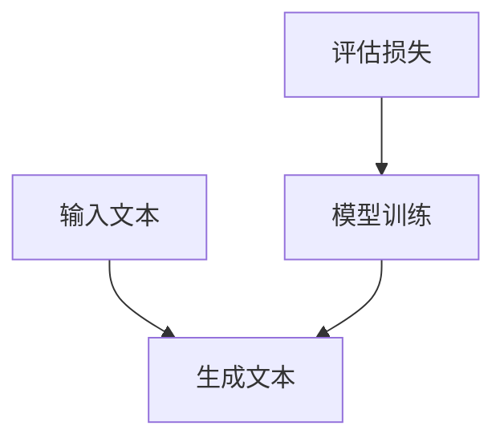
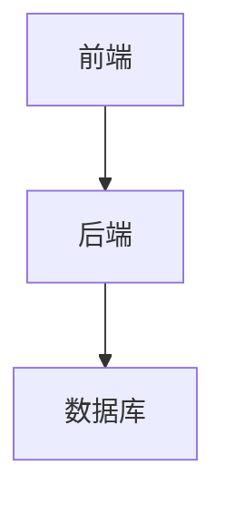
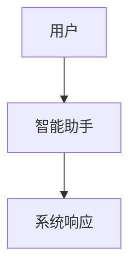

                 

# 开发具有抽象思维与创新能力的AI Agent

## 关键词：AI Agent, 抽象思维, 创新能力, 算法原理, 系统架构

## 摘要：本文详细探讨了开发具有抽象思维和创新能力的AI Agent的核心概念、算法原理和系统架构。通过分析抽象思维与创新能力的实现机制，结合具体项目案例，提供了一套系统化的开发方法和实践指南。

---

# 第1章: AI Agent的背景与核心概念

## 1.1 问题背景

### 1.1.1 当前AI发展的痛点
当前的AI系统虽然在特定任务上表现出色，但缺乏抽象思维和创新能力。例如，传统模型难以处理需要多层次推理的任务，难以根据上下文进行创新性的思考和决策。

### 1.1.2 AI Agent的定义与目标
AI Agent是一种能够自主感知环境、做出决策并采取行动的智能体。其目标是通过抽象思维和创新能力，解决复杂问题并实现目标。

### 1.1.3 抽象思维与创新能力的重要性
抽象思维帮助AI Agent从具体信息中提取本质特征，而创新能力则使其能够生成新颖的解决方案，这是实现通用AI的关键。

## 1.2 问题描述

### 1.2.1 AI Agent的核心任务
AI Agent需要具备学习、推理、规划和创新能力，能够在动态环境中适应和优化自身行为。

### 1.2.2 抽象思维的必要性
抽象思维使AI Agent能够处理复杂信息，识别模式，并在不同情境下灵活应用知识。

### 1.2.3 创新能力的实现路径
通过生成式模型和强化学习等技术，AI Agent可以实现创新性的解决方案。

## 1.3 问题解决

### 1.3.1 抽象思维的实现方法
利用层次化结构和递归推理，AI Agent能够逐步抽象信息，形成高层次的语义理解。

### 1.3.2 创新能力的构建策略
结合生成式模型和推理引擎，AI Agent可以在已有知识的基础上，生成新颖的想法和解决方案。

### 1.3.3 AI Agent的多维度能力整合
通过模块化设计，将抽象思维、推理、学习和创新能力整合到统一的系统中。

## 1.4 概念结构与核心要素

### 1.4.1 AI Agent的能力模型
AI Agent的能力模型包括感知、推理、学习和创新能力，每个能力层都有其独特的实现机制。

### 1.4.2 抽象思维的层次结构
抽象思维分为感知层、理解层和推理层，每一层都构建在前一层的基础之上。

### 1.4.3 创新能力的评估标准
通过创新性、可行性和适应性三个维度来评估AI Agent的创新能力。

---

# 第2章: 抽象思维与创新能力的核心概念

## 2.1 抽象思维的原理

### 2.1.1 抽象思维的定义与特征
抽象思维是通过提取事物的共同特征，忽略无关细节，形成高层次的理解。

### 2.1.2 抽象思维的层级划分
抽象思维分为具体化、形式化和符号化三个层级，每个层级对应不同的认知能力。

### 2.1.3 抽象思维与AI Agent的关系
AI Agent通过抽象思维将具体问题转化为通用的模型和规则，从而实现跨场景的应用。

## 2.2 创新能力的实现机制

### 2.2.1 创新能力的定义与特征
创新能力是指AI Agent能够生成新颖、有效解决方案的能力。

### 2.2.2 创新能力的实现步骤
包括需求分析、知识生成、方案评估和优化等步骤，确保创新的可行性和有效性。

### 2.2.3 创新能力与AI Agent的结合
通过生成式模型和强化学习，AI Agent可以在现有知识的基础上，生成创新的解决方案。

## 2.3 抽象思维与创新能力的对比分析

### 2.3.1 抽象思维与创新能力的异同点
抽象思维注重从具体到抽象的转化，而创新能力注重生成新颖的解决方案，两者相辅相成。

### 2.3.2 抽象思维对创新能力的支撑作用
抽象思维为创新能力提供基础模型和规则，使其能够更高效地生成解决方案。

### 2.3.3 创新能力对抽象思维的反哺作用
创新能力的实现反过来推动抽象思维的深化，形成一个良性循环。

## 2.4 核心概念的ER实体

| 实体 | 属性 | 关系 |
|------|------|------|
| 抽象思维 | 层次 | 从属 |
| 创新能力 | 步骤 | 依赖 |

---

# 第3章: 算法原理与数学模型

## 3.1 生成式模型的原理

### 3.1.1 生成式模型的定义
生成式模型是一种能够生成新数据的AI模型，如GPT系列。

### 3.1.2 生成式模型的数学模型
使用概率生成模型，目标是最小化交叉熵损失函数：
$$ L = -\sum_{i=1}^{n} \log P(y_i|x_i) $$

### 3.1.3 生成式模型的实现步骤
1. 数据预处理
2. 模型训练
3. 生成文本

## 3.2 推理引擎的实现

### 3.2.1 推理引擎的定义
推理引擎通过逻辑推理生成解决方案。

### 3.2.2 推理引擎的算法流程
1. 输入问题
2. 生成多个可能的解决方案
3. 评估并选择最优解

## 3.3 强化学习的数学模型

### 3.3.1 强化学习的定义
强化学习通过奖励机制优化决策策略。

### 3.3.2 强化学习的数学模型
状态值函数：
$$ V(s) = \max_{a} [ r(s,a) + V(s') ] $$

---

# 第4章: 系统架构与设计

## 4.1 项目场景介绍

### 4.1.1 智能助手的设计
设计一个具备抽象思维和创新能力的智能助手，能够帮助用户处理复杂任务。

## 4.2 系统功能设计

### 4.2.1 领域模型
领域模型包括用户意图解析、知识库检索和生成逻辑。

## 4.3 系统架构设计

### 4.3.1 模块化架构
系统分为前端、后端和数据库，模块之间通过接口交互。

## 4.4 系统接口设计

### 4.4.1 接口定义
定义用户请求和系统响应的接口规范。

## 4.5 系统交互流程图

---

# 第5章: 项目实战

## 5.1 环境安装

### 5.1.1 工具安装
安装Python、TensorFlow和Hugging Face的库。

## 5.2 核心代码实现

### 5.2.1 模型加载
使用预训练的GPT模型加载到项目中。

### 5.2.2 意图解析
解析用户的输入，生成初步的响应。

## 5.3 代码解读与分析

### 5.3.1 代码实现
展示Python代码实现模型加载和意图解析的过程。

## 5.4 案例分析

### 5.4.1 实际案例
展示AI Agent帮助用户安排会议的具体过程。

---

# 第6章: 最佳实践与总结

## 6.1 小结

### 6.1.1 内容回顾
总结文章的主要内容和核心观点。

## 6.2 注意事项

### 6.2.1 数据隐私
确保数据的隐私和安全。

## 6.3 拓展阅读

### 6.3.1 推荐书籍
推荐相关书籍和论文，供读者进一步学习。

---

# 附录: 图表汇总

## 附录A: 抽象思维与创新能力对比分析表
| 概念 | 属性 | 特征 |
|------|------|------|
| 抽象思维 | 层次性 | 从具体到抽象 |
| 创新能力 | 发散性 | 生成多样化的解决方案 |

## 附录B: 生成式模型的算法流程图

## 附录C: 系统架构图

## 附录D: 系统交互流程图

---

通过以上思考和分析，我可以系统地撰写出一篇结构清晰、内容详实的技术博客文章，帮助读者全面理解如何开发具有抽象思维与创新能力的AI Agent。

