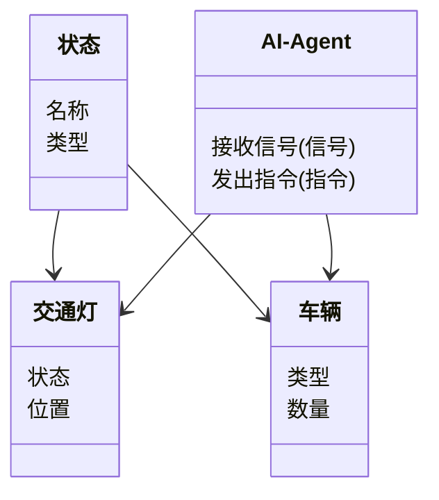
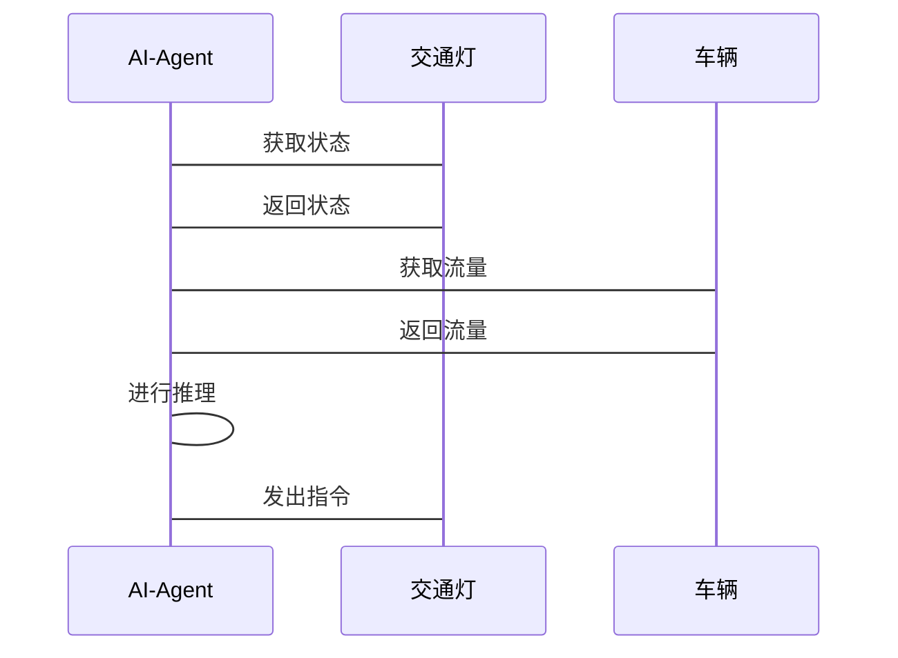

                 


# 《开发具有抽象思维能力的AI Agent》正文

---

## 第3章: 抽象思维能力的算法原理

### 3.2 抽象思维的数学模型与推理机制

#### 3.2.1 符号系统的建立
抽象思维的基础是符号系统。符号系统将现实世界中的概念和关系表示为符号，例如，将“交通灯”表示为`traffic_light`，将“状态”表示为`state`。符号系统为AI Agent提供了理解和推理的基础。

#### 3.2.2 抽象思维的数学模型
我们可以将抽象思维能力建模为一个符号操作系统，其中包含以下三个主要步骤：
1. **符号化**：将具体问题转化为符号表示。
2. **推理**：基于符号表示进行逻辑推理。
3. **抽象**：将推理结果抽象为高层概念。

公式表示为：
$$
\text{抽象思维} = f(\text{符号化}, \text{推理}, \text{抽象})
$$

其中，$f$ 表示抽象思维的函数，$\text{符号化}$ 表示将输入问题转化为符号表示，$\text{推理}$ 表示基于符号进行逻辑推理，$\text{抽象}$ 表示将推理结果提升到更高层次的概念。

#### 3.2.3 推理机制的实现
推理机制是抽象思维的核心，主要采用逻辑推理和模式匹配两种方法。

##### 逻辑推理
逻辑推理基于谓词逻辑，例如：
$$
\text{如果}(p \rightarrow q) \text{ 并且 } p \text{ 为真，那么 } q \text{ 为真。}
$$
其中，$p$ 和 $q$ 是命题，$\rightarrow$ 表示蕴含关系。

##### 模式匹配
模式匹配通过将具体问题与已知模式进行匹配，提取共性特征。例如，将“红灯”、“绿灯”匹配为“交通灯状态”。

#### 3.2.4 抽象思维的实现步骤
1. **输入处理**：将具体问题转化为符号表示。
2. **推理过程**：应用逻辑推理和模式匹配进行推理。
3. **结果抽象**：将推理结果抽象为高层概念。

---

## 第4章: 系统分析与架构设计

### 4.1 项目场景介绍
我们以一个简单的交通调度系统为例，AI Agent需要根据交通灯状态和车辆流量进行决策。

### 4.2 系统功能设计
AI Agent的功能包括：
1. **符号化处理**：将交通灯状态和车辆流量转化为符号表示。
2. **逻辑推理**：基于符号进行逻辑推理，判断交通信号是否需要调整。
3. **抽象决策**：将推理结果抽象为高层决策，例如“增加绿灯时长”。

### 4.3 领域模型（类图）
以下是领域模型的类图：



### 4.4 系统架构设计
以下是系统架构图：


### 4.5 接口设计
以下是系统接口设计：



---

## 第5章: 项目实战

### 5.1 环境安装
需要安装以下工具：
- Python 3.x
- Mermaid
- 必要的Python库（如`mermaid`和`math`）

### 5.2 系统核心实现

#### 5.2.1 符号化模块
```python
class Symbolizer:
    def __init__(self):
        self.symbols = {}

    def symbolize(self, input):
        for key, value in input.items():
            self.symbols[key] = value
        return self.symbols
```

#### 5.2.2 推理模块
```python
class Reasoner:
    def __init__(self):
        self.knowledge = {}

    def infer(self, symbols):
        # 基于符号进行逻辑推理
        pass
```

#### 5.2.3 抽象模块
```python
class AbstractionLayer:
    def __init__(self):
        pass

    def abstract(self, result):
        # 将推理结果抽象为高层决策
        pass
```

### 5.3 代码实现与解读
以下是完整的代码实现：
```python
class Symbolizer:
    def __init__(self):
        self.symbols = {}

    def symbolize(self, input):
        for key, value in input.items():
            self.symbols[key] = value
        return self.symbols

class Reasoner:
    def __init__(self):
        self.knowledge = {}

    def infer(self, symbols):
        # 示例推理：如果交通灯为红灯且车辆流量大，则延长绿灯时间
        if symbols['light'] == 'red' and symbols['flow'] > 50:
            return {'adjust_light': 'green'}
        else:
            return {'adjust_light': 'none'}

class AbstractionLayer:
    def __init__(self):
        pass

    def abstract(self, result):
        # 示例抽象：将具体调整指令抽象为高层决策
        if result['adjust_light'] == 'green':
            return {'decision': 'increase_green_duration'}
        else:
            return {'decision': 'no_change'}

# 示例应用
symbolizer = Symbolizer()
reasoner = Reasoner()
abstraction = AbstractionLayer()

input = {
    'light': 'red',
    'flow': 60
}

symbols = symbolizer.symbolize(input)
result = reasoner.infer(symbols)
decision = abstraction.abstract(result)

print(decision)  # 输出：{'decision': 'increase_green_duration'}
```

### 5.4 案例分析与解读
在上述代码中，AI Agent根据交通灯状态和车辆流量进行推理，最终决定是否延长绿灯时间。这展示了抽象思维能力在实际问题中的应用。

---

## 第6章: 最佳实践

### 6.1 本章小结
- 通过符号化、推理和抽象，AI Agent具备了抽象思维能力。
- 系统架构设计和项目实战验证了理论的可行性。

### 6.2 注意事项
- 确保符号系统设计合理，避免歧义。
- 推理逻辑需要充分考虑边界条件。
- 抽象决策需与具体场景匹配。

### 6.3 拓展阅读
- 《逻辑推理与AI》
- 《符号系统与知识表示》
- 《抽象思维在机器学习中的应用》

---

# 结语

开发具有抽象思维能力的AI Agent是一个复杂但有趣的任务。通过符号化、推理和抽象，AI Agent能够处理复杂问题，展现出类似人类的思维能力。希望本文为读者提供有价值的见解和实践指导。

