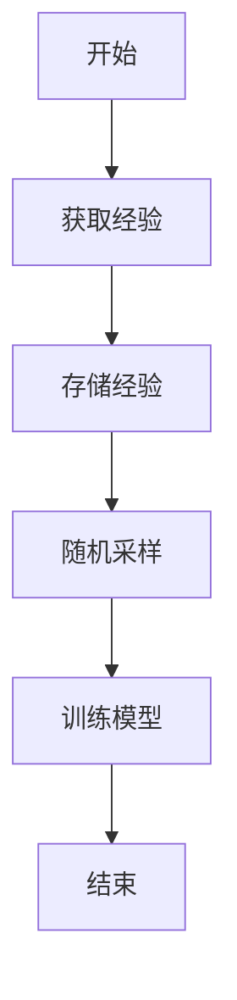
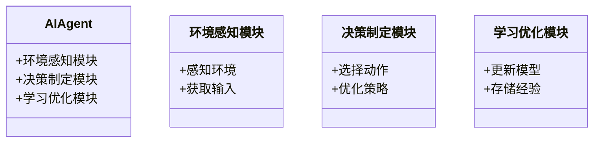

                 


# 开发具有持续学习能力的AI Agent

## 关键词：持续学习，AI Agent，机器学习，深度学习，强化学习，知识蒸馏，经验重放

## 摘要：本文详细探讨了开发具有持续学习能力的AI Agent的关键技术与实现方法。从持续学习的定义、核心概念，到具体的算法原理、系统架构设计，再到项目实战和最佳实践，本文为读者提供了从理论到实践的全面指导，帮助开发者构建能够不断进化和适应的新一代AI系统。

---

# 第1章: 持续学习AI Agent的背景介绍

## 1.1 持续学习的定义与问题背景

### 1.1.1 传统AI的局限性
传统AI系统通常基于静态训练数据进行训练，在部署后无法适应新数据或新任务。这种局限性在动态变化的环境中尤为明显，例如智能助手需要不断学习新知识以应对用户需求的变化。

### 1.1.2 持续学习的定义与核心问题
持续学习（Continuous Learning）是一种机器学习范式，旨在让模型能够逐步适应新的数据和任务，避免灾难性遗忘（Catastrophic Forgetting），同时保持对旧任务的记忆和性能。

### 1.1.3 持续学习的应用场景与边界
应用场景包括智能助手、推荐系统、自动驾驶、游戏AI等。边界在于模型无法处理完全无关的任务，且需要权衡新旧任务之间的学习资源。

## 1.2 持续学习AI Agent的核心概念
AI Agent通过感知环境、执行动作和学习优化来实现持续进化。核心概念包括经验重放、知识蒸馏和迁移学习。

## 1.3 持续学习AI Agent的挑战与机遇
技术挑战包括处理动态数据、防止灾难性遗忘；应用挑战包括实时性和安全性；未来发展方向包括结合元学习和多模态学习。

## 1.4 本章小结
本章介绍了持续学习AI Agent的背景、核心概念和挑战，为后续章节奠定了基础。

---

# 第2章: 持续学习的核心概念与联系

## 2.1 持续学习的原理与机制
### 2.1.1 经验重放机制
通过存储和重放经验来缓解梯度消失问题，帮助模型保持对旧任务的记忆。

### 2.1.2 知识蒸馏方法
通过教师模型将知识传递给学生模型，实现知识的压缩和转移。

### 2.1.3 迁移学习的应用
将已学习的知识迁移到新任务中，减少新任务的学习时间。

## 2.2 核心概念对比分析
通过对比表格展示经验重放与知识蒸馏的优缺点，帮助读者理解不同方法的特点。

| 概念       | 优点                     | 缺点                       |
|------------|--------------------------|---------------------------|
| 经验重放    | 有效缓解遗忘问题         | 需要存储大量经验           |
| 知识蒸馏    | 保持知识压缩             | 教师模型可能不够准确       |

## 2.3 持续学习的ER实体关系图
展示AI Agent与环境、知识库等实体之间的关系。

```
```mermaid
er
actor: AI Agent
agent: 知识库
knowledge_base: 环境
ability: 训练数据
```

## 2.4 本章小结
本章详细讲解了持续学习的核心机制，并通过对比分析和图表帮助读者理解不同概念之间的联系。

---

# 第3章: 持续学习AI Agent的算法原理

## 3.1 经验重放算法

### 3.1.1 算法原理
通过存储经验并随机采样进行训练，缓解梯度消失问题。

### 3.1.2 算法流程图
展示经验存储、采样和训练的流程。

```


### 3.1.3 代码示例
```python
import random
import numpy as np

class ExperienceReplay:
    def __init__(self, capacity):
        self.capacity = capacity
        self.memory = []

    def remember(self, state, action, reward, next_state):
        self.memory.append((state, action, reward, next_state))
        if len(self.memory) > self.capacity:
            self.memory.pop(0)

    def replay(self, batch_size):
        if len(self.memory) < batch_size:
            return
        minibatch = random.sample(self.memory, batch_size)
        # 训练模型
```

## 3.2 策略梯度方法

### 3.2.1 算法原理
通过优化策略函数，直接优化动作选择概率。

### 3.2.2 数学模型
策略梯度的损失函数：
$$ L = -\mathbb{E}_{\tau \sim \pi} [\log \pi(a|s) \cdot Q(s,a)] $$

## 3.3 元学习方法

### 3.3.1 算法原理
通过学习如何学习，快速适应新任务。

### 3.3.2 数学模型
元学习的优化目标：
$$ \theta = \arg\min_{\theta} \mathbb{E}_{t} [\mathcal{L}_t(\theta)] $$

## 3.4 本章小结
本章详细讲解了持续学习中的几种核心算法，包括经验重放、策略梯度和元学习，并通过代码示例和数学公式帮助读者理解其工作原理。

---

# 第4章: 持续学习AI Agent的系统分析与架构设计

## 4.1 系统分析
### 4.1.1 问题场景
AI Agent需要在动态环境中持续学习，应对新任务。

### 4.1.2 项目介绍
开发一个能够持续学习的AI Agent，应用于智能助手场景。

## 4.2 系统功能设计
### 4.2.1 领域模型
展示系统各模块之间的关系。

```


### 4.2.2 系统架构设计
展示系统的整体架构。

```


## 4.3 系统交互设计
展示系统各组件之间的交互过程。

```
```mermaid
sequence
    用户 --> 网关: 发送请求
    网关 --> AI Agent: 转发请求
    AI Agent --> 知识库: 查询信息
    知识库 --> AI Agent: 返回结果
    AI Agent --> 用户: 发送响应
```

## 4.4 本章小结
本章通过系统分析和架构设计，明确了AI Agent的实现框架和各模块之间的协作关系。

---

# 第5章: 持续学习AI Agent的项目实战

## 5.1 环境安装与准备
安装Python、TensorFlow、Keras等开发工具。

## 5.2 系统核心实现
### 5.2.1 感知模块实现
使用自然语言处理技术感知用户输入。

### 5.2.2 决策模块实现
基于强化学习选择最优动作。

### 5.2.3 学习模块实现
结合经验重放和策略梯度算法优化模型。

## 5.3 代码实现与解读
展示关键模块的代码实现。

## 5.4 实际案例分析
通过具体案例展示AI Agent的学习过程和效果。

## 5.5 项目小结
总结项目实现的经验和教训。

---

# 第6章: 持续学习AI Agent的最佳实践

## 6.1 小结与回顾
总结全文的核心内容。

## 6.2 注意事项
提示开发过程中需要注意的事项。

## 6.3 拓展阅读
推荐进一步学习的资料。

---

# 附录

## 附录A: 术语表
解释文中涉及的专业术语。

## 附录B: 参考文献
列出参考的文献和资料。

---

# 结语

通过本文的系统讲解，读者可以全面掌握开发具有持续学习能力的AI Agent的关键技术和实现方法。持续学习AI Agent的应用前景广阔，未来将推动人工智能技术的发展。

---

# END

