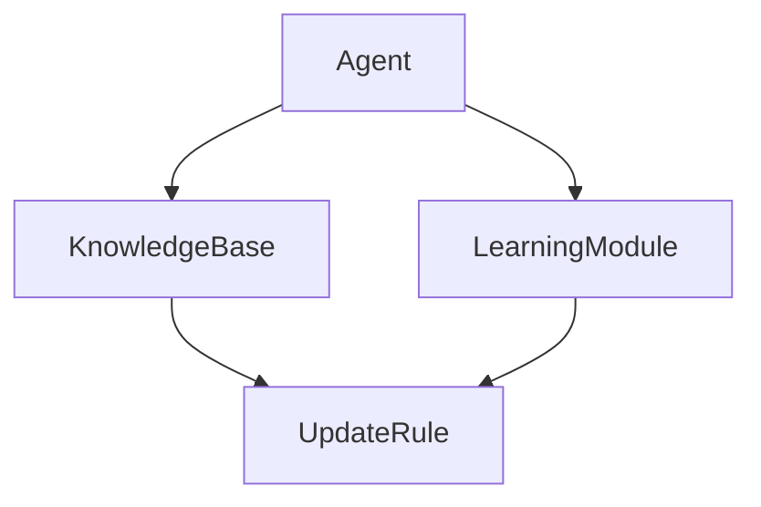
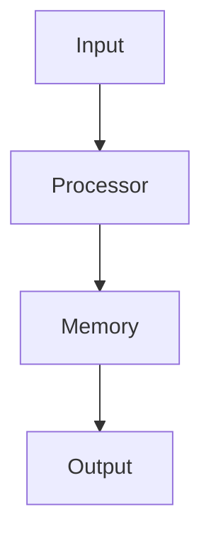
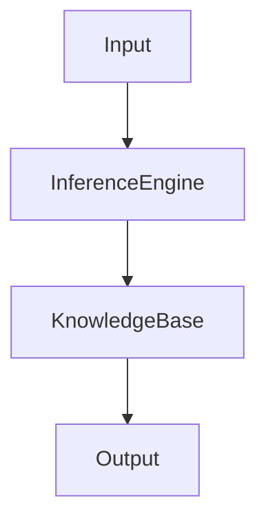
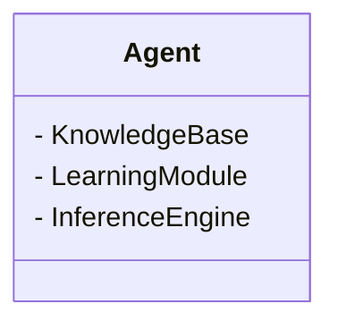
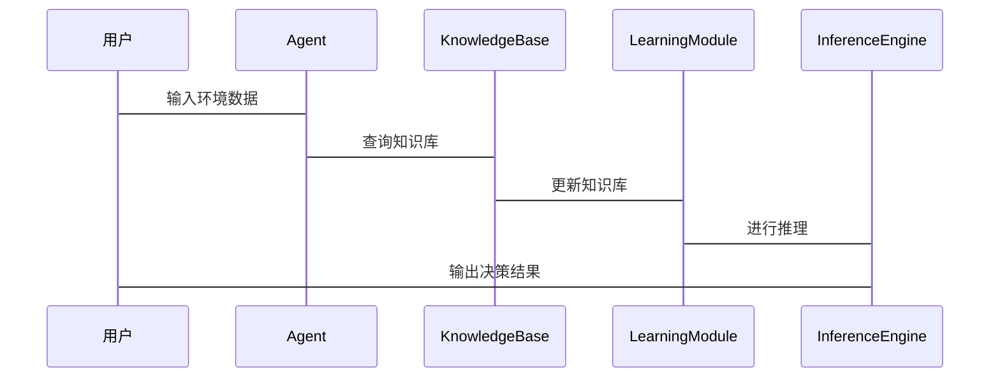

                 


# 开发具有持续适应能力的AI Agent

## 关键词：
AI Agent、持续适应、自适应学习、动态知识更新、人工智能系统设计

## 摘要：
本文详细探讨了开发具有持续适应能力的AI Agent的关键技术，从背景分析到系统架构设计，再到项目实战，全面解析了实现持续适应能力的核心概念与算法原理。文章通过实际案例展示了如何在复杂多变的环境中构建能够自我更新和适应的AI Agent，并提出了最佳实践和未来研究方向。

---

# 第1章 持续适应AI Agent的背景与核心概念

## 1.1 问题背景

### 1.1.1 当前AI Agent的发展现状
AI Agent（智能体）是人工智能领域的核心概念之一，广泛应用于自动驾驶、智能助手、机器人等领域。然而，现有的AI Agent大多依赖于静态知识库和固定的推理规则，难以应对动态变化的环境。

### 1.1.2 持续适应能力的必要性
在实际应用中，环境是动态变化的。例如，在自动驾驶中，交通规则、道路状况和驾驶场景可能随时变化。传统的AI Agent无法有效处理这些动态变化，导致性能下降甚至系统崩溃。

### 1.1.3 传统AI Agent的局限性
传统的AI Agent通常依赖于静态知识库和固定的推理规则，缺乏自我更新和适应能力。在面对新场景或新数据时，传统AI Agent往往需要人工干预或重新训练，导致效率低下。

## 1.2 问题描述

### 1.2.1 持续适应AI Agent的定义
持续适应AI Agent是一种能够在动态环境中不断更新知识和推理模型的智能体，能够根据环境变化自适应地调整行为策略。

### 1.2.2 适应能力的核心特征
- **持续学习**：能够在线更新知识和模型，适应新数据。
- **自适应推理**：能够根据环境变化动态调整推理逻辑。
- **动态知识更新**：能够实时更新知识库，保持知识的准确性。

### 1.2.3 适应能力与自适应学习的关系
自适应学习是一种技术手段，而适应能力是AI Agent的核心目标。持续适应AI Agent通过自适应学习实现对动态环境的适应。

## 1.3 问题解决

### 1.3.1 持续适应AI Agent的设计目标
- 实现知识库的动态更新。
- 构建自适应推理模型。
- 提供持续学习机制。

### 1.3.2 实现持续适应能力的关键技术
- 持续学习算法。
- 自适应推理模型。
- 动态知识更新机制。

### 1.3.3 持续适应AI Agent的应用场景
- 自动驾驶。
- 智能助手。
- 智能推荐系统。

## 1.4 边界与外延

### 1.4.1 持续适应能力的边界
- 适应能力的范围：仅限于动态环境中的特定任务。
- 适应能力的深度：仅限于知识库和推理模型的更新。

### 1.4.2 与相关概念的区分
- 与自适应学习的区分：自适应学习是一种技术手段，而持续适应能力是AI Agent的核心目标。
- 与在线学习的区分：在线学习是一种学习方式，而持续适应能力是一种系统特性。

### 1.4.3 持续适应能力的外延
- 可扩展性：支持多种任务和场景。
- 可解释性：能够解释适应过程和结果。

## 1.5 核心概念组成

### 1.5.1 核心要素分析
- 知识库：存储动态更新的知识。
- 学习模块：负责知识的更新和学习。
- 推理引擎：负责推理和决策。

### 1.5.2 概念结构与核心要素
- **知识库**：动态更新的知识存储。
- **学习模块**：负责知识的在线学习。
- **推理引擎**：负责动态推理和决策。

### 1.5.3 核心概念间的联系
- 知识库与学习模块：学习模块负责更新知识库。
- 知识库与推理引擎：推理引擎依赖知识库进行推理。
- 学习模块与推理引擎：推理引擎的结果反馈到学习模块，指导学习过程。

# 第2章 持续适应AI Agent的核心概念与联系

## 2.1 核心概念原理

### 2.1.1 持续学习机制
持续学习是一种在线学习方法，能够在新数据到来时更新模型。

### 2.1.2 自适应推理模型
自适应推理模型是一种能够根据环境变化动态调整推理逻辑的模型。

### 2.1.3 动态知识更新
动态知识更新是指知识库能够实时更新，保持知识的准确性。

## 2.2 核心概念属性特征对比

| 概念       | 特征1：持续性 | 特征2：动态性 | 特征3：自适应性 |
|------------|--------------|--------------|----------------|
| 持续学习    | 高           | 高           | 高              |
| 自适应推理  | 中           | 高           | 高              |
| 动态知识更新| 高           | 高           | 中              |

## 2.3 ER实体关系图



---

# 第3章 持续适应AI Agent的算法原理讲解

## 3.1 算法原理

### 3.1.1 持续学习算法
持续学习算法是一种在线学习算法，能够在新数据到来时更新模型。



### 3.1.2 自适应推理算法
自适应推理算法是一种动态调整推理逻辑的算法。



## 3.2 算法数学模型

### 3.2.1 持续学习模型
$$L(t) = \frac{1}{t}\sum_{i=1}^{t} \text{loss}(x_i, y_i)$$

### 3.2.2 自适应推理模型
$$P(y|x) = \prod_{i=1}^{n} P(y|x_i)$$

## 3.3 算法实现

### 3.3.1 持续学习的实现代码
```python
def持续学习算法(x, y):
    for i in range(len(x)):
        模型更新(x[i], y[i])
```

---

# 第4章 持续适应AI Agent的系统架构设计

## 4.1 问题场景介绍
在自动驾驶场景中，AI Agent需要根据交通状况动态调整驾驶策略。

## 4.2 系统功能设计

### 4.2.1 领域模型类图


### 4.2.2 系统架构图


### 4.2.3 系统接口设计
- 输入接口：接收环境数据。
- 输出接口：输出决策结果。
- 更新接口：更新知识库。

### 4.2.4 系统交互流程


---

# 第5章 项目实战：持续适应AI Agent的开发与实现

## 5.1 开发环境搭建
- Python 3.8+
- TensorFlow 2.0+
-其他依赖库安装

## 5.2 核心代码实现

### 5.2.1 知识库更新模块
```python
class KnowledgeBase:
    def __init__(self):
        self.data = {}
    
    def update(self, new_data):
        self.data.update(new_data)
```

### 5.2.2 学习模块实现
```python
class LearningModule:
    def __init__(self, model):
        self.model = model
    
    def update_model(self, x, y):
        self.model.fit(x, y)
```

### 5.2.3 推理引擎实现
```python
class InferenceEngine:
    def __init__(self, model):
        self.model = model
    
    def infer(self, x):
        return self.model.predict(x)
```

## 5.3 代码功能解读与分析
- 知识库更新模块：负责知识的动态更新。
- 学习模块：负责模型的在线训练。
- 推理引擎：负责根据更新后的知识进行推理。

## 5.4 案例分析
在自动驾驶场景中，AI Agent根据实时交通数据动态调整驾驶策略。

## 5.5 项目小结
通过实际案例分析，展示了如何实现具有持续适应能力的AI Agent。

---

# 第6章 最佳实践与未来展望

## 6.1 最佳实践 tips
- 定期更新知识库。
- 使用高效的持续学习算法。
- 保持系统的可解释性。

## 6.2 小结
本文详细探讨了开发具有持续适应能力的AI Agent的关键技术，从理论到实践，全面解析了实现持续适应能力的核心概念与算法原理。

## 6.3 注意事项
- 确保系统的安全性和稳定性。
- 定期监控系统性能。

## 6.4 拓展阅读
- 《持续学习的算法与应用》
- 《自适应推理模型的设计与实现》

---

# 结语

开发具有持续适应能力的AI Agent是一项具有挑战性的任务，需要结合多种技术手段。本文通过理论分析和实际案例，展示了如何实现具有持续适应能力的AI Agent，并提出了未来的研究方向。

