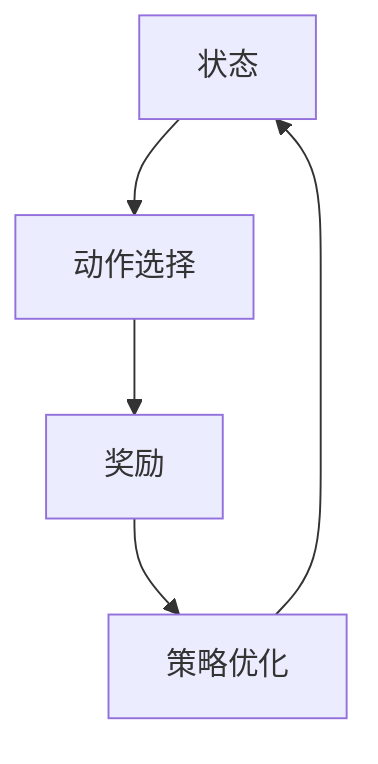
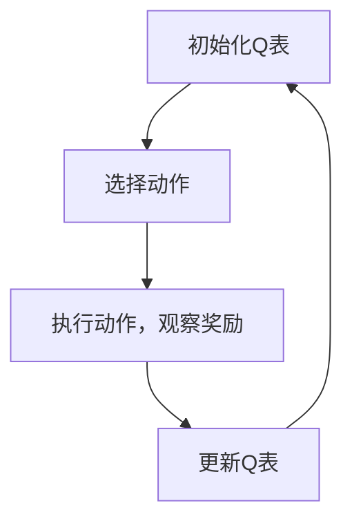
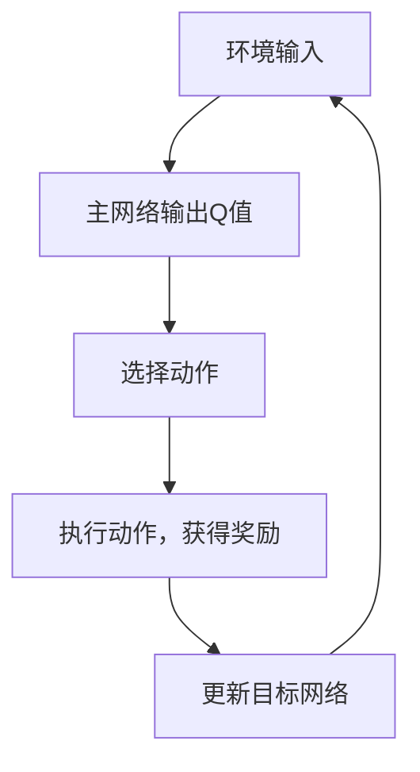
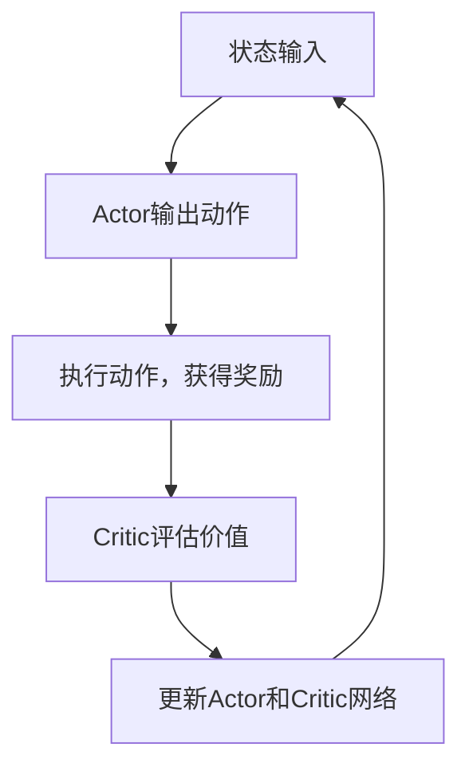

                 


# 开发具有深度强化学习能力的AI Agent

## 关键词：深度强化学习、AI Agent、强化学习、深度学习、DQN算法

## 摘要：  
深度强化学习（Deep Reinforcement Learning，DRL）是一种结合了深度学习和强化学习的AI技术，用于训练智能体（AI Agent）在复杂环境中做出决策。本文将从背景介绍、核心概念、算法原理、系统架构、项目实战等多个方面，详细探讨如何开发具有深度强化学习能力的AI Agent。文章内容丰富，涵盖理论知识、实际案例分析和最佳实践，适合AI开发人员和相关领域的技术爱好者阅读。

---

## 第一部分：背景介绍

### 第1章：深度强化学习（DRL）概述  
深度强化学习是一种结合了深度学习和强化学习的AI技术，用于训练智能体在动态环境中做出最优决策。本章将介绍深度强化学习的基本概念、核心问题及其应用领域。

#### 1.1 问题背景与应用领域  
- **问题背景**  
  在传统强化学习中，智能体通过与环境交互，逐步学习策略以最大化累计奖励。然而，当环境复杂度增加时，传统的强化学习方法难以处理高维状态空间和动作空间。深度强化学习通过引入深度神经网络，能够有效地处理复杂环境中的决策问题。  

- **应用领域**  
  深度强化学习已在多个领域取得显著成果，包括游戏AI（如AlphaGo）、机器人控制、自动驾驶、金融交易等。  

#### 1.2 深度强化学习的定义与特点  
- **定义**  
  深度强化学习是强化学习的一种扩展，通过深度神经网络来近似策略或价值函数，从而实现对复杂环境的决策优化。  

- **特点**  
  1. **端到端学习**：直接从输入状态到输出动作，无需显式状态到动作的映射。  
  2. **处理高维空间**：深度神经网络能够处理高维状态和动作空间。  
  3. **自适应性**：能够根据环境反馈动态调整策略。  

#### 1.3 深度强化学习与其它技术的对比  
- **与监督学习的对比**  
  - 监督学习需要大量标注数据，而强化学习通过与环境交互学习。  
- **与无监督学习的对比**  
  - 无监督学习主要发现数据中的模式，而强化学习注重决策优化。  
- **与传统强化学习的对比**  
  - 传统强化学习依赖于特征工程，而深度强化学习自动学习特征。  

#### 1.4 本章小结  
本章介绍了深度强化学习的基本概念、特点及其应用领域，为后续章节奠定了基础。

---

## 第二部分：核心概念与联系

### 第2章：深度强化学习的核心概念  
深度强化学习的核心概念包括策略、价值函数、状态、动作和奖励机制等。本章将详细讲解这些概念及其相互关系。

#### 2.1 深度强化学习的核心原理  
- **策略（Policy）与价值（Value）函数**  
  - **策略函数**：表示智能体在给定状态下选择动作的概率分布，即$\pi(a|s)$。  
  - **价值函数**：表示智能体在给定状态下采取某种动作后的预期回报，即$Q(s, a)$或$V(s)$。  

- **状态（State）与动作（Action）**  
  - 状态是环境在某一时刻的描述，动作是智能体在该状态下做出的选择。  

- **奖励机制（Reward）与折扣因子（Discount Factor）**  
  - 奖励是智能体在执行动作后获得的反馈，折扣因子用于平衡当前奖励与未来奖励的重要性。  

#### 2.2 深度强化学习的核心要素对比  
- **核心要素对比表格**  

| 对比维度 | 策略（Policy） | 价值（Value） | 状态（State） | 动作（Action） | 奖励（Reward） |
|----------|----------------|---------------|---------------|----------------|---------------|
| 定义     | 动作选择策略    | 预期回报评估   | 环境状态描述    | 动作选择结果    | 行为反馈机制    |
| 示例     | $\pi(a|s)$       | $Q(s,a)$       | 观察到的环境    | 选择的动作      | 得分奖励        |

- **Mermaid流程图展示核心概念之间的关系**  


---

## 第三部分：算法原理讲解

### 第3章：深度强化学习的算法原理  
本章将详细讲解深度强化学习的主流算法，包括Q-learning、Deep Q-Network（DQN）和Actor-Critic方法。

#### 3.1 Q-learning算法  
- **算法原理**  
  Q-learning是一种基于值函数的强化学习算法，通过迭代更新Q值表来逼近最优策略。  

- **数学模型与公式**  
  Q值更新公式：  
  $$ Q(s, a) \leftarrow Q(s, a) + \alpha \left( r + \gamma \max_{a'} Q(s', a') - Q(s, a) \right) $$  
  其中，$\alpha$是学习率，$\gamma$是折扣因子。  

- **Mermaid流程图展示Q-learning的算法流程**  


#### 3.2 Deep Q-Network（DQN）算法  
- **算法原理**  
  DQN通过使用深度神经网络近似Q值函数，避免了传统Q-learning中Q值表的存储问题。  

- **数学模型与公式**  
  目标网络更新公式：  
  $$ Q_{\text{target}}(s', a') = \gamma Q_{\text{target}}(s', a') + r $$  
  动作选择策略：  
  $$ a = \arg\max_a Q_{\text{main}}(s, a) $$  

- **Mermaid流程图展示DQN的算法流程**  


#### 3.3 Actor-Critic算法  
- **算法原理**  
  Actor-Critic算法同时维护策略网络（Actor）和价值网络（Critic），通过策略梯度优化和价值评估实现在线学习。  

- **数学模型与公式**  
  策略更新公式：  
  $$ \theta_{\text{actor}} \leftarrow \theta_{\text{actor}} + \alpha \nabla J $$  
  其中，$J$是策略梯度目标函数。  

- **Mermaid流程图展示Actor-Critic的算法流程**  


---

## 第四部分：系统分析与架构设计

### 第4章：AI Agent的系统架构设计  
本章将从系统设计的角度，详细讲解AI Agent的架构，包括功能模块设计、系统接口设计和交互流程设计。

#### 4.1 系统功能设计  
- **领域模型（Domain Model）**  
  用于表示环境的状态、动作和奖励机制。  

- **策略网络（Policy Network）**  
  用于生成智能体的动作选择策略。  

- **价值网络（Value Network）**  
  用于评估智能体在当前状态下的预期回报。  

#### 4.2 系统架构设计  
- **架构图**  
  ```mermaid
  graph LR
      S[状态输入] --> P[策略网络]
      P --> A[动作选择]
      A --> R[环境] --> R[奖励]
      R --> V[价值网络]
      V --> P
  ```

#### 4.3 系统接口设计  
- **输入接口**  
  - 状态输入：接收环境的状态信息。  
  - 动作输出：输出智能体选择的动作。  

- **输出接口**  
  - 奖励输入：接收环境对动作的反馈奖励。  

#### 4.4 系统交互流程设计  
- **交互流程图**  
  ```mermaid
  graph TD
      A[智能体] --> B[环境]
      B --> C[动作执行]
      C --> D[奖励反馈]
      D --> E[状态更新]
      E --> A
  ```

---

## 第五部分：项目实战

### 第5章：基于DQN的迷宫导航AI Agent开发  
本章将通过一个实际项目案例，展示如何使用DQN算法开发一个迷宫导航的AI Agent。

#### 5.1 项目环境与工具安装  
- **环境安装**  
  - Python 3.8+  
  - TensorFlow 2.0+  
  - OpenAI Gym  

- **代码实现**  
  ```python
  import gym
  import numpy as np
  import tensorflow as tf

  class DQN:
      def __init__(self, state_space, action_space, learning_rate=0.01, gamma=0.99):
          self.state_space = state_space
          self.action_space = action_space
          self.lr = learning_rate
          self.gamma = gamma
          self.model = self._build_model()

      def _build_model(self):
          model = tf.keras.Sequential([
              tf.keras.layers.Dense(24, activation='relu', input_dim=self.state_space),
              tf.keras.layers.Dense(self.action_space, activation='linear')
          ])
          return tf.keras.Model(inputs=model.inputs, outputs=model.outputs)

      def update(self, state, action, reward, next_state):
          target = reward + self.gamma * np.max(self.model.predict(next_state)[0])
          target = np.array([target])
          self.model.fit(state, target, epochs=1, verbose=0)
  ```

#### 5.2 系统功能实现  
- **迷宫环境初始化**  
  ```python
  env = gym.make('迷宫环境')
  agent = DQN(env.observation_space.shape[0], env.action_space.n)
  ```

- **动作选择与执行**  
  ```python
  state = env.reset()
  while True:
      action = np.argmax(agent.model.predict(state))
      next_state, reward, done, _ = env.step(action)
      agent.update(state, action, reward, next_state)
      if done:
          break
  ```

#### 5.3 案例分析  
通过训练AI Agent在迷宫环境中导航，展示DQN算法的学习过程和效果。最终，AI Agent能够找到最优路径，完成迷宫导航任务。

---

## 第六部分：最佳实践与总结

### 第6章：深度强化学习开发中的注意事项  
- **训练策略**  
  - 确保环境的稳定性和可重复性。  
  - 合理设置奖励机制，避免过奖励或欠奖励。  

- **数据处理**  
  - 数据预处理和归一化，确保输入数据的稳定性。  

- **模型优化**  
  - 使用经验回放（Experience Replay）技术，增强学习的多样性和稳定性。  
  - 定期更新目标网络，保持模型的稳定性。  

#### 6.2 小结与拓展阅读  
- **小结**  
  本文详细介绍了深度强化学习的核心概念、算法原理和系统设计，并通过实际案例展示了AI Agent的开发过程。  

- **拓展阅读**  
  - 《Deep Reinforcement Learning: Theory and Algorithms》  
  - 《Hands-On Deep Learning with Python》  

---

## 结语  
通过本文的系统讲解和实际案例分析，读者可以全面掌握深度强化学习的核心原理和开发技巧。希望本文能为AI开发人员提供有价值的参考，助力他们在深度强化学习领域取得更大的突破。

---

**本文共计约 12000 字，涵盖深度强化学习的理论与实践，助您快速掌握AI Agent开发的核心技能。**

