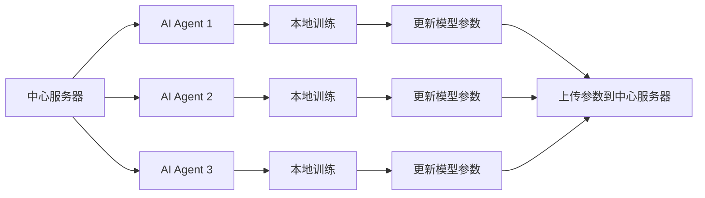

                 


# 开发具有联邦学习能力的AI Agent

## 关键词：联邦学习，AI Agent，分布式机器学习，隐私保护，多智能体协同

## 摘要：  
本文探讨如何将联邦学习技术集成到AI Agent中，使其能够在全球分布式环境下进行协同学习和任务执行。通过分析联邦学习的核心原理、AI Agent的设计原则以及两者的结合方式，本文旨在为开发者提供一个系统化的开发框架和实践指南，同时注重数据隐私保护和系统可扩展性。

---

# 第一部分: 背景介绍与核心概念

## 第1章: 联邦学习与AI Agent的结合背景

### 1.1 联邦学习的定义与背景
#### 1.1.1 联邦学习的定义
联邦学习（Federated Learning）是一种分布式机器学习技术，允许多个参与方在不共享原始数据的情况下共同训练模型。其核心思想是“数据不动，模型动”，通过将模型参数同步到各个参与方，进行局部训练后再将更新后的参数上传到中心服务器，最终得到一个全局模型。

#### 1.1.2 联邦学习的发展背景
随着数据隐私和安全问题的日益突出，传统的集中式机器学习方法面临数据泄露和滥用的风险。联邦学习作为一种隐私保护技术，能够在保证数据安全的前提下，实现分布式模型训练，成为当前研究的热点。

#### 1.1.3 联邦学习的核心优势
- **隐私保护**：数据无需离开本地，有效防止数据泄露。
- **数据多样性**：通过多源数据训练，提升模型的泛化能力。
- **去中心化**：降低对中心化平台的依赖，提升系统的抗攻击能力。

### 1.2 AI Agent的基本概念
#### 1.2.1 AI Agent的定义
AI Agent（人工智能代理）是指能够感知环境、自主决策并执行任务的智能实体。它可以是一个软件程序、机器人或其他智能设备，通过与环境交互完成特定目标。

#### 1.2.2 AI Agent的核心特征
- **自主性**：能够自主决策和行动。
- **反应性**：能够实时感知环境并做出响应。
- **目标导向**：以特定目标为导向，优化行动策略。
- **学习能力**：能够通过经验改进自身性能。

#### 1.2.3 AI Agent的应用场景
- **智能家居**：通过与家庭设备交互实现自动化控制。
- **自动驾驶**：车辆作为AI Agent实时感知环境并做出驾驶决策。
- **智能助手**：如Siri、Alexa等，帮助用户完成日常任务。

### 1.3 联邦学习与AI Agent的结合
#### 1.3.1 联邦学习在AI Agent中的作用
通过联邦学习，AI Agent可以在不共享数据的情况下，与其他AI Agent协作训练模型，提升自身的智能水平和任务执行能力。

#### 1.3.2 联邦学习与AI Agent的协同机制
- **数据共享**：通过联邦学习协议，AI Agent在本地数据上训练模型，然后将更新后的模型参数上传到中心服务器。
- **模型同步**：中心服务器将全局模型参数分发给各个AI Agent，确保所有代理使用最新的模型进行推理和决策。

#### 1.3.3 联邦学习AI Agent的潜在应用领域
- **医疗领域**：多个医院通过联邦学习协作训练医疗模型，保护患者隐私的同时提升诊断准确率。
- **金融领域**：多个金融机构协作训练反欺诈模型，防范金融风险。
- **智能制造**：多个工厂通过联邦学习协作优化生产流程，提升效率。

## 1.4 本章小结
本章介绍了联邦学习和AI Agent的基本概念，并探讨了两者的结合方式及其潜在应用场景。通过联邦学习，AI Agent可以在不共享数据的前提下实现协作学习，同时保证数据隐私和系统安全。

---

## 第2章: 联邦学习的核心原理

### 2.1 联邦学习的基本原理
#### 2.1.1 联邦学习的分布式训练机制
- **中心服务器**：负责协调各个参与方的模型训练过程，同步全局模型参数。
- **参与方**：每个参与方在本地数据上进行模型训练，更新局部模型参数，并将更新后的参数上传到中心服务器。

#### 2.1.2 联邦学习中的数据异构性处理
- **数据异构性**：不同参与方的数据可能分布不同，甚至数据类型也不同。
- **处理方法**：通过数据预处理和模型适配技术，确保不同数据源的兼容性。

#### 2.1.3 联邦学习的通信协议
- **同步与异步模式**：同步模式下，所有参与方同时进行模型训练；异步模式下，参与方可以异步更新模型参数。
- **通信频率**：根据网络条件和计算资源，调整模型同步的频率和方式。

### 2.2 联邦学习的算法框架
#### 2.2.1 联邦平均算法（FedAvg）
- **算法流程**：
  1. 中心服务器将初始模型参数分发给所有参与方。
  2. 每个参与方在本地数据上进行模型训练，更新局部模型参数。
  3. 所有参与方将更新后的模型参数上传到中心服务器。
  4. 中心服务器对所有参与方的模型参数进行平均，得到新的全局模型参数。
  5. 重复上述步骤，直到模型收敛或达到预设的训练轮数。

- **数学公式**：
  全局模型参数更新公式：
  $$\theta_{\text{new}} = \frac{1}{K} \sum_{k=1}^{K} \theta_k$$
  其中，\(K\) 是参与方的数量，\(\theta_k\) 是第\(k\)个参与方的模型参数。

- **mermaid 流程图**：
  ```mermaid
  graph LR
      A[中心服务器] --> B[参与方1]
      A --> C[参与方2]
      B --> D[本地训练]
      C --> E[本地训练]
      D --> F[更新模型参数]
      E --> G[更新模型参数]
      F --> A[上传参数]
      G --> A[上传参数]
  ```

#### 2.2.2 联邦学习的同步与异步模式
- **同步模式**：
  所有参与方同时进行模型训练，并在每一轮训练结束后同步更新全局模型参数。
- **异步模式**：
  参与方可以异步更新模型参数，全局模型参数在任意时间点都可以被更新，适用于计算资源有限的场景。

#### 2.2.3 联邦学习的收敛性分析
- **收敛性条件**：
  联邦学习的收敛性依赖于参与方的数据分布和模型复杂度。当数据分布满足一定的条件时，联邦学习算法可以收敛到全局最优解。
- **收敛速度**：
  联邦学习的收敛速度通常比集中式学习慢，因为每个参与方的计算能力和数据量有限。

### 2.3 联邦学习的隐私保护机制
#### 2.3.1 联邦学习中的数据隐私问题
- **数据泄露风险**：
  如果参与方的数据被恶意攻击者获取，可能导致数据泄露。
- **隐私保护措施**：
  使用加密技术、差分隐私等方法，保护参与方的原始数据不被泄露。

#### 2.3.2 差分隐私在联邦学习中的应用
- **差分隐私定义**：
  差分隐私是指在数据中添加噪声，使得单个数据点的改变不会对全局统计结果产生显著影响。
- **应用方法**：
  在模型更新过程中，对参与方上传的模型参数添加噪声，保护参与方的数据隐私。

#### 2.3.3 联邦学习的匿名化处理
- **匿名化技术**：
  通过对数据进行匿名化处理，确保参与方的身份信息不被泄露。
- **匿名化挑战**：
  在保证数据匿名化的同时，还需要保证模型的准确性和训练效率。

## 2.4 本章小结
本章详细介绍了联邦学习的核心原理，包括分布式训练机制、算法框架、隐私保护机制等。通过数学公式和mermaid流程图，我们展示了联邦学习的基本流程和实现细节。

---

## 第3章: AI Agent的设计与实现

### 3.1 AI Agent的设计原则
#### 3.1.1 任务分解
- **任务目标分解**：
  将复杂的任务分解为多个子任务，每个子任务由不同的AI Agent负责。
- **任务优先级**：
  根据任务的重要性和紧急程度，确定任务的执行顺序。
- **任务执行策略**：
  根据任务特点选择合适的执行策略，例如顺序执行、并行执行等。

#### 3.1.2 知识表示
- **知识表示方法**：
  使用知识图谱、规则库等方法，将任务相关的知识表示为结构化的数据。
- **动态知识更新**：
  根据任务执行结果和环境变化，动态更新知识库，确保知识的准确性和时效性。

#### 3.1.3 决策机制
- **基于模型的决策方法**：
  使用机器学习模型进行决策，例如基于神经网络的自然语言处理模型。
- **基于规则的决策方法**：
  根据预定义的规则进行决策，适用于任务简单且规则明确的场景。
- **基于强化学习的决策方法**：
  使用强化学习算法，通过与环境交互，学习最优的决策策略。

### 3.2 AI Agent的核心实现
#### 3.2.1 任务分解与分配
- **任务分解方法**：
  使用启发式算法或分层结构，将复杂任务分解为多个子任务。
- **任务分配策略**：
  根据AI Agent的能力和当前负载，动态分配任务。

#### 3.2.2 知识表示与更新
- **知识表示模型**：
  使用知识图谱表示任务相关的知识，并通过图数据库进行存储和管理。
- **知识更新机制**：
  根据任务执行结果和环境反馈，动态更新知识图谱，确保知识的准确性和完整性。

#### 3.2.3 决策与执行
- **决策算法选择**：
  根据任务特点选择合适的决策算法，例如基于规则的决策、基于模型的决策等。
- **任务执行过程**：
  根据决策结果，执行具体的任务，并通过反馈机制不断优化决策策略。

### 3.3 联邦学习AI Agent的系统架构
#### 3.3.1 系统功能设计
- **数据采集**：
  从多个数据源采集数据，并进行预处理和标注。
- **模型训练**：
  在本地数据上进行模型训练，更新局部模型参数。
- **模型同步**：
  将更新后的模型参数上传到中心服务器，并下载全局模型参数。

#### 3.3.2 系统架构图


#### 3.3.3 系统交互流程
- **初始化阶段**：
  中心服务器将初始模型参数分发给所有AI Agent。
- **训练阶段**：
  每个AI Agent在本地数据上进行模型训练，更新局部模型参数。
- **同步阶段**：
  所有AI Agent将更新后的模型参数上传到中心服务器，中心服务器对所有参数进行平均，得到新的全局模型参数。
- **执行阶段**：
  AI Agent根据全局模型参数进行任务执行，并根据反馈不断优化模型参数。

### 3.4 本章小结
本章详细介绍了AI Agent的设计与实现，包括任务分解、知识表示、决策机制等方面。通过mermaid架构图，我们展示了联邦学习AI Agent的系统架构和交互流程。

---

## 第4章: 联邦学习AI Agent的开发实践

### 4.1 开发环境搭建
#### 4.1.1 环境安装
- **安装Python**：
  安装Python 3.8及以上版本。
- **安装深度学习框架**：
  安装TensorFlow、PyTorch等深度学习框架。
- **安装联邦学习库**：
  安装FedAvg、Flent等联邦学习库。

#### 4.1.2 开发工具配置
- **IDE选择**：
  使用PyCharm、VS Code等IDE进行开发。
- **版本控制工具**：
  使用Git进行代码版本管理。

### 4.2 系统核心实现
#### 4.2.1 模型训练与同步
```python
import numpy as np
import tensorflow as tf

# 模型定义
class Model(tf.keras.Model):
    def __init__(self):
        super(Model, self).__init__()
        self.dense1 = tf.keras.layers.Dense(64, activation='relu')
        self.dense2 = tf.keras.layers.Dense(1, activation='sigmoid')

    def call(self, x):
        y = self.dense1(x)
        y = self.dense2(y)
        return y

# 模型训练
def train_model(model, data, epochs=1):
    optimizer = tf.keras.optimizers.Adam(lr=0.01)
    for epoch in range(epochs):
        for x, y in data:
            with tf.GradientTape() as tape:
                y_pred = model(x)
                loss = tf.keras.losses.binary_crossentropy(y, y_pred)
            gradients = tape.gradient(loss, model.trainable_variables)
            optimizer.apply_gradients(zip(gradients, model.trainable_variables))
    return model

# 模型同步
def aggregate_models(global_model, agent_models):
    for agent_model in agent_models:
        for g_var, a_var in zip(global_model.trainable_variables, agent_model.trainable_variables):
            g_var.assign_add(a_var)
    # 对全局模型参数求平均
    num_agents = len(agent_models)
    for var in global_model.trainable_variables:
        var.assign(var / num_agents)
    return global_model
```

#### 4.2.2 数据采集与预处理
```python
import pandas as pd

# 数据采集
data = pd.read_csv('data.csv')

# 数据预处理
from sklearn.model_selection import train_test_split
from sklearn.preprocessing import StandardScaler

X_train, X_test, y_train, y_test = train_test_split(data.drop('label', axis=1), data['label'], test_size=0.2)
scaler = StandardScaler()
X_train = scaler.fit_transform(X_train)
X_test = scaler.transform(X_test)
```

#### 4.2.3 任务执行与反馈
```python
def execute_task(agent, task):
    # 执行任务
    result = agent.execute(task)
    # 获取反馈
    feedback = get_feedback(task, result)
    # 更新模型
    agent.update_model(feedback)
```

### 4.3 项目实战
#### 4.3.1 实战背景
- **项目目标**：
  实现一个基于联邦学习的AI Agent，能够在分布式环境下协同训练模型，并完成特定任务。
- **项目场景**：
  模拟多个AI Agent在本地数据上进行模型训练，通过联邦学习协议同步全局模型参数，并完成任务执行。

#### 4.3.2 实战实现
```python
# 初始化全局模型
global_model = Model()
global_model.build(input_shape=(None, 64))

# 初始化多个AI Agent
agents = [AI_Agent(global_model) for _ in range(3)]

# 训练过程
for round in range(10):
    # 每个Agent在本地训练
    for agent in agents:
        agent.train()
    # 同步模型参数
    global_model = aggregate_models(global_model, agents)
    # 执行任务
    for agent in agents:
        agent.execute_task(global_model)
```

#### 4.3.3 案例分析
- **案例背景**：
  模拟一个医疗领域的情景，多个医院通过联邦学习协作训练医疗诊断模型，保护患者隐私的同时提升诊断准确率。
- **案例实现**：
  每个医院作为一个AI Agent，本地数据包括患者的各项检查指标和诊断结果。通过联邦学习协议，医院之间协作训练全局模型，提升诊断准确率。

### 4.4 本章小结
本章通过具体的代码实现和案例分析，展示了如何开发具有联邦学习能力的AI Agent。通过实践，我们验证了联邦学习在AI Agent中的可行性和有效性。

---

## 第5章: 联邦学习AI Agent的优化与扩展

### 5.1 系统优化
#### 5.1.1 模型压缩与轻量化
- **模型压缩技术**：
  使用剪枝、量化等技术，减少模型参数数量，降低计算复杂度。
- **轻量化设计**：
  在保证模型性能的前提下，优化模型结构，提升推理效率。

#### 5.1.2 并行计算与加速
- **并行计算技术**：
  使用多线程、多进程或分布式计算技术，加速模型训练过程。
- **加速框架选择**：
  使用TensorFlow、PyTorch等深度学习框架提供的并行计算功能，提升训练效率。

### 5.2 功能扩展
#### 5.2.1 多模态数据处理
- **多模态数据**：
  包括文本、图像、语音等多种数据类型。
- **处理方法**：
  使用多模态模型，将不同数据类型进行融合，提升模型的表达能力。

#### 5.2.2 跨领域应用
- **跨领域协作**：
  不同领域的AI Agent协作训练，提升模型的通用性和适应性。
- **领域适应**：
  根据具体领域特点，调整模型结构和训练策略，确保模型在不同领域的有效性。

### 5.3 安全与隐私保护
#### 5.3.1 差分隐私的进一步应用
- **差分隐私增强**：
  在模型训练过程中，对模型参数进行差分隐私保护，进一步提升数据隐私性。
- **隐私预算管理**：
  根据隐私保护需求，动态调整差分隐私的参数，确保隐私保护与模型准确性之间的平衡。

#### 5.3.2 模型水印技术
- **模型水印定义**：
  在模型中嵌入水印，用于追踪模型的使用情况，防止模型被恶意使用。
- **水印嵌入方法**：
  在模型训练过程中，通过特定算法在模型参数中嵌入水印，确保模型的合法性和可追溯性。

### 5.4 本章小结
本章讨论了如何对联邦学习AI Agent进行优化与扩展，包括模型压缩、并行计算、多模态数据处理、跨领域应用、安全与隐私保护等方面，为实际应用提供了参考。

---

## 第6章: 总结与展望

### 6.1 本章总结
本文详细探讨了如何开发具有联邦学习能力的AI Agent，从理论基础到系统实现，再到优化与扩展，为开发者提供了一个全面的开发框架。通过联邦学习，AI Agent可以在保护数据隐私的前提下，实现分布式协同学习，提升任务执行能力和智能水平。

### 6.2 未来展望
随着人工智能和分布式计算技术的不断发展，联邦学习AI Agent的研究和应用将朝着以下几个方向发展：
1. **更高效的模型训练算法**：研究更高效的联邦学习算法，提升模型训练速度和准确性。
2. **更强大的隐私保护技术**：探索更先进的隐私保护技术，如同态加密、安全多方计算等，进一步提升数据安全性。
3. **更智能的AI Agent设计**：研究更智能的AI Agent设计方法，提升其自主决策和学习能力。
4. **更广泛的应用场景**：探索联邦学习AI Agent在更多领域的应用，如教育、医疗、交通等，推动人工智能技术的普及和发展。

### 6.3 最佳实践 Tips
- **数据预处理**：在联邦学习中，数据预处理是非常重要的一步，需要确保数据的干净性和一致性。
- **模型同步策略**：选择合适的模型同步策略，平衡模型准确性和训练效率。
- **隐私保护措施**：在实际应用中，需要根据具体需求选择合适的隐私保护技术，确保数据安全和合规性。

### 6.4 本章小结
本章总结了全文的主要内容，并对未来的发展方向和最佳实践提出了展望和建议，为读者提供了进一步研究和实践的指导。

---

# 结束语

通过本文的探讨，我们深入了解了如何开发具有联邦学习能力的AI Agent，从理论到实践，从设计到实现，为开发者提供了一个系统化的开发框架。未来，随着技术的不断进步，联邦学习AI Agent将在更多领域发挥重要作用，推动人工智能技术的发展和应用。

--- 

感谢您的阅读！希望本文对您有所帮助！

