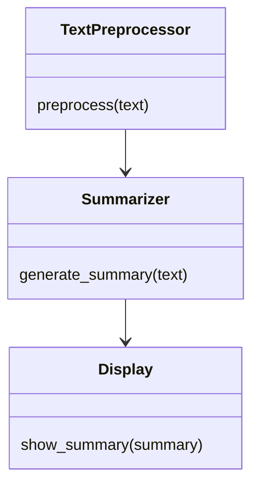

                 


# 开发具有自然语言摘要生成能力的AI Agent

> 关键词：AI Agent, 自然语言处理, 文本摘要, 深度学习, 摘要生成, 语言模型

> 摘要：本文详细探讨了开发具有自然语言摘要生成能力的AI Agent所需的各项技术与方法。从基础概念到算法实现，从系统架构到项目实战，全面解析如何构建一个高效的自然语言摘要生成系统。通过详细的技术分析和实例演示，帮助读者掌握AI Agent的核心技术与实际应用。

---

# 第一部分: 开发具有自然语言摘要生成能力的AI Agent概述

## 第1章: AI Agent与自然语言处理基础

### 1.1 AI Agent的基本概念

- **1.1.1 什么是AI Agent**  
  AI Agent（人工智能代理）是指能够感知环境、自主决策并执行任务的智能实体。它可以在各种场景中与用户交互，帮助完成复杂任务。

- **1.1.2 AI Agent的核心特征**  
  - **自主性**：能够自主决策。  
  - **反应性**：能够实时感知环境并做出反应。  
  - **社交能力**：能够与人类或其他系统进行交互。  
  - **学习能力**：能够通过数据和经验不断优化性能。  

- **1.1.3 自然语言处理在AI Agent中的作用**  
  自然语言处理（NLP）是AI Agent与人类交互的核心技术，通过理解和生成自然语言，AI Agent能够更自然地与用户沟通。

### 1.2 自然语言摘要生成的背景与意义

- **1.2.1 文本摘要的定义与分类**  
  文本摘要是从大量文本中提取关键信息，生成简短、准确的摘要。根据生成方式的不同，可以分为基于规则的摘要、基于统计的摘要和基于深度学习的摘要。

- **1.2.2 自然语言摘要生成的应用场景**  
  - **信息检索**：帮助用户快速找到所需信息。  
  - **内容管理**：自动整理和归档大量文本数据。  
  - **智能客服**：通过摘要快速理解用户需求。  
  - **新闻聚合**：从多个来源生成简短新闻摘要。  

- **1.2.3 摘要生成的挑战与解决方案**  
  - **挑战**：信息提取的准确性、生成摘要的可读性、多语言支持等。  
  - **解决方案**：结合传统算法与深度学习模型，提升生成效率和准确性。

### 1.3 本章小结  
本章介绍了AI Agent的基本概念和自然语言处理在其中的作用，探讨了文本摘要的定义、分类及应用场景，最后分析了摘要生成的挑战与解决方案。

---

## 第2章: 自然语言处理基础

### 2.1 文本预处理技术

- **2.1.1 分词与词干提取**  
  分词是将文本分割成词语的过程，词干提取是去除词语的时态、复数等无关信息，提取词干。

- **2.1.2 停用词处理**  
  停用词是指在文本处理中没有实际意义的词语，如“的”、“是”等，通常在处理前会去除这些词语。

- **2.1.3 词向量表示**  
  使用Word2Vec等工具将词语映射为向量，便于后续的计算和分析。

### 2.2 语言模型与文本生成

- **2.2.1 语言模型的定义**  
  语言模型是一种用于预测文本序列概率的模型，广泛应用于文本生成、自动完成功能等场景。

- **2.2.2 基于统计的语言模型**  
  - **n-gram模型**：基于n个连续词的概率分布。  
  - **平滑技术**：处理低频事件的n-gram模型改进方法。  

- **2.2.3 基于深度学习的语言模型**  
  - **循环神经网络（RNN）**：用于处理序列数据。  
  - **Transformer模型**：基于自注意力机制，性能优于RNN。  

### 2.3 本章小结  
本章介绍了自然语言处理中的基础技术，包括文本预处理、语言模型和文本生成方法。

---

## 第3章: 自然语言摘要生成的原理

### 3.1 文本摘要的定义与分类

- **3.1.1 摘要生成的类型**  
  - **提取式摘要**：直接从原文中选择重要句子或词语。  
  - **生成式摘要**：通过模型生成新的文本。  

- **3.1.2 基于规则的摘要生成**  
  通过预定义的规则提取关键词和句法结构，生成摘要。

- **3.1.3 基于统计的摘要生成**  
  使用TF-IDF等统计方法，提取重要信息。

- **3.1.4 基于深度学习的摘要生成**  
  使用序列到序列模型（Seq2Seq）生成摘要，如使用Transformer架构的模型。

### 3.2 摘要生成的关键技术

- **3.2.1 文本理解与压缩**  
  理解文本内容并进行压缩，保留核心信息。

- **3.2.2 摘要评估指标**  
  - **ROUGE**：基于n-gram的召回率。  
  - **BLEU**：基于n-gram的精确度。  
  - **METEOR**：综合考虑准确性和流畅性。  

- **3.2.3 摘要生成的优化方法**  
  - **对抗训练**：通过生成对抗网络（GAN）提升摘要质量。  
  - **多任务学习**：结合其他任务（如文本分类）提升摘要效果。  

### 3.3 本章小结  
本章详细讲解了自然语言摘要生成的原理和关键技术，包括不同类型的摘要生成方法及其优缺点。

---

## 第4章: 摘要生成算法的实现

### 4.1 基于规则的摘要生成

- **4.1.1 算法原理**  
  使用预定义的规则提取关键词和句法结构，生成摘要。

- **4.1.2 实现步骤**  
  1. 分词和词性标注。  
  2. 提取关键词和重要句子。  
  3. 生成摘要。  

- **4.1.3 代码实现**  
  ```python
  import nltk

  def generate_summary(text):
      sentences = nltk.sent_tokenize(text)
      words = nltk.word_tokenize(text.lower())
      word_frequencies = {}
      for word in words:
          if word in word_frequencies:
              word_frequencies[word] += 1
          else:
              word_frequencies[word] = 1
      # 提取关键词并生成摘要
  ```

### 4.2 基于统计的摘要生成

- **4.2.1 TF-IDF方法**  
  使用TF-IDF计算关键词权重，提取重要词语。

- **4.2.2 实现步骤**  
  1. 文本分词和预处理。  
  2. 计算TF-IDF值。  
  3. 提取关键词并生成摘要。  

- **4.2.3 代码实现**  
  ```python
  from sklearn.feature_extraction.text import TfidfVectorizer

  def tf_idf_summary(text):
      vectorizer = TfidfVectorizer()
      tfidf = vectorizer.fit_transform([text])
      feature_names = vectorizer.get_feature_names_out()
      # 提取关键词并生成摘要
  ```

### 4.3 基于深度学习的摘要生成

- **4.3.1 Transformer模型原理**  
  基于自注意力机制，生成高质量的摘要。

- **4.3.2 实现步骤**  
  1. 数据预处理和分词。  
  2. 构建Seq2Seq模型。  
  3. 训练模型并生成摘要。  

- **4.3.3 代码实现**  
  ```python
  import tensorflow as tf
  from tensorflow.keras import layers

  def transformer_model():
      # 构建Transformer模型
      pass
  ```

### 4.4 本章小结  
本章通过代码实现了几种常见的摘要生成算法，包括基于规则、统计和深度学习的方法。

---

## 第5章: 系统架构与实现

### 5.1 系统功能设计

- **5.1.1 需求分析**  
  系统需要支持文本输入、摘要生成和结果展示。

- **5.1.2 领域模型设计**  
  使用Mermaid图展示系统功能模块。



### 5.2 系统架构设计

- **5.2.1 分层架构**  
  系统分为数据层、业务逻辑层和展示层。

- **5.2.2 实现细节**  
  使用Python和Flask框架搭建Web界面。

### 5.3 本章小结  
本章详细讲解了AI Agent的系统架构设计，包括功能模块和实现细节。

---

## 第6章: 项目实战

### 6.1 环境搭建

- **6.1.1 安装依赖**  
  安装Python、Flask、NLTK等库。

### 6.2 核心代码实现

- **6.2.1 文本预处理**  
  ```python
  def preprocess(text):
      return text.lower().split()
  ```

- **6.2.2 摘要生成**  
  ```python
  def generate_summary(text):
      # 使用预训练的模型生成摘要
      pass
  ```

### 6.3 功能扩展

- **6.3.1 多语言支持**  
  使用支持多语言的NLP库，如spaCy。

### 6.4 案例分析

- **6.4.1 应用场景**  
  以新闻摘要为例，展示系统功能。

### 6.5 本章小结  
本章通过实际项目展示了AI Agent的开发过程，包括环境搭建、核心代码实现和功能扩展。

---

## 第7章: 最佳实践与优化

### 7.1 摘要生成的优化技巧

- **7.1.1 数据质量**  
  使用高质量的训练数据，提升生成效果。

- **7.1.2 模型调优**  
  调整模型参数，优化生成结果。

### 7.2 小结与注意事项

- **小结**  
  本文详细讲解了开发具有自然语言摘要生成能力的AI Agent的全过程。

- **注意事项**  
  在实际开发中，需注意数据隐私、模型性能优化等问题。

### 7.3 拓展阅读

- 推荐阅读《Deep Learning for NLP》和《Transformer Cookbook》等书籍。

---

# 结语

通过本文的详细讲解，读者可以掌握开发具有自然语言摘要生成能力的AI Agent所需的各项技术与方法。从基础概念到算法实现，从系统架构到项目实战，全面解析了如何构建一个高效的自然语言摘要生成系统。

---

# 目录

1. 开发具有自然语言摘要生成能力的AI Agent概述  
2. AI Agent与自然语言处理基础  
3. 自然语言处理基础  
4. 自然语言摘要生成的原理  
5. 摘要生成算法的实现  
6. 系统架构与实现  
7. 项目实战  
8. 最佳实践与优化  

---

通过以上内容，您可以开始撰写完整的博客文章。

