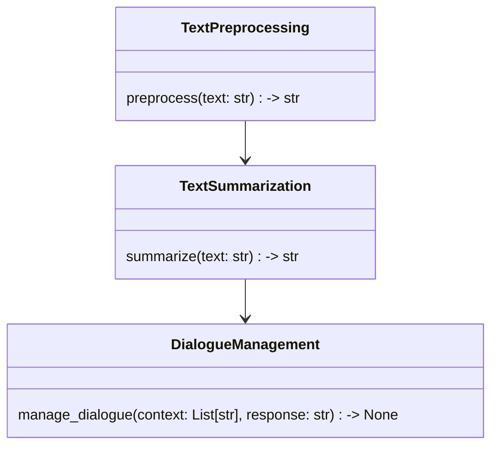
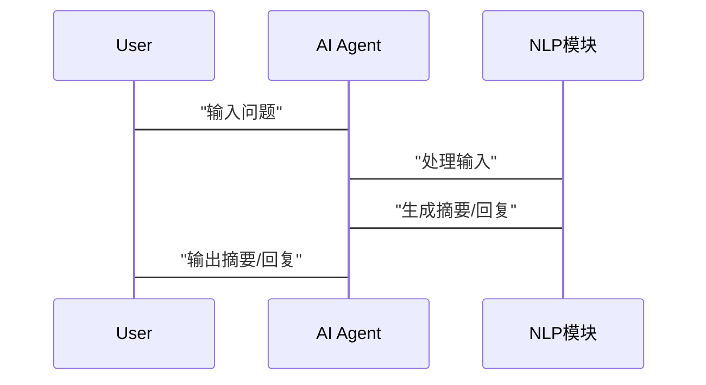

                 


# 开发具有自然语言摘要能力的AI Agent

> 关键词：AI Agent, 自然语言处理, 文本摘要, 对话生成, 深度学习, Transformer模型

> 摘要：本文详细探讨了开发具有自然语言摘要能力的AI Agent的全过程，从核心概念、算法原理到系统架构设计，再到项目实战，为读者提供了从理论到实践的全面指导。

---

# 第一部分: 背景介绍

## 第1章: 自然语言处理基础

### 1.1 自然语言处理概述

#### 1.1.1 自然语言处理的定义与目标
自然语言处理（NLP）是计算机科学、人工智能和语言学的交叉领域，旨在帮助计算机理解、解析和生成人类语言。其目标是让计算机能够像人类一样理解和处理自然语言文本。

#### 1.1.2 自然语言处理的核心任务
自然语言处理的核心任务包括：
- **文本分类**：将文本归类到预定义的类别中（如垃圾邮件检测）。
- **信息提取**：从文本中提取特定信息（如命名实体识别）。
- **文本生成**：根据输入生成相应的文本（如机器翻译）。
- **文本摘要**：将长文本压缩成简洁的摘要。

#### 1.1.3 自然语言处理的应用场景
自然语言处理广泛应用于搜索引擎、智能客服、机器翻译、文本摘要、情感分析等领域。

---

## 第2章: AI Agent概述

### 2.1 AI Agent的定义与特点

#### 2.1.1 AI Agent的定义
AI Agent（人工智能代理）是指能够感知环境、执行任务并采取行动以实现特定目标的智能实体。它可以是一个软件程序，也可以是一个物理设备。

#### 2.1.2 AI Agent的特点
- **自主性**：能够在没有外部干预的情况下运行。
- **反应性**：能够根据环境变化实时调整行为。
- **目标导向**：所有行动都是为了实现特定目标。
- **学习能力**：能够通过经验改进性能。

### 2.2 AI Agent的核心功能

#### 2.2.1 信息处理能力
AI Agent需要能够处理多种类型的信息，包括文本、语音、图像等。

#### 2.2.2 自然语言交互能力
AI Agent需要能够理解用户的自然语言输入，并生成自然语言输出。

#### 2.2.3 问题解决能力
AI Agent需要能够分析问题、寻找解决方案并执行任务。

### 2.3 自然语言处理与AI Agent的结合

#### 2.3.1 自然语言处理在AI Agent中的作用
自然语言处理是AI Agent实现人机交互的核心技术，使得AI Agent能够理解和生成自然语言。

#### 2.3.2 自然语言摘要在AI Agent中的重要性
自然语言摘要能力使得AI Agent能够快速提取文本的核心信息，提高交互效率。

---

# 第二部分: 核心概念与原理

## 第3章: 自然语言处理的核心概念与原理

### 3.1 词嵌入与文本表示

#### 3.1.1 词嵌入的定义与作用
词嵌入是将词语映射到高维连续向量空间的技术，使得词语之间的语义关系可以通过向量运算表示。

#### 3.1.2 常见的词嵌入方法
- **Word2Vec**：通过上下文预测单词，生成单词向量。
- **GloVe**：基于全局词频统计，生成单词向量。

#### 3.1.3 文本表示的挑战与解决方案
文本表示的挑战包括词汇歧义、语境多样性等，解决方案包括预训练模型（如BERT）的应用。

### 3.2 语言模型与文本生成

#### 3.2.1 语言模型的定义与分类
语言模型是用于预测文本序列下一个词的模型，分为基于统计的模型和基于神经网络的模型。

#### 3.2.2 基于Transformer的文本生成模型
Transformer模型通过自注意力机制捕捉文本中的长程依赖关系，成为现代自然语言处理的核心架构。

#### 3.2.3 语言模型在AI Agent中的应用
语言模型用于AI Agent的对话生成和文本摘要任务。

### 3.3 自然语言理解与生成的对比

#### 3.3.1 自然语言理解的核心任务
自然语言理解包括文本分类、信息提取、问答系统等任务。

#### 3.3.2 自然语言生成的核心任务
自然语言生成包括文本摘要、机器翻译、对话生成等任务。

#### 3.3.3 理解与生成的结合与区别
自然语言理解是生成的基础，生成是理解的延伸。两者的结合使得AI Agent能够实现更复杂的交互任务。

---

## 第4章: AI Agent的自然语言摘要能力

### 4.1 自然语言摘要的定义与目标

#### 4.1.1 自然语言摘要的定义
自然语言摘要是指从长文本中提取关键信息并生成简洁的摘要的过程。

#### 4.1.2 自然语言摘要的目标
- 提供文本的核心信息。
- 保持原文的意思和风格。
- 提高信息获取效率。

### 4.2 自然语言摘要的关键技术

#### 4.2.1 基于提取式摘要的技术
提取式摘要通过选择原文中的重要句子或词语生成摘要。

#### 4.2.2 基于生成式摘要的技术
生成式摘要通过生成新的文本内容生成摘要。

#### 4.2.3 摘要评估指标与方法
常用的摘要评估指标包括BLEU、ROUGE、METEOR等。

### 4.3 AI Agent中自然语言摘要的实现

#### 4.3.1 摘要任务的输入与输出
输入：长文本；输出：摘要文本。

#### 4.3.2 摘要模型的选择与训练
选择合适的预训练模型（如BERT、GPT）并进行微调。

#### 4.3.3 摘要结果的优化与调整
通过人工校验和模型调优优化摘要质量。

---

# 第三部分: 算法原理

## 第5章: Transformer模型的原理

### 5.1 Transformer模型的结构

#### 5.1.1 编码器-解码器架构
Transformer模型由编码器和解码器组成，编码器用于处理输入，解码器用于生成输出。

#### 5.1.2 自注意力机制
自注意力机制通过计算输入序列中每个位置与其他位置的相关性，生成位置权重。

#### 5.1.3 前馈神经网络
每个编码器和解码器层都包含自注意力机制和前馈神经网络。

### 5.2 自注意力机制的数学公式

$$
\text{Attention}(Q, K, V) = \text{softmax}\left(\frac{QK^T}{\sqrt{d_k}}\right)V
$$

其中，$Q$、$K$、$V$分别是查询、键、值向量，$d_k$是向量的维度。

### 5.3 Transformer模型在文本摘要中的应用

#### 5.3.1 Seq2Seq结构
Seq2Seq结构由编码器和解码器组成，广泛应用于文本摘要任务。

#### 5.3.2 预训练模型的微调
使用预训练的Transformer模型（如BERT、GPT）并进行微调以适应特定任务。

---

## 第6章: 对话生成算法的实现

### 6.1 对话生成的定义与目标

#### 6.1.1 对话生成的定义
对话生成是指根据输入的上下文生成自然语言回复的过程。

#### 6.1.2 对话生成的目标
生成回复需要满足语义相关、语法正确、上下文连贯。

### 6.2 基于Transformer的对话生成模型

#### 6.2.1 模型结构
对话生成模型通常由编码器和解码器组成，编码器处理输入，解码器生成回复。

#### 6.2.2 训练策略
使用监督学习或强化学习训练对话生成模型。

### 6.3 对话生成中的挑战与解决方案

#### 6.3.1 上下文理解的挑战
如何捕捉对话中的上下文信息是对话生成的核心挑战。

#### 6.3.2 多轮对话的处理
通过记忆网络或指针网络处理多轮对话。

---

# 第四部分: 系统分析与架构设计

## 第7章: AI Agent的系统架构设计

### 7.1 问题场景介绍

#### 7.1.1 AI Agent的应用场景
AI Agent可以应用于智能客服、智能助手、智能推荐等领域。

#### 7.1.2 自然语言摘要在AI Agent中的应用
在智能客服中，AI Agent可以通过摘要生成简要的对话记录。

### 7.2 系统功能设计

#### 7.2.1 系统功能模块
- **文本预处理模块**：对输入文本进行分词、停用词处理等。
- **摘要生成模块**：生成文本摘要。
- **对话管理模块**：管理对话流程。

#### 7.2.2 领域模型设计
使用Mermaid类图展示系统功能模块及其交互。



### 7.3 系统架构设计

#### 7.3.1 系统架构图
使用Mermaid架构图展示系统整体架构。


### 7.4 系统接口设计

#### 7.4.1 系统接口描述
- **输入接口**：接受用户输入的自然语言文本。
- **输出接口**：生成摘要文本或对话回复。

### 7.5 系统交互流程

#### 7.5.1 交互流程图
使用Mermaid序列图展示系统交互流程。



---

# 第五部分: 项目实战

## 第8章: 环境安装与代码实现

### 8.1 环境安装

#### 8.1.1 安装Python与依赖库
安装Python 3.8及以上版本，并安装必要的依赖库（如TensorFlow、Keras、Hugging Face库）。

#### 8.1.2 安装工具链
安装Git、Jupyter Notebook等开发工具。

### 8.2 核心代码实现

#### 8.2.1 文本预处理代码
```python
import re
from typing import List

def preprocess(text: str) -> List[str]:
    # 分词
    words = text.split()
    # 去除停用词
    stop_words = set(["的", "了", "是", "在", "有"])
    filtered_words = [word for word in words if word not in stop_words]
    return filtered_words
```

#### 8.2.2 摘要生成代码
```python
from transformers import BartTokenizer, BartForConditionalGeneration

tokenizer = BartTokenizer.from_pretrained('facebook/bart-large')
model = BartForConditionalGeneration.from_pretrained('facebook/bart-large')

def generate_summary(text: str) -> str:
    inputs = tokenizer.encode(text, max_length=1024, truncation=True, return_tensors='pt')
    outputs = model.generate(inputs.input_ids, max_length=100, num_beams=5, early_stopping=True)
    summary = tokenizer.decode(outputs[0])
    return summary
```

### 8.3 代码应用解读与分析

#### 8.3.1 文本预处理模块
文本预处理模块对输入文本进行分词和停用词处理，生成干净的文本数据。

#### 8.3.2 摘要生成模块
摘要生成模块使用预训练的BART模型生成文本摘要，模型通过参数调整实现摘要优化。

### 8.4 实际案例分析

#### 8.4.1 案例描述
以一段长文本为例，展示AI Agent如何生成摘要。

#### 8.4.2 代码实现与分析
详细分析代码实现的每一步，解释其工作原理和优化技巧。

### 8.5 项目小结

#### 8.5.1 项目总结
总结项目实现的关键点和注意事项。

#### 8.5.2 经验分享
分享开发过程中遇到的问题及解决方法。

---

# 第六部分: 最佳实践

## 第9章: 小结与展望

### 9.1 小结
本文详细介绍了开发具有自然语言摘要能力的AI Agent的全过程，包括背景介绍、核心概念、算法原理、系统架构设计和项目实战。

### 9.2 展望
未来，随着自然语言处理技术的不断发展，AI Agent的自然语言摘要能力将更加智能化和个性化。

---

## 第10章: 注意事项与拓展阅读

### 10.1 开发过程中的注意事项

#### 10.1.1 模型选择
选择合适的预训练模型是项目成功的关键。

#### 10.1.2 数据质量
数据质量直接影响模型性能，需要进行数据清洗和标注。

#### 10.1.3 性能优化
通过模型压缩、并行计算等技术优化模型性能。

### 10.2 拓展阅读

#### 10.2.1 自然语言处理领域的新技术
如大语言模型（LLM）、多模态模型等。

#### 10.2.2 AI Agent的应用案例
如智能客服、智能助手、智能教育等领域的应用。

---

# 结语

开发具有自然语言摘要能力的AI Agent是一个复杂而有趣的任务，需要结合自然语言处理技术与系统架构设计。希望本文能够为读者提供从理论到实践的全面指导，帮助他们开发出具有强大自然语言摘要能力的AI Agent。

