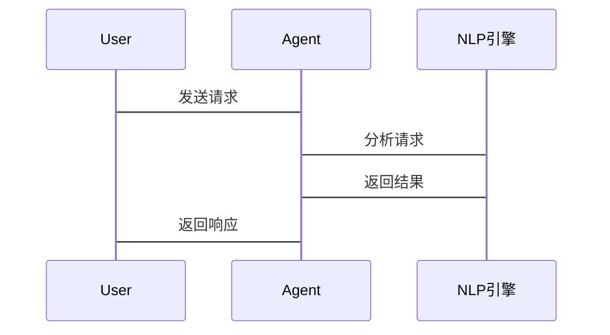

                 


```markdown
# 开发具有自然语言理解能力的AI Agent

> 关键词：自然语言理解，AI Agent，NLP，对话系统，机器学习，文本匹配，意图识别

> 摘要：本文详细介绍了开发具有自然语言理解能力的AI Agent的全过程，从基础概念到算法原理，再到系统架构设计和实际项目实现。通过丰富的理论知识和具体的代码示例，帮助读者全面掌握AI Agent开发的核心技术。

---

# 第1章: 自然语言理解与AI Agent的背景介绍

## 1.1 自然语言理解的核心概念
### 1.1.1 问题背景与问题描述
自然语言理解（Natural Language Understanding, NLU）是人工智能领域的重要分支，旨在让计算机能够理解和解析人类的自然语言输入。随着AI Agent的广泛应用，NLU技术在智能助手、智能客服、智能音箱等领域发挥着越来越重要的作用。

### 1.1.2 自然语言理解的核心要素
- **语言知识**：包括词汇、语法、语义等方面的知识。
- **上下文理解**：能够理解对话的上下文关系，处理歧义和模糊信息。
- **用户意图识别**：准确识别用户的意图，提供相应的反馈或服务。

### 1.1.3 AI Agent的定义与特点
- **AI Agent**：一种能够感知环境、自主决策并执行任务的智能体。
- **特点**：具备自主性、反应性、目标导向性和学习能力。

## 1.2 自然语言理解与AI Agent的联系
### 1.2.1 自然语言理解在AI Agent中的作用
- NLU是AI Agent与用户进行交互的核心技术，决定了AI Agent能否准确理解用户的输入并做出正确的回应。

### 1.2.2 AI Agent与传统NLP的区别
- AI Agent不仅仅是完成单一的NLP任务，而是能够根据用户的输入动态调整交互策略，提供更智能的服务。

### 1.2.3 应用场景与边界
- **应用场景**：智能助手、智能客服、智能音箱、智能车机等。
- **边界**：NLU技术的准确性、系统响应速度、用户体验等。

## 1.3 自然语言理解与AI Agent的发展现状
### 1.3.1 技术发展史
- 从基于规则的NLU到基于统计的NLU，再到当前流行的深度学习NLU。

### 1.3.2 当前主流技术与工具
-主流技术：深度学习（如BERT、GPT）、迁移学习。
-主流工具：spaCy、NLTK、HanLP、Gensim等。

### 1.3.3 未来发展趋势
- 多模态NLU：结合语音、视觉等信息，提升理解能力。
- 实时性优化：提升系统响应速度，降低延迟。
- 可解释性增强：让用户更容易理解AI Agent的决策过程。

## 1.4 本章小结
本章介绍了自然语言理解的核心概念、AI Agent的定义与特点，以及两者之间的联系。通过对比分析，明确了AI Agent与传统NLP的区别，为后续章节的深入学习奠定了基础。

---

# 第2章: 分词与词性标注

## 2.1 分词技术
### 2.1.1 分词的基本原理
分词是将连续的文本分割成独立的词语或短语的过程，是NLU的基石。

### 2.1.2 常见分词算法
- **基于规则的分词**：通过预定义的规则进行分词。
- **基于统计的分词**：利用语言模型和概率统计进行分词。
- **深度学习分词**：利用神经网络模型进行分词。

### 2.1.3 分词工具的优缺点对比
| 工具名称 | 优点 | 缺点 |
|----------|------|------|
|spaCy    | 高效，支持多种语言 | 对中文支持有限|
|NLTK     | 灵活，支持多种语言 | 速度较慢|
|HanLP     | 高效，支持中文 | 社区支持较少|

## 2.2 词性标注
### 2.2.1 词性标注的定义
词性标注是将每个词语标注其词性（如名词、动词、形容词等）的过程。

### 2.2.2 基于统计的词性标注算法
- **最大熵模型**：通过统计词性和上下文信息进行标注。
- **条件随机场（CRF）**：基于马尔可夫假设，利用上下文信息进行标注。

### 2.2.3 词性标注的实现案例
```python
import spacy

nlp = spacy.load("en_core_web_sm")
text = "This is a test sentence."
doc = nlp(text)
for token in doc:
    print(token.text, token.pos_)
```

## 2.3 本章小结
本章详细介绍了分词技术和词性标注的基本原理及实现方法，通过对比分析，明确了不同工具的优缺点，为后续章节的深入学习奠定了基础。

---

# 第3章: 句法分析与语义理解

## 3.1 句法分析
### 3.1.1 句法树的构建
句法树是将句子的语法结构以树形结构表示，帮助理解句子的语法关系。

### 3.1.2 基于上下文的句法分析
- **依存句法分析**：通过依赖关系表示句子结构。
- **树形句法分析**：通过树形结构表示句子的层次关系。

### 3.1.3 句法分析工具对比
| 工具名称 | 优点 | 缺点 |
|----------|------|------|
|spaCy    | 高效，支持多种语言 | 对复杂句法关系支持有限|
|Stanford NLP| 功能强大，支持多种语言 | 速度较慢|

## 3.2 语义理解
### 3.2.1 语义理解的基本原理
语义理解是通过分析词语的含义和上下文关系，理解文本的深层含义。

### 3.2.2 基于深度学习的语义理解模型
- **BERT**：基于Transformer的预训练模型，能够理解文本的上下文关系。
- **GPT**：基于Transformer的生成式模型，能够生成与上下文相关的文本。

### 3.2.3 语义理解的挑战与解决方案
- **歧义性问题**：通过上下文和领域知识消除歧义。
- **语境理解**：利用预训练模型捕捉语境信息。

## 3.3 本章小结
本章详细介绍了句法分析和语义理解的基本原理及实现方法，通过对比分析，明确了不同工具的优缺点，为后续章节的深入学习奠定了基础。

---

# 第4章: 对话系统与AI Agent交互设计

## 4.1 对话系统的定义与分类
### 4.1.1 对话系统的类型
- **基于规则的对话系统**：通过预定义的规则进行对话。
- **基于统计的对话系统**：利用概率统计和语言模型进行对话。
- **基于深度学习的对话系统**：利用神经网络模型进行对话。

### 4.1.2 对话系统的优缺点对比
| 类型       | 优点           | 缺点           |
|------------|----------------|----------------|
|基于规则的 | 实现简单，易于控制 | 对复杂对话场景支持有限|
|基于统计的 | 能处理部分复杂场景 | 精度和可靠性较低|
|基于深度学习的 | 能处理复杂场景，精度高 | 实时性差，资源消耗大|

## 4.2 AI Agent的交互设计
### 4.2.1 用户需求分析
- **用户画像**：分析用户的基本信息和使用场景。
- **需求提取**：提取用户的核心需求和隐含需求。

### 4.2.2 对话流程设计
- **对话状态管理**：跟踪对话的当前状态，确定下一步的行动。
- **对话策略制定**：根据对话状态和用户需求，制定相应的对话策略。

### 4.2.3 对话策略的制定
- **规则驱动策略**：通过预定义的规则进行对话。
- **数据驱动策略**：通过机器学习模型进行对话。
- **混合策略**：结合规则驱动和数据驱动的优势。

## 4.3 本章小结
本章详细介绍了对话系统的定义与分类，以及AI Agent交互设计的核心内容，为后续章节的深入学习奠定了基础。

---

# 第5章: 文本匹配算法

## 5.1 文本匹配的定义与应用
### 5.1.1 文本匹配的定义
文本匹配是将输入文本与预定义的候选文本进行匹配，找出最相关的文本。

### 5.1.2 文本匹配的应用场景
- **问答系统**：根据用户的问题，匹配最相关的答案。
- **对话系统**：根据用户的输入，匹配最相关的回复。
- **信息检索**：根据用户查询，匹配最相关的文档。

## 5.2 基于余弦相似度的文本匹配
### 5.2.1 余弦相似度的数学公式
$$\text{余弦相似度} = \frac{\vec{A} \cdot \vec{B}}{|\vec{A}| |\vec{B}|}$$

### 5.2.2 余弦相似度的实现步骤
1. 将文本转换为向量表示。
2. 计算向量的点积。
3. 计算向量的模长。
4. 计算余弦相似度。

### 5.2.3 余弦相似度的代码实现
```python
from sklearn.metrics.pairwise import cosine_similarity

text1 = "This is a test sentence."
text2 = "This is another test sentence."

vectorizer = TfidfVectorizer()
vectors = vectorizer.fit_transform([text1, text2])
similarity = cosine_similarity(vectors)
print(similarity)
```

## 5.3 基于编辑距离的文本匹配
### 5.3.1 编辑距离的定义
编辑距离是将一个字符串转换为另一个字符串所需的最少编辑操作次数。

### 5.3.2 编辑距离的计算方法
- **替换**：将一个字符替换成另一个字符。
- **删除**：删除一个字符。
- **插入**：插入一个字符。

### 5.3.3 编辑距离的代码实现
```python
def edit_distance(s1, s2):
    m = len(s1)
    n = len(s2)
    # 创建二维数组存储子问题的解
    dp = [[0]*(n+1) for _ in range(m+1)]
    # 填充dp数组
    for i in range(m+1):
        for j in range(n+1):
            if i == 0:
                dp[i][j] = j
            elif j == 0:
                dp[i][j] = i
            else:
                if s1[i-1] == s2[j-1]:
                    dp[i][j] = dp[i-1][j-1]
                else:
                    dp[i][j] = 1 + min(dp[i-1][j], dp[i][j-1], dp[i-1][j-1])
    return dp[m][n]

print(edit_distance("hello", "hola"))
```

## 5.4 本章小结
本章详细介绍了文本匹配的定义与应用，以及基于余弦相似度和编辑距离的文本匹配算法，为后续章节的深入学习奠定了基础。

---

# 第6章: 意图识别算法

## 6.1 意图识别的定义与应用
### 6.1.1 意图识别的定义
意图识别是通过分析用户输入的文本，识别用户的意图或目标。

### 6.1.2 意图识别的应用场景
- **智能助手**：识别用户的意图，提供相应的服务。
- **智能客服**：识别用户的意图，提供相应的帮助。
- **智能音箱**：识别用户的意图，控制设备。

## 6.2 基于词袋模型的意图识别
### 6.2.1 词袋模型的定义
词袋模型是一种文本表示方法，将文本表示为词袋，忽略词序。

### 6.2.2 词袋模型的实现步骤
1. 将文本分割成词语。
2. 统计每个词语的出现次数。
3. 将词语出现次数向量化。

### 6.2.3 词袋模型的代码实现
```python
from sklearn.feature_extraction.text import CountVectorizer

text = ["This is a test sentence.", "This is another test sentence."]
vectorizer = CountVectorizer()
vectors = vectorizer.fit_transform(text)
print(vectorizer.get_feature_names())
```

## 6.3 基于深度学习的意图识别
### 6.3.1 深度学习模型的选择
- **卷积神经网络（CNN）**：适合处理局部特征。
- **循环神经网络（RNN）**：适合处理序列数据。
- **Transformer**：适合处理长序列数据。

### 6.3.2 深度学习模型的训练流程
1. 数据预处理：将文本转换为向量表示。
2. 模型训练：利用训练数据训练模型。
3. 模型评估：利用测试数据评估模型性能。

### 6.3.3 深度学习模型的代码实现
```python
import tensorflow as tf
from tensorflow.keras import layers

model = tf.keras.Sequential()
model.add(layers.Embedding(input_dim=10000, output_dim=50))
model.add(layers.GlobalAveragePooling1D())
model.add(layers.Dense(1, activation='sigmoid'))
model.compile(optimizer='adam', loss='binary_crossentropy', metrics=['accuracy'])
model.summary()
```

## 6.4 本章小结
本章详细介绍了意图识别的定义与应用，以及基于词袋模型和深度学习的意图识别算法，为后续章节的深入学习奠定了基础。

---

# 第7章: 系统分析与架构设计方案

## 7.1 问题场景介绍
### 7.1.1 系统需求分析
- **功能需求**：支持多轮对话，能够理解用户的意图。
- **性能需求**：响应速度快，准确率高。
- **扩展需求**：支持多种语言，能够扩展新的功能。

### 7.1.2 问题分析
- **技术难点**：如何提高系统的准确率和响应速度。
- **实现难点**：如何设计高效的系统架构，支持多轮对话和复杂场景。

## 7.2 系统功能设计
### 7.2.1 领域模型设计
```mermaid
classDiagram
    class User {
        id
        name
        }
    class Agent {
        id
        name
        }
    class Message {
        id
        content
        sender
        }
    User -> Message: sends message
    Agent -> Message: receives message
```

### 7.2.2 系统架构设计


### 7.2.3 系统接口设计
- **输入接口**：接收用户的输入，解析成系统可处理的格式。
- **输出接口**：将系统的输出返回给用户，格式友好且易于理解。

### 7.2.4 系统交互设计


## 7.3 本章小结
本章详细介绍了系统分析与架构设计方案，通过领域模型设计、系统架构设计和系统交互设计，明确了系统的整体架构和实现流程。

---

# 第8章: 项目实战——开发一个简单的客服助手

## 8.1 环境安装与配置
### 8.1.1 安装Python环境
- 安装Python 3.8及以上版本。
- 安装pip工具。

### 8.1.2 安装依赖库
- `pip install spacy transformers`
- `pip install tensorflow`

## 8.2 系统核心实现
### 8.2.1 自然语言理解模块
```python
import spacy

nlp = spacy.load("en_core_web_sm")
text = "I have a problem with my order."
doc = nlp(text)
for token in doc:
    print(token.text, token.pos_)
```

### 8.2.2 对话系统模块
```python
def respond(user_input):
    # 分析用户输入
    doc = nlp(user_input)
    # 提取关键词
    keywords = [token.text for token in doc if token.pos_ == "NOUN"]
    # 根据关键词生成回复
    response = f"I understand your issue with {keywords[0]}. Let me help you with that."
    return response

print(respond("I have a problem with my order."))
```

### 8.2.3 系统测试
- **功能测试**：测试系统的各项功能是否正常。
- **性能测试**：测试系统的响应速度和准确率。

## 8.3 项目优化与扩展
### 8.3.1 系统优化
- 优化NLP模型，提高系统的准确率。
- 优化系统架构，提高系统的响应速度。

### 8.3.2 系统扩展
- **多语言支持**：扩展系统支持多种语言。
- **多渠道支持**：扩展系统支持多种交互渠道（如语音、文本）。

## 8.4 本章小结
本章通过一个简单的客服助手项目，详细介绍了系统的实现过程，包括环境安装、核心实现、系统测试和项目优化与扩展。

---

# 第9章: 总结与展望

## 9.1 总结
- 本文详细介绍了开发具有自然语言理解能力的AI Agent的全过程，从基础概念到算法原理，再到系统架构设计和实际项目实现。

## 9.2 展望
- **技术发展**：随着深度学习技术的不断进步，AI Agent的自然语言理解能力将更加智能化。
- **应用拓展**：AI Agent将在更多领域得到应用，如教育、医疗、金融等。

## 9.3 最佳实践 tips
- **持续学习**：保持对新技术的关注，不断提升自己的技术水平。
- **实践项目**：通过实际项目锻炼自己的动手能力。
- **团队合作**：与团队成员密切合作，共同完成复杂任务。

## 9.4 本章小结
本文通过总结和展望，明确了AI Agent开发的未来方向和挑战，同时给出了最佳实践 tips，帮助读者在实际项目中少走弯路。

---

# 附录: 参考文献与拓展阅读

## 附录A: 参考文献
1. "Natural Language Processing" by Jurafsky and Martin.
2. "Deep Learning" by Ian Goodfellow, Yoshua Bengio, and Aaron Courville.
3. "BERT: Pre-training of Deep Bidirectional Transformers for Natural Language Processing" by Jacob Devlin et al.

## 附录B: 拓展阅读
- [ spaCy官方文档 ](https://spacy.io/)
- [ TensorFlow官方文档 ](https://tensorflow.org/)
- [ Hugging Face的Transformers库 ](https://huggingface.co/transformers/)

---

通过以上目录大纲，读者可以系统地学习和掌握开发具有自然语言理解能力的AI Agent的核心技术，从理论到实践，全面提升自己的技术能力。
```

