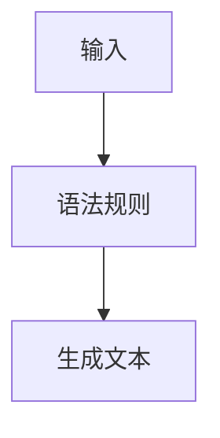
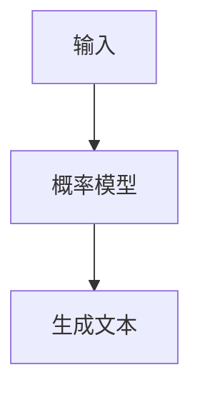
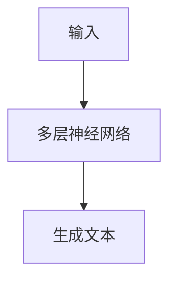
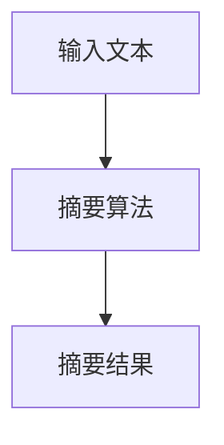
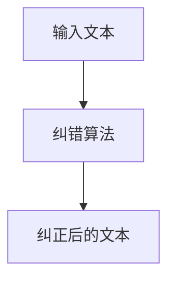
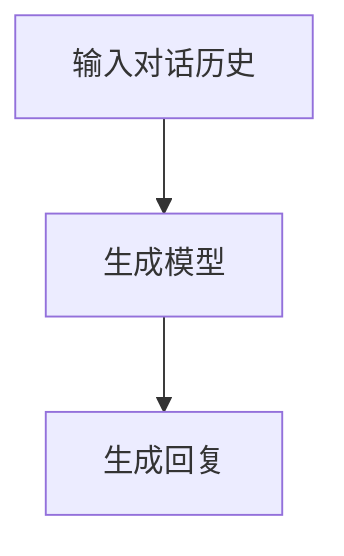

                 


# 开发具有自然语言生成能力的AI Agent

> **关键词**：AI Agent, 自然语言生成, 生成式AI, 自然语言处理, 智能对话系统, 多轮对话, 自然语言理解

> **摘要**：  
本文详细探讨了开发具有自然语言生成能力的AI Agent的核心技术与实现方法。从AI Agent的基本概念到自然语言生成的原理，再到系统的架构设计与项目实战，系统性地分析了AI Agent在自然语言生成领域的应用。文章通过理论与实践结合的方式，帮助读者全面理解并掌握如何构建一个基于自然语言生成的AI Agent系统。

---

# 第一部分: AI Agent与自然语言生成概述

## 第1章: AI Agent与自然语言生成概述

### 1.1 AI Agent的基本概念

#### 1.1.1 AI Agent的定义与特点
**AI Agent**（人工智能代理）是指能够感知环境、自主决策并执行任务的智能实体。AI Agent具有以下特点：
- **自主性**：能够在没有外部干预的情况下独立运作。
- **反应性**：能够实时感知环境并做出响应。
- **目标导向性**：基于目标或任务进行决策和行动。
- **社会性**：能够与其他AI Agent或人类进行交互和协作。

#### 1.1.2 自然语言生成的定义与作用
**自然语言生成**（Natural Language Generation, NLG）是将结构化数据或信息转换为自然语言文本的技术。其作用包括：
- **信息传递**：将复杂的数据转化为易于理解的文本。
- **人机交互**：使AI Agent能够以自然语言形式与用户进行对话。
- **内容创作**：自动生成文章、报告等文本内容。

#### 1.1.3 AI Agent与自然语言生成的结合
AI Agent通过集成自然语言生成技术，能够以更自然、更贴近人类的方式与用户进行交互。例如：
- 智能音箱通过自然语言生成技术为用户提供天气预报、新闻等信息。
- 智能客服系统通过自然语言生成技术为用户提供个性化的服务响应。

### 1.2 自然语言生成技术的发展历程

#### 1.2.1 自然语言生成技术的起源
自然语言生成技术起源于20世纪50年代，早期主要基于规则的生成方法，例如基于句法规则生成简单句子。

#### 1.2.2 生成式AI的崛起
随着深度学习的兴起，生成式AI（如GPT系列模型）逐渐成为自然语言生成的主流方法。生成式AI通过大规模数据训练，能够生成连贯、自然的文本。

#### 1.2.3 当前自然语言生成技术的应用现状
目前，自然语言生成技术已经广泛应用于多个领域，包括：
- **智能客服**：通过自然语言生成技术为用户提供自动回复。
- **新闻生成**：利用NLG技术自动生成新闻稿。
- **教育辅助**：为学生提供个性化的学习反馈。

### 1.3 AI Agent在自然语言生成中的应用案例

#### 1.3.1 智能客服中的应用
智能客服通过自然语言生成技术，能够快速响应用户的问题，并提供个性化的解决方案。

#### 1.3.2 智能对话系统中的应用
智能对话系统（如智能音箱、智能助手）通过自然语言生成技术与用户进行实时对话，提供各种服务。

#### 1.3.3 自然语言生成在AI Agent中的具体实现
在AI Agent中，自然语言生成技术通常用于：
- **任务描述**：将用户的需求转化为具体的任务指令。
- **反馈生成**：将任务执行结果以自然语言形式反馈给用户。

---

# 第二部分: 自然语言生成技术的核心原理

## 第2章: 自然语言生成的实现原理

### 2.1 自然语言生成的流程

#### 2.1.1 数据准备阶段
数据准备是自然语言生成的第一步，主要包括：
- **数据清洗**：去除噪声数据，确保数据质量。
- **数据标注**：为数据添加标签，便于模型训练。

#### 2.1.2 模型训练阶段
模型训练是自然语言生成的核心环节，通常包括以下几个步骤：
1. **模型选择**：选择合适的生成模型（如RNN、Transformer等）。
2. **参数初始化**：初始化模型参数。
3. **训练数据输入**：将训练数据输入模型，进行反向传播和参数优化。

#### 2.1.3 文本生成阶段
文本生成是自然语言生成的最终目标，包括：
- **生成策略**：选择合适的生成策略（如贪心算法、采样法等）。
- **文本优化**：对生成的文本进行润色和优化，提升生成文本的质量。

### 2.2 生成式模型的核心算法

#### 2.2.1 基于规则的生成方法
基于规则的生成方法通过预定义的语法规则生成文本。例如：


#### 2.2.2 统计机器学习的生成方法
统计机器学习的生成方法基于概率模型生成文本。例如：


#### 2.2.3 基于深度学习的生成模型
基于深度学习的生成模型（如GPT）通过多层神经网络生成文本。例如：


### 2.3 自然语言生成的关键技术

#### 2.3.1 文本摘要技术
文本摘要技术通过压缩文本信息生成摘要。例如：


#### 2.3.2 文本纠错技术
文本纠错技术通过检测并纠正文本中的错误。例如：


#### 2.3.3 多轮对话生成技术
多轮对话生成技术通过上下文信息生成连贯的对话。例如：


### 2.4 本章小结

---

# 第三部分: AI Agent的架构与交互设计

## 第3章: AI Agent的架构设计

### 3.1 AI Agent的基本架构

#### 3.1.1 模块化设计
AI Agent的模块化设计包括以下几个模块：
- **输入模块**：负责接收用户的输入。
- **处理模块**：负责解析输入并生成响应。
- **输出模块**：负责将响应输出给用户。

#### 3.1.2 分层设计
AI Agent的分层设计包括以下几个层次：
- **输入层**：接收用户的输入。
- **处理层**：解析输入并生成响应。
- **输出层**：将响应输出给用户。

#### 3.1.3 面向服务的架构
AI Agent的面向服务的架构包括以下几个服务：
- **输入服务**：接收用户的输入。
- **处理服务**：解析输入并生成响应。
- **输出服务**：将响应输出给用户。

### 3.2 自然语言生成模块的设计

#### 3.2.1 模块功能设计
自然语言生成模块的功能包括：
- **文本生成**：生成自然语言文本。
- **文本优化**：对生成的文本进行优化。

#### 3.2.2 模块接口设计
自然语言生成模块的接口包括：
- **输入接口**：接收输入数据。
- **输出接口**：输出生成的文本。

#### 3.2.3 模块实现方式
自然语言生成模块的实现方式包括：
- **基于规则的方法**：通过预定义的语法规则生成文本。
- **基于深度学习的方法**：通过多层神经网络生成文本。

### 3.3 AI Agent与用户的交互设计

#### 3.3.1 多轮对话设计
多轮对话设计包括以下几个步骤：
1. **接收用户输入**：获取用户的输入。
2. **解析输入**：理解用户的输入内容。
3. **生成响应**：基于解析结果生成响应。
4. **输出响应**：将响应返回给用户。

#### 3.3.2 任务规划与执行
任务规划与执行包括以下几个步骤：
1. **接收任务**：获取用户的任务请求。
2. **解析任务**：理解任务的具体内容。
3. **执行任务**：根据任务内容执行相应的操作。
4. **反馈结果**：将任务执行结果反馈给用户。

#### 3.3.3 用户意图的理解与反馈
用户意图的理解与反馈包括以下几个步骤：
1. **接收输入**：获取用户的输入。
2. **解析意图**：理解用户的意图。
3. **生成反馈**：根据意图生成反馈内容。
4. **输出反馈**：将反馈内容返回给用户。

### 3.4 本章小结

---

# 第四部分: 自然语言生成的系统实现

## 第4章: 自然语言生成系统的实现

### 4.1 系统实现的总体架构

#### 4.1.1 系统功能模块划分
自然语言生成系统的功能模块包括：
- **输入模块**：接收用户的输入。
- **处理模块**：解析输入并生成响应。
- **输出模块**：将响应输出给用户。

#### 4.1.2 系统数据流设计
系统的数据流设计包括以下几个步骤：
1. **接收输入**：获取用户的输入。
2. **解析输入**：理解输入内容。
3. **生成响应**：基于解析结果生成响应。
4. **输出响应**：将响应返回给用户。

#### 4.1.3 系统性能优化
系统的性能优化包括以下几个方面：
- **算法优化**：优化生成模型的算法，提升生成效率。
- **数据优化**：优化数据存储和处理方式，提升系统性能。

### 4.2 自然语言生成模型的训练

#### 4.2.1 数据准备
数据准备包括以下几个步骤：
1. **数据清洗**：去除噪声数据，确保数据质量。
2. **数据标注**：为数据添加标签，便于模型训练。

#### 4.2.2 模型训练
模型训练包括以下几个步骤：
1. **模型选择**：选择合适的生成模型（如GPT）。
2. **参数初始化**：初始化模型参数。
3. **训练数据输入**：将训练数据输入模型，进行反向传播和参数优化。

#### 4.2.3 模型优化
模型优化包括以下几个方面：
- **超参数调整**：调整模型的超参数，提升生成效果。
- **模型评估**：评估模型的生成效果，进行优化。

### 4.3 系统实现的代码示例

#### 4.3.1 环境安装
要运行以下代码，需要先安装以下库：
```bash
pip install transformers
pip install torch
```

#### 4.3.2 代码实现
以下是一个简单的自然语言生成系统的代码实现：
```python
from transformers import GPT2LMHeadModel, GPT2Tokenizer

# 初始化模型和分词器
model_name = 'gpt2'
tokenizer = GPT2Tokenizer.from_pretrained(model_name)
model = GPT2LMHeadModel.from_pretrained(model_name)

# 输入
input_text = "今天天气怎么样？"

# 生成文本
inputs = tokenizer.encode(input_text, return_tensors='pt')
outputs = model.generate(inputs, max_length=50, temperature=0.7, top_p=0.9)

# 解码输出
generated_text = tokenizer.decode(outputs[0], skip_special_tokens=True)
print(generated_text)
```

#### 4.3.3 代码解读
上述代码实现了一个简单的自然语言生成系统，主要步骤包括：
1. **导入库**：导入必要的库（如`transformers`和`torch`）。
2. **初始化模型和分词器**：加载预训练的GPT-2模型和分词器。
3. **输入文本**：输入需要生成的文本。
4. **生成文本**：使用模型生成文本。
5. **解码输出**：将生成的文本解码为可读的文本。

### 4.4 系统交互设计

#### 4.4.1 系统交互流程
系统的交互流程包括以下几个步骤：
1. **接收输入**：获取用户的输入。
2. **解析输入**：理解用户的输入内容。
3. **生成响应**：基于解析结果生成响应。
4. **输出响应**：将响应返回给用户。

#### 4.4.2 交互设计的注意事项
在设计交互流程时，需要注意以下几点：
- **用户体验**：确保交互流程简单易用，符合用户的使用习惯。
- **系统性能**：确保系统能够高效地处理用户的输入并生成响应。
- **错误处理**：设计完善的错误处理机制，确保系统在异常情况下仍能正常运行。

### 4.5 本章小结

---

# 第五部分: 项目实战

## 第5章: 自然语言生成系统的项目实战

### 5.1 项目背景与目标

#### 5.1.1 项目背景
本项目旨在开发一个具有自然语言生成能力的AI Agent，能够与用户进行自然语言对话，并根据用户需求生成相应的文本内容。

#### 5.1.2 项目目标
项目的具体目标包括：
- **实现自然语言生成功能**：使AI Agent能够生成自然语言文本。
- **实现多轮对话功能**：使AI Agent能够与用户进行多轮对话。
- **实现任务执行功能**：使AI Agent能够根据用户需求执行相应的任务。

### 5.2 项目实现

#### 5.2.1 环境安装
要运行以下代码，需要先安装以下库：
```bash
pip install transformers
pip install torch
```

#### 5.2.2 代码实现
以下是一个简单的自然语言生成系统的代码实现：
```python
from transformers import GPT2LMHeadModel, GPT2Tokenizer

# 初始化模型和分词器
model_name = 'gpt2'
tokenizer = GPT2Tokenizer.from_pretrained(model_name)
model = GPT2LMHeadModel.from_pretrained(model_name)

# 输入
input_text = "今天天气怎么样？"

# 生成文本
inputs = tokenizer.encode(input_text, return_tensors='pt')
outputs = model.generate(inputs, max_length=50, temperature=0.7, top_p=0.9)

# 解码输出
generated_text = tokenizer.decode(outputs[0], skip_special_tokens=True)
print(generated_text)
```

#### 5.2.3 代码解读
上述代码实现了一个简单的自然语言生成系统，主要步骤包括：
1. **导入库**：导入必要的库（如`transformers`和`torch`）。
2. **初始化模型和分词器**：加载预训练的GPT-2模型和分词器。
3. **输入文本**：输入需要生成的文本。
4. **生成文本**：使用模型生成文本。
5. **解码输出**：将生成的文本解码为可读的文本。

### 5.3 项目测试与优化

#### 5.3.1 系统测试
系统测试包括以下几个步骤：
1. **功能测试**：测试系统是否能够正常生成文本。
2. **性能测试**：测试系统的响应速度和生成效率。
3. **用户体验测试**：测试系统的用户体验，确保系统易于使用。

#### 5.3.2 系统优化
系统优化包括以下几个方面：
- **算法优化**：优化生成模型的算法，提升生成效率。
- **数据优化**：优化数据存储和处理方式，提升系统性能。
- **界面优化**：优化用户界面，提升用户体验。

### 5.4 项目小结

---

# 第六部分: 总结与展望

## 第6章: 总结与展望

### 6.1 本章总结
本文详细探讨了开发具有自然语言生成能力的AI Agent的核心技术与实现方法。从AI Agent的基本概念到自然语言生成的原理，再到系统的架构设计与项目实战，系统性地分析了AI Agent在自然语言生成领域的应用。文章通过理论与实践结合的方式，帮助读者全面理解并掌握如何构建一个基于自然语言生成的AI Agent系统。

### 6.2 未来展望
随着生成式AI的不断发展，自然语言生成技术将更加智能化和个性化。未来，AI Agent在自然语言生成领域的应用将更加广泛，包括：
- **更智能的对话系统**：通过更先进的生成模型，实现更自然、更智能的对话。
- **更个性化的服务**：通过用户画像和行为分析，为用户提供更个性化的自然语言生成服务。
- **更高效的任务执行**：通过优化生成模型和系统架构，实现更高效的任务执行。

---

**温馨提示**：如果需要更详细的代码实现或具体的项目案例，可以参考相关技术文档或联系技术支持。

