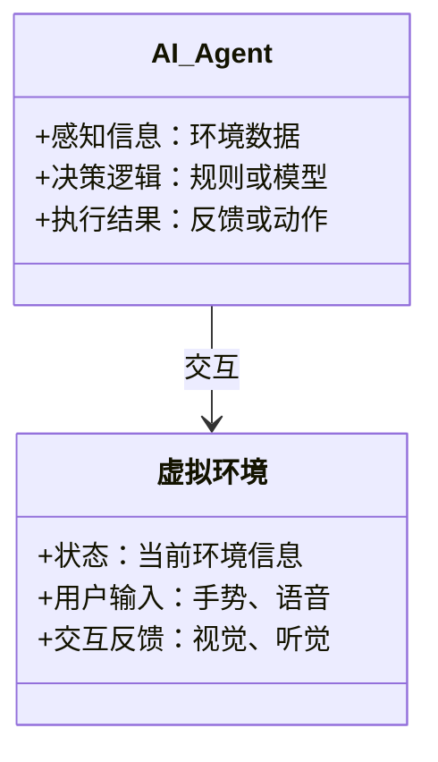
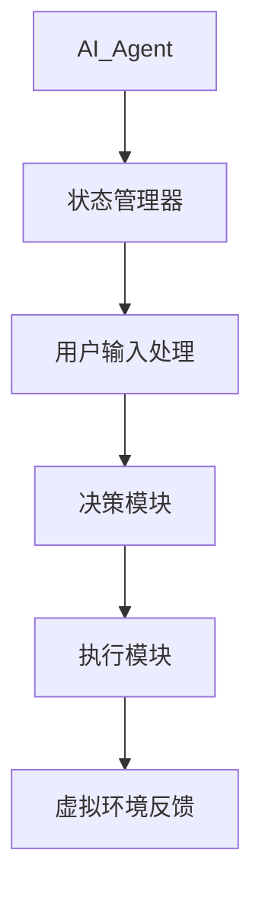

                 


# 开发具有虚拟现实交互能力的AI Agent

> 关键词：AI Agent、虚拟现实、交互设计、算法原理、系统架构

> 摘要：本文探讨了开发具有虚拟现实交互能力的AI Agent的关键技术，从核心概念、算法原理、系统架构到项目实战，全面分析了实现这一目标的路径与挑战。

---

# 第一章：背景介绍

## 1.1 问题背景

随着虚拟现实（VR）技术的快速发展，人机交互的方式也在不断进化。传统的图形用户界面（GUI）逐渐被更沉浸式的交互方式所取代，而AI Agent作为连接用户与数字世界的桥梁，能够通过自然语言处理、计算机视觉等技术，为用户提供更加智能化的服务。然而，AI Agent在虚拟现实环境中的交互能力尚未得到充分开发，存在以下主要问题：

1. **交互方式单一**：目前的AI Agent大多依赖于文本输入或按钮点击，难以支持更自然的交互方式，如手势识别、语音指令等。
2. **环境感知不足**：AI Agent需要能够实时感知虚拟环境中的动态变化，并根据这些信息做出相应的反馈。
3. **用户体验欠佳**：由于缺乏对虚拟现实环境的深度理解，AI Agent的交互体验往往不够流畅，难以满足用户的期望。

## 1.2 问题解决的意义

开发具有虚拟现实交互能力的AI Agent，不仅能够提升用户体验，还能够推动以下领域的发展：

1. **教育**：为学生提供更加沉浸式的学习体验。
2. **娱乐**：增强游戏或虚拟现实应用的互动性。
3. **医疗**：帮助医生进行更精准的手术模拟。

## 1.3 边界与外延

本文主要关注AI Agent在虚拟现实环境中的交互能力，不涉及AI Agent的其他功能，如自主学习或数据处理。同时，本文不讨论虚拟现实硬件的技术细节，而是聚焦于AI Agent与虚拟现实环境的交互设计。

---

# 第二章：核心概念与联系

## 2.1 AI Agent的基本概念

AI Agent是一种能够感知环境、自主决策并执行任务的智能实体。它可以通过传感器获取信息，并根据预设的规则或学习得到的模型做出决策。

## 2.2 虚拟现实交互的核心原理

虚拟现实交互是指用户通过虚拟现实设备与虚拟环境中的对象进行互动。这种互动通常包括用户的输入（如手势、语音）和系统的反馈（如视觉、听觉）。

## 2.3 两者的结合与应用

AI Agent与虚拟现实交互的结合，使得用户可以通过更自然的方式与虚拟环境互动。例如，在虚拟现实游戏中，AI Agent可以作为NPC（非玩家角色），与玩家进行实时对话和互动。

---

# 第三章：算法原理讲解

## 3.1 基于规则的决策算法

基于规则的决策算法是一种简单但有效的AI Agent决策方法。其核心思想是将决策逻辑编码为一系列的规则，并根据输入的信息匹配相应的规则以做出决策。

### 3.1.1 算法流程

1. **感知输入**：AI Agent通过传感器获取环境信息。
2. **规则匹配**：将感知信息与预设的规则进行匹配。
3. **输出决策**：根据匹配的规则输出决策结果。

### 3.1.2 Python代码示例

```python
def decide_action(sensor_input):
    if sensor_input['temperature'] > 30:
        return 'move_to_shade'
    elif sensor_input['temperature'] < 20:
        return 'move_to_sun'
    else:
        return 'stay_put'
```

## 3.2 基于强化学习的决策算法

强化学习是一种通过试错机制来优化决策的算法。AI Agent通过与环境的互动，逐步学习最优策略。

### 3.2.1 算法流程

1. **感知输入**：AI Agent获取环境信息。
2. **状态识别**：根据感知信息确定当前状态。
3. **动作选择**：基于当前状态选择一个动作。
4. **奖励评估**：根据动作的结果获得奖励或惩罚。
5. **策略优化**：根据奖励调整策略。

### 3.2.2 数学模型

强化学习的核心是Q-learning算法，其更新公式为：

$$ Q(s, a) = Q(s, a) + \alpha (r + \gamma \max Q(s', a') - Q(s, a)) $$

其中：
- \( Q(s, a) \) 表示在状态 \( s \) 下执行动作 \( a \) 的价值。
- \( \alpha \) 是学习率。
- \( r \) 是奖励。
- \( \gamma \) 是折扣因子。
- \( s' \) 是下一个状态。

---

# 第四章：系统分析与架构设计

## 4.1 问题场景介绍

在虚拟现实环境中，AI Agent需要与用户进行实时互动。例如，在一个虚拟展览馆中，用户可以通过手势或语音与AI Agent互动，获取展品信息。

## 4.2 系统功能设计

系统需要实现以下功能：
1. **环境感知**：获取虚拟环境中的动态信息。
2. **用户意图识别**：通过用户的输入（如手势、语音）识别用户的意图。
3. **交互反馈**：根据用户的意图生成相应的反馈（如语音回答、动作执行）。

### 4.2.1 领域模型（Mermaid 类图）



## 4.3 系统架构设计

### 4.3.1 整体架构（Mermaid 架构图）



### 4.3.2 接口设计

系统需要定义以下接口：
1. **用户输入接口**：接收用户的输入（如手势、语音）。
2. **环境反馈接口**：向用户输出反馈（如语音、动作）。

---

# 第五章：项目实战

## 5.1 环境安装与工具准备

### 5.1.1 Python安装与配置

确保安装了Python 3.8及以上版本，并配置好环境变量。

### 5.1.2 虚拟现实开发框架安装

安装Oculus SDK或其他虚拟现实开发框架。

## 5.2 系统核心功能实现

### 5.2.1 环境感知实现

```python
def get_sensor_data():
    # 获取虚拟环境中的传感器数据
    return {
        'temperature': 25,
        'light': 70
    }
```

### 5.2.2 用户意图识别

```python
def recognize_intent(user_input):
    # 根据用户输入识别意图
    if user_input == 'hello':
        return 'greeting'
    elif user_input == 'help':
        return 'request_assistance'
    else:
        return 'unknown'
```

### 5.2.3 交互反馈实现

```python
def generate_response(intent):
    # 根据意图生成反馈
    if intent == 'greeting':
        return 'Hello! How can I help you today?'
    elif intent == 'request_assistance':
        return 'I can help you with information about the exhibition.'
    else:
        return 'I am sorry, I do not understand your request.'
```

## 5.3 项目实战：虚拟展览馆中的AI Agent

### 5.3.1 系统实现

结合上述代码，实现一个简单的虚拟展览馆中的AI Agent，能够响应用户的问候和请求帮助的指令。

### 5.3.2 代码实现

```python
class AIAgent:
    def __init__(self):
        self.sensors = {}

    def get_sensor_data(self):
        return {
            'temperature': 25,
            'light': 70
        }

    def recognize_intent(self, user_input):
        if user_input == 'hello':
            return 'greeting'
        elif user_input == 'help':
            return 'request_assistance'
        else:
            return 'unknown'

    def generate_response(self, intent):
        if intent == 'greeting':
            return 'Hello! How can I help you today?'
        elif intent == 'request_assistance':
            return 'I can help you with information about the exhibition.'
        else:
            return 'I am sorry, I do not understand your request.'

# 示例用法
agent = AIAgent()
print(agent.generate_response(agent.recognize_intent('hello')))  # 输出：Hello! How can I help you today?
print(agent.generate_response(agent.recognize_intent('help')))  # 输出：I can help you with information about the exhibition.
```

---

# 第六章：总结与展望

## 6.1 本章小结

本文详细探讨了开发具有虚拟现实交互能力的AI Agent的关键技术，包括核心概念、算法原理、系统架构和项目实战。通过本文的分析，读者可以了解如何实现一个基本的虚拟现实交互AI Agent，并能够在实际应用中进行扩展和优化。

## 6.2 注意事项

在实际开发中，需要注意以下几点：
1. **性能优化**：虚拟现实环境中的交互需要实时响应，因此需要优化算法的执行效率。
2. **用户体验**：确保交互设计的直观性和流畅性，避免用户感到困惑或不便。
3. **安全性**：特别是在医疗等关键领域，需要确保AI Agent的决策不会对用户造成伤害。

## 6.3 拓展阅读

1. **强化学习算法的优化**：研究更高效的强化学习算法，如深度强化学习。
2. **多模态交互设计**：探索结合视觉、听觉等多种交互方式的AI Agent设计。
3. **虚拟现实中的伦理问题**：研究AI Agent在虚拟现实环境中的伦理问题，如隐私保护和数据安全。

---

通过本文的分析和实践，读者可以掌握开发具有虚拟现实交互能力的AI Agent的核心技术，并能够在实际项目中进行应用和创新。

