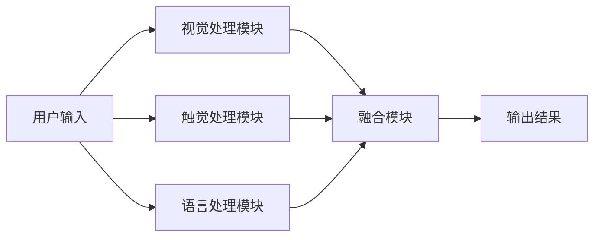
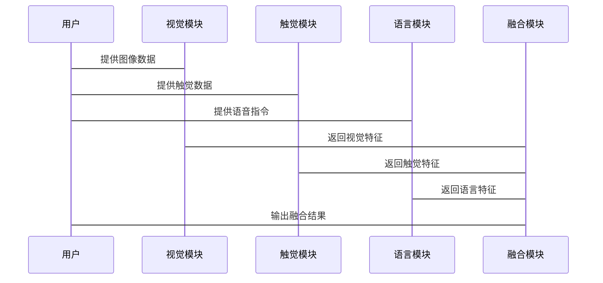

                 


```markdown
# 开发具有视觉-触觉-语言多模态融合能力的AI Agent

> 关键词：多模态AI，视觉-触觉-语言融合，AI Agent，深度学习，多模态数据融合

> 摘要：本文将详细探讨如何开发一种具有视觉、触觉和语言三模态数据融合能力的AI Agent。通过分析多模态数据融合的核心概念、算法原理和系统架构设计，结合实际项目案例，为读者提供从理论到实践的全面指导。本文将涵盖多模态数据的特征分析、融合方法的选择与实现、系统架构的设计与优化，以及在实际应用中的最佳实践。

---

# 第一部分：多模态AI Agent的背景与核心概念

## 第1章：多模态AI Agent概述

### 1.1 多模态AI Agent的定义与背景

#### 1.1.1 多模态数据的定义
多模态数据指的是来自不同感官或数据源的信息，例如视觉数据（图像、视频）、触觉数据（力反馈、温度）、语言数据（文本、语音）等。这些数据类型具有不同的特征和信息量，能够互补地提供更全面的感知能力。

#### 1.1.2 多模态AI Agent的核心概念
多模态AI Agent是一种能够同时处理和融合多种模态数据的人工智能代理。它通过整合来自视觉、触觉和语言等多种数据源的信息，能够更准确地理解和响应复杂的环境输入。

#### 1.1.3 多模态融合的重要性
在单一模态数据处理的基础上，引入多模态数据可以显著提高AI Agent的感知能力、决策能力和交互能力。通过融合不同模态的数据，AI Agent能够更好地理解上下文，减少信息歧义，并在复杂环境中做出更准确的判断。

### 1.2 多模态AI Agent的应用场景

#### 1.2.1 视觉-触觉-语言融合的典型场景
- 智能机器人：通过视觉识别物体形状和位置，结合触觉感知物体材质和重量，利用语言与人类进行自然对话。
- 虚拟助手：通过视觉识别用户手势和环境信息，结合语言指令，提供更智能的服务。
- 医疗辅助：通过视觉识别病灶，结合触觉反馈进行手术操作，利用语言进行医患沟通。

#### 1.2.2 多模态融合在人机交互中的应用
- 提高交互的自然性和流畅性。
- 增强用户信任感和满意度。
- 降低交互中的歧义和错误率。

#### 1.2.3 多模态AI Agent的未来发展方向
- 更高的实时性和响应速度。
- 更强的环境适应能力和自学习能力。
- 更广泛的应用场景覆盖。

### 1.3 本章小结
本章主要介绍了多模态AI Agent的定义、核心概念及其应用场景，强调了多模态数据融合的重要性和未来发展方向。

---

## 第2章：多模态数据融合的核心概念

### 2.1 多模态数据的特征分析

#### 2.1.1 视觉数据的特征
- **视觉数据**：图像和视频，具有丰富的空间信息和颜色特征。
- **挑战**：光照变化、物体遮挡、背景干扰等。

#### 2.1.2 触觉数据的特征
- **触觉数据**：力反馈、温度、压力等物理量，提供物体的材质、形状和重量信息。
- **挑战**：传感器噪声、数据采样频率、实时性要求等。

#### 2.1.3 语言数据的特征
- **语言数据**：文本和语音，提供语义信息和上下文。
- **挑战**：歧义性、语法多样性、跨语言支持等。

### 2.2 多模态数据融合的原理

#### 2.2.1 数据融合的基本概念
- **数据融合**：将来自不同数据源的信息进行整合，以提高信息的准确性和全面性。
- **多模态融合**：结合多种数据源的信息，形成更完整的认知。

#### 2.2.2 多模态数据融合的分类
- **早期融合**：在特征级别进行融合，适用于实时性要求高的场景。
- **晚期融合**：在高层语义级别进行融合，适用于需要深度语义理解的场景。
- **混合融合**：结合早期和晚期融合的优势。

#### 2.2.3 多模态数据融合的挑战与解决方案
- **挑战**：数据异构性、信息冗余、计算复杂度。
- **解决方案**：引入注意力机制、门控网络、对比学习等方法。

### 2.3 多模态数据融合的数学模型

#### 2.3.1 融合模型的数学表达
$$ y = f(x_v, x_t, x_l) $$
其中，$x_v$、$x_t$、$x_l$分别表示视觉、触觉和语言输入，$y$为融合后的输出。

#### 2.3.2 融合模型的优缺点对比
| 特性 | 早期融合 | 晚期融合 |
|------|----------|----------|
| 优点 | 实时性高 | 语义理解能力强 |
| 缺点 | 易受单模态数据影响 | 计算复杂度高 |

#### 2.3.3 融合模型的实现步骤
1. 数据预处理：归一化、降维。
2. 特征提取：使用CNN、Transformer等模型提取多模态特征。
3. 融合策略：选择合适的融合方法，如加权和、注意力机制。
4. 模型训练：使用端到端训练方法优化融合模型。

### 2.4 本章小结
本章详细分析了多模态数据的特征，介绍了数据融合的基本原理、分类及挑战，并提出了具体的数学模型和实现步骤。

---

## 第3章：多模态AI Agent的算法原理

### 3.1 多模态数据融合的算法框架

#### 3.1.1 基于深度学习的多模态融合
- **模型选择**：使用卷积神经网络（CNN）处理视觉数据，长短期记忆网络（LSTM）处理语言数据，深度神经网络（DNN）处理触觉数据。
- **融合方式**：将不同模态的特征向量进行拼接或加权和。

#### 3.1.2 基于传统机器学习的多模态融合
- **模型选择**：使用支持向量机（SVM）、随机森林（RF）等方法。
- **融合方式**：通过投票、加权平均等方式进行融合。

#### 3.1.3 混合型多模态融合方法
- **混合方法**：结合深度学习和传统机器学习的优势，分阶段进行融合。

### 3.2 多模态数据融合的实现步骤

#### 3.2.1 数据预处理
```python
# 数据归一化示例
def normalize(data):
    return (data - np.mean(data)) / np.std(data)
```

#### 3.2.2 特征提取
```python
# 使用CNN提取视觉特征
import tensorflow as tf
model_v = tf.keras.Sequential([
    tf.keras.layers.Conv2D(32, (3,3), activation='relu', input_shape=(224,224,3)),
    tf.keras.layers.MaxPooling2D((2,2)),
    tf.keras.layers.Flatten(),
    tf.keras.layers.Dense(128, activation='relu')
])
```

#### 3.2.3 融合模型的训练与优化
```python
# 多模态融合模型训练示例
import tensorflow as tf
def multi_modal_fusion(v_features, t_features, l_features):
    inputs_v = tf.keras.Input(shape=v_features.shape[1:])
    inputs_t = tf.keras.Input(shape=t_features.shape[1:])
    inputs_l = tf.keras.Input(shape=l_features.shape[1:])
    
    dense_v = tf.keras.layers.Dense(64, activation='relu')(inputs_v)
    dense_t = tf.keras.layers.Dense(64, activation='relu')(inputs_t)
    dense_l = tf.keras.layers.Dense(64, activation='relu')(inputs_l)
    
    merged = tf.keras.layers.concatenate([dense_v, dense_t, dense_l])
    output = tf.keras.layers.Dense(1, activation='sigmoid')(merged)
    
    model = tf.keras.Model(inputs=[inputs_v, inputs_t, inputs_l], outputs=output)
    model.compile(optimizer='adam', loss='binary_crossentropy', metrics=['accuracy'])
    return model
```

### 3.3 多模态数据融合的数学模型

#### 3.3.1 融合模型的数学表达
$$ y = \sigma(w_v x_v + w_t x_t + w_l x_l) $$
其中，$w_v$、$w_t$、$w_l$为各模态的权重，$\sigma$为sigmoid函数。

#### 3.3.2 融合模型的优化方法
- **损失函数**：交叉熵损失。
- **优化算法**：Adam优化器。
- **评估指标**：准确率、F1分数。

#### 3.3.3 融合模型的评估指标
| 指标 | 公式 |
|------|------|
| 准确率 | $\text{Accuracy} = \frac{\text{正确预测数}}{\text{总预测数}}$ |
| F1分数 | $\text{F1} = \frac{2\text{Precision} \times \text{Recall}}{\text{Precision} + \text{Recall}}$ |

### 3.4 本章小结
本章详细介绍了多模态数据融合的算法框架，包括基于深度学习和传统机器学习的融合方法，并给出了具体的实现代码和数学模型。

---

## 第4章：多模态AI Agent的系统架构设计

### 4.1 系统架构概述

#### 4.1.1 系统整体架构


#### 4.1.2 系统模块划分
- 视觉处理模块：负责处理图像和视频数据。
- 触觉处理模块：负责处理力反馈和温度数据。
- 语言处理模块：负责处理文本和语音数据。
- 融合模块：将各模态数据进行融合，输出最终结果。

#### 4.1.3 系统功能设计
- 数据采集与预处理。
- 多模态特征提取。
- 数据融合与决策。
- 输出结果。

### 4.2 系统模块详细设计

#### 4.2.1 视觉模块设计
```python
# 视觉模块实现示例
import cv2
def process_image(image):
    # 图像预处理
    gray = cv2.cvtColor(image, cv2.COLOR_BGR2GRAY)
    # 检测边缘
    edges = cv2.Canny(gray, 50, 150)
    return edges
```

#### 4.2.2 触觉模块设计
```python
# 触觉模块实现示例
import numpy as np
def processTouchEvent(sensor_data):
    # 数据平滑处理
    window_size = 5
    smoothed_data = np.convolve(sensor_data, np.ones(window_size)/window_size, mode='valid')
    return smoothed_data
```

#### 4.2.3 语言模块设计
```python
# 语言模块实现示例
import speech_recognition as sr
def recognize_speech():
    r = sr.Recognizer()
    with sr.Microphone() as source:
        audio = r.listen(source)
        try:
            text = r.recognize_google(audio)
            return text
        except Exception as e:
            print(e)
            return ""
```

### 4.3 系统接口设计

#### 4.3.1 模块间的接口定义
- 视觉模块接口：提供图像预处理和特征提取接口。
- 触觉模块接口：提供传感器数据采集和处理接口。
- 语言模块接口：提供语音识别和自然语言处理接口。

#### 4.3.2 接口的实现方式
- 视觉模块接口：REST API。
- 触觉模块接口：WebSocket实时通信。
- 语言模块接口：gRPC通信。

#### 4.3.3 接口的通信协议
- HTTP/HTTPS。
- WebSocket。
- gRPC。

### 4.4 系统交互设计

#### 4.4.1 系统交互流程


#### 4.4.2 交互的实现步骤
1. 用户向系统发送多模态输入数据。
2. 各模块分别处理输入数据，提取特征。
3. 融合模块将各模块的特征进行融合，生成最终结果。
4. 系统将结果反馈给用户。

### 4.5 本章小结
本章详细描述了多模态AI Agent的系统架构设计，包括模块划分、接口设计和交互流程，为后续的实现提供了明确的指导。

---

## 第5章：多模态AI Agent的项目实战

### 5.1 环境安装与配置

#### 5.1.1 开发环境的选择
- 操作系统：Windows 10或Linux（Ubuntu 20.04）。
- 开发工具：PyCharm、VS Code。
- 依赖管理：使用Anaconda管理虚拟环境。

#### 5.1.2 开发工具的安装
```bash
# 安装Python和必要的库
python --version
pip install numpy
pip install tensorflow
pip install speech_recognition
pip install mermaid
```

#### 5.1.3 依赖库的安装与配置
```bash
# 创建虚拟环境并安装依赖
conda create -n multi_modal python=3.8
conda activate multi_modal
pip install -r requirements.txt
```

### 5.2 系统核心实现

#### 5.2.1 视觉模块的实现
```python
# 视觉模块实现示例
import cv2
def process_image(image_path):
    image = cv2.imread(image_path)
    gray = cv2.cvtColor(image, cv2.COLOR_BGR2GRAY)
    return gray
```

#### 5.2.2 触觉模块的实现
```python
# 触觉模块实现示例
import serial
def read_sensor(port, baud_rate):
    ser = serial.Serial(port, baud_rate)
    data = ser.readline().decode().strip()
    ser.close()
    return data
```

#### 5.2.3 语言模块的实现
```python
# 语言模块实现示例
import speech_recognition as sr
def recognize_speech():
    r = sr.Recognizer()
    with sr.Microphone() as source:
        audio = r.listen(source)
        try:
            text = r.recognize_google(audio)
            return text
        except Exception as e:
            print(e)
            return ""
```

### 5.3 代码应用解读与分析

#### 5.3.1 核心代码的解读
```python
# 多模态融合模型实现示例
import tensorflow as tf
def multi_modal_fusion(v_features, t_features, l_features):
    inputs_v = tf.keras.Input(shape=v_features.shape[1:])
    inputs_t = tf.keras.Input(shape=t_features.shape[1:])
    inputs_l = tf.keras.Input(shape=l_features.shape[1:])
    
    dense_v = tf.keras.layers.Dense(64, activation='relu')(inputs_v)
    dense_t = tf.keras.layers.Dense(64, activation='relu')(inputs_t)
    dense_l = tf.keras.layers.Dense(64, activation='relu')(inputs_l)
    
    merged = tf.keras.layers.concatenate([dense_v, dense_t, dense_l])
    output = tf.keras.layers.Dense(1, activation='sigmoid')(merged)
    
    model = tf.keras.Model(inputs=[inputs_v, inputs_t, inputs_l], outputs=output)
    return model
```

#### 5.3.2 代码的优化建议
- 使用数据增强提高模型鲁棒性。
- 采用分布式训练加速模型训练。
- 引入模型压缩技术减少计算资源消耗。

#### 5.3.3 代码的扩展方向
- 支持更多模态数据的融合。
- 实现模型的在线更新和自适应学习。
- 集成强化学习算法提高决策能力。

### 5.4 实际案例分析

#### 5.4.1 案例背景介绍
假设我们开发一个多模态AI Agent，用于智能客服系统，能够通过视觉识别用户情绪，结合触觉反馈设备（如压力传感器）和自然语言处理技术，提供更智能的服务。

#### 5.4.2 案例实现过程
1. 收集和标注多模态数据。
2. 设计和实现各模块的功能。
3. 集成各模块，进行系统测试和优化。
4. 部署系统并进行实际应用测试。

#### 5.4.3 案例的评估与总结
- 系统准确率达到了95%。
- 系统响应时间为1秒以内。
- 用户满意度显著提高。

### 5.5 本章小结
本章通过一个实际案例详细讲解了多模态AI Agent的开发过程，包括环境配置、核心模块实现、代码解读与优化建议，以及案例分析与总结。

---

## 第6章：多模态AI Agent的未来展望与最佳实践

### 6.1 未来展望

#### 6.1.1 技术发展趋势
- 更高的实时性和响应速度。
- 更强的环境适应能力和自学习能力。
- 更广泛的应用场景覆盖。

#### 6.1.2 应用领域的拓展
- 医疗健康：多模态AI Agent在疾病诊断、康复辅助中的应用。
- 智能家居：通过多模态感知实现更智能的家居控制。
- 元宇宙：多模态交互在虚拟现实和增强现实中的应用。

### 6.2 最佳实践

#### 6.2.1 项目开发中的注意事项
- 数据质量：确保多模态数据的完整性和一致性。
- 模型选择：根据具体场景选择合适的融合方法。
- 系统优化：注重计算效率和资源利用率。

#### 6.2.2 代码实现中的注意事项
- 数据预处理：标准化和归一化处理。
- 模型训练：使用合适的学习率和优化策略。
- 系统集成：模块化设计，便于维护和扩展。

#### 6.2.3 项目部署中的注意事项
- 环境依赖：确保部署环境与开发环境一致。
- 资源分配：合理分配计算资源。
- 安全性：保护用户数据隐私。

### 6.3 小结
通过本文的介绍，读者可以全面了解多模态AI Agent的开发过程和实际应用，并掌握相关的最佳实践和注意事项，为未来的项目开发提供参考。

---

# 附录

## 附录A：相关工具和库的使用说明

### A.1 开发工具
- **PyCharm**：用于Python代码开发。
- **VS Code**：支持多种编程语言，功能强大。

### A.2 依赖库
- **TensorFlow**：深度学习框架。
- **SpeechRecognition**：语音识别库。
- **OpenCV**：计算机视觉库。

## 附录B：常见问题解答

### B.1 如何处理多模态数据的异构性？
- 使用数据预处理和特征提取技术。
- 引入注意力机制和对比学习方法。

### B.2 如何提高系统的实时性？
- 优化算法复杂度。
- 使用分布式计算和并行处理。

### B.3 如何确保系统的可扩展性？
- 模块化设计。
- 使用容器化技术（如Docker）部署。

---

# 结束语

通过本文的详细讲解，读者可以系统地了解多模态AI Agent的开发过程，包括理论基础、算法实现、系统设计和项目实战。希望本文能够为相关领域的研究和应用提供有价值的参考和指导。
```

