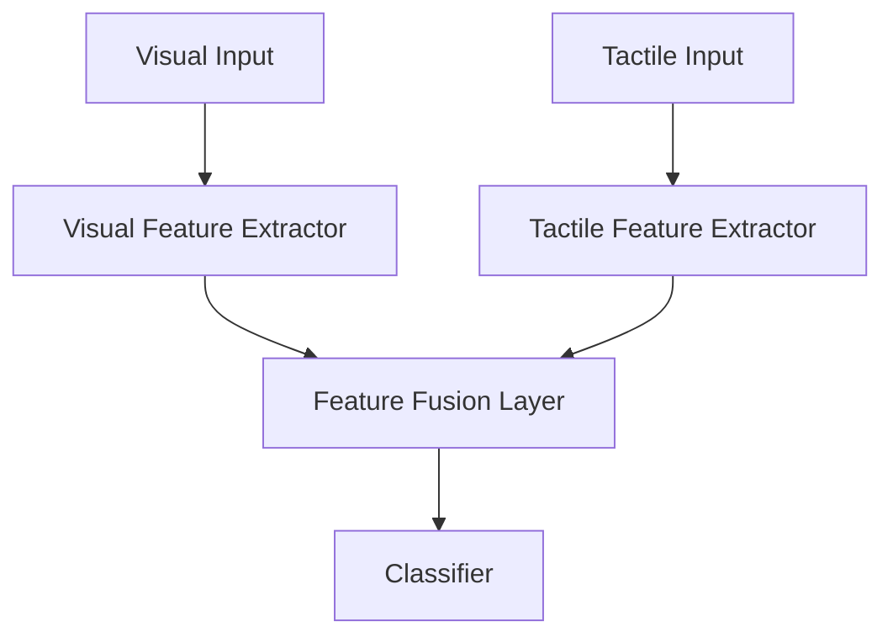
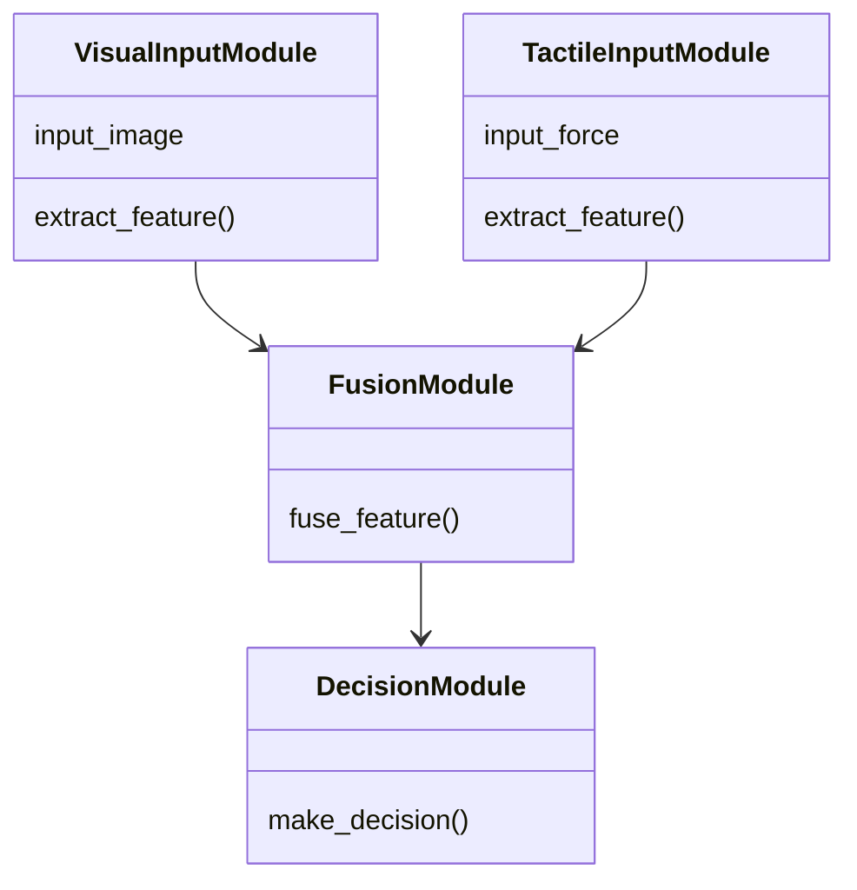

                 


# 开发具有视觉-触觉跨模态学习能力的AI Agent

**关键词**：AI Agent，跨模态学习，视觉-触觉，多模态数据融合，深度学习

**摘要**：  
本文探讨了开发具有视觉-触觉跨模态学习能力的AI Agent的关键技术与实现方法。通过分析跨模态学习的核心概念、算法原理、系统架构以及实际应用，本文旨在为研究人员和开发者提供一份全面的指南，帮助他们理解和实现具备视觉与触觉双模态感知能力的智能体。文章内容涵盖从基础概念到实际应用的各个方面，包括跨模态数据的融合方法、深度学习模型的设计与优化、系统架构的构建与实现等。

---

# 第1章：背景与概述

## 1.1 问题背景与挑战

### 1.1.1 跨模态学习的定义与重要性  
跨模态学习（Multimodal Learning）是指在多个数据模态（如视觉、听觉、触觉等）之间建立关联并进行联合学习的过程。通过结合不同模态的信息，AI Agent能够更好地理解和处理复杂环境中的任务。视觉和触觉的结合尤其重要，因为它们在机器人操作、物体识别、人机交互等领域具有广泛的应用潜力。

### 1.1.2 视觉-触觉跨模态学习的核心问题  
视觉-触觉跨模态学习的核心问题在于如何有效地将视觉信息（如图像）与触觉信息（如力反馈）进行融合，以实现对物体属性（如形状、材质）的准确感知和操作。这一过程需要解决数据对齐、特征融合以及模型泛化等问题。

### 1.1.3 AI Agent在跨模态学习中的角色与目标  
AI Agent的目标是通过视觉和触觉的协同工作，实现对环境的感知、理解和自主决策。跨模态学习能力的提升能够显著增强AI Agent在复杂场景中的适应性和智能性。

---

## 1.2 跨模态学习的定义与分类

### 1.2.1 跨模态学习的基本概念  
跨模态学习是指在多个数据模态之间建立关联并进行联合学习的过程。其核心思想是通过不同模态的数据互补性来提高模型的表达能力。

### 1.2.2 跨模态学习的主要分类  
跨模态学习可以分为以下几类：
1. **多模态分类**：基于多个模态的数据对同一目标进行分类。
2. **跨模态检索**：在一种模态中检索与另一种模态相关的结果。
3. **联合学习**：通过多种模态数据的协同作用来提升模型性能。

### 1.2.3 视觉-触觉跨模态学习的特点与优势  
视觉-触觉跨模态学习的特点在于其能够结合视觉信息的全局感知能力和触觉信息的局部精细感知能力。其优势在于能够实现对物体的全面理解和精准操作。

---

## 1.3 AI Agent的定义与能力

### 1.3.1 AI Agent的基本定义  
AI Agent（智能体）是指能够感知环境、自主决策并执行任务的智能系统。它通常具备感知、推理、规划和执行能力。

### 1.3.2 跨模态学习能力对AI Agent的影响  
跨模态学习能力的引入显著提升了AI Agent的感知能力。通过视觉和触觉的协同工作，AI Agent能够更准确地理解环境并执行复杂任务。

### 1.3.3 AI Agent在视觉-触觉跨模态学习中的应用场景  
视觉-触觉跨模态学习在机器人操作、人机交互、智能助手等领域具有广泛的应用潜力。

---

## 1.4 本章小结  
本章介绍了跨模态学习的基本概念、分类及其在AI Agent中的应用。通过分析视觉-触觉跨模态学习的特点和优势，为后续章节的深入探讨奠定了基础。

---

# 第2章：跨模态学习的核心概念与联系

## 2.1 跨模态学习的核心原理

### 2.1.1 跨模态数据的特征与挑战  
跨模态数据的特点包括异构性、异步性以及分布差异性。这些特点给数据的对齐和融合带来了挑战。

### 2.1.2 跨模态学习的基本原理  
跨模态学习的基本原理是通过构建模态间的关联关系，实现数据的互补与增强。

### 2.1.3 视觉-触觉数据的融合方法  
视觉-触觉数据的融合方法包括特征级融合、决策级融合以及基于注意力机制的融合。

---

## 2.2 跨模态学习的关键技术

### 2.2.1 跨模态数据表示方法  
跨模态数据表示方法包括基于特征的表示和基于分布的表示。

### 2.2.2 跨模态注意力机制  
跨模态注意力机制通过自适应地关注不同模态的重要特征，实现数据的高效融合。

### 2.2.3 跨模态模型的训练与优化  
跨模态模型的训练通常采用联合损失函数，通过多任务学习的方式优化模型性能。

---

## 2.3 跨模态学习的数学模型与公式

### 2.3.1 跨模态数据的表示公式  
$$x_v \in \mathbb{R}^{n_v}, x_t \in \mathbb{R}^{n_t}$$  
其中，$x_v$ 和 $x_t$ 分别表示视觉和触觉数据的特征向量。

### 2.3.2 跨模态注意力机制公式  
$$\alpha = \text{softmax}(W_v x_v + W_t x_t)$$  
其中，$\alpha$ 是注意力权重，$W_v$ 和 $W_t$ 是视觉和触觉模态的权重矩阵。

### 2.3.3 跨模态融合模型公式  
$$f(x_v, x_t) = \text{softmax}(W_f h)$$  
其中，$h$ 是融合后的特征向量，$W_f$ 是融合层的权重矩阵。

---

## 2.4 跨模态学习的ER实体关系图



---

## 2.5 本章小结  
本章详细介绍了跨模态学习的核心概念与关键技术，包括数据表示、注意力机制以及融合模型。通过ER实体关系图和数学公式，进一步明确了跨模态学习的实现原理。

---

# 第3章：跨模态学习的算法原理

## 3.1 跨模态学习算法的基本原理

### 3.1.1 跨模态数据的表示与对齐  
跨模态数据的表示与对齐是实现数据融合的关键步骤。通过对齐不同模态的数据，可以有效提升模型的表达能力。

### 3.1.2 跨模态注意力机制的实现  
基于Transformer的注意力机制被广泛应用于跨模态学习中。通过计算不同模态特征之间的相关性，实现特征的自适应加权。

### 3.1.3 跨模态模型的训练流程  
跨模态模型的训练流程包括数据预处理、特征提取、融合以及模型优化。

---

## 3.2 基于Transformer的跨模态学习算法

### 3.2.1 Transformer的基本结构  
Transformer由编码器和解码器组成，其核心思想是通过自注意力机制实现全局上下文的建模。

### 3.2.2 跨模态Transformer的改进  
针对视觉-触觉跨模态学习的特点，可以对Transformer的结构进行改进，例如引入多模态注意力机制。

### 3.2.3 跨模态Transformer的实现流程  
1. 对视觉和触觉数据分别进行特征提取。
2. 使用自注意力机制计算模态间的相关性。
3. 对融合后的特征进行分类或回归。

---

## 3.3 跨模态学习算法的数学模型

### 3.3.1 视觉模态的特征提取  
$$x_v = \text{CNN}(I)$$  
其中，$I$ 是输入图像，$\text{CNN}$ 是卷积神经网络。

### 3.3.2 触觉模态的特征提取  
$$x_t = \text{MLP}(F)$$  
其中，$F$ 是输入的力反馈信号，$\text{MLP}$ 是多层感知机。

### 3.3.3 跨模态注意力机制  
$$\alpha = \text{softmax}(W_v x_v + W_t x_t)$$  
$$h = \alpha x_v + (1-\alpha)x_t$$

---

## 3.4 本章小结  
本章详细介绍了跨模态学习算法的基本原理与实现方法，重点探讨了基于Transformer的跨模态学习算法及其数学模型。

---

# 第4章：系统架构设计

## 4.1 系统架构概述

### 4.1.1 系统功能模块  
AI Agent的系统架构主要包括以下功能模块：
1. **感知模块**：负责采集和处理视觉和触觉数据。
2. **融合模块**：对视觉和触觉数据进行融合。
3. **决策模块**：基于融合后的特征进行决策和动作规划。

### 4.1.2 系统功能模块的类图  


---

## 4.2 系统架构的实现

### 4.2.1 系统架构的详细设计  
系统架构的设计需要考虑模块间的接口和数据流。通过模块化设计，可以提高系统的可扩展性和可维护性。

### 4.2.2 系统架构的交互流程  
1. 感知模块采集视觉和触觉数据。
2. 融合模块对数据进行融合处理。
3. 决策模块基于融合后的特征进行决策。

---

## 4.3 系统接口设计

### 4.3.1 模块间的接口定义  
模块间的接口需要明确输入和输出的数据格式，例如：
- 视觉模块输出特征向量$x_v$。
- 触觉模块输出特征向量$x_t$。

### 4.3.2 系统接口的交互流程  
1. 感知模块将数据传递给融合模块。
2. 融合模块对数据进行融合处理。
3. 融合后的特征传递给决策模块。
4. 决策模块输出决策结果。

---

## 4.4 本章小结  
本章详细介绍了AI Agent的系统架构设计，包括功能模块的划分、类图设计以及接口设计。通过模块化设计，可以提高系统的灵活性和可扩展性。

---

# 第5章：项目实战与实现

## 5.1 项目环境与工具安装

### 5.1.1 开发环境的配置  
建议使用Python 3.8及以上版本，安装TensorFlow、Keras、PyTorch等深度学习框架。

### 5.1.2 数据集的准备  
需要准备包含视觉和触觉数据的多模态数据集，例如物体的图像和对应的力反馈信号。

---

## 5.2 系统核心实现

### 5.2.1 视觉模块的实现  
```python
def extract_visual_feature(image):
    # 使用CNN提取视觉特征
    feature_v = cnn_model(image)
    return feature_v
```

### 5.2.2 触觉模块的实现  
```python
def extract_tactile_feature(force):
    # 使用MLP提取触觉特征
    feature_t = mlp_model(force)
    return feature_t
```

### 5.2.3 融合模块的实现  
```python
def fuse_feature(feature_v, feature_t):
    # 使用注意力机制融合特征
    attention = softmax(W_v * feature_v + W_t * feature_t)
    fused_feature = attention * feature_v + (1 - attention) * feature_t
    return fused_feature
```

### 5.2.4 决策模块的实现  
```python
def make_decision(fused_feature):
    # 使用分类器进行决策
    prediction = classifier(fused_feature)
    return prediction
```

---

## 5.3 代码实现与应用

### 5.3.1 数据集的预处理  
需要对图像和力反馈数据进行归一化处理，确保输入数据的格式一致。

### 5.3.2 模型的训练与优化  
通过交叉验证和超参数调优，可以提升模型的性能。

### 5.3.3 模型的测试与评估  
使用测试集对模型进行评估，计算准确率、召回率等指标。

---

## 5.4 本章小结  
本章通过具体的代码实现，展示了AI Agent的系统核心实现过程，包括视觉模块、触觉模块、融合模块以及决策模块的实现。

---

# 第6章：应用案例分析

## 6.1 应用场景分析

### 6.1.1 机器人操作  
视觉-触觉跨模态学习在机器人抓取和操作中具有重要的应用。通过视觉和触觉的协同工作，机器人能够更准确地识别物体并完成精细操作。

### 6.1.2 人机交互  
在人机交互领域，视觉-触觉跨模态学习可以提升用户体验，例如在虚拟现实中的触觉反馈。

---

## 6.2 应用案例的具体实现

### 6.2.1 机器人抓取案例  
通过视觉和触觉数据的融合，机器人可以更准确地识别物体的形状和材质，从而实现精准的抓取。

### 6.2.2 虚拟现实中的触觉反馈  
在虚拟现实应用中，视觉-触觉跨模态学习可以实现更真实的触觉反馈，提升用户体验。

---

## 6.3 本章小结  
本章通过具体的应用案例，展示了视觉-触觉跨模态学习在机器人操作和人机交互等领域的实际应用。

---

# 第7章：未来研究方向与总结

## 7.1 未来研究方向

### 7.1.1 更高效的跨模态学习算法  
未来的研究方向包括设计更高效的跨模态学习算法，例如基于图神经网络的跨模态学习方法。

### 7.1.2 更大的模型规模  
随着计算能力的提升，未来可以尝试构建更大规模的跨模态学习模型。

### 7.1.3 更多模态的结合  
未来可以研究更多模态的结合，例如视觉、触觉和听觉的三模态学习。

---

## 7.2 总结

### 7.2.1 跨模态学习的重要意义  
跨模态学习是实现更智能AI Agent的核心技术之一。通过视觉和触觉的结合，可以显著提升AI Agent的感知和决策能力。

### 7.2.2 对未来研究的展望  
未来的研究需要进一步探索跨模态学习的理论和应用，特别是在多模态数据融合、模型优化以及实际应用方面。

---

## 7.3 注意事项与建议

### 7.3.1 数据质量的重要性  
数据质量对跨模态学习的效果至关重要。需要确保数据的准确性和完整性。

### 7.3.2 模型的泛化能力  
在实际应用中，需要关注模型的泛化能力，避免过拟合训练数据。

### 7.3.3 安全性与伦理问题  
在设计和应用AI Agent时，需要关注安全性与伦理问题，确保技术的合理使用。

---

## 7.4 拓展阅读与参考文献

### 7.4.1 推荐书籍  
1. 《Deep Learning》（Ian Goodfellow等著）
2. 《Multimodal Machine Learning》（Zheng-Yu Sun等著）

### 7.4.2 推荐论文  
1. "Attention is all you need"（Vaswani et al., 2017）
2. "Multimodal deep learning for robot perception"（Yan et al., 2020）

---

## 7.5 本章小结  
本章总结了当前视觉-触觉跨模态学习的研究进展，并展望了未来的研究方向。通过注意事项和拓展阅读，为读者提供了进一步学习和研究的方向。

---

# 结语

开发具有视觉-触觉跨模态学习能力的AI Agent是一项具有重要意义的技术。通过本文的详细讲解，读者可以全面了解跨模态学习的核心概念、算法原理和系统架构。未来的研究需要进一步探索跨模态学习的理论和应用，特别是在多模态数据融合和模型优化方面。希望本文能够为相关领域的研究人员和开发者提供有价值的参考。

