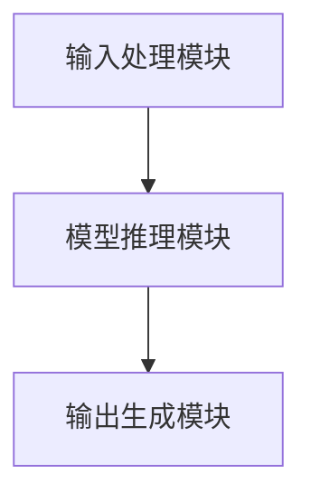
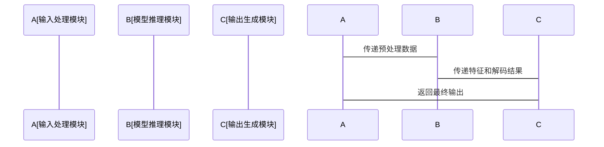

                 


# 开发具有视觉-语言多模态理解能力的AI Agent

> 关键词：多模态AI Agent，视觉-语言理解，AI系统开发，多模态数据融合，模型训练，系统架构设计

> 摘要：本文将详细探讨开发具有视觉-语言多模态理解能力的AI Agent的关键技术，从背景介绍到核心概念，从算法原理到系统设计，从项目实战到总结，全面解析如何构建一个能够理解和处理视觉与语言信息的智能体。

---

## 第1章: 背景介绍与问题背景

### 1.1 问题背景与目标

#### 1.1.1 多模态AI Agent的定义与核心概念
- **多模态AI Agent**：具备处理多种数据类型（如图像、文本、语音等）能力的智能体，能够通过多模态数据理解环境并执行任务。
- **核心目标**：实现AI Agent对视觉和语言信息的联合理解，使其能够在复杂场景中进行高效的人机交互和决策。

#### 1.1.2 视觉-语言理解的必要性
- 当前AI技术的局限性：单一模态处理能力较强，但缺乏多模态联合理解能力。
- 视觉-语言理解的应用场景：图像描述生成、视觉问答、多模态对话系统等。

#### 1.1.3 问题解决目标与边界
- **目标**：构建一个能够同时处理图像和文本信息的AI Agent，使其具备多模态理解能力。
- **边界**：专注于视觉-语言模态的处理，暂不考虑其他模态（如语音、视频）。

### 1.2 多模态数据与AI Agent的结合

#### 1.2.1 视觉与语言数据的特点
- **图像数据**：高维、非结构化，包含丰富的空间信息。
- **文本数据**：序列化、结构化，具备语义信息。

#### 1.2.2 多模态数据在AI Agent中的作用
- 提供更丰富的语境信息。
- 增强模型的理解能力，使其能够处理复杂场景。

#### 1.2.3 视觉-语言理解的应用场景
- 图像描述生成：将图像内容转化为自然语言描述。
- 视觉问答：通过图像和上下文回答问题。
- 多模态对话系统：结合视觉和语言信息进行实时对话。

---

## 第2章: 核心概念与联系

### 2.1 多模态数据的特征与处理

#### 2.1.1 图像数据的特征提取
- **图像数据的特征**：颜色、纹理、形状、空间关系等。
- **特征提取方法**：使用CNN（卷积神经网络）提取图像特征，如ResNet、VGG等。

#### 2.1.2 文本数据的特征提取
- **文本数据的特征**：词向量、语义信息、上下文关系。
- **特征提取方法**：使用词嵌入模型（如Word2Vec、BERT）提取文本特征。

#### 2.1.3 多模态数据的融合方法
- **模态对齐**：通过注意力机制对齐图像和文本特征。
- **特征融合**：将图像和文本特征进行融合，如简单的拼接或加权融合。

### 2.2 多模态模型的结构与原理

#### 2.2.1 编码器-解码器结构
- **编码器**：将输入的图像和文本数据编码为统一的特征表示。
- **解码器**：根据编码后的特征生成目标输出（如文本描述）。

#### 2.2.2 注意力机制在多模态中的应用
- **图像注意力**：在图像中关注重要区域。
- **文本注意力**：在文本中关注相关词汇或短语。

#### 2.2.3 多模态模型的训练目标
- **联合优化**：同时优化图像和文本的特征表示，使其能够相互增强。

---

## 第3章: 多模态AI Agent的算法原理

### 3.1 多模态模型的算法流程

#### 3.1.1 数据输入与特征提取
- **输入数据**：图像和文本对（如图像和其对应的描述文本）。
- **特征提取**：分别提取图像和文本的特征。

#### 3.1.2 模型编码与解码过程
- **编码器**：将图像和文本特征映射到同一空间。
- **解码器**：根据编码后的特征生成目标输出。

#### 3.1.3 输出结果与反馈机制
- **输出结果**：生成的文本描述或答案。
- **反馈机制**：通过监督学习进行模型优化。

### 3.2 多模态模型的数学公式

#### 3.2.1 编码器的数学表达式
- **图像编码**：将图像特征表示为向量$F \in \mathbb{R}^{d}$，其中$d$是特征维度。
- **文本编码**：将文本表示为向量$T \in \mathbb{R}^{d}$。

#### 3.2.2 解码器的数学表达式
- **解码器输入**：联合特征向量$Z = \text{concat}(F, T)$。
- **生成输出**：$P(y|x) = p(y|x; \theta)$，其中$\theta$是模型参数。

#### 3.2.3 注意力机制的公式推导
- **查询-键-值机制**：$Q = W_q h$, $K = W_k h$, $V = W_v h$。
- **注意力权重**：$\alpha = \text{softmax}(\frac{QK^T}{\sqrt{d}})$。
- **注意力输出**：$O = \alpha V$。

---

## 第4章: 系统分析与架构设计

### 4.1 系统功能模块设计

#### 4.1.1 输入处理模块
- **功能**：接收图像和文本输入，进行预处理。
- **实现**：使用数据预处理库（如OpenCV、TensorFlow）。

#### 4.1.2 模型推理模块
- **功能**：将预处理后的数据输入模型，进行特征提取和解码。
- **实现**：使用深度学习框架（如TensorFlow、PyTorch）。

#### 4.1.3 输出生成模块
- **功能**：生成最终的文本输出或答案。
- **实现**：根据模型的输出结果进行后处理。

### 4.2 系统架构设计

#### 4.2.1 模块间关系的Mermaid图


#### 4.2.2 系统交互的序列图


#### 4.2.3 系统架构的类图
```mermaid
classDiagram
    class A(InputProcessor) {
        processInputs()
    }
    class B(ModelInference) {
        inferFeatures()
    }
    class C(OutputGenerator) {
        generateOutput()
    }
    A --> B:传递数据
    B --> C:传递结果
```

---

## 第5章: 项目实战与代码实现

### 5.1 环境搭建与数据准备

#### 5.1.1 Python环境与库安装
- **安装Python**：使用Python 3.8或更高版本。
- **安装库**：`pip install tensorflow numpy pandas matplotlib`

#### 5.1.2 数据集的获取与预处理
- **数据集**：使用COCO数据集或其他图像描述数据集。
- **预处理**：将图像和文本对进行配对，提取图像特征（如使用ResNet50）。

#### 5.1.3 数据格式与存储方式
- **存储格式**：将图像特征和文本描述存储为JSON文件。

### 5.2 模型实现与训练

#### 5.2.1 模型代码实现
```python
import tensorflow as tf
from tensorflow.keras.layers import Dense, Input, Concatenate
from tensorflow.keras.models import Model

# 输入层
image_input = Input(shape=(2048,))
text_input = Input(shape=(2048,))

# 编码器
merged = Concatenate()([image_input, text_input])
dense = Dense(1024, activation='relu')(merged)
output = Dense(1, activation='sigmoid')(dense)

# 模型定义
model = Model(inputs=[image_input, text_input], outputs=output)
model.compile(optimizer='adam', loss='binary_crossentropy', metrics=['accuracy'])
```

#### 5.2.2 代码应用解读与分析
- **输入层**：分别接收图像和文本特征。
- **编码器**：将图像和文本特征拼接后进行处理。
- **输出层**：生成二分类结果（如判断图像与文本是否匹配）。

#### 5.2.3 模型训练与评估
- **训练**：使用训练数据进行模型训练。
- **评估**：在验证集上评估模型性能。

---

## 第6章: 总结与展望

### 6.1 最佳实践 tips
- **数据预处理**：确保数据质量和多样性。
- **模型优化**：尝试不同的模型结构和超参数。
- **系统设计**：注重模块化和可扩展性。

### 6.2 小结
通过本文的讲解，读者可以系统地了解开发具有视觉-语言多模态理解能力的AI Agent的关键技术，包括核心概念、算法原理和系统设计。

### 6.3 注意事项
- **数据隐私**：注意数据的隐私保护。
- **模型泛化能力**：避免过拟合，确保模型的泛化能力。

### 6.4 拓展阅读
- 推荐阅读相关领域的最新论文和书籍，深入了解多模态AI Agent的前沿技术。

---

通过以上步骤，我们逐步构建了一个具有视觉-语言多模态理解能力的AI Agent，涵盖了从理论到实践的各个方面，帮助读者全面理解并掌握相关技术。

