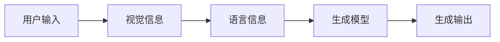
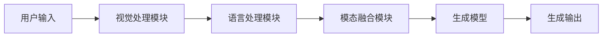

                 


# 开发具有视觉-语言多模态生成能力的AI Agent

> 关键词：视觉-语言生成、多模态AI Agent、深度学习、生成模型、视觉与语言融合

> 摘要：本文将深入探讨如何开发具有视觉-语言多模态生成能力的AI Agent。从多模态生成的基本概念到核心算法，从系统架构设计到项目实战，我们将一步步分析如何构建一个能够同时处理视觉和语言信息，并生成高质量输出的AI Agent。文章内容丰富，涵盖数学公式、算法流程图、系统架构图等，适合技术专家和开发者阅读。

---

## 第一部分: 视觉-语言多模态生成的背景与基础

### 第1章: 多模态生成的背景与概念

#### 1.1 多模态生成的背景
多模态生成是指AI系统能够同时处理和生成多种模态的信息，例如视觉、语言、音频等。在当前AI技术迅速发展的背景下，单一模态的生成模型已经无法满足复杂场景的需求。例如，在智能客服系统中，用户可能需要通过图片描述问题，AI Agent需要通过理解图片内容生成相应的文字回复。

**AI Agent在多模态生成中的角色**  
AI Agent是一个能够感知环境、理解用户需求并执行任务的智能体。在多模态生成场景中，AI Agent需要同时处理视觉和语言信息，并能够生成多种模态的输出，例如图像、文字或语音。

#### 1.2 视觉与语言的理解与生成
**视觉信息的处理与理解**  
视觉信息主要包括图像和视频。AI Agent需要通过计算机视觉技术提取图像中的特征信息，例如物体检测、图像分割等。  
**语言信息的处理与理解**  
语言信息主要指文本和语音。AI Agent需要通过自然语言处理技术理解文本或语音的内容，并生成相应的语言输出。  
**多模态信息的融合与生成**  
多模态信息的融合是指将视觉和语言信息进行联合处理，生成更加丰富和准确的输出。例如，AI Agent可以根据用户提供的图片生成相关的文字描述。

#### 1.3 AI Agent的基本概念与能力
**AI Agent的定义与特点**  
AI Agent是一种智能体，能够感知环境、理解用户需求并执行任务。其特点包括自主性、反应性、社交能力等。  
**多模态生成能力的核心要素**  
- 多模态信息的理解能力：能够同时处理视觉和语言信息。  
- 多模态信息的生成能力：能够生成多种模态的输出，例如图像、文字或语音。  
- 多模态信息的融合能力：能够将不同模态的信息进行联合处理，生成更准确的输出。  
**AI Agent的典型应用场景**  
- 智能客服：用户可以通过图片描述问题，AI Agent通过理解图片内容生成相应的文字回复。  
- 智能助手：AI Agent可以根据用户的语音指令生成相应的图像或文字输出。  

#### 1.4 多模态生成的核心概念对比
**不同模态数据的特征对比**  
| 模态 | 特征 | 优点 | 缺点 |  
|------|------|------|------|  
| 视觉 | 图像、视频 | 信息丰富 | 处理复杂 |  
| 语言 | 文本、语音 | 易于理解 | 信息量有限 |  

**多模态生成与单一模态生成的对比**  
- 单一模态生成：只能处理一种模态的信息，例如仅生成图像或仅生成文字。  
- 多模态生成：能够同时处理多种模态的信息，并生成多种模态的输出。  
- 多模态生成的优势在于能够结合不同模态的信息，生成更准确和丰富的输出。  

#### 1.5 多模态生成的ER实体关系图


---

### 第2章: 多模态生成的核心概念与联系

#### 2.1 多模态生成的核心原理
**视觉与语言的特征提取**  
- 视觉特征提取：通过CNN等技术提取图像的特征信息。  
- 语言特征提取：通过Transformer等技术提取文本的特征信息。  
**多模态信息的融合机制**  
- 对齐：将不同模态的信息对齐，例如将图像的特征与文本的特征进行对齐。  
- 融合：将对齐后的特征进行融合，生成联合特征。  
**生成模型的基本原理**  
生成模型的核心是通过学习数据的分布，生成新的数据。例如，GAN通过生成器和判别器的对抗训练生成高质量的图像。

#### 2.2 多模态生成的核心概念对比
**多模态生成与单一模态生成的对比**  
- 单一模态生成只能处理一种模态的信息，例如仅生成图像或仅生成文字。  
- 多模态生成能够同时处理多种模态的信息，并生成多种模态的输出。  

**生成模型的数学模型**  
- GAN的数学模型：  
  $$ G(x) = xW_G + b_G $$  
  $$ D(x) = xW_D + b_D $$  
  其中，G是生成器，D是判别器，x是输入数据，W是权重矩阵，b是偏置项。  

**Diffusion模型的数学模型**  
$$ q(x_t|x_{t-1}) = \mathcal{N}(x_t; \mu_\theta(x_{t-1}), \sigma^2 I) $$  
其中，$\mu_\theta$是均值函数，$\sigma$是标准差，I是单位矩阵。  

---

## 第三部分: 多模态生成的核心算法与原理

### 第3章: 视觉处理算法

#### 3.1 视觉特征提取算法
**基于CNN的图像特征提取**  
- AlexNet：经典的CNN模型，用于图像分类任务。  
- VGGNet：通过堆叠多个3x3的卷积层，提取深层特征。  
- ResNet：通过引入跳跃连接，解决了深层网络的梯度消失问题。  

**视觉生成模型**  
- GAN：通过生成器和判别器的对抗训练生成高质量的图像。  
- Diffusion模型：通过逐步添加噪声并逐步去噪，生成高质量的图像。  

#### 3.2 视觉处理算法的数学模型
**CNN的卷积操作**  
$$ f(x) = \sum_{i=1}^{n} w_i x_i + b $$  
其中，$w_i$是权重，$x_i$是输入数据，$b$是偏置项。  

**GAN的生成器与判别器**  
$$ G(x) = xW_G + b_G $$  
$$ D(x) = xW_D + b_D $$  

---

## 第四部分: 多模态生成的系统架构与设计

### 第4章: 系统架构设计

#### 4.1 系统功能设计
- 用户输入：用户可以通过图片或文字输入需求。  
- 模态处理：系统分别对视觉和语言信息进行处理。  
- 模态融合：将处理后的视觉和语言特征进行融合。  
- 模型生成：通过生成模型生成最终的输出。  

#### 4.2 系统架构图


---

## 第五部分: 项目实战

### 第5章: 项目实战

#### 5.1 项目介绍
- 项目名称：视觉-语言对话系统  
- 项目目标：用户可以通过图片描述问题，AI Agent通过理解图片内容生成相应的文字回复。  

#### 5.2 环境安装
- 安装Python：确保Python版本为3.8以上。  
- 安装深度学习框架：例如TensorFlow或PyTorch。  
- 安装视觉处理库：例如OpenCV和 PIL。  
- 安装自然语言处理库：例如Transformers。  

#### 5.3 系统核心实现源代码
```python
import torch
import torch.nn as nn
import torch.optim as optim
from PIL import Image
import numpy as np

class VisionLanguageGenerator(nn.Module):
    def __init__(self, vision_dim, language_dim):
        super(VisionLanguageGenerator, self).__init__()
        self.vision_encoder = nn.Linear(vision_dim, 512)
        self.language_encoder = nn.Linear(language_dim, 512)
        self.fusion_layer = nn.Linear(1024, 512)
        self.generator = nn.Linear(512, output_dim)
    
    def forward(self, vision_features, language_features):
        vision_embeddings = self.vision_encoder(vision_features)
        language_embeddings = self.language_encoder(language_features)
        fused_embeddings = torch.cat((vision_embeddings, language_embeddings), dim=-1)
        fused_embeddings = self.fusion_layer(fused_embeddings)
        output = self.generator(fused_embeddings)
        return output
```

#### 5.4 代码应用解读与分析
- 视觉编码：通过卷积神经网络提取图像的特征信息。  
- 语言编码：通过Transformer模型提取文本的特征信息。  
- 模态融合：将视觉和语言特征进行融合，生成联合特征。  
- 生成模型：基于融合特征生成最终的输出。  

#### 5.5 实际案例分析
- 输入：用户上传一张图片，描述“一只猫在桌子上”。  
- 输出：AI Agent生成“这是一只猫在桌子上。”  

---

## 第六部分: 扩展与展望

### 第6章: 未来的研究方向
- 更高效的多模态生成算法：例如更高效的生成模型和模态融合方法。  
- 多模态生成的应用场景扩展：例如应用于教育、医疗、娱乐等领域。  

### 6.2 最佳实践 tips
- 在实际应用中，建议先从单一模态生成开始，逐步实现多模态生成。  
- 在模型训练中，建议使用高质量的数据集，并进行充分的训练。  

### 6.3 项目小结
通过本文的分析和实战，我们了解了如何开发具有视觉-语言多模态生成能力的AI Agent。从算法原理到系统架构，再到项目实战，我们一步步实现了一个简单的视觉-语言对话系统。未来，我们可以进一步优化算法，扩展应用场景，实现更复杂的多模态生成任务。

