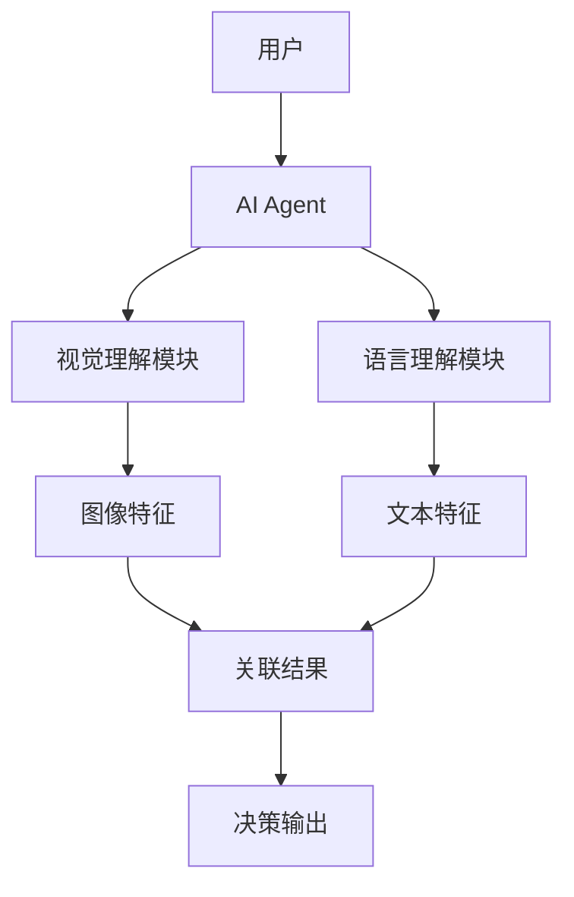
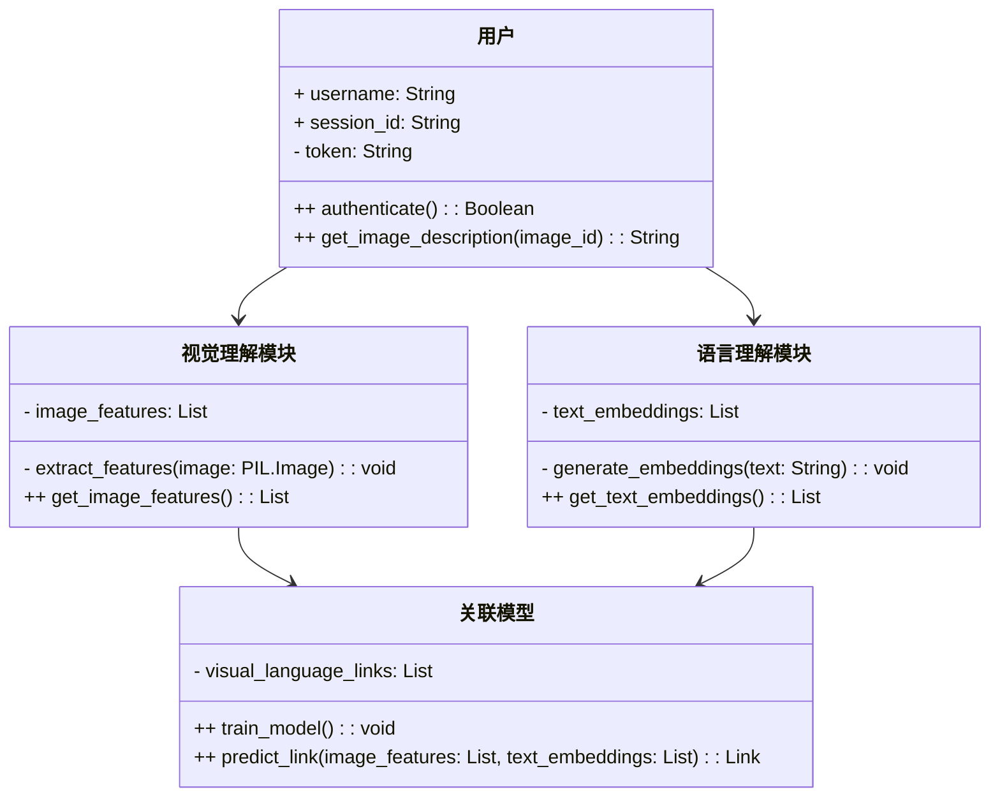
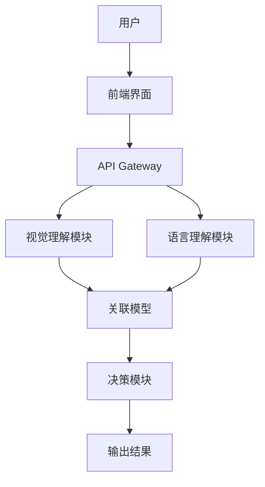

                 


# 开发具有视觉-语言理解能力的AI Agent

## 关键词：视觉-语言理解，AI Agent，多模态数据，深度学习，自然语言处理，计算机视觉

## 摘要：  
本文详细探讨了开发具有视觉-语言理解能力的AI Agent的关键技术与实现方法。从问题背景、核心概念到算法原理、系统架构设计，再到项目实战和最佳实践，本文为读者提供了一套完整的开发指南。通过多模态数据的融合与处理、视觉-语言模型的训练优化，以及AI Agent的交互设计，本文帮助开发者深入理解并掌握视觉-语言理解AI Agent的开发精髓。

---

# 第1章: 背景介绍

## 1.1 问题背景

### 1.1.1 从单模态AI到多模态AI的演进  
传统的AI系统主要基于单一模态（如文本或图像）进行处理，但现实世界中的数据往往是多模态的。例如，一个人可能会通过看到一张图片并结合上下文描述来理解其含义。因此，开发能够同时处理视觉和语言信息的AI Agent成为趋势。

### 1.1.2 视觉-语言理解的必要性  
视觉-语言理解是AI Agent实现更复杂任务的关键能力。例如，在电子商务中，AI Agent可以通过图像识别和自然语言处理帮助用户搜索商品；在医疗领域，AI Agent可以通过分析医学图像和病历描述辅助诊断。

### 1.1.3 当前AI Agent的发展现状  
当前，AI Agent已广泛应用于智能助手、机器人、自动驾驶等领域。然而，大多数AI Agent仅能处理单一模态信息，缺乏对多模态数据的综合理解能力。

---

## 1.2 问题描述

### 1.2.1 视觉-语言理解的核心问题  
视觉-语言理解的核心问题是如何将图像或视频等视觉数据与文本数据进行关联，实现跨模态的信息理解和推理。

### 1.2.2 AI Agent的任务目标与挑战  
AI Agent的目标是通过视觉-语言理解能力，实现与用户的自然交互，并完成复杂任务。其主要挑战包括多模态数据的融合、跨模态理解的准确性以及系统的实时性。

### 1.2.3 视觉-语言理解在AI Agent中的作用  
视觉-语言理解是AI Agent实现高级任务的基础，例如场景理解、目标识别、对话生成等。

---

## 1.3 问题解决

### 1.3.1 多模态数据处理的解决方案  
通过将视觉和语言数据进行预处理、特征提取和融合，实现多模态数据的联合表示。

### 1.3.2 视觉-语言模型的训练策略  
采用端到端的训练方法，利用大规模多模态数据进行预训练，并通过微调任务进行优化。

### 1.3.3 AI Agent的交互设计与实现  
设计基于视觉-语言理解的交互界面，支持用户通过图像和文本与AI Agent进行自然交互。

---

## 1.4 边界与外延

### 1.4.1 视觉-语言理解的边界条件  
视觉-语言理解目前主要局限于特定场景，例如图像描述生成或基于图像的问答。复杂场景的理解仍需进一步研究。

### 1.4.2 AI Agent能力的局限性  
当前AI Agent的视觉-语言理解能力受限于数据质量和模型的泛化能力，难以处理极端复杂或模糊场景。

### 1.4.3 相关领域的区别与联系  
与单模态AI相比，视觉-语言理解AI Agent更具实用性和广泛性，但其开发难度也更大。

---

## 1.5 概念结构与核心要素组成

### 1.5.1 视觉-语言理解的系统架构  
视觉-语言理解系统通常包括数据输入、特征提取、跨模态融合、模型训练和结果输出五个部分。

### 1.5.2 AI Agent的核心要素  
AI Agent的核心要素包括感知能力（视觉、语言）、决策能力（推理、判断）和交互能力（对话生成、动作执行）。

### 1.5.3 系统的输入输出关系  
输入：图像、文本；输出：目标识别、场景描述、对话回应。

---

## 1.6 本章小结  
本章从背景、问题、解决策略和系统架构等方面介绍了开发具有视觉-语言理解能力的AI Agent的基本情况，为后续章节的深入分析奠定了基础。

---

# 第2章: 核心概念与联系

## 2.1 视觉-语言理解的基础知识

### 2.1.1 视觉理解的定义与实现  
视觉理解是指通过计算机视觉技术对图像或视频进行分析和理解，提取其中的语义信息。

### 2.1.2 语言理解的定义与实现  
语言理解是指通过自然语言处理技术对文本进行分析和理解，提取其中的语义信息。

### 2.1.3 视觉-语言联合理解的优势  
视觉-语言联合理解能够结合两种模态的优势，提高系统的理解和推理能力。

---

## 2.2 核心概念原理

### 2.2.1 多模态数据的融合方法  
常见的多模态数据融合方法包括特征级融合、决策级融合和混合融合。

### 2.2.2 视觉-语言模型的训练目标  
视觉-语言模型的训练目标是通过联合优化视觉和语言特征，实现跨模态的信息关联。

### 2.2.3 AI Agent的决策机制  
AI Agent的决策机制基于视觉-语言理解结果，结合上下文信息进行推理和判断。

---

## 2.3 概念属性特征对比表格

| 概念         | 输入     | 输出      | 核心算法           | 应用场景                   |
|--------------|----------|-----------|--------------------|---------------------------|
| 视觉理解     | 图像/视频 | 物体识别   | CNN, Transformer    | 图像识别、视频分析         |
| 语言理解     | 文本      | 语义解析   | RNN, Transformer    | 文本分类、问答系统         |
| 视觉-语言理解 | 图像+文本 | 关联描述   | 多模态模型          | 图像描述生成、基于图像问答 |

---

## 2.4 ER实体关系图架构



---

## 2.5 本章小结  
本章通过对比分析和图表展示，详细阐述了视觉-语言理解的核心概念及其在AI Agent中的应用，为后续章节的算法实现提供了理论基础。

---

# 第3章: 视觉-语言模型的算法原理

## 3.1 模型训练目标

### 3.1.1 联合表示学习  
通过多模态数据的特征提取和融合，学习统一的表示空间。

### 3.1.2 对齐任务  
通过对比学习或交叉注意力机制，实现视觉和语言特征的对齐。

---

## 3.2 模型训练流程

### 3.2.1 数据预处理  
对图像数据进行归一化、裁剪等预处理，对文本数据进行分词、嵌入生成。

### 3.2.2 特征提取  
使用卷积神经网络（CNN）提取图像特征，使用Transformer提取文本特征。

### 3.2.3 跨模态融合  
通过注意力机制或门控机制，实现视觉和语言特征的融合。

### 3.2.4 损失函数  
使用交叉熵损失函数优化模型。

---

## 3.3 损失函数与优化策略

### 3.3.1 损失函数  
$$ \mathcal{L} = -\sum_{i=1}^{N} y_i \log p(y_i) $$

### 3.3.2 优化策略  
采用Adam优化器，设置合适的学习率和批量大小。

---

## 3.4 跨模态交互机制

### 3.4.1 视觉到语言的注意力机制  
通过图像特征生成文本描述，利用注意力机制确定图像区域与文本单词的关联。

### 3.4.2 语言到视觉的注意力机制  
通过文本描述生成图像关键词，利用注意力机制定位图像中的关键区域。

---

## 3.5 本章小结  
本章详细分析了视觉-语言模型的训练目标、损失函数和交互机制，为后续的系统设计和项目实现提供了理论依据。

---

# 第4章: 系统分析与架构设计

## 4.1 问题场景介绍

### 4.1.1 系统目标  
开发一个支持视觉-语言交互的AI Agent，能够通过图像和文本理解用户需求并提供服务。

### 4.1.2 系统特点  
支持多模态输入、实时交互、高精度理解。

---

## 4.2 系统功能设计

### 4.2.1 领域模型设计  


---

## 4.3 系统架构设计

### 4.3.1 系统架构图  


---

## 4.4 系统接口设计

### 4.4.1 API接口  
- POST /api/v1/visual-language-process  
- Parameters: image_base64, text_query  
- Response: description, confidence_score

### 4.4.2 数据交互流程  
用户输入图像和文本，系统通过API接口传递数据，经过视觉和语言模块处理后，生成关联结果并返回。

---

## 4.5 本章小结  
本章通过系统分析和架构设计，详细描述了视觉-语言理解AI Agent的实现方案，为后续的项目开发提供了明确的指导。

---

# 第5章: 项目实战

## 5.1 环境搭建

### 5.1.1 系统需求  
- Python 3.8+  
- GPU支持（推荐NVIDIA显卡）  
- 软件：PyTorch、OpenCV、Transformers库

### 5.1.2 环境安装  
```bash
pip install torch torchvision transformers numpy
```

---

## 5.2 核心功能实现

### 5.2.1 数据预处理  
```python
import torch
from PIL import Image
import numpy as np

def preprocess_image(image_path):
    image = Image.open(image_path)
    image = image.resize((224, 224))
    image = np.array(image) / 255.0
    image = torch.FloatTensor(image)
    return image
```

### 5.2.2 视觉特征提取  
```python
import torch.nn as nn
import torch.nn.functional as F

class VisualFeatureExtractor(nn.Module):
    def __init__(self):
        super(VisualFeatureExtractor, self).__init__()
        self.conv = nn.Conv2d(3, 64, kernel_size=3, padding=1)
        
    def forward(self, x):
        x = F.relu(self.conv(x))
        return x
```

### 5.2.3 语言特征提取  
```python
from transformers import BertTokenizer, BertModel

tokenizer = BertTokenizer.from_pretrained('bert-base-uncased')
model = BertModel.from_pretrained('bert-base-uncased')

def get_text_embedding(text):
    inputs = tokenizer(text, return_tensors='pt')
    outputs = model(**inputs)
    return outputs.last_hidden_state
```

---

## 5.3 系统集成与测试

### 5.3.1 系统集成  
将视觉和语言模块集成到AI Agent中，通过API接口实现数据交互。

### 5.3.2 系统测试  
编写测试用例，验证系统在不同场景下的表现，例如图像描述生成和基于图像的问答。

---

## 5.4 本章小结  
本章通过项目实战，详细讲解了视觉-语言理解AI Agent的开发过程，包括环境搭建、功能实现和系统测试。

---

# 第6章: 最佳实践与注意事项

## 6.1 性能优化

### 6.1.1 模型压缩  
通过剪枝和量化技术减少模型参数，提高推理速度。

### 6.1.2 并行计算  
利用多GPU并行加速模型训练和推理。

---

## 6.2 模型调优

### 6.2.1 参数调整  
调整学习率、批量大小等超参数，优化模型性能。

### 6.2.2 数据增强  
通过数据增强技术扩大训练数据规模，提高模型的泛化能力。

---

## 6.3 安全性与隐私保护

### 6.3.1 数据脱敏  
对敏感数据进行匿名化处理，保护用户隐私。

### 6.3.2 权限控制  
通过访问控制列表（ACL）限制系统的使用权限。

---

## 6.4 项目小结

### 6.4.1 项目总结  
通过本项目，我们成功开发了一个具有视觉-语言理解能力的AI Agent，验证了多模态数据处理和跨模态交互的技术可行性。

### 6.4.2 注意事项  
在实际应用中，需注意模型的泛化能力、系统的实时性和用户隐私保护。

### 6.4.3 未来展望  
未来可以研究更复杂的多模态任务，如三维视觉和多语言理解。

---

## 6.5 拓展阅读

### 6.5.1 推荐书籍  
- 《Deep Learning》  
- 《Natural Language Processing with PyTorch》  

### 6.5.2 推荐论文  
- "ImageNet Classification with Deep Convolutional Neural Networks"  
- "Attention Is All You Need"  

---

## 6.6 本章小结  
本章总结了项目的开发经验，提出了实际应用中的注意事项，并为读者提供了进一步研究的方向。

---

# 第7章: 结语

## 7.1 全文总结  
本文系统地介绍了开发具有视觉-语言理解能力的AI Agent的关键技术与实现方法，从理论到实践，为读者提供了完整的开发指南。

## 7.2 作者寄语  
希望本文能为AI Agent的开发人员提供有价值的参考，推动视觉-语言理解技术的进一步发展。

---

感谢您的阅读！

