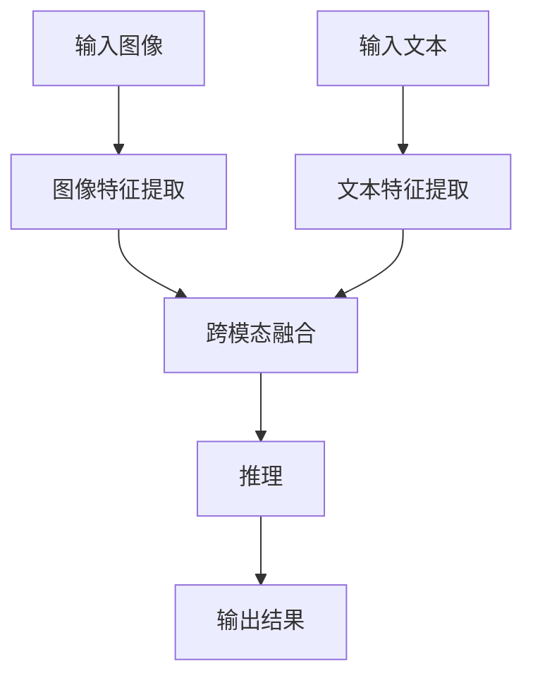
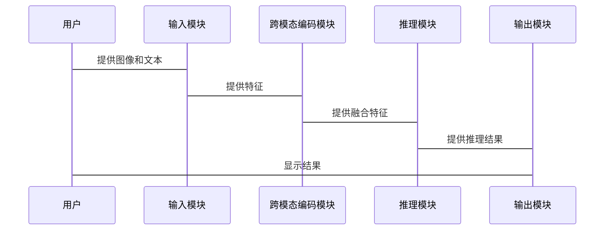

                 


# 开发具有视觉-语言跨模态推理能力的AI Agent

> 关键词：AI Agent, 跨模态推理, 视觉-语言, 多模态学习, 注意力机制

> 摘要：本文将详细探讨如何开发具有视觉-语言跨模态推理能力的AI Agent。文章从跨模态推理的基本概念出发，逐步分析其算法原理、系统架构设计、接口与交互设计，并通过实际案例展示开发过程。最终，文章将为读者提供一个全面而深入的指南，帮助他们掌握跨模态推理AI Agent的开发技能。

---

## 第1章: 背景介绍与问题背景

### 1.1 问题背景

#### 1.1.1 跨模态推理的定义
跨模态推理是指在多个数据模态（如图像、文本、语音等）之间进行信息处理和推理的能力。视觉-语言跨模态推理专注于处理图像和文本之间的信息交互。

#### 1.1.2 当前AI Agent的发展现状
AI Agent正在从单一模态处理向多模态处理方向发展，跨模态推理能力是提升AI Agent智能水平的关键。

#### 1.1.3 跨模态推理在AI Agent中的重要性
跨模态推理使AI Agent能够更好地理解和处理复杂场景中的信息，提升其在实际应用中的表现。

---

## 第2章: 跨模态推理的核心概念与系统架构

### 2.1 跨模态推理的核心概念

#### 2.1.1 视觉模态与语言模态的定义与特点
- 视觉模态：图像、视频等视觉数据，具有丰富的空间信息。
- 语言模态：文本、语音等语言数据，具有语义信息。

#### 2.1.2 跨模态推理的基本原理
跨模态推理通过多模态数据的特征提取和信息融合，实现跨模态的语义理解与推理。

#### 2.1.3 跨模态推理与单模态推理的主要区别
- 单模态推理仅依赖一种模态的数据，而跨模态推理结合多种模态的信息。

### 2.2 跨模态推理系统架构

#### 2.2.1 系统的整体架构设计
系统包括数据输入模块、跨模态编码模块和推理与输出模块。

#### 2.2.2 各模块的功能与交互关系
- 数据输入模块：接收图像和文本输入。
- 跨模态编码模块：提取图像和文本特征，并进行跨模态融合。
- 推理与输出模块：基于融合特征进行推理，输出结果。

#### 2.2.3 系统的输入输出流程
1. 接收输入数据。
2. 提取图像和文本特征。
3. 跨模态融合，生成融合特征。
4. 基于融合特征进行推理。
5. 输出推理结果。

---

## 第3章: 跨模态推理算法原理

### 3.1 跨模态推理的算法概述

#### 3.1.1 基于Transformer的跨模态编码
使用Transformer结构对图像和文本进行编码，提取其特征。

#### 3.1.2 多模态注意力机制
通过注意力机制实现图像和文本特征的自适应融合。

#### 3.1.3 跨模态推理网络的构建
构建跨模态推理网络，进行特征融合和推理。

### 3.2 跨模态推理的数学模型与公式

#### 3.2.1 多模态数据的表示方法
- 图像特征表示为向量。
- 文本特征表示为向量。

#### 3.2.2 跨模态注意力机制的数学公式
$$
\alpha_i = \frac{\exp(e_i)}{\sum_{j} \exp(e_j)}
$$
其中，$\alpha_i$为注意力权重，$e_i$为第i个特征的相似度。

#### 3.2.3 跨模态推理模型的损失函数
$$
L = -\sum_{i} y_i \log(p_i) + (1 - y_i) \log(1 - p_i)
$$
其中，$y_i$为真实标签，$p_i$为预测概率。

---

## 第4章: 跨模态推理系统的数学模型与公式

### 4.1 跨模态数据的表示

#### 4.1.1 图像特征向量的表示方法
图像经过卷积神经网络提取特征向量。

#### 4.1.2 文本特征向量的表示方法
文本经过词嵌入或BERT模型提取特征向量。

#### 4.1.3 跨模态特征的融合方法
使用注意力机制进行图像和文本特征的融合。

### 4.2 跨模态推理的数学公式

#### 4.2.1 注意力机制的数学表达
$$
\text{Attention}(Q, K, V) = \text{softmax}\left(\frac{QK^T}{\sqrt{d_k}}\right)V
$$
其中，$Q$、$K$、$V$分别为查询、键和值矩阵，$d_k$为维度。

#### 4.2.2 跨模态融合的数学公式
$$
f_{\text{fusion}}(I, T) = \sigma(W_I I + W_T T + b)
$$
其中，$W_I$和$W_T$为权重矩阵，$b$为偏置，$\sigma$为激活函数。

#### 4.2.3 推理模型的损失函数
$$
L = \sum_{i=1}^N \text{CrossEntropy}(y_i, \hat{y}_i)
$$
其中，$y_i$为真实标签，$\hat{y}_i$为预测标签。

---

## 第5章: 跨模态推理系统的架构设计

### 5.1 系统的功能设计

#### 5.1.1 数据输入模块
接收图像和文本输入，进行预处理。

#### 5.1.2 跨模态编码模块
提取图像和文本特征，进行融合。

#### 5.1.3 推理与输出模块
基于融合特征进行推理，输出结果。

### 5.2 系统的架构图



---

## 第6章: 跨模态推理系统的接口与交互设计

### 6.1 系统接口设计

#### 6.1.1 输入接口定义
```python
class InputInterface:
    def __init__(self):
        pass
    def process_image(self, image):
        pass
    def process_text(self, text):
        pass
```

#### 6.1.2 输出接口定义
```python
class OutputInterface:
    def __init__(self):
        pass
    def output_result(self, result):
        pass
```

### 6.2 系统交互流程



---

## 第7章: 跨模态推理系统的项目实战

### 7.1 环境安装与配置

#### 7.1.1 开发环境的选择
推荐使用Python 3.8及以上版本，安装TensorFlow、Keras、PyTorch等库。

#### 7.1.2 依赖库的安装
```bash
pip install tensorflow==2.5.0 keras==2.5.0 pytorch==1.9.0
```

### 7.2 核心代码实现

#### 7.2.1 数据预处理代码
```python
import tensorflow as tf
from tensorflow.keras.layers import Dense, Activation

def process_image(image):
    # 假设image是预处理后的张量
    return image

def process_text(text):
    # 假设text是预处理后的张量
    return text
```

#### 7.2.2 跨模态编码模块的实现
```python
class CrossModalEncoder:
    def __init__(self, image_dim, text_dim):
        self.image_encoder = Dense(image_dim, activation='relu')
        self.text_encoder = Dense(text_dim, activation='relu')
        self.attention = Dense(1, activation='sigmoid')
    
    def call(self, image_input, text_input):
        image_features = self.image_encoder(image_input)
        text_features = self.text_encoder(text_input)
        combined_features = tf.concat([image_features, text_features], axis=-1)
        attention = self.attention(combined_features)
        return attention * image_features + (1 - attention) * text_features
```

#### 7.2.3 推理网络的构建与训练
```python
from tensorflow.keras.models import Model
from tensorflow.keras.layers import Input, Dense, Activation

def build_model(image_input_shape, text_input_shape):
    image_input = Input(shape=image_input_shape)
    text_input = Input(shape=text_input_shape)
    
    image_features = Dense(128, activation='relu')(image_input)
    text_features = Dense(128, activation='relu')(text_input)
    
    combined_features = tf.concat([image_features, text_features], axis=-1)
    attention = Dense(1, activation='sigmoid')(combined_features)
    fused_features = attention * image_features + (1 - attention) * text_features
    
    output = Dense(1, activation='sigmoid')(fused_features)
    model = Model(inputs=[image_input, text_input], outputs=output)
    return model

model = build_model((128, 128, 3), (128,))
model.compile(optimizer='adam', loss='binary_crossentropy', metrics=['accuracy'])
model.fit([image_data, text_data], labels, epochs=10, batch_size=32)
```

### 7.3 代码应用解读与分析

#### 7.3.1 代码的整体结构分析
代码分为数据预处理、模型构建和训练三个部分，实现图像和文本的跨模态编码与推理。

#### 7.3.2 关键模块的代码解读
- `CrossModalEncoder`类实现了跨模态编码，通过注意力机制进行特征融合。
- `build_model`函数构建了推理网络，实现图像和文本特征的融合与推理。

#### 7.3.3 代码的优化与改进
- 可以引入更复杂的注意力机制，如多头注意力。
- 可以增加更多的层，提升模型的表达能力。

### 7.4 实际案例分析和详细讲解剖析

#### 7.4.1 案例背景介绍
假设我们开发一个图像描述生成的AI Agent，能够根据输入的图像生成相应的文本描述。

#### 7.4.2 数据集准备
使用COCO数据集，包含图像和对应的文本描述。

#### 7.4.3 模型训练与评估
训练模型以生成准确的图像描述。

---

## 第8章: 跨模态推理系统的实际案例分析

### 8.1 案例背景介绍

---

## 第9章: 总结与展望

### 9.1 总结
本文详细介绍了开发具有视觉-语言跨模态推理能力的AI Agent的过程，包括核心概念、算法原理、系统架构设计和项目实战。

### 9.2 注意事项
- 数据预处理和特征提取是关键步骤。
- 注意力机制的选择和设计会影响模型性能。
- 模型的训练和优化需要大量计算资源。

### 9.3 扩展阅读
- 建议阅读相关论文和文献，深入了解跨模态推理的最新研究成果。

---

以上是《开发具有视觉-语言跨模态推理能力的AI Agent》的技术博客文章的详细目录大纲和内容概要。通过逐步分析和详细讲解，文章将帮助读者全面掌握跨模态推理AI Agent的开发技能。

