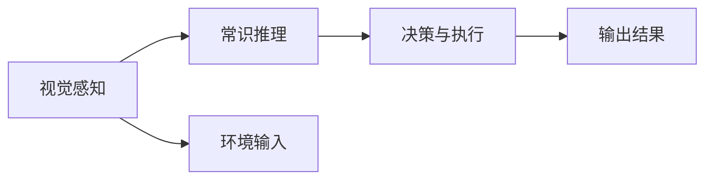
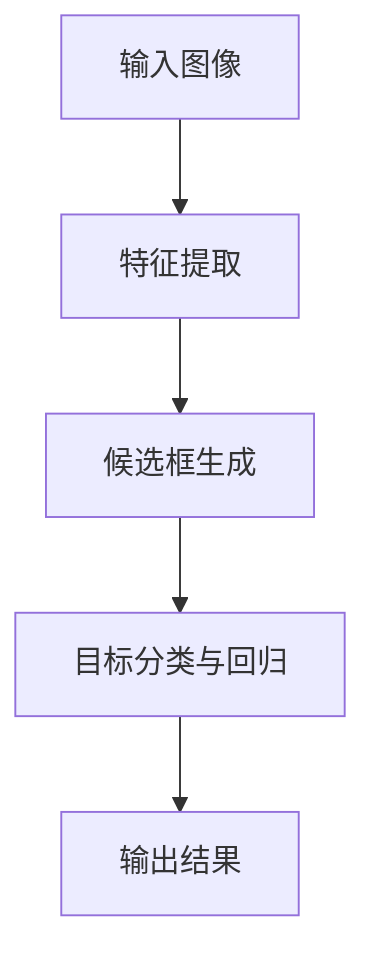
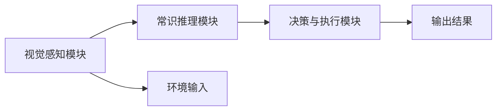
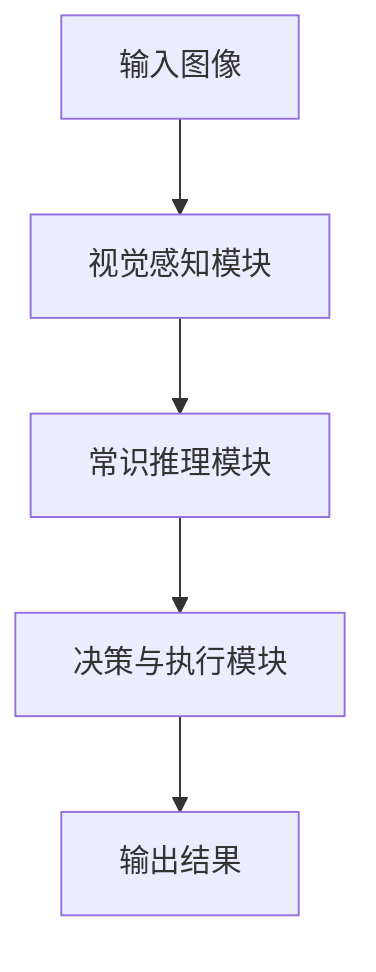

                 


# 开发具有视觉常识推理能力的AI Agent

> 关键词：AI Agent, 视觉常识推理, 人工智能, 计算机视觉, 视觉感知, 常识推理

> 摘要：  
本文详细探讨了开发具有视觉常识推理能力的AI Agent的关键技术与实现方法。从问题背景到解决方案，从核心概念到算法原理，从系统架构到项目实战，全面解析了AI Agent在视觉常识推理领域的开发过程。本文旨在为开发者提供理论指导和实践参考，帮助他们更好地理解和实现具有视觉常识推理能力的AI Agent。

---

# 第一部分: 开发具有视觉常识推理能力的AI Agent概述

# 第1章: 背景介绍

## 1.1 问题背景

### 1.1.1 视觉常识推理的定义
视觉常识推理是指AI Agent能够通过视觉感知获取信息，并结合常识知识进行推理和理解的能力。这种能力使AI Agent能够理解图像中的场景、物体及其关系，并基于这些信息做出合理的决策。

### 1.1.2 当前AI Agent的局限性
尽管AI Agent在许多领域取得了显著进展，但大多数AI Agent仍依赖于规则或特定任务的数据，缺乏对视觉信息的深度理解和常识推理能力。例如，在复杂的视觉场景中，AI Agent往往无法理解物体之间的关系或场景的整体含义。

### 1.1.3 视觉常识推理的重要性
视觉常识推理是实现通用AI Agent的重要组成部分。通过结合视觉感知和常识推理，AI Agent能够更好地理解真实世界中的复杂场景，并在多个领域（如机器人、自动驾驶、智能助手等）中展现出更强的实用价值。

## 1.2 问题描述

### 1.2.1 AI Agent在视觉任务中的挑战
AI Agent在视觉任务中面临的主要挑战包括：
1. 复杂场景下的目标识别和语义理解。
2. 常识知识的表示与推理。
3. 视觉感知与常识推理的高效结合。

### 1.2.2 视觉常识推理的核心问题
视觉常识推理的核心问题在于如何将视觉感知信息与常识知识有效结合，并通过推理得出有意义的结果。这需要解决以下关键问题：
1. 如何从图像中提取有效的视觉特征？
2. 如何表示和推理常识知识？
3. 如何将视觉信息与常识知识进行高效匹配？

### 1.2.3 问题解决的必要性
解决视觉常识推理问题的必要性体现在以下几个方面：
1. 提升AI Agent在复杂场景中的理解和决策能力。
2. 为实现更通用的AI Agent奠定基础。
3. 在实际应用中（如机器人、自动驾驶等）提高系统的实用性和智能化水平。

## 1.3 问题解决

### 1.3.1 视觉常识推理的解决方案
视觉常识推理的解决方案通常包括以下几个步骤：
1. **视觉感知**：通过计算机视觉技术（如目标检测、语义分割等）从图像中提取视觉特征。
2. **常识推理**：基于常识知识库（如知识图谱）对提取的视觉特征进行推理，理解场景中的物体关系和语义信息。
3. **决策与执行**：根据推理结果生成决策，并通过执行模块实现目标。

### 1.3.2 AI Agent的开发目标
AI Agent的开发目标是实现一个能够通过视觉感知获取信息，并结合常识推理进行决策和执行的智能系统。具体目标包括：
1. 提供高效的视觉感知能力。
2. 实现强大的常识推理能力。
3. 在实际场景中实现高效的决策与执行。

### 1.3.3 边界与外延

- **边界**：
  - 仅限于视觉信息的处理，不涉及听觉、触觉等其他感知方式。
  - 仅限于常识推理，不涉及复杂的情感或意图推理。
- **外延**：
  - 可与其他感知方式结合，形成更全面的感知能力。
  - 可与其他推理方法结合，实现更复杂的推理能力。

## 1.4 核心要素组成

### 1.4.1 视觉感知模块
视觉感知模块负责从图像中提取视觉特征，通常包括目标检测、语义分割、图像识别等功能。常用的算法包括Faster R-CNN、Mask R-CNN等。

### 1.4.2 常识推理模块
常识推理模块负责基于常识知识对视觉特征进行推理，理解场景中的物体关系和语义信息。常用的知识表示方法包括知识图谱（如ConceptNet、Wikidata）和逻辑推理方法（如基于规则的推理、概率推理等）。

### 1.4.3 决策与执行模块
决策与执行模块负责根据推理结果生成决策，并通过执行模块实现目标。常用的决策方法包括基于规则的决策、基于强化学习的决策等。

---

# 第二部分: 核心概念与联系

# 第2章: 视觉常识推理的核心概念

## 2.1 视觉感知与常识推理的联系

### 2.1.1 视觉感知的定义与特点
视觉感知是指通过计算机视觉技术从图像中提取视觉特征的过程。其特点包括：
1. **高效性**：通过深度学习模型快速提取特征。
2. **准确性**：通过模型优化和数据增强提高识别精度。
3. **多样性**：能够处理多种类型的视觉任务（如目标检测、语义分割等）。

### 2.1.2 常识推理的定义与特点
常识推理是指基于常识知识对信息进行推理的过程。其特点包括：
1. **广泛性**：涵盖丰富的常识知识。
2. **推理能力**：能够基于知识进行逻辑推理。
3. **动态性**：能够动态更新和扩展知识库。

### 2.1.3 两者结合的必要性
视觉感知和常识推理的结合是实现视觉常识推理的核心。通过视觉感知获取图像信息，结合常识推理理解场景含义，AI Agent能够更好地理解和处理复杂场景。

## 2.2 常识推理的属性特征对比

| **属性**       | **视觉感知**                     | **常识推理**                     |
|----------------|---------------------------------|---------------------------------|
| **输入**       | 图像、视频等视觉数据             | 文本、知识图谱等结构化数据       |
| **输出**       | 视觉特征、目标检测结果           | 场景描述、关系推理结果           |
| **依赖性**     | 依赖于视觉数据的准确性           | 依赖于知识库的全面性和准确性     |
| **计算复杂度** | 较高（涉及大量图像处理）         | 中等（依赖于知识推理的复杂性）   |

## 2.3 实体关系图架构



---

# 第三部分: 算法原理讲解

# 第3章: 视觉感知算法

## 3.1 视觉感知算法概述

### 3.1.1 目标检测算法
目标检测算法用于从图像中检测出感兴趣的目标，并确定其位置和类别。常用的算法包括Faster R-CNN、YOLO、SSD等。

### 3.1.2 语义分割算法
语义分割算法用于对图像中的每个像素进行分类，确定其所属的语义类别。常用的算法包括U-Net、Mask R-CNN等。

### 3.1.3 图像识别算法
图像识别算法用于对图像进行整体分类，确定其所属的类别。常用的算法包括ResNet、Inception、MobileNet等。

## 3.2 基于深度学习的目标检测

### 3.2.1 Faster R-CNN算法流程
Faster R-CNN算法流程如下：
1. **特征提取**：通过卷积基（如ResNet）提取图像特征。
2. **候选框生成**：通过区域建议网络（RPN）生成候选框。
3. **目标分类与回归**：对每个候选框进行目标分类和位置回归。
4. **输出结果**：输出检测结果，包括目标类别、位置和置信度。



### 3.2.2 代码实现
以下是Faster R-CNN的Python代码示例：

```python
import torch
from torchvision.models import resnet

def build_feature_extractor():
    # 使用ResNet作为卷积基
    backbone = resnet.resnet50(pretrained=True)
    return backbone

def build_rpn():
    # 区域建议网络（RPN）
    in_channels = 1024
    out_channels = 512
    return torch.nn.Sequential(
        torch.nn.Conv2d(in_channels, out_channels, kernel_size=3, padding=1),
        torch.nn.ReLU(),
        torch.nn.Conv2d(out_channels, out_channels, kernel_size=1)
    )

def build_classifier(num_classes):
    # 目标分类与回归头
    in_channels = 512
    return torch.nn.Sequential(
        torch.nn.Conv2d(in_channels, in_channels, kernel_size=1),
        torch.nn.ReLU(),
        torch.nn.Conv2d(in_channels, num_classes * 4, kernel_size=1)
    )

# 示例代码
feature_extractor = build_feature_extractor()
rpn = build_rpn()
classifier = build_classifier(10)
```

### 3.2.3 数学模型与公式
Faster R-CNN的目标检测模型通常使用以下数学公式进行目标分类和回归：

- **目标分类**：使用softmax函数进行分类，损失函数为交叉熵损失：
  $$ L_{cls} = -\sum_{i=1}^{n} y_i \log(p_i) $$
  其中，\( y_i \) 是标签，\( p_i \) 是预测概率。

- **目标回归**：使用均方误差损失：
  $$ L_{reg} = \frac{1}{2} \sum_{i=1}^{n} (y_i - p_i)^2 $$

  其中，\( y_i \) 是真实值，\( p_i \) 是预测值。

## 3.3 常识推理算法

### 3.3.1 基于知识图谱的推理
基于知识图谱的推理是通过知识图谱中的实体和关系进行推理。常用的知识图谱包括ConceptNet、Wikidata等。

### 3.3.2 基于逻辑推理的算法
基于逻辑推理的算法包括规则推理、演绎推理、归纳推理等。例如，通过谓词逻辑进行推理：
$$ \text{如果} \ A \text{是} B \text{的子类，那么} A \text{具有} B \text{的所有属性} $$

---

# 第四部分: 系统分析与架构设计

# 第4章: 系统分析与架构设计

## 4.1 问题场景介绍
在本项目中，我们将开发一个具有视觉常识推理能力的AI Agent，用于实现图像中的目标检测和常识推理。

## 4.2 项目介绍
本项目的目标是开发一个能够通过视觉感知获取信息，并结合常识推理进行决策和执行的智能系统。

## 4.3 系统功能设计

### 4.3.1 领域模型
以下是领域模型的Mermaid图：



### 4.3.2 系统架构
以下是系统架构的Mermaid图：


### 4.3.3 接口设计
系统接口设计包括：
1. 视觉感知模块接口：接收图像输入，输出视觉特征。
2. 常识推理模块接口：接收视觉特征，输出推理结果。
3. 决策与执行模块接口：接收推理结果，输出执行指令。

### 4.3.4 交互流程
以下是交互流程的Mermaid图：



---

# 第五部分: 项目实战

# 第5章: 项目实战

## 5.1 环境安装
以下是项目所需的环境安装步骤：
1. 安装Python和相关库（如TensorFlow、PyTorch、OpenCV等）。
2. 安装深度学习框架（如TensorFlow或PyTorch）。
3. 安装知识图谱库（如NetworkX、Ubergraph等）。

## 5.2 系统核心实现

### 5.2.1 视觉感知模块实现
以下是视觉感知模块的Python代码示例：

```python
import cv2

def detect_objects(image_path):
    # 加载图像
    image = cv2.imread(image_path)
    # 转换为RGB格式
    image = cv2.cvtColor(image, cv2.COLOR_BGR2RGB)
    # 使用预训练模型进行目标检测
    model = load_model()  # 假设已经定义了load_model函数
    predictions = model.predict(image)
    return predictions

# 示例调用
detect_objects("input_image.jpg")
```

### 5.2.2 常识推理模块实现
以下是常识推理模块的Python代码示例：

```python
from networkx import knowledge_graph

def infer_meaning(features):
    # 加载知识图谱
    kg = knowledge_graph.load("knowledge_graph.nt")
    # 基于特征进行推理
    result = knowledge_graph.infer(kg, features)
    return result

# 示例调用
infer_meaning(features)
```

## 5.3 代码应用解读与分析
以下是代码的解读与分析：
1. **视觉感知模块**：通过OpenCV加载图像，使用预训练模型进行目标检测。
2. **常识推理模块**：加载知识图谱，基于提取的视觉特征进行推理。

## 5.4 实际案例分析

### 5.4.1 案例描述
假设我们有一个图像，其中包含一个人、桌子和书本。AI Agent需要通过视觉感知模块检测出这些物体，并通过常识推理模块推理出它们之间的关系（如人坐在桌子旁，桌子上有书本）。

### 5.4.2 详细讲解
1. **视觉感知模块**：检测出图像中的物体（人、桌子、书本）。
2. **常识推理模块**：推理出物体之间的关系（人坐在桌子旁，桌子上有书本）。
3. **决策与执行模块**：根据推理结果生成相应的决策（如提醒用户整理书本）。

## 5.5 项目小结
通过本项目的实战，我们实现了具有视觉常识推理能力的AI Agent，验证了算法的有效性和系统的可行性。

---

# 第六部分: 最佳实践

# 第6章: 最佳实践

## 6.1 小结
通过本文的详细讲解和实战案例，我们全面介绍了开发具有视觉常识推理能力的AI Agent的关键技术与实现方法。

## 6.2 注意事项
1. **数据质量**：确保视觉感知和常识推理的数据质量。
2. **模型优化**：不断优化模型的性能，提高准确性和效率。
3. **知识库构建**：构建全面且准确的知识库，提升推理能力。

## 6.3 拓展阅读
1. 《Deep Learning》—— Ian Goodfellow
2. 《Pattern Recognition and Machine Learning》—— Christopher M. Bishop
3. 《Knowledge Representation and Reasoning》—— Richard Ernest Brach

---

通过本文的系统讲解和实践案例，我们希望能够为开发者提供宝贵的理论指导和实践参考，帮助他们更好地理解和实现具有视觉常识推理能力的AI Agent。

