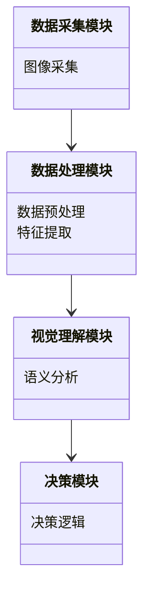
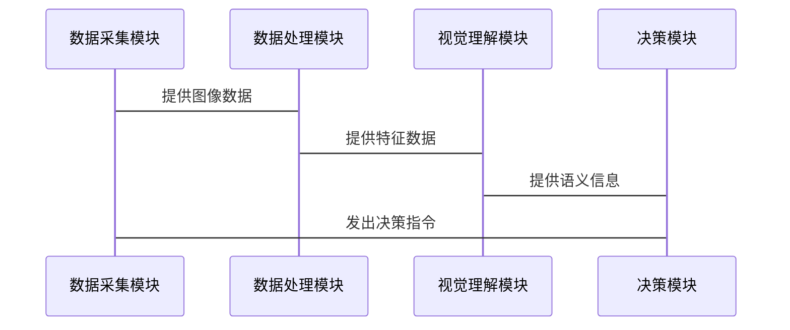

                 


# 开发具有视觉理解能力的AI Agent

> 关键词：AI Agent、视觉理解、计算机视觉、深度学习、目标检测

> 摘要：本文将详细探讨如何开发具有视觉理解能力的AI Agent。从AI Agent的基本概念到视觉理解的核心原理，从算法实现到系统架构设计，再到项目实战，我们将一步步解析开发具有视觉理解能力的AI Agent所需的关键技术和实现细节。通过本文，读者将能够全面理解AI Agent视觉理解的能力构建过程，并掌握相关的核心技术与实践方法。

---

## 第1章 AI Agent与视觉理解概述

### 1.1 AI Agent的基本概念
#### 1.1.1 什么是AI Agent
AI Agent（人工智能代理）是指能够感知环境、自主决策并执行任务的智能体。AI Agent可以是软件程序，也可以是硬件设备，其核心目标是通过与环境交互来实现特定任务。

#### 1.1.2 AI Agent的核心特征
- **自主性**：能够在没有外部干预的情况下独立运行。
- **反应性**：能够实时感知环境并做出反应。
- **目标导向**：基于目标进行决策和行动。
- **学习能力**：能够通过经验改进自身性能。

#### 1.1.3 视觉理解在AI Agent中的作用
视觉理解是AI Agent与现实世界交互的关键能力。通过视觉理解，AI Agent能够识别和理解图像、视频等视觉信息，从而更好地完成任务。

### 1.2 视觉理解的基本概念
#### 1.2.1 视觉理解的定义
视觉理解是指计算机通过对图像、视频等视觉数据的处理，理解数据中的语义信息，例如物体识别、场景理解等。

#### 1.2.2 视觉理解的关键技术
- **目标检测**：识别图像中的目标物体及其位置。
- **图像分割**：将图像划分为不同区域，识别每个区域的语义信息。
- **目标跟踪**：跟踪目标物体在视频中的运动轨迹。
- **语义理解**：理解图像或视频的整体语义信息。

#### 1.2.3 视觉理解的应用场景
- **自动驾驶**：通过视觉理解识别道路、车辆和行人。
- **智能安防**：通过视觉理解进行人脸识别、行为分析。
- **机器人控制**：通过视觉理解指导机器人完成复杂任务。

### 1.3 AI Agent与视觉理解的结合
#### 1.3.1 AI Agent中的视觉理解需求
AI Agent需要通过视觉理解感知环境，例如识别物体、理解场景语义等。

#### 1.3.2 视觉理解如何增强AI Agent的能力
视觉理解使AI Agent能够更准确地感知环境，从而做出更智能的决策。

#### 1.3.3 当前AI Agent视觉理解的发展现状
视觉理解技术在AI Agent中的应用正在快速发展，但仍面临一些挑战，例如复杂场景下的理解能力不足。

### 1.4 本章小结
本章从AI Agent的基本概念出发，介绍了视觉理解的核心概念及其在AI Agent中的作用，并展望了当前的发展现状。

---

## 第2章 AI Agent视觉理解的核心原理

### 2.1 AI Agent的感知层
#### 2.1.1 视觉感知的输入形式
AI Agent的视觉感知通常通过摄像头、传感器等设备获取图像或视频数据。

#### 2.1.2 视觉感知的处理流程
1. 数据采集：通过摄像头获取视觉数据。
2. 数据预处理：对图像进行增强、降噪等处理。
3. 特征提取：提取图像的关键特征，例如边缘、纹理等。

#### 2.1.3 视觉感知的关键技术
- **图像增强**：提高图像质量的技术，例如对比度增强、去噪等。
- **特征提取**：通过卷积神经网络（CNN）提取图像特征。

### 2.2 AI Agent的理解层
#### 2.2.1 视觉理解的模型构建
视觉理解通常基于深度学习模型，例如卷积神经网络（CNN）和Transformer模型。

#### 2.2.2 视觉理解的特征提取
特征提取是视觉理解的关键步骤，常用的特征包括图像的纹理、形状等。

#### 2.2.3 视觉理解的语义分析
语义分析通过理解图像中的语义信息，例如物体类别、场景描述等。

### 2.3 AI Agent的决策层
#### 2.3.1 视觉理解在决策中的作用
视觉理解为AI Agent的决策提供语义信息，例如在自动驾驶中识别交通信号灯。

#### 2.3.2 基于视觉理解的决策算法
决策算法通常基于强化学习（Reinforcement Learning）或监督学习（Supervised Learning）。

#### 2.3.3 决策层与理解层的交互机制
决策层根据理解层提供的语义信息做出决策，例如在自动驾驶中识别红绿灯并做出停车或行驶的决策。

### 2.4 核心概念对比表
| 概念       | 属性             | 描述                             |
|------------|------------------|----------------------------------|
| 视觉感知    | 输入形式         | 图像、视频等                     |
| 视觉理解    | 特征提取         | 提取图像特征                     |
| 视觉理解    | 语义分析         | 理解图像语义                     |
| AI Agent    | 决策能力         | 根据语义信息做出决策             |

---

## 第3章 AI Agent视觉理解的算法实现

### 3.1 目标检测算法
#### 3.1.1 目标检测的定义
目标检测是指在图像中检测出目标物体的位置和类别。

#### 3.1.2 目标检测算法流程
1. 数据预处理：图像 resizing、归一化等。
2. 特征提取：使用CNN提取图像特征。
3. 检测器：基于特征进行目标检测。

#### 3.1.3 目标检测算法实现
```python
import tensorflow as tf
from tensorflow.keras import layers

model = tf.keras.Sequential([
    layers.Conv2D(32, (3,3), activation='relu', input_shape=(224, 224, 3)),
    layers.MaxPooling2D((2,2)),
    layers.Conv2D(64, (3,3), activation='relu'),
    layers.MaxPooling2D((2,2)),
    layers.Flatten(),
    layers.Dense(128, activation='relu'),
    layers.Dense(10, activation='softmax')
])
```

#### 3.1.4 目标检测的数学模型
目标检测的损失函数通常包括分类损失和定位损失：
$$ \text{损失函数} = \text{分类损失} + \text{定位损失} $$

### 3.2 图像分割算法
#### 3.2.1 图像分割的定义
图像分割是指将图像划分为多个区域，每个区域对应不同的语义类别。

#### 3.2.2 图像分割算法流程
1. 数据预处理：图像 resizing、归一化等。
2. 特征提取：使用CNN提取图像特征。
3. 分割器：基于特征进行图像分割。

#### 3.2.3 图像分割算法实现
```python
import tensorflow as tf
from tensorflow.keras import layers

model = tf.keras.Sequential([
    layers.Conv2D(64, (3,3), activation='relu', input_shape=(224, 224, 3)),
    layers.MaxPooling2D((2,2)),
    layers.Conv2D(128, (3,3), activation='relu'),
    layers.MaxPooling2D((2,2)),
    layers.Conv2D(256, (3,3), activation='relu'),
    layers.UpSampling2D((2,2)),
    layers.Conv2DTranspose(128, (3,3), activation='relu'),
    layers.UpSampling2D((2,2)),
    layers.Conv2DTranspose(64, (3,3), activation='relu'),
    layers.Conv2D(10, (1,1), activation='softmax')
])
```

#### 3.2.4 图像分割的数学模型
图像分割通常使用交叉熵损失函数：
$$ \text{损失函数} = -\sum_{i=1}^{N} \sum_{j=1}^{M} y_{ij} \log(p_{ij}) $$

---

## 第4章 AI Agent视觉理解的系统架构设计

### 4.1 问题场景介绍
本节将介绍AI Agent视觉理解的典型应用场景，例如自动驾驶、智能安防等。

### 4.2 系统功能设计
#### 4.2.1 系统功能模块
- **数据采集模块**：负责采集图像或视频数据。
- **数据处理模块**：对数据进行预处理和特征提取。
- **视觉理解模块**：基于特征进行语义分析。
- **决策模块**：根据语义信息做出决策。

#### 4.2.2 系统功能流程
1. 数据采集模块采集图像数据。
2. 数据处理模块对图像进行预处理和特征提取。
3. 视觉理解模块基于特征进行语义分析。
4. 决策模块根据语义信息做出决策。

#### 4.2.3 领域模型设计


### 4.3 系统架构设计
#### 4.3.1 系统架构图


#### 4.3.2 系统接口设计
- 数据采集模块接口：提供图像数据接口。
- 数据处理模块接口：提供特征提取接口。
- 视觉理解模块接口：提供语义分析接口。
- 决策模块接口：提供决策逻辑接口。

#### 4.3.3 系统交互设计


---

## 第5章 项目实战：开发具有视觉理解能力的AI Agent

### 5.1 环境安装
安装必要的依赖：
```bash
pip install tensorflow==2.5.0
pip install numpy==1.21.2
pip install matplotlib==3.5.1
```

### 5.2 核心代码实现
#### 5.2.1 目标检测实现
```python
import tensorflow as tf
from tensorflow.keras import layers

model = tf.keras.Sequential([
    layers.Conv2D(32, (3,3), activation='relu', input_shape=(224, 224, 3)),
    layers.MaxPooling2D((2,2)),
    layers.Conv2D(64, (3,3), activation='relu'),
    layers.MaxPooling2D((2,2)),
    layers.Flatten(),
    layers.Dense(128, activation='relu'),
    layers.Dense(10, activation='softmax')
])
```

#### 5.2.2 图像分割实现
```python
import tensorflow as tf
from tensorflow.keras import layers

model = tf.keras.Sequential([
    layers.Conv2D(64, (3,3), activation='relu', input_shape=(224, 224, 3)),
    layers.MaxPooling2D((2,2)),
    layers.Conv2D(128, (3,3), activation='relu'),
    layers.MaxPooling2D((2,2)),
    layers.Conv2D(256, (3,3), activation='relu'),
    layers.UpSampling2D((2,2)),
    layers.Conv2DTranspose(128, (3,3), activation='relu'),
    layers.UpSampling2D((2,2)),
    layers.Conv2DTranspose(64, (3,3), activation='relu'),
    layers.Conv2D(10, (1,1), activation='softmax')
])
```

#### 5.2.3 系统交互实现
```python
class AI_Agent:
    def __init__(self):
        self.data采集模块 = Data采集模块()
        self.data处理模块 = Data处理模块()
        self.视觉理解模块 = 视觉理解模块()
        self.决策模块 = 决策模块()

    def 运行(self):
        while True:
            数据 = self.data采集模块.采集()
            特征 = self.data处理模块.处理(数据)
            语义 = self.视觉理解模块.分析(特征)
            决策 = self.决策模块.决策(语义)
            self.执行决策(决策)
```

### 5.3 实际案例分析
以自动驾驶为例，AI Agent通过视觉理解识别道路、车辆和行人，做出停车或行驶的决策。

### 5.4 项目小结
本章通过实际案例展示了如何开发具有视觉理解能力的AI Agent，详细讲解了环境安装、核心代码实现和系统交互设计。

---

## 第6章 总结与展望

### 6.1 总结
本文详细探讨了开发具有视觉理解能力的AI Agent的关键技术，包括AI Agent的基本概念、视觉理解的核心原理、算法实现、系统架构设计和项目实战。

### 6.2 注意事项
- 在开发AI Agent时，需要注意数据质量和模型泛化能力。
- 需要关注模型的实时性和计算效率。

### 6.3 拓展阅读
- 《Deep Learning》：深入理解深度学习的核心概念。
- 《Computer Vision: Algorithms and Applications》：学习计算机视觉的核心算法。

### 6.4 未来展望
随着深度学习和计算机视觉技术的不断发展，AI Agent的视觉理解能力将更加智能化和多样化。

---

通过本文的详细讲解，读者可以系统地掌握开发具有视觉理解能力的AI Agent所需的核心技术和实现方法。

