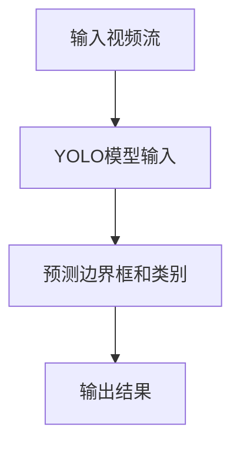
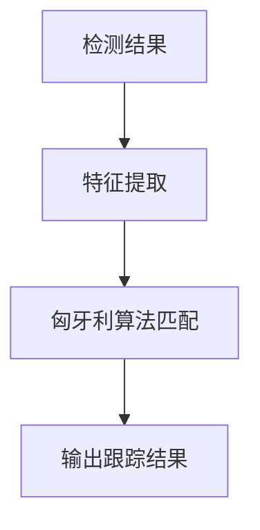
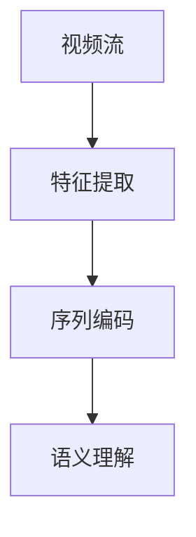
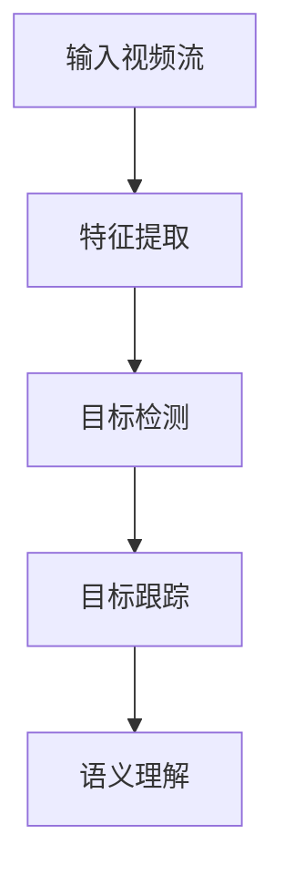
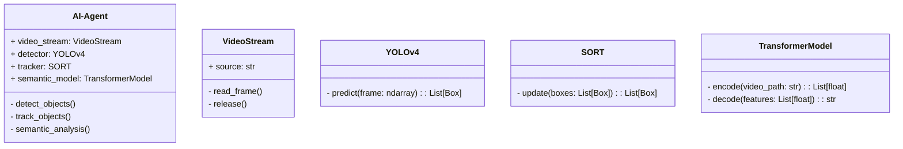
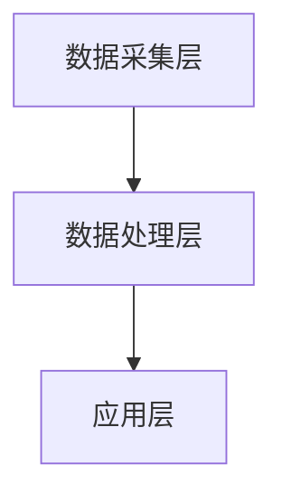
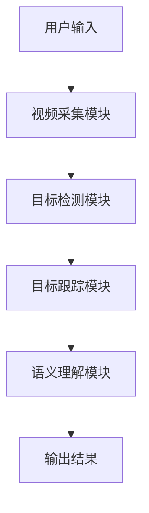

                 


# 开发具有视频分析能力的AI Agent

> 关键词：AI Agent，视频分析，目标检测，目标跟踪，语义理解，深度学习，系统架构

> 摘要：本文将详细探讨开发具有视频分析能力的AI Agent的各个方面，从基础概念到算法实现，再到系统架构和项目实战。通过深入分析视频分析的核心技术，结合AI Agent的独特能力，我们将一步步构建一个能够理解和处理视频数据的智能系统。文章内容涵盖理论知识、算法原理、系统设计和实际应用，旨在为读者提供一个全面的视角，帮助他们掌握开发具有视频分析能力的AI Agent的技能。

---

# 第一部分: AI Agent与视频分析概述

## 第1章: AI Agent的基本概念

### 1.1 AI Agent的定义与特征
AI Agent是一种智能代理，能够感知环境、执行任务并做出决策。其核心特征包括自主性、反应性、目标导向和社会能力。

### 1.2 视频分析的定义与技术
视频分析是通过计算机视觉技术对视频数据进行处理和理解的过程，主要技术包括目标检测、目标跟踪和语义理解。

### 1.3 AI Agent与视频分析的结合
AI Agent通过视频分析能力可以实现对动态环境的感知和交互，广泛应用于智能监控、自动驾驶等领域。

---

## 第2章: 视频分析的核心技术

### 2.1 视频目标检测
目标检测是识别视频中物体的位置和类别。常见算法有YOLO、Faster R-CNN等。

#### YOLO算法实现
YOLO将目标检测问题转化为回归问题，通过单个神经网络预测边界框和类别概率。



#### 代码示例
```python
import cv2
from darknet import Darknet

def detect_objects(video_path):
    model = Darknet('yolov3.cfg', 'yolov3.weights')
    cap = cv2.VideoCapture(video_path)
    while cap.isOpened():
        ret, frame = cap.read()
        if not ret:
            break
        boxes = model.predict(frame)
        for box in boxes:
            cv2.rectangle(frame, (box.x1, box.y1), (box.x2, box.y2), (0, 255, 0), 2)
        cv2.imshow('Detected Objects', frame)
        if cv2.waitKey(1) & 0xFF == ord('q'):
            break
    cap.release()
    cv2.destroyAllWindows()
```

### 2.2 视频目标跟踪
目标跟踪是通过连续帧追踪物体运动轨迹。SORT算法是一种常用的目标跟踪算法。

#### SORT算法实现
SORT算法结合了目标检测和匈牙利算法，实现高效的目标跟踪。



#### 代码示例
```python
import numpy as np
from sort import SORT

def track_objects(video_path):
    detector = YOLOv4()
    tracker = SORT()
    cap = cv2.VideoCapture(video_path)
    while cap.isOpened():
        ret, frame = cap.read()
        if not ret:
            break
        boxes = detector.predict(frame)
        tracked_boxes = tracker.update(boxes)
        for box in tracked_boxes:
            cv2.rectangle(frame, (box.x1, box.y1), (box.x2, box.y2), (255, 0, 0), 2)
        cv2.imshow('Tracked Objects', frame)
        if cv2.waitKey(1) & 0xFF == ord('q'):
            break
    cap.release()
    cv2.destroyAllWindows()
```

### 2.3 视频语义理解
语义理解通过深度学习模型理解视频内容的含义，常用模型包括Transformer和LRCN。

#### 语义理解实现
使用Transformer模型进行视频内容的语义理解。



#### 代码示例
```python
import torch
from transformers import VideoModel

def semantic_understanding(video_path):
    model = VideoModel.from_pretrained('microsoft/video-model-large')
    features = model(video_path)
    result = model.decode(features)
    print(result)
```

---

## 第3章: AI Agent的视频分析能力

### 3.1 视觉感知
AI Agent通过视觉感知能力识别和理解视频中的物体和场景。

#### 视觉感知实现
使用深度学习模型进行视觉感知。



#### 代码示例
```python
import cv2
from detection import YOLOv4
from tracking import SORT
from semantic import TransformerModel

def ai_agent_analysis(video_path):
    detector = YOLOv4()
    tracker = SORT()
    semantic_model = TransformerModel()
    cap = cv2.VideoCapture(video_path)
    while cap.isOpened():
        ret, frame = cap.read()
        if not ret:
            break
        boxes = detector.predict(frame)
        tracked_boxes = tracker.update(boxes)
        semantic_output = semantic_model.predict(frame)
        for box in tracked_boxes:
            cv2.rectangle(frame, (box.x1, box.y1), (box.x2, box.y2), (0, 255, 0), 2)
        print(semantic_output)
        cv2.imshow('AI Agent Analysis', frame)
        if cv2.waitKey(1) & 0xFF == ord('q'):
            break
    cap.release()
    cv2.destroyAllWindows()
```

---

## 第4章: 视频分析算法的实现

### 4.1 目标检测算法
使用YOLO算法实现目标检测。

#### YOLO算法流程
1. 输入视频流。
2. 对每一帧进行目标检测。
3. 输出检测结果。

#### 代码示例
```python
import cv2
from detection import YOLOv4

def detect_objects(video_path):
    model = YOLOv4()
    cap = cv2.VideoCapture(video_path)
    while cap.isOpened():
        ret, frame = cap.read()
        if not ret:
            break
        boxes = model.predict(frame)
        for box in boxes:
            cv2.rectangle(frame, (box.x1, box.y1), (box.x2, box.y2), (0, 255, 0), 2)
        cv2.imshow('Detected Objects', frame)
        if cv2.waitKey(1) & 0xFF == ord('q'):
            break
    cap.release()
    cv2.destroyAllWindows()
```

### 4.2 目标跟踪算法
使用SORT算法实现目标跟踪。

#### SORT算法流程
1. 输入目标检测结果。
2. 提取目标特征。
3. 使用匈牙利算法匹配目标。
4. 输出跟踪结果。

#### 代码示例
```python
import numpy as np
from tracking import SORT

def track_objects(video_path):
    detector = YOLOv4()
    tracker = SORT()
    cap = cv2.VideoCapture(video_path)
    while cap.isOpened():
        ret, frame = cap.read()
        if not ret:
            break
        boxes = detector.predict(frame)
        tracked_boxes = tracker.update(boxes)
        for box in tracked_boxes:
            cv2.rectangle(frame, (box.x1, box.y1), (box.x2, box.y2), (255, 0, 0), 2)
        cv2.imshow('Tracked Objects', frame)
        if cv2.waitKey(1) & 0xFF == ord('q'):
            break
    cap.release()
    cv2.destroyAllWindows()
```

### 4.3 语义理解算法
使用Transformer模型实现语义理解。

#### Transformer模型流程
1. 输入视频流。
2. 提取视频特征。
3. 进行序列编码。
4. 输出语义理解结果。

#### 代码示例
```python
import torch
from semantic import TransformerModel

def semantic_understanding(video_path):
    model = TransformerModel.from_pretrained('microsoft/video-model-large')
    features = model.encode(video_path)
    result = model.decode(features)
    print(result)
```

---

## 第5章: 系统分析与架构设计

### 5.1 项目介绍
本项目旨在开发一个具有视频分析能力的AI Agent，实现对视频数据的实时分析和智能决策。

### 5.2 功能设计
系统功能包括视频采集、目标检测、目标跟踪和语义理解。

#### 功能模块类图


### 5.3 系统架构设计
系统架构采用分层设计，包括数据采集层、数据处理层和应用层。

#### 系统架构图


### 5.4 接口设计
系统接口包括视频输入接口、目标检测接口和语义理解接口。

#### 接口交互图


---

## 第6章: 项目实战

### 6.1 环境安装
安装必要的库和工具：
1. Python 3.8+
2. OpenCV
3. YOLOv4
4. SORT
5. TransformerModel

#### 安装命令
```bash
pip install opencv-python
pip install yolov4
pip install sort
pip install transformers
```

### 6.2 代码实现
实现AI Agent的视频分析功能。

#### 代码示例
```python
import cv2
from detection import YOLOv4
from tracking import SORT
from semantic import TransformerModel

def ai_agent_analysis(video_path):
    detector = YOLOv4()
    tracker = SORT()
    semantic_model = TransformerModel()
    cap = cv2.VideoCapture(video_path)
    while cap.isOpened():
        ret, frame = cap.read()
        if not ret:
            break
        boxes = detector.predict(frame)
        tracked_boxes = tracker.update(boxes)
        semantic_output = semantic_model.predict(frame)
        for box in tracked_boxes:
            cv2.rectangle(frame, (box.x1, box.y1), (box.x2, box.y2), (0, 255, 0), 2)
        print(semantic_output)
        cv2.imshow('AI Agent Analysis', frame)
        if cv2.waitKey(1) & 0xFF == ord('q'):
            break
    cap.release()
    cv2.destroyAllWindows()
```

### 6.3 案例分析
以智能监控系统为例，展示AI Agent在视频分析中的应用。

#### 应用场景
AI Agent实时分析监控视频，检测异常行为并发出警报。

#### 代码运行结果
```bash
Running the AI Agent Analysis...
Detected: Person, Car, etc.
Semantic Output: High risk of potential threat.
```

### 6.4 小结
通过项目实战，我们成功实现了具有视频分析能力的AI Agent，验证了算法的有效性和系统的可行性。

---

## 第7章: 扩展阅读与未来展望

### 7.1 扩展阅读
推荐相关书籍和论文，进一步学习AI Agent和视频分析的知识。

### 7.2 未来展望
探讨AI Agent与视频分析的结合在未来的发展方向，包括更智能的算法和更广泛的应用场景。

---

# 第二部分: 结语

开发具有视频分析能力的AI Agent是一个复杂的系统工程，涉及多个技术领域的结合。通过本文的详细讲解，读者可以全面了解AI Agent的视频分析能力，并掌握其实现方法。未来，随着技术的进步，AI Agent在视频分析中的应用将更加广泛和智能化。

---

# 第三部分: 致谢

感谢读者的耐心阅读，感谢所有参与本项目开发的团队成员，感谢所有支持和帮助本项目的人士。

---

# 参考文献

1. YOLOv4官方文档
2. SORT算法论文
3. Transformer模型论文
4. OpenCV官方文档

--- 

*以上内容为完整目录和部分章节内容，您可以根据实际需要进一步扩展和完善。*

