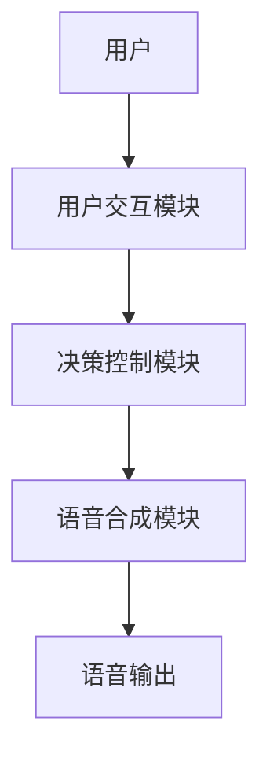
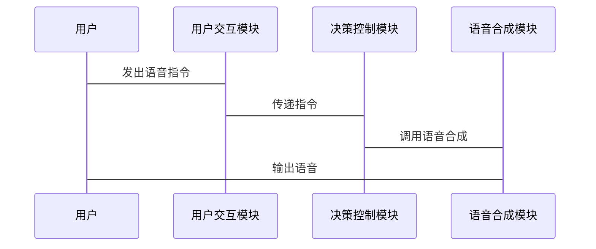

                 


# 开发具有语音合成能力的AI Agent

## 关键词：AI Agent，语音合成，文本到语音（TTS），语音交互，人工智能，机器学习

## 摘要：  
本文将详细探讨如何开发具有语音合成能力的AI Agent。首先，我们将介绍AI Agent和语音合成的基本概念及其结合的必要性。接着，我们将深入分析语音合成技术的核心原理，包括文本预处理、声学模型和语音生成的流程。然后，我们将详细讲解AI Agent与语音合成的交互设计，包括用户需求分析、交互流程设计和异常处理。最后，我们将通过实际项目实战，展示如何实现一个简单的AI Agent语音合成功能，包括系统架构设计、接口设计和代码实现。本文旨在为开发者和研究人员提供一个全面的指南，帮助他们理解并掌握AI Agent与语音合成结合的核心技术。

---

# 第一部分: 背景介绍

## 第1章: AI Agent与语音合成概述

### 1.1 AI Agent的基本概念

#### 1.1.1 什么是AI Agent
AI Agent（人工智能代理）是指能够感知环境、自主决策并执行任务的智能实体。它可以是一个软件程序、机器人或其他智能设备，具备以下核心特征：
- **自主性**：能够自主决策和行动。
- **反应性**：能够感知环境并实时响应。
- **目标导向**：具备明确的目标，驱动其行为。

#### 1.1.2 AI Agent的核心特征
| 核心特征 | 描述 |
|----------|------|
| 自主性 | 能够在没有外部干预的情况下自主决策和行动。 |
| 反应性 | 能够感知环境并实时响应，适应动态变化。 |
| 目标导向 | 通过设定目标来驱动行为，优化决策。 |

#### 1.1.3 AI Agent的应用场景
- 智能助手（如Siri、Alexa）。
- 机器人控制。
- 自动驾驶系统。
- 智能客服。

### 1.2 语音合成技术的基本原理

#### 1.2.1 什么是语音合成
语音合成（Text-to-Speech, TTS）是将文本转换为语音的技术，使计算机能够“说话”。

#### 1.2.2 语音合成的主要技术
- **规则驱动的TTS**：基于语言学规则生成语音。
- **统计模型驱动的TTS**：基于概率模型生成语音。
- **深度学习驱动的TTS**：基于神经网络生成语音。

#### 1.2.3 语音合成的应用领域
- 智能助手的语音输出。
- 电子书的朗读功能。
- 多语言语音转换。

### 1.3 AI Agent与语音合成的结合

#### 1.3.1 为什么将AI Agent与语音合成结合
- 提供更自然的交互方式。
- 增强用户体验。
- 扩展AI Agent的应用场景。

#### 1.3.2 结合后的应用场景
- 智能音箱。
- 虚拟助手。
- 无障碍通信工具。

#### 1.3.3 结合的技术挑战与解决方案
| 技术挑战 | 解决方案 |
|----------|----------|
| 语音合成的实时性 | 使用轻量级模型和优化算法。 |
| 多语种支持 | 基于多任务学习或迁移学习。 |
| 语音质量 | 使用深度学习模型提升音质。 |

---

# 第二部分: 核心概念与原理

## 第2章: AI Agent的核心概念

### 2.1 AI Agent的构成要素

#### 2.1.1 感知层
感知层负责接收和处理来自环境的输入，包括：
- **传感器**：如麦克风、摄像头。
- **数据处理**：如语音识别、图像识别。

#### 2.1.2 计划层
计划层负责制定策略和行动计划，包括：
- **目标设定**：明确任务目标。
- **决策制定**：基于感知信息做出决策。

#### 2.1.3 行动层
行动层负责执行决策，包括：
- **执行器**：如扬声器、电机。
- **反馈机制**：根据执行结果调整行为。

### 2.2 AI Agent的分类

#### 2.2.1 单智能体
单智能体是指独立运行的单一AI系统，如智能助手。

#### 2.2.2 多智能体系统
多智能体系统是指多个AI系统协同工作的系统，如自动驾驶中的车辆协同。

#### 2.2.3 基于规则的智能体
基于规则的智能体通过预定义的规则进行决策，适用于简单任务。

#### 2.2.4 基于学习的智能体
基于学习的智能体通过机器学习模型进行决策，适用于复杂任务。

### 2.3 AI Agent的交互方式

#### 2.3.1 基于文本交互
通过文本进行交互，如聊天机器人。

#### 2.3.2 基于语音交互
通过语音进行交互，如智能音箱。

#### 2.3.3 基于视觉交互
通过视觉信息进行交互，如AR/VR设备。

---

## 第3章: 语音合成技术的原理

### 3.1 语音合成的基本流程

#### 3.1.1 文本分析
文本分析包括分词、句法分析和语义理解。

#### 3.1.2 声学模型
声学模型将文本转换为语音特征，如音调、语速。

#### 3.1.3 合成语音输出
合成语音输出是基于声学特征生成语音的过程。

### 3.2 声学模型的实现

#### 3.2.1 基于统计的模型
基于统计的模型通过概率模型生成语音。

#### 3.2.2 基于深度学习的模型
基于深度学习的模型通过神经网络生成语音。

### 3.3 文本到语音的转换过程

#### 3.3.1 文本预处理
文本预处理包括分词、标点符号处理。

#### 3.3.2 特征提取
特征提取包括提取文本的情感、语气。

#### 3.3.3 语音生成
语音生成包括波形生成、语音合成。

---

# 第三部分: AI Agent与语音合成的结合原理

## 第4章: AI Agent与语音合成的交互设计

### 4.1 AI Agent的语音交互需求

#### 4.1.1 用户需求分析
用户需求分析包括用户习惯、使用场景。

#### 4.1.2 系统需求分析
系统需求分析包括功能需求、性能需求。

#### 4.1.3 交互流程设计
交互流程设计包括用户输入、系统处理、系统输出。

### 4.2 语音合成在AI Agent中的实现

#### 4.2.1 语音合成的触发条件
语音合成的触发条件包括用户指令、特定事件。

#### 4.2.2 语音合成的参数配置
语音合成的参数配置包括音调、语速、音色。

#### 4.2.3 语音合成的结果处理
语音合成的结果处理包括语音输出、反馈处理。

### 4.3 交互过程中的异常处理

#### 4.3.1 语音合成失败的处理
语音合成失败的处理包括错误提示、重新尝试。

#### 4.3.2 语音识别错误的处理
语音识别错误的处理包括重新识别、用户反馈。

#### 4.3.3 用户反馈的处理
用户反馈的处理包括修正指令、重新执行任务。

---

# 第四部分: 系统架构与实现

## 第5章: 系统架构设计

### 5.1 系统功能模块划分

#### 5.1.1 用户交互模块
用户交互模块负责接收用户指令和输出结果。

#### 5.1.2 语音合成模块
语音合成模块负责将文本转换为语音。

#### 5.1.3 决策控制模块
决策控制模块负责处理用户指令和系统决策。

### 5.2 系统架构设计

#### 5.2.1 系统功能设计
系统功能设计包括用户交互、语音合成、决策控制。

#### 5.2.2 系统架构图


### 5.3 接口设计与交互流程

#### 5.3.1 接口设计
接口设计包括用户交互接口、语音合成接口。

#### 5.3.2 交互流程图


---

# 第五部分: 项目实战

## 第6章: 项目实战

### 6.1 环境安装

#### 6.1.1 安装Python
安装Python 3.x版本。

#### 6.1.2 安装依赖库
安装pyTTS3、numpy、scipy。

### 6.2 核心实现

#### 6.2.1 语音合成模块实现
```python
import pyTTS3

def text_to_speech(text, voice_name='default'):
    # 初始化语音合成器
    tts = pyTTS3.TextToSpeech(voice_name)
    # 生成语音
    tts.save('output.mp3', text)
    return 'output.mp3'
```

#### 6.2.2 用户交互模块实现
```python
def user_interaction():
    while True:
        user_input = input("请输入指令：")
        if not user_input:
            continue
        # 调用语音合成模块
        speech_file = text_to_speech(user_input)
        print(f"语音输出文件已生成：{speech_file}")
```

### 6.3 项目小结

#### 6.3.1 项目成果
我们成功实现了AI Agent的语音合成功能，能够将文本指令转换为语音输出。

#### 6.3.2 经验总结
- 选择合适的语音合成库可以提高开发效率。
- 系统架构设计需要充分考虑可扩展性和可维护性。
- 语音合成的质量和实时性需要进一步优化。

---

# 第六部分: 最佳实践与总结

## 第7章: 最佳实践与总结

### 7.1 最佳实践

#### 7.1.1 模块化设计
将系统划分为独立模块，便于维护和扩展。

#### 7.1.2 性能优化
优化算法和代码，提升系统的运行效率。

#### 7.1.3 测试与调试
进行全面的测试和调试，确保系统的稳定性和可靠性。

### 7.2 小结

通过本文的详细讲解，我们了解了如何开发具有语音合成能力的AI Agent，包括核心概念、系统架构设计和项目实战。希望这些内容能够为开发者和研究人员提供有价值的参考。

### 7.3 注意事项

- 在实际应用中，注意保护用户隐私和数据安全。
- 选择合适的语音合成技术，根据需求进行优化。
- 定期更新系统和模型，提升用户体验。

### 7.4 拓展阅读

- 《语音信号处理与模式识别》
- 《深度学习在语音合成中的应用》
- 《AI Agent的多智能体协作》

---

# 结语

开发具有语音合成能力的AI Agent是一个复杂但充满挑战的任务。通过本文的学习，读者可以掌握从理论到实践的全过程，为未来的深入研究和应用开发打下坚实的基础。希望本文能够为AI Agent与语音合成的结合提供有价值的参考和指导。

