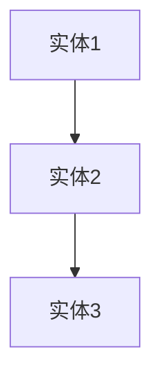
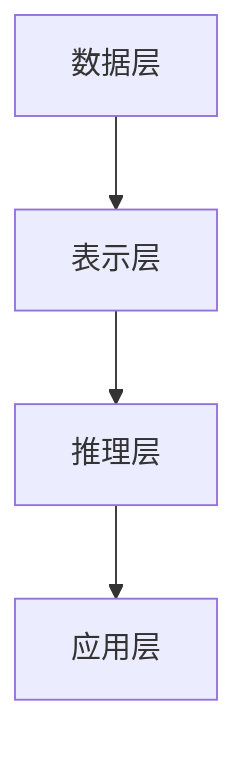

                 


```markdown
# 开发具有跨域知识推理能力的AI Agent

> 关键词：跨域知识推理、AI Agent、知识图谱、符号逻辑、深度学习、多模态数据

> 摘要：跨域知识推理是人工智能领域的重要研究方向，旨在使AI Agent能够整合和推理跨领域知识。本文从理论基础、算法原理、系统架构到项目实现，详细探讨了开发具有跨域知识推理能力的AI Agent的全过程，结合实际案例和最佳实践，为读者提供全面的指导。

---

## 第1章 跨域知识推理与AI Agent的背景介紹

### 1.1 跨域知识推理的定义与背景

#### 1.1.1 知识推理的定义
知识推理是指通过已有知识进行逻辑推理，得出新的结论的过程。跨域知识推理则是在不同领域之间进行知识整合和推理。

#### 1.1.2 跨域知识推理的背景与意义
随着AI技术的发展，AI Agent需要处理的任务越来越复杂，涉及多个领域知识的整合和推理成为必然趋势。

#### 1.1.3 AI Agent的核心概念与作用
AI Agent是一种能够感知环境、自主决策并执行任务的智能实体，跨域知识推理能力是其核心能力之一。

### 1.2 跨域知识推理的实现方式

#### 1.2.1 知识图谱与符号逻辑推理
知识图谱是一种结构化的知识表示方式，符号逻辑推理则通过规则进行推理。

#### 1.2.2 基于深度学习的跨域知识整合
深度学习模型能够自动学习跨领域知识的关联性。

#### 1.2.3 跨域知识推理的挑战与解决方案
跨领域知识的语义差异和数据孤岛是主要挑战，解决方案包括知识图谱对齐和多模态数据融合。

### 1.3 跨域知识推理的应用场景

#### 1.3.1 智能问答系统
支持多领域问题的智能问答。

#### 1.3.2 自然语言理解与生成
提升AI Agent的语言理解和生成能力。

#### 1.3.3 多领域任务处理
处理涉及多个领域的复杂任务。

### 1.4 本章小结
跨域知识推理是AI Agent的核心能力，通过整合多领域知识，能够处理更复杂的任务。

---

## 第2章 跨域知识推理的核心原理

### 2.1 跨域知识推理的模型架构

#### 2.1.1 知识表示模型
知识图谱是一种常用的表示方式，使用节点和边表示实体及其关系。



#### 2.1.2 图神经网络在知识推理中的应用
图神经网络通过节点之间的关系进行信息传播和特征提取。

#### 2.1.3 符号逻辑推理与深度学习的结合
将符号逻辑推理与深度学习模型结合，提升推理能力。

### 2.2 跨域知识推理的关键技术

#### 2.2.1 知识图谱构建与整合
通过数据抽取和知识对齐技术，构建跨领域的知识图谱。

#### 2.2.2 跨域实体关联发现
发现不同领域实体之间的关联关系。

#### 2.2.3 多模态知识融合
整合文本、图像等多种模态的数据，提升推理能力。

### 2.3 跨域知识推理的数学模型

#### 2.3.1 知识表示的向量空间模型
使用向量表示实体和关系，向量空间模型如下：

$$
E = \{e_1, e_2, ..., e_n\}
$$

其中，$e_i$表示第i个实体的向量表示。

#### 2.3.2 图结构数据的表示学习
通过图神经网络进行节点嵌入学习：

$$
h_i = \text{aggregate}(\{h_j | j \in N(i)\})
$$

其中，$N(i)$表示节点i的邻居节点集合。

#### 2.3.3 跨域推理的联合概率模型
联合概率模型将跨领域知识整合到一个概率框架中：

$$
P(y|x) = \prod_{k=1}^n P(y_k|x, y_{k-1})
$$

---

## 第3章 跨域知识推理的算法原理

### 3.1 图神经网络在知识推理中的应用

#### 3.1.1 图神经网络的基本原理
图神经网络通过聚合邻居节点的信息来更新当前节点的表示。

#### 3.1.2 图注意力机制
使用注意力机制捕获重要节点的信息：

$$
\alpha_{ij} = \text{softmax}(\frac{q_i^T k_j}{\sqrt{d}})
$$

#### 3.1.3 图结构数据的表示学习
通过多次迭代优化节点表示，提升推理能力。

### 3.2 符号逻辑推理与深度学习的结合

#### 3.2.1 符号逻辑推理的基本原理
符号逻辑推理基于规则进行推导，如：

$$
P \rightarrow Q \\
Q \rightarrow R \\
\therefore P \rightarrow R
$$

#### 3.2.2 深度学习在逻辑推理中的应用
将逻辑规则嵌入到深度学习模型中，提升推理的灵活性。

#### 3.2.3 跨域推理的联合优化方法
结合符号逻辑和深度学习的优势，进行联合优化。

### 3.3 跨域知识推理的算法实现

#### 3.3.1 基于图神经网络的跨域推理算法
实现步骤如下：

1. 构建跨领域知识图谱。
2. 使用图神经网络进行节点表示学习。
3. 基于节点表示进行跨域推理。

#### 3.3.2 基于符号逻辑的跨域推理算法
实现步骤如下：

1. 建立跨域知识规则库。
2. 使用符号逻辑推理引擎进行推理。
3. 输出推理结果。

#### 3.3.3 跨域推理算法的对比与优化
对比图神经网络和符号逻辑推理的优缺点，提出联合优化策略。

---

## 第4章 跨域知识推理系统的架构设计

### 4.1 系统功能设计

#### 4.1.1 知识图谱构建模块
负责构建和维护跨领域知识图谱。

#### 4.1.2 跨域推理引擎模块
负责接收输入，执行跨域推理并返回结果。

#### 4.1.3 多模态数据处理模块
处理多种模态的数据，如文本、图像等。

### 4.2 系统架构设计

#### 4.2.1 分层架构设计
分层架构包括数据层、表示层、推理层和应用层。



#### 4.2.2 模块间的接口设计
定义模块之间的接口，确保模块间高效协作。

#### 4.2.3 系统的可扩展性设计
设计模块化架构，方便后续扩展和维护。

### 4.3 系统交互设计

#### 4.3.1 用户输入与输出设计
设计友好的用户界面，方便用户输入和结果查看。

#### 4.3.2 系统反馈机制设计
系统根据推理结果提供反馈，支持用户进一步操作。

#### 4.3.3 多用户交互场景设计
支持多用户同时使用系统，保证系统的稳定性和响应速度。

---

## 第5章 跨域知识推理项目的环境与核心实现

### 5.1 环境配置

#### 5.1.1 开发环境的选择
推荐使用Python 3.8及以上版本，安装必要的依赖库。

#### 5.1.2 依赖库的安装
安装`networkx`, `numpy`, `tensorflow`等库。

#### 5.1.3 知识图谱数据的准备
收集和整理跨领域的知识数据，构建知识图谱。

### 5.2 核心代码实现

#### 5.2.1 知识图谱构建代码
使用`networkx`构建知识图谱：

```python
import networkx as nx

G = nx.DiGraph()
G.add_edge('实体1', '实体2')
G.add_edge('实体2', '实体3')
```

#### 5.2.2 跨域推理引擎代码
实现基于图神经网络的推理引擎：

```python
class GraphNN:
    def __init__(self):
        # 初始化网络参数
        pass
    
    def forward(self, graph):
        # 前向传播
        pass
    
    def infer(self, query):
        # 推理
        pass
```

#### 5.2.3 多模态数据处理代码
处理多模态数据，如文本和图像：

```python
import tensorflow as tf

def process_image(image):
    # 图像处理
    pass

def process_text(text):
    # 文本处理
    pass
```

### 5.3 代码解读与分析

#### 5.3.1 知识图谱构建代码解读
使用`networkx`构建知识图谱，便于后续推理。

#### 5.3.2 跨域推理引擎代码解读
基于图神经网络的推理引擎，实现跨域推理。

#### 5.3.3 多模态数据处理代码解读
处理多模态数据，提升系统的综合推理能力。

### 5.4 案例分析

#### 5.4.1 案例场景
假设有一个跨医疗和法律领域的推理任务。

#### 5.4.2 代码实现与结果展示
展示代码实现过程和推理结果。

#### 5.4.3 问题分析与优化
分析案例中的问题，提出优化方向。

### 5.5 项目小结
总结项目的实现过程，提出改进建议。

---

## 第6章 跨域知识推理的最佳实践与小结

### 6.1 最佳实践

#### 6.1.1 知识图谱的构建与维护
建议使用标准化的方法构建知识图谱。

#### 6.1.2 算法的选择与优化
根据具体任务选择合适的算法，并进行优化。

#### 6.1.3 系统的可扩展性设计
设计模块化架构，便于后续扩展和维护。

### 6.2 小结

跨域知识推理是一项复杂但重要的技术，通过本文的探讨，读者可以系统地了解其核心原理和实现方法。未来的研究可以进一步优化算法和系统架构，推动AI Agent的发展。

---

## 总结

本文详细探讨了开发具有跨域知识推理能力的AI Agent的全过程，从理论基础到算法实现，再到系统架构和项目实战，为读者提供了全面的指导。通过本文的学习，读者可以掌握跨域知识推理的核心技术，并将其应用于实际项目中。

---

* END *
```

