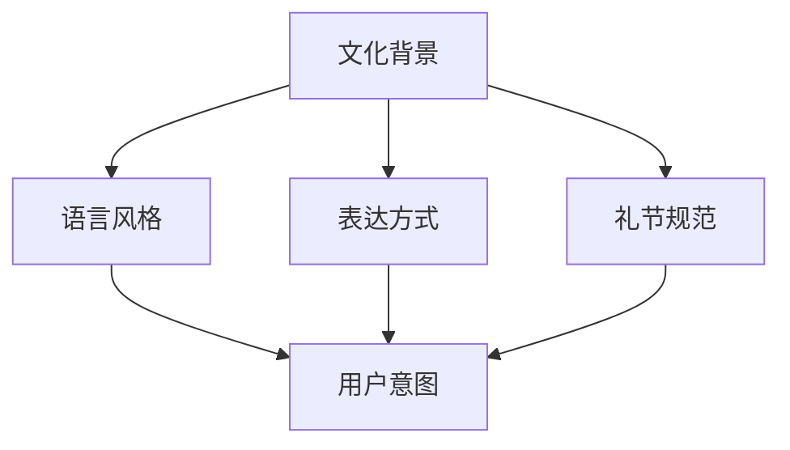
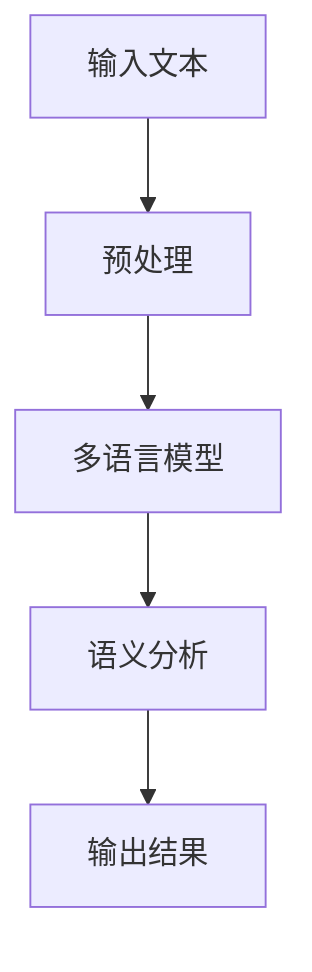
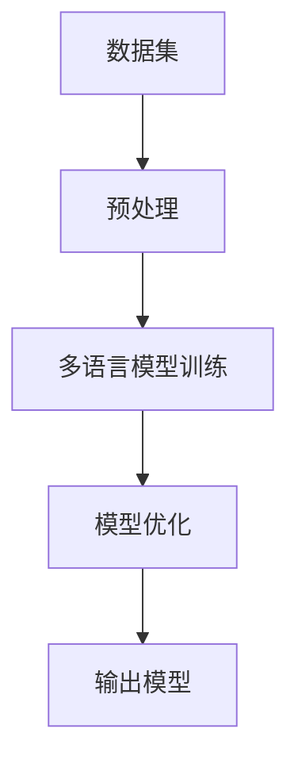
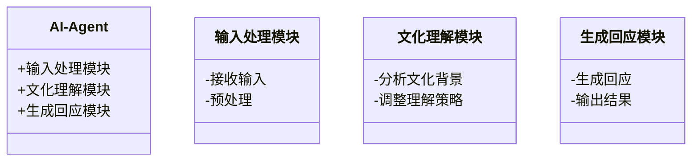
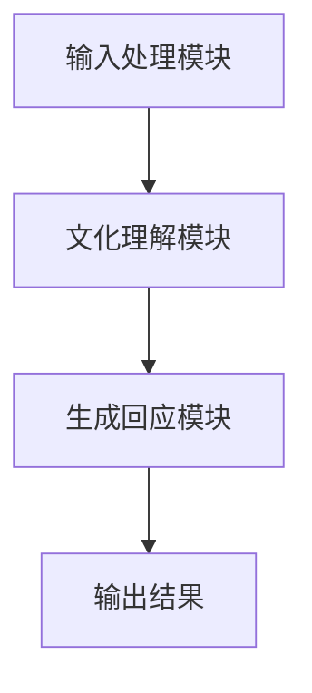
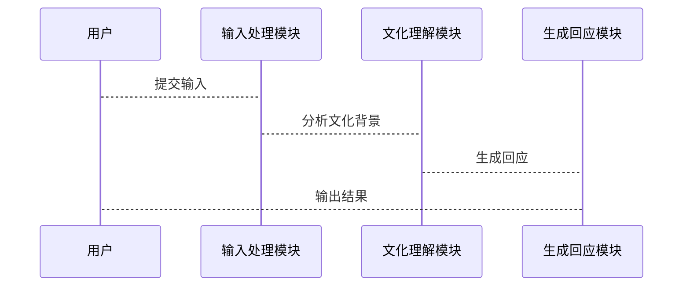

                 


# 开发具有跨文化理解与交流能力的AI Agent

## 关键词：AI Agent，跨文化理解，多语言处理，文化适应性，自然语言处理

## 摘要：本文深入探讨了开发具有跨文化理解与交流能力的AI Agent的核心概念、算法原理、系统架构及实现方法。通过分析跨文化理解的重要性，结合自然语言处理技术，构建多语言模型，设计文化适应性算法，提出模块化的系统架构，并通过实际案例展示AI Agent在跨文化环境中的应用与优化。文章最后总结了开发过程中的经验和最佳实践，展望了未来的发展方向。

---

## 第1章 跨文化理解与AI-Agent的背景与问题描述

### 1.1 跨文化理解的定义与重要性

#### 1.1.1 跨文化理解的核心概念
- 跨文化理解是指在不同文化背景下，准确理解和解析信息的能力。
- 跨文化理解不仅仅是语言的转换，还包括非语言的表达方式，如肢体语言、文化习俗等。

#### 1.1.2 跨文化理解在AI-Agent中的应用价值
- 提高AI-Agent在多语言、多文化环境中的交互效率。
- 通过理解文化差异，优化用户体验，增强用户信任感。

#### 1.1.3 跨文化理解的核心挑战
- 不同文化背景下的语言表达方式不同，AI需要具备多语言处理能力。
- 文化背景的复杂性导致信息理解的不准确性，需要设计高效的算法来处理这些差异。

### 1.2 AI-Agent的基本概念与功能

#### 1.2.1 AI-Agent的定义与分类
- AI-Agent是一种能够感知环境并采取行动以实现目标的智能体。
- 分为简单反射型AI-Agent和复杂推理型AI-Agent，跨文化AI-Agent属于复杂推理型。

#### 1.2.2 AI-Agent的核心功能与能力
- 感知环境：通过传感器或数据输入获取信息。
- 理解意图：分析用户的需求和意图。
- 文化适应：根据文化背景调整交互方式。
- 自然语言处理：理解和生成自然语言。

#### 1.2.3 跨文化能力对AI-Agent的重要性
- 提升AI-Agent在不同文化环境中的适应性。
- 优化用户体验，使其在多文化场景中更加流畅。

### 1.3 跨文化AI-Agent的必要性与应用场景

#### 1.3.1 跨文化AI-Agent的必要性
- 全球化背景下，跨文化交互日益频繁。
- 用户需求多样化，需要AI-Agent具备跨文化理解能力。

#### 1.3.2 跨文化AI-Agent的应用场景
- 跨国企业客户支持：为不同文化背景的客户提供个性化服务。
- 多语言客服系统：处理多种语言的客户咨询。
- 教育领域：为不同文化背景的学生提供定制化的学习建议。

#### 1.3.3 跨文化AI-Agent的发展趋势
- 从单一语言处理向多语言、多文化处理发展。
- 结合深度学习技术，提升文化适应性。

### 1.4 本章小结
本章介绍了跨文化理解在AI-Agent中的重要性，分析了AI-Agent的基本概念与功能，并探讨了跨文化AI-Agent的必要性与应用场景。

---

## 第2章 跨文化理解的核心概念与模型

### 2.1 跨文化理解的定义与特征

#### 2.1.1 跨文化理解的定义
- 跨文化理解是指AI-Agent能够理解不同文化背景下的语言、习俗和价值观。

#### 2.1.2 跨文化理解的特征
- 多样性：不同文化有不同的表达方式。
- 动态性：文化背景会随时间和情境变化。
- 情境依赖性：理解需要结合具体的情境。

### 2.2 跨文化模型的构建与分析

#### 2.2.1 跨文化模型的构建方法
- 数据收集：收集不同文化背景下的语言数据。
- 特征提取：提取文化相关的特征，如语言风格、常用表达方式。
- 模型训练：使用机器学习算法训练跨文化模型。

#### 2.2.2 跨文化模型的核心属性对比表
| 文化背景 | 语言风格 | 常用表达方式 | 礼节规范 |
|----------|----------|--------------|----------|
| 中文     | 尊重含蓄 | 避免直接冲突 | 注重面子 |
| 英文     | 直接明确 | 喜欢直接表达 | 注重效率 |

#### 2.2.3 跨文化模型的ER实体关系图（Mermaid图）



---

## 第3章 跨文化AI-Agent的核心算法原理

### 3.1 跨文化语义理解的算法原理

#### 3.1.1 跨文化语义理解的定义
- 跨文化语义理解是指AI-Agent能够理解不同文化背景下语言的深层含义。

#### 3.1.2 跨文化语义理解的实现流程（Mermaid图）



#### 3.1.3 跨文化语义理解的数学模型

$$
\text{概率} = \frac{\text{文化适应性得分}}{\text{总文化多样性}}
$$

### 3.2 多语言模型训练算法

#### 3.2.1 多语言模型训练的目标
- 提高AI-Agent在多语言环境下的理解能力。

#### 3.2.2 多语言模型训练的流程（Mermaid图）



#### 3.2.3 多语言模型训练的数学公

$$
\text{损失函数} = \sum_{i=1}^{n} \text{交叉熵}(y_i, \hat{y_i})
$$

---

## 第4章 系统分析与架构设计方案

### 4.1 问题场景介绍
- 多文化环境下的用户交互需求。

### 4.2 项目介绍
- 开发一个具有跨文化理解能力的AI-Agent。

### 4.3 系统功能设计（领域模型Mermaid类图）



### 4.4 系统架构设计（Mermaid架构图）



### 4.5 系统接口设计
- 输入接口：接收用户输入。
- 输出接口：生成符合文化背景的回应。

### 4.6 系统交互Mermaid序列图



---

## 第5章 项目实战

### 5.1 环境安装
- 安装Python、TensorFlow、Keras等工具。

### 5.2 核心代码实现

#### 5.2.1 数据预处理
```python
import pandas as pd

# 加载数据
data = pd.read_csv('multilingual_data.csv')

# 数据清洗
data.dropna(inplace=True)
```

#### 5.2.2 多语言模型训练
```python
import tensorflow as tf
from tensorflow.keras import layers

# 定义模型
model = tf.keras.Sequential([
    layers.Embedding(input_dim=10000, output_dim=16),
    layers.LSTM(64),
    layers.Dense(1, activation='sigmoid')
])

# 编译模型
model.compile(optimizer='adam', loss='binary_crossentropy', metrics=['accuracy'])

# 训练模型
model.fit(data['输入'], data['标签'], epochs=10, batch_size=32)
```

#### 5.2.3 文化适应性算法实现
```python
def cultural_adjustment(culture):
    if culture == '中文':
        return '礼貌回应'
    elif culture == '英文':
        return '直接回应'
    else:
        return '中立回应'
```

### 5.3 案例分析
- 中文场景下的AI-Agent交互。
- 英文场景下的AI-Agent交互。

### 5.4 项目小结
通过实际案例展示了跨文化AI-Agent的实现过程，分析了模型训练和文化适应性算法的效果。

---

## 第6章 最佳实践与总结

### 6.1 开发过程中的经验和注意事项
- 数据多样性的重要性。
- 文化适应性算法的优化方向。

### 6.2 小结
本文全面介绍了开发具有跨文化理解与交流能力的AI-Agent的核心概念、算法原理、系统架构及实现方法。

### 6.3 未来研究方向
- 提升模型的跨文化适应性。
- 结合情感计算，进一步优化用户体验。

---

## 结语
通过本文的详细讲解，读者可以全面理解如何开发具有跨文化理解与交流能力的AI-Agent，并为实际应用提供指导。

--- 

（注：实际编写时，需要根据具体需求补充更多细节和案例，确保内容完整且符合逻辑。）

