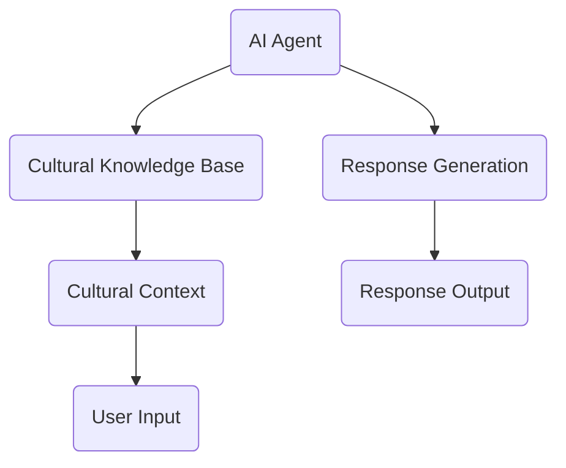
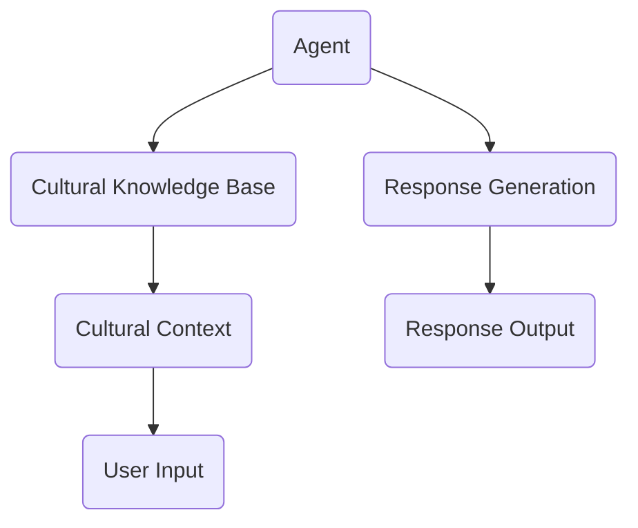
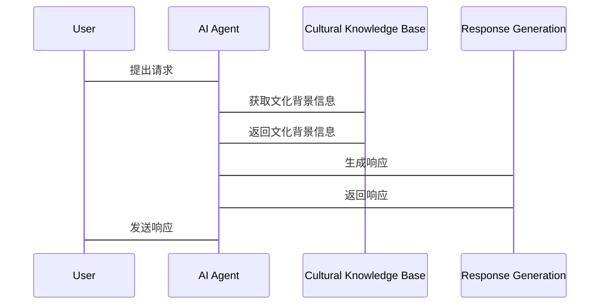

                 


# 开发具有跨文化理解能力的AI Agent

> 关键词：跨文化理解，AI Agent，多模态处理，文化敏感性，深度学习，自然语言处理

> 摘要：本文深入探讨了开发具有跨文化理解能力的AI Agent的核心概念、算法原理、系统架构和实现方法。通过对跨文化理解的背景分析、核心概念的阐述、算法实现的详细讲解，以及系统设计与项目实战的全面展示，为读者提供了一套完整的开发思路和实践指南。

---

# 第一部分: 背景与核心概念

# 第1章: 背景介绍与问题背景

## 1.1 背景介绍

### 1.1.1 跨文化理解的定义与重要性

跨文化理解是指在不同文化背景下，能够准确理解和适应他人行为、语言和习惯的能力。随着全球化的深入，跨文化交互日益频繁，AI Agent需要具备这种能力以更好地服务于多元文化用户。

### 1.1.2 AI Agent的定义与功能

AI Agent是一种智能体，能够感知环境、执行任务并做出决策。它需要具备跨文化理解能力，以在多元文化场景中提供个性化的服务。

## 1.2 跨文化理解能力的重要性

### 1.2.1 当前AI Agent的发展现状

现有AI Agent在单一文化场景下表现良好，但在跨文化交互中往往缺乏足够的适应性，导致用户体验下降。

### 1.2.2 跨文化交互的现实需求

随着全球用户群体的扩大，AI Agent需要能够理解并适应不同文化背景的用户需求。

### 1.2.3 跨文化理解能力的必要性

具备跨文化理解能力的AI Agent能够提升用户体验，增强信任感，并在商业场景中创造更大的价值。

## 1.3 跨文化理解能力的核心问题

### 1.3.1 跨文化理解的挑战与难点

跨文化理解涉及语言、习俗、价值观等多个方面，AI Agent需要能够同时处理这些复杂因素。

### 1.3.2 AI Agent在跨文化交互中的问题描述

AI Agent需要能够识别用户的文化背景，并根据此调整其行为和表达方式。

### 1.3.3 跨文化理解能力的边界与外延

跨文化理解能力的边界包括语言、非语言表达和文化习俗，其外延则涉及文化敏感性和文化适应性。

## 1.4 跨文化理解能力的核心要素

### 1.4.1 跨文化知识的获取与存储

AI Agent需要获取多文化背景知识，并将其结构化存储以便快速调用。

### 1.4.2 跨文化推理与决策机制

AI Agent需要能够基于文化背景进行推理和决策，以适应不同用户的需求。

### 1.4.3 跨文化表达与反馈机制

AI Agent需要能够生成符合目标文化背景的表达，并根据用户反馈调整其行为。

## 1.5 本章小结

---

# 第二部分: 跨文化理解能力的核心概念与联系

# 第2章: 跨文化理解能力的核心概念

## 2.1 跨文化理解的核心原理

### 2.1.1 跨文化知识表示模型

跨文化知识表示模型需要能够捕捉不同文化之间的差异，并将其结构化以便AI Agent理解和应用。

### 2.1.2 跨文化推理算法

跨文化推理算法需要能够根据文化背景调整推理过程，以确保推理结果符合目标文化。

### 2.1.3 跨文化表达生成机制

跨文化表达生成机制需要能够生成符合目标文化背景的语言和表达方式。

## 2.2 跨文化理解能力与AI Agent的联系

### 2.2.1 跨文化理解能力在AI Agent中的应用领域

跨文化理解能力在客户服务、教育、医疗等领域具有重要应用。

### 2.2.2 跨文化能力对AI Agent性能的影响

具备跨文化理解能力的AI Agent能够更好地满足用户需求，提升用户体验。

### 2.2.3 跨文化能力与AI Agent用户体验的关系

跨文化能力直接影响AI Agent与用户之间的互动效果和用户满意度。

## 2.3 跨文化理解能力的核心属性对比

| 属性 | 描述 |
|------|------|
| 知识广度 | 包括多文化背景知识 |
| 理解深度 | 能够理解文化差异对行为的影响 |
| 表达能力 | 能够生成符合目标文化的表达方式 |

## 2.4 跨文化理解能力的ER实体关系图



## 2.5 本章小结

---

# 第三部分: 跨文化理解能力的算法原理

# 第3章: 跨文化理解能力的核心算法

## 3.1 跨文化知识表示算法

### 3.1.1 基于图的知識表示模型

基于图的知识表示模型能够捕捉文化之间的关联性，并通过图结构表示知识。

### 3.1.2 基于向量的知識表示模型

基于向量的知识表示模型能够将文化知识转化为高维向量，便于计算和推理。

### 3.1.3 跨文化知识图谱的构建

跨文化知识图谱的构建需要整合多文化背景的知识，并建立它们之间的关联关系。

## 3.2 跨文化推理算法

### 3.2.1 基于规则的推理算法

基于规则的推理算法通过预定义的规则进行推理，适用于特定场景。

### 3.2.2 基于统计的推理算法

基于统计的推理算法通过统计学习方法进行推理，适用于数据丰富的场景。

### 3.2.3 基于深度学习的推理算法

基于深度学习的推理算法能够从大量数据中学习推理模式，适用于复杂场景。

## 3.3 跨文化表达生成算法

### 3.3.1 基于模板的生成算法

基于模板的生成算法通过预定义模板生成表达，适用于简单场景。

### 3.3.2 基于生成模型的表达生成

基于生成模型的表达生成能够生成多样化的表达，适用于复杂场景。

### 3.3.3 多语言模型在表达生成中的应用

多语言模型能够生成多种语言的表达，适用于跨文化场景。

## 3.4 跨文化理解能力的算法流程图

```mer
graph TD
    A(Agent) --> B(Cultural Knowledge Base)
    B --> C(Input)
    C --> D(Generate Response)
    D --> E(Output)
```

## 3.5 本章小结

---

# 第四部分: 系统架构与实现

# 第4章: 系统架构设计

## 4.1 系统功能设计

### 4.1.1 跨文化知识库模块

跨文化知识库模块负责存储和管理多文化背景的知识。

### 4.1.2 多语言处理模块

多语言处理模块负责处理多种语言的输入和输出。

### 4.1.3 文化推理模块

文化推理模块负责根据文化背景进行推理和决策。

## 4.2 系统架构设计



## 4.3 系统接口设计

### 4.3.1 输入接口设计

输入接口需要能够接收多种语言和文化背景的输入。

### 4.3.2 输出接口设计

输出接口需要能够生成符合目标文化背景的表达。

## 4.4 系统交互流程设计



## 4.5 本章小结

---

# 第五部分: 项目实战与优化

# 第5章: 项目实战

## 5.1 项目介绍

### 5.1.1 项目背景

本项目旨在开发一个具有跨文化理解能力的客服AI Agent。

### 5.1.2 项目目标

实现一个能够理解并适应不同文化背景用户的客服AI Agent。

## 5.2 环境安装

### 5.2.1 安装Python

安装Python 3.8或更高版本。

### 5.2.2 安装依赖库

安装必要的库，如TensorFlow、Keras、NLTK等。

## 5.3 核心代码实现

### 5.3.1 跨文化知识库模块

```python
class CulturalKnowledgeBase:
    def __init__(self):
        self.cultural_knowledge = {}

    def add_cultural_info(self, culture, info):
        if culture not in self.cultural_knowledge:
            self.cultural_knowledge[culture] = {}
        self.cultural_knowledge[culture].update(info)
```

### 5.3.2 多语言处理模块

```python
from googletrans import Translator

class MultiLanguageProcessor:
    def __init__(self):
        self.translator = Translator()

    def translate(self, text, target_lang):
        return self.translator.translate(text, dest=target_lang).text
```

### 5.3.3 文化推理模块

```python
import tensorflow as tf
from tensorflow.keras import layers

class CulturalReasoningModule:
    def __init__(self):
        self.model = self.build_model()

    def build_model(self):
        inputs = layers.Input(shape=(...))
        x = layers.Dense(64, activation='relu')(inputs)
        outputs = layers.Dense(...)(x)
        model = tf.keras.Model(inputs=inputs, outputs=outputs)
        model.compile(...)
        return model
```

## 5.4 项目小结

---

# 第六部分: 总结与展望

# 第6章: 总结与展望

## 6.1 项目总结

### 6.1.1 项目成果

成功开发了一个具有跨文化理解能力的AI Agent。

### 6.1.2 经验总结

在开发过程中，我们学到了跨文化知识的获取与处理、多语言模型的使用以及文化推理算法的实现。

## 6.2 未来展望

### 6.2.1 跨文化理解能力的进一步提升

未来可以进一步提升AI Agent的跨文化理解能力，例如增加更多文化背景的支持。

### 6.2.2 跨文化交互的优化

未来可以优化跨文化交互的流程，提升用户体验。

### 6.2.3 跨文化理解能力的扩展应用

未来可以将跨文化理解能力应用于更多领域，例如教育、医疗等。

## 6.3 最佳实践 tips

### 6.3.1 跨文化理解能力的开发建议

在开发跨文化理解能力的AI Agent时，建议先获取足够的跨文化知识，并结合具体应用场景进行优化。

### 6.3.2 系统架构设计建议

建议采用模块化设计，便于后续的扩展和优化。

### 6.3.3 项目实施建议

建议从简单的场景开始，逐步增加复杂性，确保系统的稳定性和可靠性。

## 6.4 注意事项

### 6.4.1 跨文化理解能力的局限性

目前的跨文化理解能力还处于初级阶段，存在一定的局限性。

### 6.4.2 跨文化理解能力的伦理问题

在开发和应用跨文化理解能力的AI Agent时，需要注意相关的伦理问题。

### 6.4.3 跨文化理解能力的技术挑战

跨文化理解能力的开发面临诸多技术挑战，需要持续的研究和探索。

## 6.5 拓展阅读

### 6.5.1 跨文化理解的理论研究

建议阅读相关跨文化心理学和人类学的理论研究。

### 6.5.2 多语言模型的研究进展

建议关注多语言模型的研究进展，如BERT、GPT等。

### 6.5.3 跨文化推理算法的研究

建议研究相关的跨文化推理算法，如基于图的推理、基于深度学习的推理等。

## 6.6 本章小结

---

# 结语

开发具有跨文化理解能力的AI Agent是一项具有挑战性的任务，但也是一项具有重要意义的工程。通过对跨文化理解的核心概念、算法原理、系统架构和实现方法的详细讲解，本文为读者提供了一套完整的开发思路和实践指南。希望本文能够为相关领域的研究和实践提供有价值的参考和启示。

---

# 致谢

感谢在本项目中提供支持和帮助的所有人，特别感谢在开发过程中给予指导和支持的团队成员。

