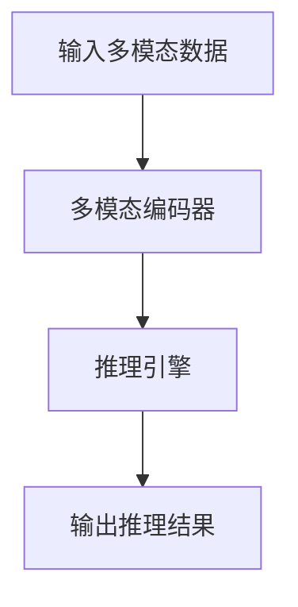
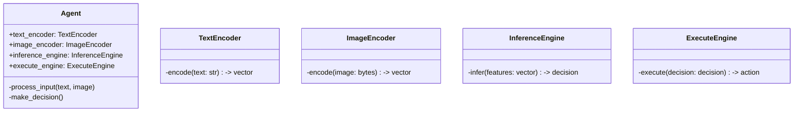
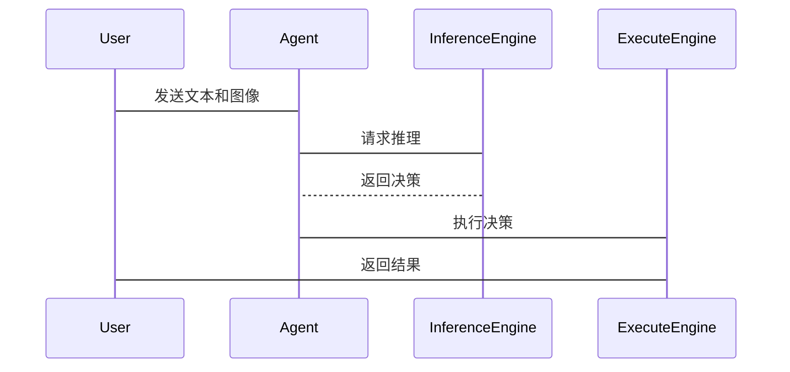
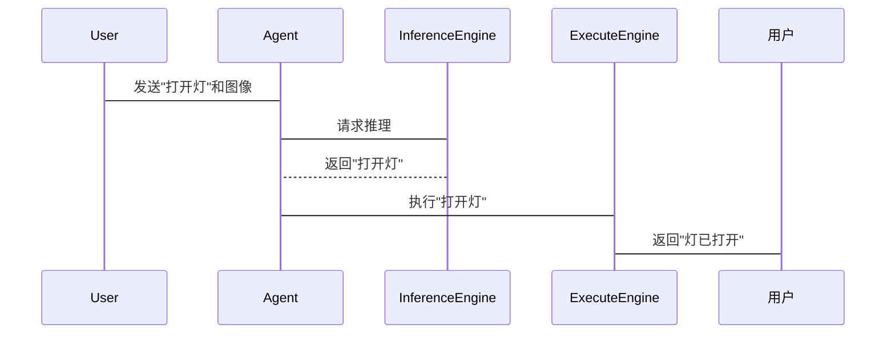

                 


# 开发具有跨模态推理能力的AI Agent

> 关键词：跨模态推理、AI Agent、多模态数据处理、推理引擎、系统架构设计

> 摘要：本文详细探讨了开发具有跨模态推理能力的AI Agent的关键技术与实现方法。从背景介绍到核心概念，再到算法原理、系统设计、项目实战和总结，全面解析了如何构建能够处理多种数据类型并进行复杂推理的智能代理系统。

---

# 第1章 背景介绍

## 1.1 问题背景

### 1.1.1 AI Agent的基本概念
AI Agent（人工智能代理）是一种能够感知环境、执行任务并做出决策的智能实体。它可以基于输入的信息（如文本、图像、语音等）采取行动，目标是为用户提供高效、智能的服务。

### 1.1.2 跨模态推理的定义与重要性
跨模态推理是指AI能够理解并整合多种数据类型（如文本、图像、语音）进行推理的能力。这种能力使AI Agent能够处理复杂的现实场景，例如从图像和文本中理解上下文并做出决策。

### 1.1.3 当前AI Agent发展的痛点与挑战
尽管AI Agent在许多领域取得了进展，但大多数系统仍局限于单一模态的数据处理，难以应对复杂的真实场景。跨模态推理的缺失限制了AI Agent的智能性和实用性。

## 1.2 问题描述

### 1.2.1 跨模态推理的核心问题
跨模态推理的核心问题是如何将不同数据类型的特征有效地整合，并在推理过程中充分利用这些信息。

### 1.2.2 AI Agent在实际应用中的需求
在实际应用中，AI Agent需要能够处理多种数据类型，并在复杂场景中做出准确的推理和决策。

### 1.2.3 当前技术的局限性与改进方向
当前技术主要集中在单一模态处理上，跨模态推理的能力较弱。未来需要重点提升多模态数据的整合与推理能力。

## 1.3 问题解决

### 1.3.1 跨模态推理的关键技术
- 多模态编码器：将不同数据类型编码为统一的表示。
- 推理引擎：基于编码后的表示进行推理。
- 跨模态解码器：将推理结果解码为具体行动或输出。

### 1.3.2 AI Agent的开发框架
- 感知层：处理多模态输入数据。
- 推理层：进行跨模态推理。
- 执行层：根据推理结果执行具体任务。

### 1.3.3 综合解决方案的提出
通过结合多模态编码器、推理引擎和执行模块，构建一个能够处理多种数据类型并进行复杂推理的AI Agent系统。

## 1.4 边界与外延

### 1.4.1 跨模态推理的边界条件
- 数据类型：支持文本、图像、语音等。
- 推理范围：局限于系统设计的能力范围内。
- 环境限制：适用于特定场景，如智能家居、客服系统等。

### 1.4.2 AI Agent的适用场景
- 智能家居：控制设备、处理用户指令。
- 客服系统：多渠道支持用户咨询。
- 智能助手：帮助用户完成日常任务。

### 1.4.3 技术的局限性与适用范围
目前，跨模态推理的能力有限，主要适用于中等复杂度的任务。随着技术进步，未来将扩展到更复杂的场景。

## 1.5 概念结构与核心要素组成

### 1.5.1 跨模态推理的要素分析
- 输入数据：多种数据类型。
- 推理引擎：核心推理模块。
- 输出结果：推理后的决策或反馈。

### 1.5.2 AI Agent的核心组件
- 感知模块：处理输入数据。
- 推理模块：进行跨模态推理。
- 执行模块：执行具体任务。

### 1.5.3 两者的结合方式与逻辑关系
AI Agent通过感知模块获取多模态数据，传递给推理引擎进行推理，最终通过执行模块完成任务。

---

# 第2章 跨模态推理与AI Agent的核心概念与联系

## 2.1 核心概念原理

### 2.1.1 跨模态推理的基本原理
跨模态推理通过将不同数据类型的特征进行编码和解码，结合推理引擎进行推理。

### 2.1.2 AI Agent的工作原理
AI Agent通过感知环境、推理信息并执行任务，为用户提供服务。

### 2.1.3 两者的结合机制
AI Agent通过整合跨模态推理能力，提升其在复杂场景中的表现。

## 2.2 概念属性特征对比表格

| 概念 | 属性 | 特征 |
|------|------|------|
| 跨模态推理 | 输入方式 | 多种数据类型支持 |
| 跨模态推理 | 输出方式 | 综合推理结果 |
| AI Agent | 输入方式 | 用户指令或传感器数据 |
| AI Agent | 输出方式 | 行动或反馈 |

## 2.3 ER实体关系图

```mermaid
er
  actor(Agent)
  actor has a role (推理引擎)
  actor has a role (行动执行器)
  actor has a role (多模态数据处理)
```

---

# 第3章 跨模态推理算法原理

## 3.1 算法原理

### 3.1.1 多模态编码器
多模态编码器将不同数据类型编码为统一的表示，例如文本和图像分别编码为向量。

### 3.1.2 跨模态解码器
跨模态解码器将推理结果解码为具体行动或输出。

### 3.1.3 推理机制
推理引擎基于编码后的表示进行推理，输出决策结果。

## 3.2 算法流程图



## 3.3 Python源代码实现

```python
class MultiModalEncoder:
    def __init__(self):
        self.text_encoder = TextEncoder()
        self.image_encoder = ImageEncoder()
    
    def encode(self, text, image):
        text_feat = self.text_encoder.encode(text)
        image_feat = self.image_encoder.encode(image)
        return text_feat + image_feat

class TextEncoder:
    def encode(self, text):
        # 文本编码逻辑
        pass

class ImageEncoder:
    def encode(self, image):
        # 图像编码逻辑
        pass

class InferenceEngine:
    def __init__(self):
        self.encoders = MultiModalEncoder()
    
    def infer(self, text, image):
        features = self.encoders.encode(text, image)
        # 推理逻辑
        pass

class Agent:
    def __init__(self):
        self.inference_engine = InferenceEngine()
    
    def process_input(self, text, image):
        features = self.inference_engine.infer(text, image)
        # 执行逻辑
        pass
```

## 3.4 数学模型和公式

### 3.4.1 注意力机制
$$
\text{Attention}(Q, K, V) = \text{softmax}\left(\frac{QK^T}{\sqrt{d_k}}\right)V
$$

### 3.4.2 损失函数
$$
\text{Loss} = -\sum_{i=1}^{n} \text{log}(\text{softmax}(y_i))
$$

### 3.4.3 推理公式
$$
y = f(x_1, x_2, \ldots, x_n)
$$

## 3.5 举例说明

### 3.5.1 文本和图像的多模态推理
输入文本和图像，编码器将两者编码为向量，推理引擎基于这些向量进行推理，输出决策结果。

### 3.5.2 语音和文本的联合推理
输入语音指令和相关文本信息，编码器将两者编码，推理引擎进行推理，输出具体行动。

---

# 第4章 系统分析与架构设计

## 4.1 问题场景介绍

### 4.1.1 系统目标
构建一个能够处理多模态数据并进行推理的AI Agent系统。

### 4.1.2 系统范围
系统适用于智能家居、客服等领域。

### 4.1.3 用户角色
用户、系统管理员。

## 4.2 系统功能设计

### 4.2.1 领域模型



### 4.2.2 系统架构设计


### 4.2.3 系统接口设计
- 输入接口：接收多模态数据。
- 输出接口：输出推理结果或执行动作。

### 4.2.4 系统交互



---

# 第5章 项目实战

## 5.1 环境安装

### 5.1.1 安装Python和相关库
```bash
pip install numpy
pip install tensorflow
pip install pytorch
```

### 5.1.2 安装依赖项
```bash
pip install -r requirements.txt
```

## 5.2 系统核心实现

### 5.2.1 多模态数据处理

```python
def process_input(text, image):
    text_vector = text_encoder.encode(text)
    image_vector = image_encoder.encode(image)
    features = text_vector + image_vector
    return features
```

### 5.2.2 推理模块实现

```python
def infer(features):
    # 推理逻辑
    pass
```

### 5.2.3 执行模块实现

```python
def execute(decision):
    # 执行逻辑
    pass
```

## 5.3 代码应用解读

### 5.3.1 多模态编码器实现
文本编码器和图像编码器分别将输入数据编码为向量，然后将向量拼接起来作为推理的输入。

### 5.3.2 推理引擎实现
推理引擎接收编码后的向量，进行推理，输出决策结果。

### 5.3.3 执行模块实现
根据决策结果，执行模块执行具体的任务，例如发送指令或触发动作。

## 5.4 实际案例分析

### 5.4.1 案例描述
智能家居场景，用户通过语音和文本指令控制设备。

### 5.4.2 代码实现

```python
def main():
    text = "打开灯"
    image = capture_image()  # 获取图像数据
    features = process_input(text, image)
    decision = infer(features)
    execute(decision)
```

### 5.4.3 系统交互流程



## 5.5 项目小结

### 5.5.1 系统功能总结
系统能够处理多模态数据，进行跨模态推理，并执行具体任务。

### 5.5.2 项目成果
成功实现了具有跨模态推理能力的AI Agent系统。

---

# 第6章 总结与展望

## 6.1 最佳实践

### 6.1.1 开发建议
- 确保多模态数据的高质量。
- 选择合适的模型和算法。
- 不断优化推理引擎。

### 6.1.2 代码优化
- 提升编码器和解码器的效率。
- 优化推理算法，提高推理速度。

## 6.2 小结

本文详细探讨了开发具有跨模态推理能力的AI Agent的关键技术与实现方法，从背景介绍到系统设计再到项目实战，全面解析了如何构建高效的AI Agent系统。

## 6.3 注意事项

- 确保数据安全和隐私保护。
- 定期更新模型和算法，以应对新的挑战。
- 提供良好的用户界面和交互体验。

## 6.4 拓展阅读

- 《多模态学习与推理》
- 《AI Agent的设计与实现》
- 《跨模态数据处理技术》

---

# 结语

开发具有跨模态推理能力的AI Agent是一个复杂而有趣的过程。通过结合多模态数据处理和先进的人工智能技术，我们可以构建出更加智能和实用的AI系统，为用户带来更好的体验和价值。

