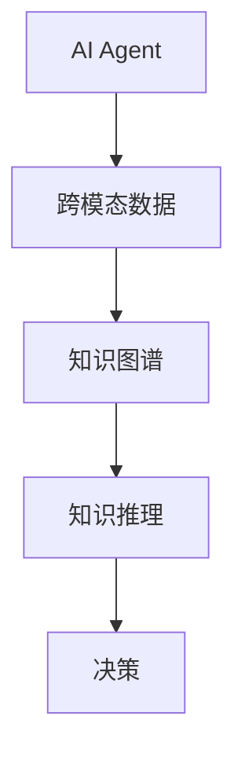

                 


# 开发具有跨模态知识推理与决策能力的AI Agent

> 关键词：跨模态知识推理，AI Agent，知识图谱，决策能力，多模态数据处理，深度学习

> 摘要：本文旨在探讨如何开发具有跨模态知识推理与决策能力的AI Agent。通过背景介绍、核心概念解析、算法原理分析、系统架构设计、项目实战和最佳实践等多维度的探讨，本文将深入剖析AI Agent在跨模态知识推理与决策领域的技术要点和实现方法。

---

# 第一部分: 背景介绍

## 第1章: 跨模态知识推理与决策AI Agent的背景介绍

### 1.1 跨模态知识推理与决策AI Agent的定义

#### 1.1.1 AI Agent的基本概念
AI Agent（人工智能代理）是一种能够感知环境、自主决策并执行任务的智能实体。它可以理解输入数据、分析信息、推理知识，并根据推理结果做出决策，最终执行相应的操作。

#### 1.1.2 跨模态知识推理的定义
跨模态知识推理是指AI Agent能够处理和理解多种模态（如文本、图像、语音等）的数据，并通过这些数据进行知识的推理和关联。这种推理不仅涉及单一模态的信息，还能够将不同模态的信息进行融合，从而更全面地理解问题。

#### 1.1.3 跨模态知识推理与决策AI Agent的核心目标
跨模态知识推理与决策AI Agent的核心目标是通过整合多模态数据，构建一个能够自主推理、决策并执行复杂任务的智能系统。这种AI Agent能够处理复杂场景中的不确定性，并根据上下文信息做出最优决策。

### 1.2 跨模态知识推理与决策AI Agent的意义

#### 1.2.1 跨模态数据处理的重要性
现实世界中的数据通常是多模态的，例如图像、文本、语音等。单一模态的数据往往无法提供足够的信息来支持决策，而跨模态数据的结合能够提供更丰富的信息，从而提高AI Agent的理解和决策能力。

#### 1.2.2 知识推理与决策的必要性
在复杂场景中，AI Agent需要通过推理来理解数据之间的关系，并根据这些关系做出决策。知识推理是连接数据和决策的关键桥梁。

#### 1.2.3 跨模态知识推理与决策的结合
跨模态知识推理与决策的结合使得AI Agent能够在多模态数据的基础上，进行更全面的知识推理，并根据推理结果做出更准确的决策。

### 1.3 跨模态知识推理与决策AI Agent的技术挑战

#### 1.3.1 跨模态数据融合的难点
不同模态的数据具有不同的特征和表示方式，如何有效地将它们融合在一起，以支持知识推理和决策是一个技术难点。

#### 1.3.2 知识推理的复杂性
知识推理需要处理大量的关联关系和不确定性，如何设计高效的推理算法是另一个挑战。

#### 1.3.3 决策的不确定性
在实际场景中，决策往往面临不确定性，如何在不确定的情况下做出最优决策是AI Agent需要解决的问题。

### 1.4 本书的核心内容与目标

#### 1.4.1 本书的核心主题
本书的核心主题是探讨如何开发具有跨模态知识推理与决策能力的AI Agent。我们将从理论到实践，全面解析AI Agent的设计、实现和应用。

#### 1.4.2 本书的目标读者
本书的目标读者是人工智能领域的研究人员、工程师以及对AI Agent开发感兴趣的读者。读者需要具备一定的机器学习和编程基础。

#### 1.4.3 本书的结构安排
本书将分为六个部分，包括背景介绍、核心概念与联系、算法原理讲解、系统分析与架构设计、项目实战以及最佳实践与未来展望。每一部分都将深入探讨相关的内容，确保读者能够全面理解和掌握AI Agent的开发技术。

---

# 第二部分: 核心概念与联系

## 第2章: 跨模态知识推理与决策的核心概念

### 2.1 跨模态数据处理

#### 2.1.1 跨模态数据的定义与特点
跨模态数据是指来自不同模态（如文本、图像、语音等）的数据。这些数据具有不同的特征和表示方式，但它们可以共同描述同一个实体或事件。

#### 2.1.2 跨模态数据的表示方法
跨模态数据的表示方法包括向量表示、符号表示等。例如，文本可以表示为词向量，图像可以表示为像素向量。

#### 2.1.3 跨模态数据融合的技术路线
跨模态数据融合的技术路线包括特征级融合、决策级融合等。特征级融合是在数据的原始特征层面上进行融合，而决策级融合是在高层语义层面上进行融合。

### 2.2 知识图谱与知识推理

#### 2.2.1 知识图谱的构建与表示
知识图谱是一种以图结构形式表示知识的工具，它由节点和边组成，节点表示实体，边表示实体之间的关系。

#### 2.2.2 知识推理的基本原理
知识推理是指通过已有的知识（节点和边）推断新的知识的过程。常见的推理方法包括基于规则的推理和基于机器学习的推理。

#### 2.2.3 知识推理的算法分类
知识推理的算法可以分为基于符号逻辑的推理和基于概率的推理。基于符号逻辑的推理包括演绎推理和归纳推理，基于概率的推理包括贝叶斯推理和马尔可夫逻辑网络推理。

### 2.3 跨模态知识推理与决策的关系

#### 2.3.1 跨模态知识推理在决策中的作用
跨模态知识推理通过整合多模态数据，提供更全面的信息支持决策。

#### 2.3.2 决策对知識推理的需求
决策需要基于推理得到的知识，因此决策对知識推理提出了更高的要求。

#### 2.3.3 跨模态知识推理与决策的协同关系
跨模态知识推理与决策是协同关系，推理为决策提供支持，决策反过来指导推理的方向和深度。

### 2.4 核心概念的ER实体关系图



---

# 第三部分: 算法原理讲解

## 第3章: 跨模态知识推理与决策的核心算法

### 3.1 多模态模型的训练方法

#### 3.1.1 多任务学习
多任务学习是一种通过同时学习多个任务来提高模型性能的方法。在跨模态知识推理中，可以同时学习文本理解和图像识别等多个任务。

#### 3.1.2 端到端优化
端到端优化是一种通过优化整个模型的损失函数来实现最优性能的方法。在跨模态知识推理中，可以通过端到端优化来提高模型的推理和决策能力。

### 3.2 知识图谱的表示与推理

#### 3.2.1 知识图谱的表示方法
知识图谱的表示方法包括向量表示和符号表示。向量表示适用于数值计算，符号表示适用于逻辑推理。

#### 3.2.2 知识图谱的推理算法
知识图谱的推理算法包括基于规则的推理和基于深度学习的推理。基于规则的推理适用于简单的推理任务，基于深度学习的推理适用于复杂的推理任务。

### 3.3 跨模态推理算法的具体实现

#### 3.3.1 跨模态特征融合
跨模态特征融合是指将不同模态的特征进行融合，以提高推理的准确性。例如，可以通过将文本的词向量和图像的像素向量进行融合，得到一个综合的特征向量。

#### 3.3.2 跨模态推理模型
跨模态推理模型是一种能够同时处理多种模态数据的模型。例如，多模态图神经网络可以同时处理文本和图像数据，并通过图结构进行推理。

---

# 第四部分: 系统分析与架构设计

## 第4章: 跨模态知识推理与决策AI Agent的系统架构设计

### 4.1 系统功能设计

#### 4.1.1 数据输入与处理模块
数据输入与处理模块负责接收和处理多模态数据，例如文本、图像等。

#### 4.1.2 知识图谱构建模块
知识图谱构建模块负责构建和更新知识图谱，包括实体识别、关系抽取等任务。

#### 4.1.3 推理与决策模块
推理与决策模块负责基于知识图谱进行推理，并根据推理结果做出决策。

### 4.2 系统架构设计

#### 4.2.1 整体架构
跨模态知识推理与决策AI Agent的整体架构包括数据输入与处理模块、知识图谱构建模块、推理与决策模块以及执行模块。

#### 4.2.2 模块划分
模块划分包括数据输入模块、数据处理模块、知识图谱构建模块、推理与决策模块以及执行模块。

#### 4.2.3 数据流设计
数据流设计包括数据输入、数据处理、知识图谱构建、推理与决策以及执行的流程。

### 4.3 系统接口设计

#### 4.3.1 输入接口
输入接口负责接收多模态数据，例如文本、图像等。

#### 4.3.2 输出接口
输出接口负责输出推理结果和决策结果。

#### 4.3.3 接口交互流程
接口交互流程包括数据输入、数据处理、知识图谱构建、推理与决策以及结果输出。

---

# 第五部分: 项目实战

## 第5章: 跨模态知识推理与决策AI Agent的实现

### 5.1 环境配置

#### 5.1.1 系统环境
需要安装Python、TensorFlow、Keras等开发工具。

#### 5.1.2 数据集准备
需要准备多模态数据集，例如包含文本和图像的数据集。

#### 5.1.3 依赖库安装
安装必要的依赖库，例如TensorFlow、Keras、numpy等。

### 5.2 核心功能实现

#### 5.2.1 数据处理代码
数据处理代码用于处理输入的多模态数据，例如文本和图像。

```python
import tensorflow as tf
from tensorflow.keras import layers

# 文本处理
def text_preprocess(text):
    # 文本预处理代码
    pass

# 图像处理
def image_preprocess(image):
    # 图像预处理代码
    pass
```

#### 5.2.2 知识图谱构建代码
知识图谱构建代码用于构建和更新知识图谱。

```python
def build_knowledge_graph(data):
    # 知识图谱构建代码
    pass
```

#### 5.2.3 推理与决策代码
推理与决策代码用于基于知识图谱进行推理，并做出决策。

```python
def infer_and_decision(knowledge_graph):
    # 推理与决策代码
    pass
```

### 5.3 案例分析与实现解读

#### 5.3.1 具体案例分析
以具体的案例为例，分析跨模态知识推理与决策AI Agent的实现过程。

#### 5.3.2 代码实现解读
详细解读代码实现，说明每一步的功能和作用。

### 5.4 项目总结

#### 5.4.1 项目实现的成果
总结项目实现的成果，例如成功构建了跨模态知识推理与决策AI Agent。

#### 5.4.2 项目中的经验与教训
总结项目中的经验与教训，例如在数据处理和知识图谱构建中遇到的挑战。

---

# 第六部分: 最佳实践与未来展望

## 第6章: 跨模态知识推理与决策AI Agent的开发实践

### 6.1 最佳实践

#### 6.1.1 数据处理技巧
数据处理是AI Agent开发中的关键步骤，需要注意数据的多样性和质量。

#### 6.1.2 知识图谱构建的注意事项
知识图谱构建需要考虑实体识别和关系抽取的准确性。

#### 6.1.3 推理与决策的优化方法
推理与决策的优化方法包括模型调优、算法优化等。

### 6.2 未来展望

#### 6.2.1 跨模态知识推理与决策的发展趋势
跨模态知识推理与决策的发展趋势包括模型的轻量化、推理的高效化等。

#### 6.2.2 跨模态知识推理与决策的未来研究方向
未来研究方向包括多模态数据的高效融合、知识图谱的动态更新、推理算法的优化等。

#### 6.2.3 跨模态知识推理与决策的应用前景
跨模态知识推理与决策在多个领域具有广泛的应用前景，例如智能客服、智能医疗等。

---

# 作者总结

通过本文的详细讲解，我们深入了解了跨模态知识推理与决策AI Agent的开发过程。从背景介绍到核心概念，从算法原理到系统架构设计，再到项目实战和最佳实践，我们全面剖析了AI Agent的开发技术。未来，随着技术的不断发展，跨模态知识推理与决策AI Agent将在更多领域展现出其强大的应用潜力。

