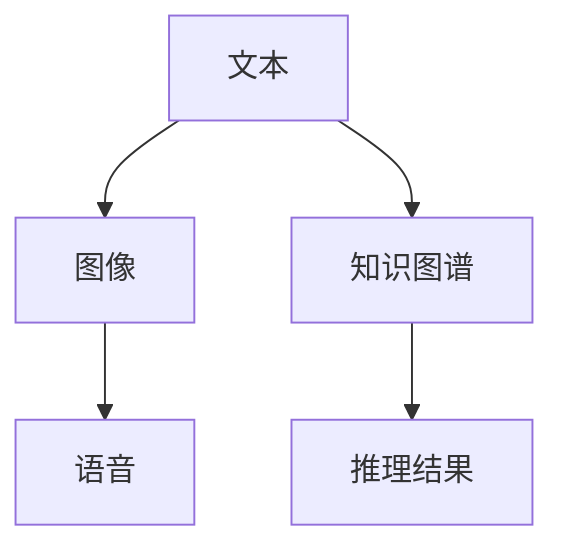
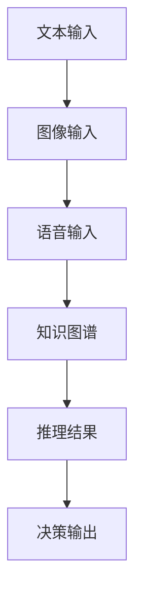

                 


# 开发具有跨模态知识推理能力的AI Agent

> 关键词：AI Agent，跨模态知识推理，多模态数据，知识表示，推理机制，系统架构设计

> 摘要：本文将详细探讨如何开发具有跨模态知识推理能力的AI Agent。通过分析跨模态知识推理的核心概念、算法原理、系统架构设计以及项目实战，我们将深入理解AI Agent在多模态数据处理和知识推理中的应用。文章内容涵盖背景介绍、核心概念、算法实现、系统设计、项目案例及最佳实践，旨在为开发者提供全面的技术指导。

---

# 正文

## 第1章: 跨模态知识推理与AI Agent概述

### 1.1 跨模态知识推理的背景与问题背景

#### 1.1.1 从单模态到跨模态的演进
传统的AI系统主要依赖单一模态的数据进行处理，如文本、图像或语音。然而，现实世界中的数据往往是多模态的，例如一张图片可能包含文字、颜色和形状等多种信息。为了使AI系统更贴近人类的认知方式，跨模态知识推理应运而生，旨在整合多种数据源，提升系统的理解和推理能力。

#### 1.1.2 跨模态知识推理的定义与问题描述
跨模态知识推理是指在多个数据模态（如文本、图像、语音等）之间建立关联，并通过推理机制得出结论的过程。AI Agent需要具备从多源异构数据中提取信息、构建知识图谱，并在此基础上进行推理的能力。例如，一个AI Agent可以通过分析图像和相关文本，推断出图片中物体的属性和关系。

#### 1.1.3 跨模态知识推理的核心要素与边界
跨模态知识推理的核心要素包括：
- **多模态数据处理**：整合和分析不同模态的数据。
- **知识表示**：构建能够表示多模态数据及其关系的知识图谱。
- **推理机制**：基于知识图谱进行逻辑推理，得出结论。

其边界包括数据源的多样性、知识表示的复杂性以及推理的准确性和效率。

#### 1.1.4 跨模态知识推理与AI Agent的结合
AI Agent通过跨模态知识推理，能够更全面地感知环境、理解任务需求，并做出更智能的决策。例如，在智能客服场景中，AI Agent可以通过分析用户的文本输入和语音情绪，结合知识库中的产品信息，提供更个性化的服务。

---

### 1.2 跨模态知识推理的核心概念

#### 1.2.1 跨模态数据的定义与特点
跨模态数据指的是来自不同感知渠道的数据，例如：
- **文本**：包括自然语言文本、结构化数据等。
- **图像**：包括照片、图表等视觉信息。
- **语音**：包括音频数据和语音命令。

跨模态数据的特点包括多样性、异构性和关联性。

#### 1.2.2 知识表示与存储
知识表示是跨模态推理的基础。常用的知识表示方法包括：
- **符号表示**：使用符号逻辑表达知识。
- **向量表示**：将知识映射为高维向量。
- **知识图谱**：构建结构化的知识网络。

#### 1.2.3 跨模态知识推理的属性特征对比表
| 属性 | 单模态推理 | 跨模态推理 |
|------|------------|------------|
| 数据来源 | 单一模态    | 多个模态    |
| 复杂性 | 较低       | 较高       |
| 知识关联 | 较弱       | 较强       |
| 应用场景 | 有限       | 广泛       |

#### 1.2.4 跨模态知识推理的ER实体关系图



---

## 第2章: 跨模态知识推理的核心原理与联系

### 2.1 跨模态知识推理的原理

#### 2.1.1 多模态数据处理流程
跨模态数据处理通常包括以下步骤：
1. 数据预处理：对多模态数据进行清洗和标准化。
2. 特征提取：从各模态数据中提取有意义的特征。
3. 数据融合：将不同模态的特征进行融合，形成统一的表示。

#### 2.1.2 知识表示与存储
知识表示的关键在于如何有效地编码多模态信息。常用方法包括：
- **嵌入表示**：将多模态数据映射到低维向量空间。
- **符号与向量混合表示**：结合符号逻辑和向量表示。

#### 2.1.3 推理机制与算法选择
推理机制是跨模态知识推理的核心，常用算法包括：
- **基于规则的推理**：通过预定义的逻辑规则进行推理。
- **基于概率的推理**：利用概率论进行不确定性推理。
- **基于深度学习的推理**：使用神经网络模型进行端到端推理。

---

### 2.2 跨模态知识推理的数学模型与公式

#### 2.2.1 跨模态数据表示的数学模型
跨模态数据可以通过多种方式表示，例如：

$$
\text{文本} = x \in \mathbb{R}^{d_x}, \quad \text{图像} = y \in \mathbb{R}^{d_y}
$$

其中，\(d_x\) 和 \(d_y\) 分别表示文本和图像的特征维度。

#### 2.2.2 知识推理的逻辑表达式
知识推理可以通过逻辑规则表示，例如：

$$
\text{如果 } x \text{ 和 } y \text{ 关联，那么 } z = f(x, y)
$$

其中，\(f\) 是推理函数。

#### 2.2.3 推理算法的数学推导
基于注意力机制的多模态推理算法可以表示为：

$$
a = \text{softmax}(W_a [x, y])
$$

其中，\(W_a\) 是注意力权重矩阵，\(a\) 是注意力权重。

---

### 2.3 跨模态知识推理的ER实体关系图


---

## 第3章: 跨模态知识推理的算法原理

### 3.1 跨模态知识推理算法概述

#### 3.1.1 多模态编码器与解码器
多模态编码器将不同模态的数据映射到统一的向量空间，解码器则根据这些向量生成目标输出。

#### 3.1.2 知识图谱表示学习
知识图谱表示学习通过将知识图谱中的节点和边表示为向量，提升推理效率。

#### 3.1.3 跨模态注意力机制
注意力机制在跨模态推理中用于动态调整不同模态数据的重要性。

---

### 3.2 跨模态知识推理算法的数学模型

#### 3.2.1 多模态编码器的数学公式
多模态编码器可以表示为：

$$
z = f(x, y) = \text{concat}(x, y) \cdot W
$$

其中，\(W\) 是参数矩阵，\(x\) 和 \(y\) 分别是文本和图像的特征向量。

#### 3.2.2 注意力机制的数学推导
注意力机制的计算公式为：

$$
a_i = \text{softmax}(W_a x_i + b_a)
$$

其中，\(a_i\) 是注意力权重，\(W_a\) 是注意力权重矩阵，\(b_a\) 是偏置项。

---

### 3.3 跨模态知识推理算法的实现步骤

#### 3.3.1 数据预处理与特征提取
1. 数据清洗：去除噪声数据。
2. 特征提取：提取文本、图像等模态的特征向量。

#### 3.3.2 知识表示与建模
1. 建立知识图谱：将多模态数据映射到知识图谱中。
2. 知识表示学习：训练模型将知识图谱中的节点表示为向量。

#### 3.3.3 推理过程与结果输出
1. 基于注意力机制进行推理。
2. 输出推理结果。

---

## 第4章: 跨模态知识推理的系统架构设计

### 4.1 系统架构设计

#### 4.1.1 系统功能设计
AI Agent的系统功能包括：
1. 多模态数据采集与处理。
2. 知识图谱构建与表示。
3. 推理与决策。

#### 4.1.2 系统架构设计图



---

## 第5章: 项目实战

### 5.1 项目介绍
本项目旨在开发一个具有跨模态知识推理能力的AI Agent，能够处理文本、图像等多种数据模态，并基于知识图谱进行推理。

### 5.2 核心代码实现

#### 5.2.1 数据预处理
```python
import numpy as np

def preprocess(text, image):
    # 文本预处理
    text_vec = text_to_vector(text)
    # 图像预处理
    image_vec = image_to_vector(image)
    return text_vec, image_vec
```

#### 5.2.2 知识图谱构建
```python
from tensorflow.keras.layers import Dense

def build_knowledge_graph(embedding_dim):
    embedding_layer = Dense(embedding_dim, activation='relu')
    return embedding_layer
```

---

## 第6章: 总结与展望

### 6.1 总结
本文详细探讨了开发具有跨模态知识推理能力的AI Agent的关键技术，包括背景介绍、核心概念、算法原理、系统架构设计以及项目实战。

### 6.2 展望
未来的研究方向包括提升推理的准确性和效率，探索新的跨模态数据处理方法，以及优化知识图谱的构建和表示学习。

### 6.3 最佳实践 Tips
- 在数据预处理阶段，注意数据的多样性和代表性。
- 知识图谱的构建需要结合具体应用场景，选择合适的表示方法。
- 推理算法的选择应根据任务需求进行调整和优化。

---

通过以上内容，我们详细介绍了开发具有跨模态知识推理能力的AI Agent的各个方面，希望对开发者和研究人员有所帮助。

