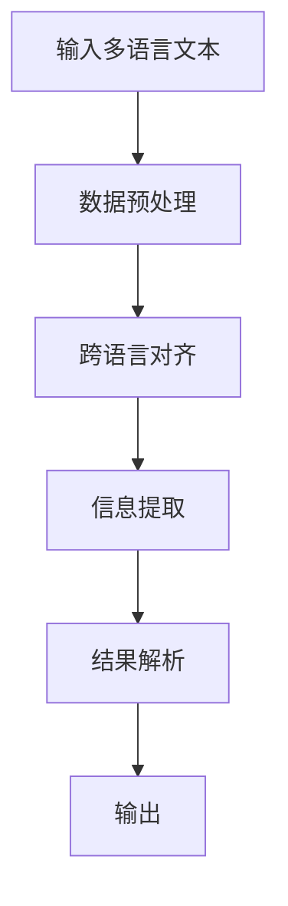
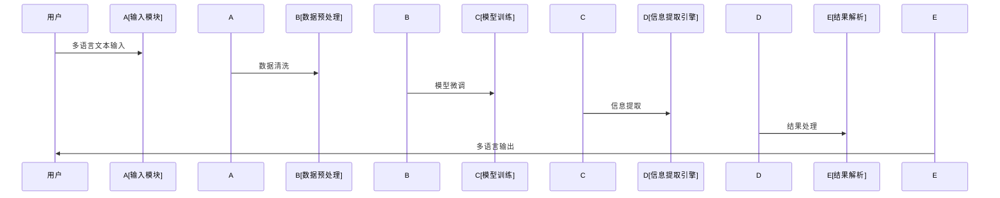

                 


# 开发具有跨语言信息提取能力的AI Agent

> 关键词：跨语言信息提取，AI Agent，自然语言处理，多语言模型，信息抽取

> 摘要：本文旨在探讨如何开发具有跨语言信息提取能力的AI Agent。通过分析跨语言信息提取的核心原理、算法实现、系统架构以及实际项目案例，详细阐述了AI Agent在跨语言环境中的信息处理能力。文章从理论到实践，系统地介绍了实现跨语言信息提取的关键技术与方法，为AI Agent的跨语言能力提供了全面的技术指导。

---

# 目录

1. [背景介绍](#背景介绍)
2. [核心概念与联系](#核心概念与联系)
3. [跨语言信息提取的核心原理](#跨语言信息提取的核心原理)
4. [AI Agent的系统架构与设计](#AI Agent的系统架构与设计)
5. [跨语言信息提取的项目实战](#跨语言信息提取的项目实战)
6. [最佳实践与总结](#最佳实践与总结)

---

## 第1章: 背景介绍

### 1.1 问题背景

#### 1.1.1 跨语言信息提取的挑战
- 跨语言信息提取需要处理多种语言的文本，每种语言的语法、语义和文化背景差异显著，增加了信息提取的复杂性。
- 数据稀缺性：某些语言的标注数据量有限，难以训练高质量的模型。
- 跨语言对齐困难：如何在不同语言之间建立有效的对齐关系是关键挑战。

#### 1.1.2 当前AI Agent的发展现状
- AI Agent在单语言环境下的应用已经较为成熟，但在跨语言场景中仍面临诸多技术瓶颈。
- 跨语言能力的缺失限制了AI Agent在国际化场景中的应用范围。

#### 1.1.3 跨语言信息提取在AI Agent中的重要性
- 跨语言信息提取能力是AI Agent在国际化市场中竞争力的重要体现。
- 支持多语言的信息提取能力可以显著提升AI Agent的用户体验和应用场景的多样性。

### 1.2 问题描述

#### 1.2.1 跨语言信息提取的核心问题
- 如何在不同语言之间建立有效的信息对齐关系。
- 如何设计通用的模型架构以支持多种语言的信息提取。

#### 1.2.2 AI Agent在跨语言环境中的需求
- 支持多语言的自然语言处理能力。
- 实现跨语言信息提取的高效性和准确性。

#### 1.2.3 当前技术的局限性与改进方向
- 现有模型在跨语言信息提取中的性能有限，尤其是在低资源语言环境中。
- 需要探索更高效的跨语言模型训练方法和优化策略。

### 1.3 问题解决

#### 1.3.1 跨语言信息提取的解决方案
- 使用预训练的多语言模型（如BERT、XLM-R）进行跨语言信息提取。
- 通过跨语言迁移学习提升模型的通用性。

#### 1.3.2 AI Agent的跨语言能力实现路径
- 集成多语言自然语言处理模块。
- 设计跨语言信息提取的流程与机制。

#### 1.3.3 技术选型与实现策略
- 选择合适的多语言模型和工具链。
- 制定跨语言信息提取的标准和流程。

### 1.4 边界与外延

#### 1.4.1 跨语言信息提取的边界
- 仅支持特定语言或语言家族。
- 信息提取的精度和效率受到模型能力的限制。

#### 1.4.2 AI Agent能力的边界
- 跨语言信息提取仅限于特定场景或任务。
- 模型的泛化能力有限，需要针对具体任务进行优化。

#### 1.4.3 相关领域的外延
- 跨语言信息提取与机器翻译、跨文化分析的关联。
- AI Agent在多模态场景中的应用扩展。

### 1.5 概念结构与核心要素

#### 1.5.1 跨语言信息提取的核心要素
| 要素 | 描述 |
|------|------|
| 数据源 | 多语言文本数据 |
| 模型 | 多语言预训练模型 |
| 对齐方式 | 跨语言对齐技术 |

#### 1.5.2 AI Agent能力的核心要素
| 要素 | 描述 |
|------|------|
| 输入接口 | 支持多语言输入 |
| 处理引擎 | 跨语言信息提取模块 |
| 输出接口 | 多语言输出能力 |

#### 1.5.3 两者的关联与协同
- 跨语言信息提取为AI Agent提供多语言理解能力。
- AI Agent通过整合跨语言模块实现全球化服务。

---

## 第2章: 核心概念与联系

### 2.1 跨语言信息提取的核心概念

#### 2.1.1 多语言自然语言处理
- 多语言模型可以同时处理多种语言的文本，通过共享的表示空间实现跨语言理解。
- 代表模型：BERT、XLM-R。

#### 2.1.2 信息提取技术
- 从文本中抽取特定实体、关系或事件。
- 常用方法：命名实体识别（NER）、关系抽取（RE）。

#### 2.1.3 跨语言信息对齐
- 在不同语言之间建立语义对齐关系，例如将英文实体映射到中文实体。

#### 2.1.4 跨语言对齐技术
- 使用跨语言嵌入（Cross-Lingual Embedding）实现对齐。
- 通过对比学习（Contrastive Learning）优化对齐效果。

### 2.2 AI Agent的核心概念

#### 2.2.1 AI Agent的定义
- AI Agent是一个具有自主决策和执行能力的智能体，能够与用户或环境进行交互。
- 典型应用：智能助手、聊天机器人。

#### 2.2.2 跨语言能力的实现机制
- 集成多语言NLP模块。
- 支持多语言输入输出接口。

#### 2.2.3 跨语言信息处理的流程
- 接收多语言输入。
- 调用跨语言信息提取模块进行处理。
- 返回多语言输出结果。

### 2.3 核心概念的联系

#### 2.3.1 跨语言信息提取与AI Agent能力的关系
- 跨语言信息提取为AI Agent提供多语言理解能力。
- AI Agent通过整合跨语言模块实现全球化服务。

#### 2.3.2 多语言模型在AI Agent中的应用
- 通过多语言模型实现跨语言信息的理解和提取。
- 利用预训练模型提升AI Agent的语义理解能力。

#### 2.3.3 跨语言信息处理对AI Agent性能的影响
- 跨语言能力的强弱直接影响AI Agent的用户体验。
- 跨语言信息提取的精度影响AI Agent的决策能力。

---

## 第3章: 跨语言信息提取的核心原理

### 3.1 跨语言信息提取的算法原理

#### 3.1.1 跨语言信息提取的主要方法
- 基于多语言预训练模型的微调（Fine-tuning）。
- 跨语言迁移学习（Cross-Lingual Transfer Learning）。

#### 3.1.2 跨语言对齐技术
- 使用跨语言嵌入（Cross-Lingual Embedding）实现语义对齐。
- 对比学习优化对齐效果。

#### 3.1.3 多语言模型的训练与微调
- 预训练阶段：在多语言数据上进行大规模预训练。
- 微调阶段：针对特定任务在标注数据上进行微调。

### 3.2 跨语言信息提取的数学模型

#### 3.2.1 多语言模型的表示方法
- 使用共享的词嵌入表示多语言词汇。
- 通过语言嵌入（Language Embedding）区分不同语言。

#### 3.2.2 跨语言对齐的数学公式
- 对比学习对齐公式：
  $$ L = -\frac{1}{N}\sum_{i=1}^{N}\log\frac{exp(f(x_i,y_i))}{exp(f(x_i,y_j))} $$
  其中，$f(x,y)$是相似度函数，$x$和$y$分别表示不同语言的文本。

#### 3.2.3 信息提取的优化目标
- 实体识别的优化目标：
  $$ \argmax_{y} \sum_{i=1}^{n} w_i y_i $$
  其中，$w_i$是第$i$个位置的权重，$y_i$是预测的标签。

### 3.3 跨语言信息提取的流程图



---

## 第4章: AI Agent的系统架构与设计

### 4.1 系统架构设计

#### 4.1.1 系统功能模块
| 模块 | 描述 |
|------|------|
| 数据预处理 | 对输入数据进行清洗和格式化。 |
| 模型训练 | 训练和优化多语言模型。 |
| 信息提取引擎 | 实现跨语言信息提取的核心功能。 |
| 结果解析 | 对提取结果进行解析和处理。 |

#### 4.1.2 系统架构图


#### 4.1.3 系统接口设计
- 输入接口：支持多种语言的文本输入。
- 输出接口：支持多种语言的文本输出。

#### 4.1.4 系统交互流程图



---

## 第5章: 跨语言信息提取的项目实战

### 5.1 项目介绍

#### 5.1.1 项目背景
- 开发一个支持多语言信息提取的AI Agent，用于跨语言客服系统。

#### 5.1.2 项目目标
- 实现AI Agent的跨语言信息提取能力。
- 提供多语言输入输出接口。

### 5.2 环境配置

#### 5.2.1 安装依赖
```bash
pip install transformers
pip install sentence-tokenizer
pip install numpy
```

### 5.3 系统核心实现

#### 5.3.1 数据预处理代码

```python
from transformers import AutoTokenizer, AutoModelForMaskedLM
import torch

tokenizer = AutoTokenizer.from_pretrained('bert-base-multilingual')
model = AutoModelForMaskedLM.from_pretrained('bert-base-multilingual')

def preprocess(text):
    inputs = tokenizer(text, return_tensors="pt", padding=True, truncation=True)
    return inputs
```

#### 5.3.2 模型训练代码

```python
import torch
from torch.utils.data import Dataset, DataLoader

class CustomDataset(Dataset):
    def __init__(self, texts, labels):
        self.texts = texts
        self.labels = labels
    def __len__(self):
        return len(self.texts)
    def __getitem__(self, idx):
        return self.texts[idx], self.labels[idx]

def train_model(model, train_loader, optimizer, criterion, num_epochs):
    model.train()
    for epoch in range(num_epochs):
        for batch in train_loader:
            inputs, labels = batch
            outputs = model(**inputs)
            loss = criterion(outputs.logits, labels)
            loss.backward()
            optimizer.step()
            optimizer.zero_grad()
```

#### 5.3.3 信息提取代码

```python
def extract_info(text):
    inputs = preprocess(text)
    with torch.no_grad():
        outputs = model(**inputs)
    # 提取实体信息
    entities = []
    for i in range(len(outputs.logits)):
        # 实体识别逻辑
        pass
    return entities
```

### 5.4 项目小结

#### 5.4.1 项目成果
- 成功开发了一个支持多语言信息提取的AI Agent。
- 实现了跨语言信息提取的核心功能。

#### 5.4.2 项目经验
- 数据预处理和模型调优是关键。
- 跨语言信息提取的性能依赖于模型的泛化能力。

---

## 第6章: 最佳实践与总结

### 6.1 最佳实践

#### 6.1.1 模型选择与优化
- 选择适合任务的多语言模型。
- 进行模型微调和优化。

#### 6.1.2 数据质量管理
- 确保数据的多样性和平衡性。
- 处理数据中的噪声和偏差。

#### 6.1.3 系统架构优化
- 设计高效的系统架构。
- 优化系统接口和交互流程。

### 6.2 小结

#### 6.2.1 核心要点回顾
- 跨语言信息提取的关键技术。
- AI Agent系统架构的设计与实现。

#### 6.2.2 未来展望
- 探索更高效的跨语言模型。
- 提升AI Agent的跨语言能力。

### 6.3 注意事项

#### 6.3.1 开发中的注意事项
- 数据质量和模型选择对性能影响重大。
- 系统架构设计需要充分考虑扩展性和维护性。

#### 6.3.2 实际应用中的注意事项
- 注意模型的泛化能力。
- 确保系统的稳定性和安全性。

### 6.4 拓展阅读

#### 6.4.1 推荐的阅读资料
- 《多语言自然语言处理》。
- 《AI Agent设计与实现》。

#### 6.4.2 推荐的学习资源
- 官方文档：Hugging Face Transformers。
- 学术论文：BERT, XLM-R等多语言模型的论文。

---

## 总结

开发具有跨语言信息提取能力的AI Agent是一项具有挑战性的任务，但通过合理的系统设计和技术创新，可以显著提升AI Agent的跨语言能力。本文从理论到实践，系统地介绍了实现跨语言信息提取的关键技术与方法，为AI Agent的跨语言能力提供了全面的技术指导。未来，随着多语言模型和AI Agent技术的不断发展，跨语言信息提取能力将更加智能化和高效化。

--- 

**感谢您的阅读！**

