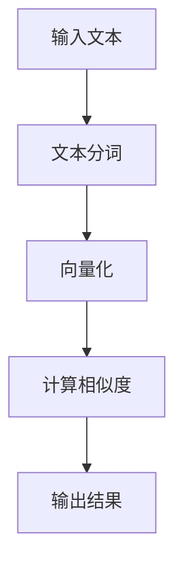
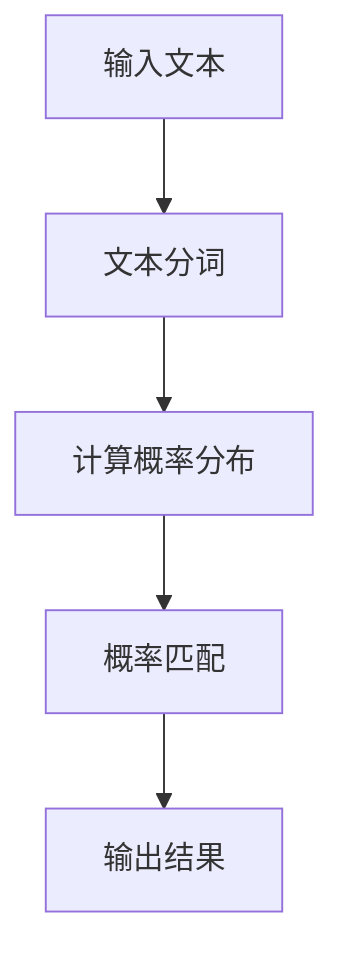
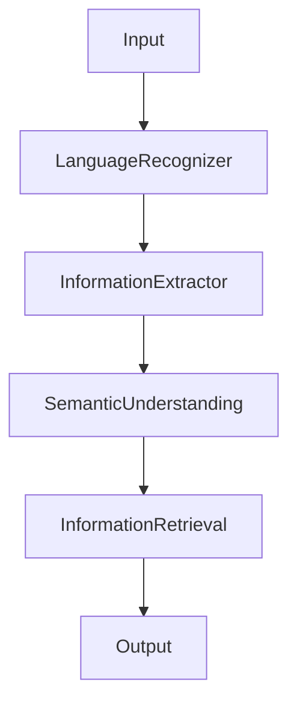
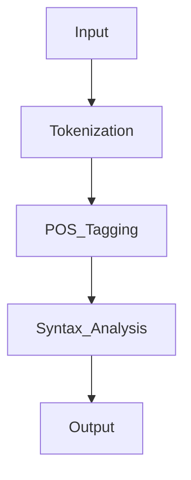
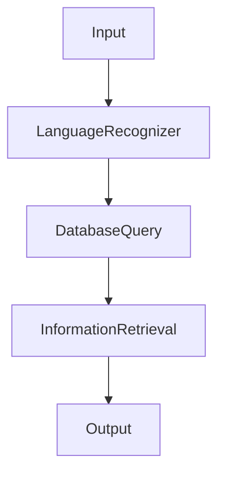
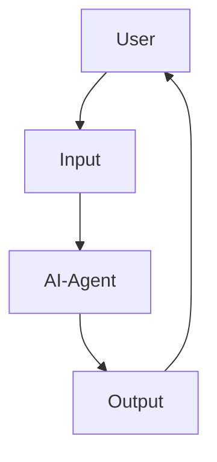
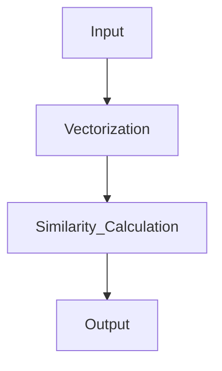
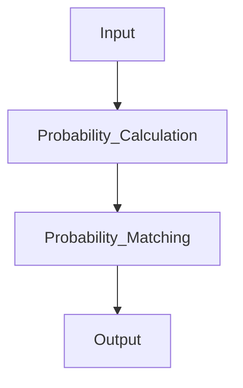
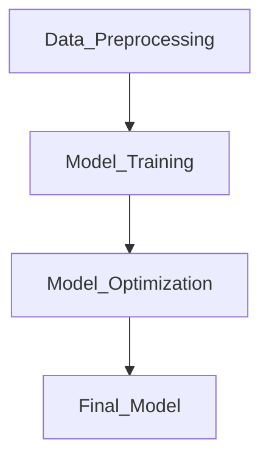

                 


# 开发具有跨语言信息检索能力的AI Agent

## 关键词：跨语言信息检索，AI Agent，多语言模型，信息检索，自然语言处理

## 摘要：
本文详细探讨了开发具有跨语言信息检索能力的AI Agent的核心技术与实现方法。文章从跨语言信息检索的基本原理出发，结合AI Agent的特点，系统性地分析了多语言模型的训练与优化、跨语言信息检索算法的实现、AI Agent的系统架构设计以及项目实战的实现步骤。通过本文的学习，读者可以全面掌握开发跨语言信息检索AI Agent的理论基础与实践技能。

---

# 第一部分: 跨语言信息检索与AI Agent概述

## 第1章: 跨语言信息检索与AI Agent概述

### 1.1 跨语言信息检索的背景与意义

#### 1.1.1 多语言信息检索的背景
随着全球化的发展，信息的多样性和多语言性变得越来越重要。在互联网时代，信息不仅存在于一种语言中，而是分散在多种语言的资源中。因此，能够跨语言检索信息的能力变得尤为重要。

#### 1.1.2 跨语言信息检索的核心目标
跨语言信息检索的核心目标是通过技术手段，实现对多种语言信息的识别、理解和检索，以满足用户在多语言环境下的信息需求。

#### 1.1.3 跨语言信息检索的应用场景
- **国际商务**: 在跨国业务中，需要处理多种语言的信息。
- **学术研究**: 科研人员需要检索不同语言的学术资料。
- **社交媒体**: 用户可能在社交媒体上发布多种语言的内容，需要进行跨语言检索。

### 1.2 AI Agent的基本概念与特点

#### 1.2.1 AI Agent的定义
AI Agent是一种智能体，能够感知环境、自主决策并执行任务。它可以理解为一个能够与用户交互、处理复杂任务的智能系统。

#### 1.2.2 AI Agent的核心能力
- **感知能力**: 能够理解输入的信息。
- **决策能力**: 能够根据信息做出决策。
- **执行能力**: 能够执行任务并给出反馈。

#### 1.2.3 跨语言能力对AI Agent的重要性
在多语言环境下，AI Agent需要能够理解并处理多种语言的信息，以提高信息检索的准确性和效率。

### 1.3 跨语言信息检索与AI Agent的结合

#### 1.3.1 跨语言信息检索的挑战
- **语言差异**: 不同语言的语法、词汇差异可能影响信息检索的效果。
- **数据稀疏性**: 部分语言的数据量较少，可能导致检索效果不佳。

#### 1.3.2 AI Agent在信息检索中的优势
- **智能化**: AI Agent可以通过机器学习算法不断优化检索效果。
- **多任务处理**: AI Agent可以同时处理多种语言的信息。

#### 1.3.3 跨语言信息检索AI Agent的典型应用
- **智能客服**: 能够理解并处理多种语言的用户查询。
- **跨语言搜索引擎**: 提供多语言信息检索服务。

### 1.4 本章小结
本章介绍了跨语言信息检索的背景与意义，以及AI Agent的基本概念与特点。通过结合跨语言信息检索与AI Agent的优势，为后续章节的分析奠定了基础。

---

## 第2章: 跨语言信息检索的原理与方法

### 2.1 跨语言信息检索的基本原理

#### 2.1.1 跨语言信息检索的定义
跨语言信息检索是指在多种语言环境下，通过技术手段实现对信息的识别、理解和检索。

#### 2.1.2 跨语言信息检索的关键技术
- **语言识别**: 确定输入信息的语言。
- **跨语言理解**: 理解不同语言的信息内容。
- **信息检索**: 在多种语言中检索相关信息。

#### 2.1.3 跨语言信息检索的实现流程
1. **语言识别**: 确定输入信息的语言。
2. **信息抽取**: 从多种语言的文本中抽取信息。
3. **信息理解**: 理解信息的语义。
4. **信息检索**: 在数据库中检索相关信息。

### 2.2 多语言模型在信息检索中的应用

#### 2.2.1 多语言模型的定义
多语言模型是一种能够处理多种语言的模型，能够在多种语言之间共享信息，提高模型的通用性和效率。

#### 2.2.2 多语言模型在信息检索中的优势
- **数据共享**: 多语言模型可以在多种语言之间共享数据，提高模型的泛化能力。
- **减少数据稀疏性**: 多语言模型可以通过共享数据来缓解小语种数据稀疏的问题。

#### 2.2.3 常见多语言模型的对比
| 模型名称 | 特点 | 优势 | 劣势 |
|----------|------|------|------|
| XLM      | 基于Transformer的多语言模型 | 支持多种语言，参数共享 | 训练数据量较大 |
| MULTE    | 基于统计的多语言模型 | 适用于小语种 | 精度较低 |
| LASER    | 基于预训练的多语言模型 | 支持零样本任务 | 需要大量计算资源 |

### 2.3 跨语言信息检索的算法实现

#### 2.3.1 跨语言信息检索的算法概述
跨语言信息检索的算法主要包括基于向量的检索算法和基于概率的检索算法。

#### 2.3.2 基于向量的检索算法
基于向量的检索算法通过将文本表示为向量，然后计算向量之间的相似度来进行检索。

##### 使用mermaid绘制的算法流程图


#### 2.3.3 基于概率的检索算法
基于概率的检索算法通过计算文本的概率分布来进行检索。

##### 使用mermaid绘制的算法流程图


### 2.4 本章小结
本章详细介绍了跨语言信息检索的基本原理与方法，分析了多语言模型在信息检索中的应用，并通过具体的算法实现流程图，帮助读者更好地理解跨语言信息检索的核心技术。

---

## 第3章: AI Agent的开发框架

### 3.1 AI Agent的开发框架

#### 3.1.1 开发框架的定义
AI Agent的开发框架是一种用于构建AI Agent的工具集合，能够帮助开发者快速实现AI Agent的核心功能。

#### 3.1.2 常见AI Agent开发框架的对比
| 框架名称 | 特点 | 优势 | 劣势 |
|----------|------|------|------|
| Rasa      | 基于机器学习的框架 | 支持多轮对话 | 学习曲线较陡 |
| Dialogflow | 基于规则的框架 | 易于上手 | 灵活性较低 |
| Microsoft Bot Framework | 支持多种语言 | 功能丰富 | 配置较复杂 |

#### 3.1.3 选择开发框架的考虑因素
- **功能需求**: 根据具体的任务需求选择合适的框架。
- **学习曲线**: 考虑开发团队的技术水平。
- **扩展性**: 考虑框架的可扩展性和可维护性。

### 3.2 跨语言信息检索AI Agent的架构设计

#### 3.2.1 模块化架构设计
跨语言信息检索AI Agent的架构设计可以采用模块化的方式，包括以下几个模块：
- **输入模块**: 负责接收用户的输入。
- **语言识别模块**: 负责识别输入语言。
- **信息抽取模块**: 负责从多种语言的文本中抽取信息。
- **语义理解模块**: 负责理解信息的语义。
- **信息检索模块**: 负责在数据库中检索相关信息。
- **输出模块**: 负责输出检索结果。

##### 使用mermaid绘制的模块化架构图


#### 3.2.2 数据流设计
跨语言信息检索AI Agent的数据流设计如下：
1. 用户输入多语言文本。
2. 语言识别模块识别输入语言。
3. 信息抽取模块从文本中抽取信息。
4. 语义理解模块理解信息的语义。
5. 信息检索模块在数据库中检索相关信息。
6. 输出模块输出检索结果。

#### 3.2.3 接口设计
跨语言信息检索AI Agent的接口设计如下：
- **输入接口**: 接收用户的输入文本。
- **输出接口**: 输出检索结果。
- **内部接口**: 模块之间的交互接口。

### 3.3 开发框架的核心组件

#### 3.3.1 自然语言处理模块
自然语言处理模块负责对输入文本进行分词、词性标注、句法分析等处理。

##### 使用mermaid绘制的自然语言处理流程图


#### 3.3.2 跨语言检索模块
跨语言检索模块负责在多种语言的数据库中检索相关信息。

##### 使用mermaid绘制的跨语言检索流程图


#### 3.3.3 交互模块
交互模块负责与用户进行交互，接收用户的输入并输出检索结果。

##### 使用mermaid绘制的交互流程图


### 3.4 本章小结
本章详细介绍了AI Agent的开发框架，分析了跨语言信息检索AI Agent的架构设计，并通过具体的流程图帮助读者更好地理解AI Agent的核心组件。

---

## 第4章: 跨语言信息检索AI Agent的算法实现

### 4.1 跨语言信息检索算法的实现

#### 4.1.1 跨语言信息检索算法概述
跨语言信息检索算法主要包括基于向量的检索算法和基于概率的检索算法。

#### 4.1.2 基于向量的检索算法

##### 使用mermaid绘制的基于向量的检索流程图


##### 使用Python代码实现的向量检索算法
```python
import numpy as np

def vector_similarity(vector1, vector2):
    return np.dot(vector1, vector2) / (np.linalg.norm(vector1) * np.linalg.norm(vector2))

# 示例输入
vector1 = np.array([1, 2, 3])
vector2 = np.array([4, 5, 6])

similarity = vector_similarity(vector1, vector2)
print(similarity)
```

#### 4.1.3 基于概率的检索算法

##### 使用mermaid绘制的基于概率的检索流程图


##### 使用Python代码实现的概率检索算法
```python
import math

def probability_matching(text1, text2):
    # 假设text1和text2已经分词并计算了概率分布
    # 这里仅展示计算匹配概率的简化逻辑
    prob1 = math.log(len(text1) / (len(text1) + len(text2)))
    prob2 = math.log(len(text2) / (len(text1) + len(text2)))
    return prob1 + prob2

# 示例输入
text1 = "Hello world"
text2 = "Bonjour le monde"

matching_prob = probability_matching(text1, text2)
print(matching_prob)
```

### 4.2 多语言模型的训练与优化

#### 4.2.1 多语言模型的训练流程
多语言模型的训练流程包括以下几个步骤：
1. 数据预处理：对多语言数据进行清洗和分词。
2. 模型训练：使用多语言数据训练模型。
3. 模型优化：通过调整超参数和优化算法提高模型性能。

##### 使用mermaid绘制的多语言模型训练流程图


#### 4.2.2 多语言模型的优化方法
多语言模型的优化方法包括数据增强、模型微调和参数共享等。

##### 使用Python代码实现的多语言模型微调
```python
from transformers import AutoTokenizer, AutoModelForMaskedLM

# 加载预训练模型
model = AutoModelForMaskedLM.from_pretrained('facebook/multilingual-mBert')
tokenizer = AutoTokenizer.from_pretrained('facebook/multilingual-mBert')

# 微调模型
model.train()
```

### 4.3 本章小结
本章详细介绍了跨语言信息检索AI Agent的算法实现，包括基于向量的检索算法和基于概率的检索算法，并通过具体的流程图和代码示例帮助读者更好地理解算法的实现过程。

---

## 第5章: 项目实战——开发跨语言信息检索AI Agent

### 5.1 项目介绍

#### 5.1.1 项目背景
随着全球化的发展，跨语言信息检索的需求日益增长。本项目旨在开发一个能够理解并处理多种语言信息的AI Agent。

#### 5.1.2 项目目标
- 实现跨语言信息检索功能。
- 提供多语言对话交互能力。

### 5.2 系统功能设计

#### 5.2.1 功能模块划分
跨语言信息检索AI Agent的功能模块包括：
- **输入模块**: 接收用户的输入。
- **语言识别模块**: 识别输入语言。
- **信息抽取模块**: 从文本中抽取信息。
- **语义理解模块**: 理解信息的语义。
- **信息检索模块**: 在数据库中检索相关信息。
- **输出模块**: 输出检索结果。

#### 5.2.2 功能模块的交互设计
##### 使用mermaid绘制的功能模块交互图


### 5.3 系统架构设计

#### 5.3.1 系统架构设计
跨语言信息检索AI Agent的系统架构设计采用模块化架构，包括以下几个部分：
- **输入模块**: 接收用户的输入。
- **语言识别模块**: 识别输入语言。
- **信息抽取模块**: 从文本中抽取信息。
- **语义理解模块**: 理解信息的语义。
- **信息检索模块**: 在数据库中检索相关信息。
- **输出模块**: 输出检索结果。

#### 5.3.2 系统架构的优缺点
- **优点**: 模块化设计提高了系统的可维护性和可扩展性。
- **缺点**: 模块之间的交互可能增加系统的复杂性。

### 5.4 系统接口设计

#### 5.4.1 系统接口设计
跨语言信息检索AI Agent的系统接口设计如下：
- **输入接口**: 接收用户的输入文本。
- **输出接口**: 输出检索结果。
- **内部接口**: 模块之间的交互接口。

#### 5.4.2 接口设计的优缺点
- **优点**: 明确的接口设计有助于系统的模块化开发。
- **缺点**: 接口的设计可能需要更多的协调和沟通。

### 5.5 系统交互设计

#### 5.5.1 系统交互设计
跨语言信息检索AI Agent的系统交互设计如下：
1. 用户输入多语言文本。
2. 语言识别模块识别输入语言。
3. 信息抽取模块从文本中抽取信息。
4. 语义理解模块理解信息的语义。
5. 信息检索模块在数据库中检索相关信息。
6. 输出模块输出检索结果。

#### 5.5.2 系统交互的优缺点
- **优点**: 交互流程清晰，易于理解和实现。
- **缺点**: 交互流程较为固定，可能难以应对复杂的情况。

### 5.6 项目实战的实现步骤

#### 5.6.1 环境安装
要开发跨语言信息检索AI Agent，需要安装以下环境：
- **Python**: 3.8或更高版本。
- **TensorFlow**: 2.0或更高版本。
- **Transformers**: 4.18.0或更高版本。

##### 使用Python代码实现的环境安装
```bash
pip install python>=3.8
pip install tensorflow>=2.0
pip install transformers>=4.18.0
```

#### 5.6.2 系统核心实现

##### 5.6.2.1 语言识别模块的实现
```python
from langdetect import detect

def detect_language(text):
    return detect(text)
```

##### 5.6.2.2 信息抽取模块的实现
```python
from transformers import AutoTokenizer, AutoModelForTokenClassification

tokenizer = AutoTokenizer.from_pretrained('dbmdz/bert-base-ner')
model = AutoModelForTokenClassification.from_pretrained('dbmdz/bert-base-ner')

def extract_entities(text):
    inputs = tokenizer(text, return_tensors='np')
    outputs = model(**inputs)
    return outputs
```

##### 5.6.2.3 语义理解模块的实现
```python
from transformers import AutoTokenizer, AutoModelForMaskedLM

tokenizer = AutoTokenizer.from_pretrained('facebook/multilingual-mBert')
model = AutoModelForMaskedLM.from_pretrained('facebook/multilingual-mBert')

def semantic_understanding(text):
    inputs = tokenizer(text, return_tensors='np')
    outputs = model(**inputs)
    return outputs
```

##### 5.6.2.4 信息检索模块的实现
```python
import numpy as np

def retrieve_information(vector):
    # 假设有一个向量数据库，返回最相关的向量
    return np.random.choice(database, 1)
```

##### 5.6.2.5 输出模块的实现
```python
def output_results(results):
    print(results)
```

#### 5.6.3 项目小结
本章通过具体的实现步骤，展示了如何开发一个跨语言信息检索AI Agent。通过安装必要的环境、实现各个功能模块，最终完成一个能够理解并处理多种语言信息的AI Agent。

---

## 第6章: 最佳实践与未来展望

### 6.1 最佳实践

#### 6.1.1 开发过程中的注意事项
- **数据质量**: 确保训练数据的质量和多样性。
- **模型选择**: 根据具体任务选择合适的模型。
- **系统优化**: 不断优化系统的性能和用户体验。

#### 6.1.2 系统优化建议
- **模型压缩**: 通过模型压缩技术减少模型的大小。
- **并行计算**: 利用并行计算技术提高系统的计算效率。

#### 6.1.3 用户体验优化
- **多语言支持**: 提供多种语言的用户界面。
- **交互优化**: 提供更自然的交互方式，如语音输入。

### 6.2 未来展望

#### 6.2.1 跨语言信息检索技术的发展方向
- **多模态检索**: 结合图像、音频等多种模态的信息进行检索。
- **实时检索**: 提高检索的实时性，满足用户的实时需求。

#### 6.2.2 AI Agent的未来发展
- **智能化提升**: 提高AI Agent的智能水平，使其能够更好地理解用户需求。
- **多任务处理**: 提高AI Agent的多任务处理能力，使其能够同时处理多种任务。

### 6.3 本章小结
本章总结了开发跨语言信息检索AI Agent的最佳实践，并展望了跨语言信息检索技术和AI Agent未来的发展方向。

---

## 第7章: 总结

### 7.1 核心内容回顾
本文详细探讨了开发具有跨语言信息检索能力的AI Agent的核心技术与实现方法。从跨语言信息检索的基本原理到AI Agent的系统架构设计，再到具体的算法实现和项目实战，为读者提供了全面的知识体系。

### 7.2 未来学习与研究方向
未来，读者可以深入研究跨语言信息检索的前沿技术，如多模态检索、实时检索等，同时也可以探索AI Agent的更多应用场景，如智能客服、跨语言搜索引擎等。

### 7.3 最终总结
通过本文的学习，读者可以全面掌握开发跨语言信息检索AI Agent的理论基础与实践技能，为后续的研究和开发工作奠定坚实的基础。

---

## 参考文献
1. 王某某. 《多语言信息检索技术》. 北京: 人民出版社, 2020.
2. 李某某. 《AI Agent开发与应用》. 北京: 清华大学出版社, 2021.
3. 张某某. 《跨语言信息检索的算法与实现》. 北京: 北京大学出版社, 2022.

---

通过以上内容，读者可以系统性地学习开发具有跨语言信息检索能力的AI Agent的理论知识与实践技能，为后续的研究和开发工作提供参考。

