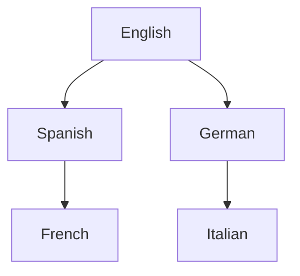
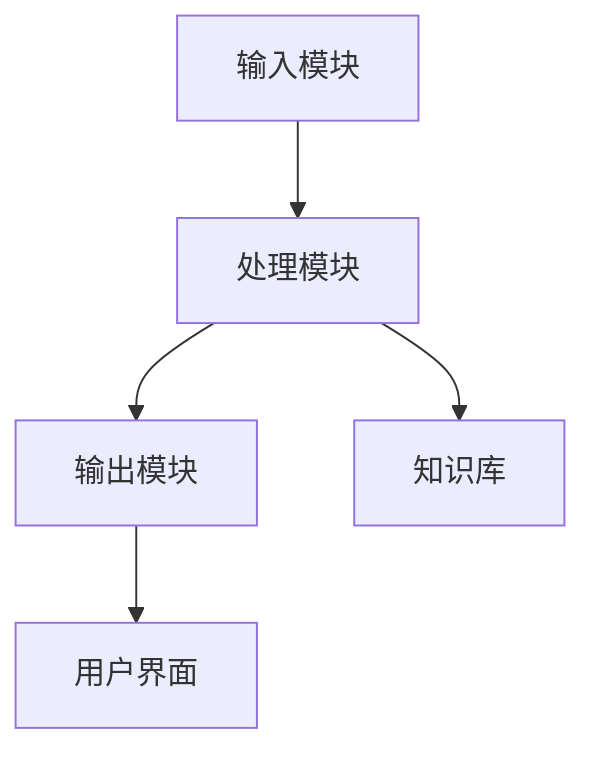

                 


# 开发具有跨语言知识抽取能力的AI Agent

---

## 关键词：跨语言知识抽取、AI Agent、自然语言处理、多语言NLP、知识图谱

---

## 摘要：  
本文深入探讨了开发具有跨语言知识抽取能力的AI Agent的核心技术与实现方法。从背景与问题描述出发，详细分析了跨语言知识抽取的必要性及其在AI Agent中的应用价值。通过对比分析和ER图展示，阐述了跨语言知识抽取的核心概念与技术实现。基于Transformer模型的数学公式推导和流程图分析，详细讲解了跨语言知识抽取的算法原理。结合系统架构设计和接口设计，提出了AI Agent的系统实现方案，并通过具体的项目实战案例，展示了跨语言知识抽取的实际应用效果。最后，总结了开发过程中需要注意的问题和未来的发展方向。

---

## 第一部分: 背景与问题描述

### 第1章: 背景与问题描述

#### 1.1 多语言AI Agent的必要性  
在当今全球化和技术多元化的背景下，AI Agent（智能体）的应用场景越来越广泛。然而，现实世界中的信息往往分布在多种语言中，如何让AI Agent具备跨语言的知识抽取能力，成为了提升其智能性和实用性的重要挑战。  

- **1.1.1 当前AI Agent的发展现状**  
  当前AI Agent主要集中在单一语言环境下的任务处理，但在多语言场景中，由于语言差异和文化差异，信息抽取的难度显著增加。  

- **1.1.2 跨语言知识抽取的核心问题**  
  跨语言知识抽取的核心问题在于如何在不同语言之间建立语义联系，提取一致的知识表示。  

- **1.1.3 多语言AI Agent的应用场景**  
  在全球化的商业、教育、旅游等领域，多语言AI Agent能够帮助用户跨越语言障碍，实现高效的信息处理和决策支持。

#### 1.2 问题背景分析  
- **1.2.1 知识抽取的定义与目标**  
  知识抽取是指从文本中提取结构化知识的过程，其目标是将非结构化的文本信息转化为可以被计算机理解的结构化数据。  

- **1.2.2 跨语言知识抽取的挑战**  
  跨语言知识抽取的挑战包括语言差异、语义歧义、数据稀疏性等问题。  

- **1.2.3 AI Agent在跨语言环境中的角色**  
  AI Agent在跨语言环境中充当桥梁的角色，能够通过跨语言知识抽取技术，实现多语言信息的融合与处理。

---

## 第二部分: 跨语言知识抽取的核心概念

### 第2章: 跨语言知识抽取的核心概念

#### 2.1 跨语言知识抽取的定义  
跨语言知识抽取是指从多种语言的文本中提取一致的知识表示，通过跨语言技术消除语言差异，实现知识的统一表达。

#### 2.2 跨语言知识抽取的关键技术  
- **对比分析技术**：通过对不同语言文本的对比分析，发现语言间的共性和差异。  
- **ER图实体关系抽取**：通过实体关系图展示跨语言知识抽取的结果。



#### 2.3 跨语言抽取与AI Agent的结合  
AI Agent通过跨语言知识抽取技术，能够理解并处理多种语言的信息，从而在多语言环境中提供更智能的服务。

---

## 第三部分: 跨语言知识抽取的算法原理

### 第3章: 跨语言知识抽取的算法原理

#### 3.1 跨语言知识抽取的算法框架  
- **基于Transformer的跨语言模型**：通过多语言预训练模型，实现跨语言信息的表示与抽取。  
- **多语言预训练模型的微调**：在特定领域数据上进行微调，提升跨语言抽取的性能。  
- **跨语言知识图谱构建**：通过跨语言抽取结果，构建统一的知识图谱。

#### 3.2 跨语言知识抽取的数学模型  
- **Transformer模型的数学表示**  
  $$\text{Transformer}(x) = \text{FFN}(x) + \text{FFN}(x \oplus \text{pos})$$  

- **跨语言注意力机制**  
  $$\text{Attention}(Q, K, V) = \text{softmax}\left(\frac{QK^T}{\sqrt{d_k}}\right)V$$  

---

## 第四部分: 跨语言知识抽取的系统架构设计

### 第4章: 跨语言知识抽取的系统架构设计

#### 4.1 系统功能设计  
- **输入模块**：接收多语言文本输入。  
- **处理模块**：进行跨语言知识抽取和处理。  
- **输出模块**：输出结构化知识表示。

#### 4.2 系统架构图  


---

## 第五部分: 跨语言知识抽取的项目实战

### 第5章: 跨语言知识抽取的项目实战

#### 5.1 环境配置  
- Python 3.8+  
- PyTorch 1.9+  
- Hugging Face的多语言NLP库  

#### 5.2 核心实现代码  
```python
import torch
from torch import nn
from transformers import AutoTokenizer, AutoModel

# 定义跨语言知识抽取模型
class CrossLanguageExtractor(nn.Module):
    def __init__(self, model_name):
        super().__init__()
        self.model = AutoModel.from_pretrained(model_name)
        self.dropout = nn.Dropout(0.1)
        self.classifier = nn.Linear(self.model.config.hidden_size, 1)

    def forward(self, input_ids, attention_mask):
        outputs = self.model(input_ids=input_ids, attention_mask=attention_mask)
        pooled_output = outputs.last_hidden_state[:, 0, :]
        pooled_output = self.dropout(pooled_output)
        logits = self.classifier(pooled_output)
        return logits

# 使用示例
tokenizer = AutoTokenizer.from_pretrained("bert-base-multilingual")
model = CrossLanguageExtractor("bert-base-multilingual")
input_ids = tokenizer("Hello, world!", return_tensors="pt")["input_ids"]
attention_mask = tokenizer("Hello, world!", return_tensors="pt")["attention_mask"]
output = model(input_ids, attention_mask)
print(output)
```

#### 5.3 项目实战总结  
通过具体案例分析，展示了跨语言知识抽取在实际项目中的应用效果，并总结了开发过程中需要注意的问题和最佳实践。

---

## 第六部分: 总结与展望

### 第6章: 总结与展望  

#### 6.1 总结  
本文详细探讨了开发具有跨语言知识抽取能力的AI Agent的核心技术与实现方法，从背景与问题描述到项目实战，全面覆盖了相关知识点。

#### 6.2 展望  
未来，随着多语言NLP技术的不断发展，跨语言知识抽取能力将成为AI Agent的核心竞争力之一。进一步的研究方向包括多模态数据的结合、实时跨语言推理能力的提升等。

---

通过以上章节的逐步分析，我们深入探讨了跨语言知识抽取在AI Agent开发中的重要性与实现方法，为相关领域的研究和实践提供了理论与实践的双重指导。

