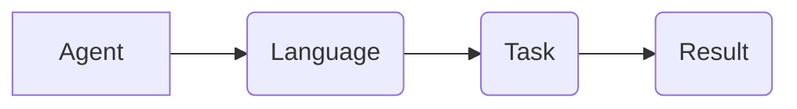
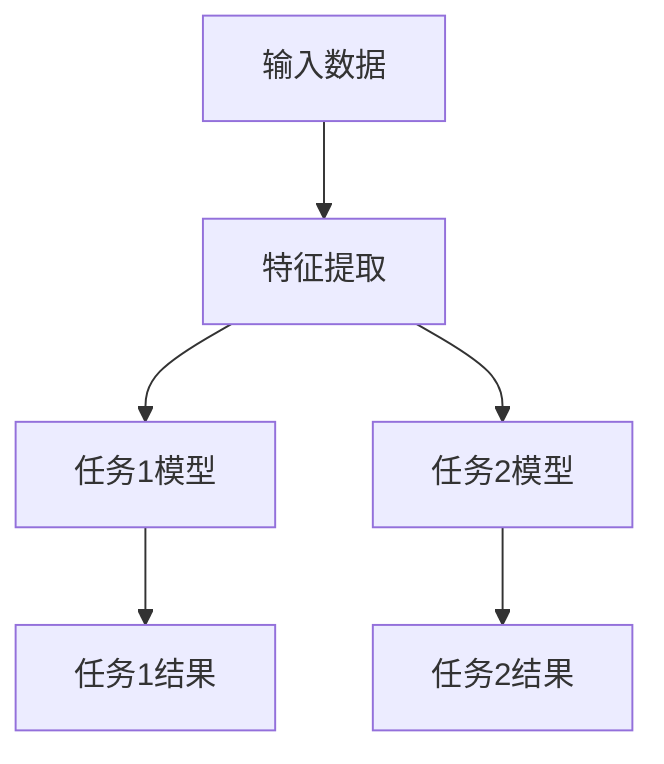

                 


```markdown
# 开发具有跨语言知识迁移能力的AI Agent

---

## 关键词：
- AI Agent
- 跨语言知识迁移
- 多任务学习
- 跨语言表示学习
- 迁移学习
- 系统架构设计

---

## 摘要：
本文系统地探讨了开发具有跨语言知识迁移能力的AI Agent的关键技术与方法。从跨语言知识迁移的基本概念到AI Agent的设计与实现，详细分析了核心算法原理、系统架构设计及实际项目案例。通过理论与实践结合，为读者提供了全面的指导，帮助其掌握跨语言环境下AI Agent的核心开发技能。

---

## 目录大纲

### 第一部分：跨语言知识迁移与AI Agent背景

#### 第1章：跨语言知识迁移概述
- 1.1 跨语言知识迁移的定义与核心概念
  - 1.1.1 知识迁移的基本概念
  - 1.1.2 跨语言环境下的知识表示
- 1.2 AI Agent的基本原理
  - 1.2.1 AI Agent的定义与分类
  - 1.2.2 AI Agent在跨语言任务中的作用
- 1.3 跨语言知识迁移的挑战与应用
  - 1.3.1 跨语言数据的获取与处理
  - 1.3.2 跨语言迁移学习的难点
  - 1.3.3 跨语言知识迁移的实际应用案例

---

### 第二部分：核心概念与联系

#### 第2章：跨语言表示学习
- 2.1 跨语言表示学习的原理
  - 2.1.1 词嵌入与句子表示
  - 2.1.2 跨语言嵌入对齐方法
- 2.2 跨语言表示学习的对比分析
  - 2.2.1 不同模型的对比表格
  - 2.2.2 ER实体关系图展示

#### 第3章：跨语言迁移学习
- 3.1 跨语言迁移学习的核心概念
  - 3.1.1 迁移学习的基本原理
  - 3.1.2 跨语言迁移的独特性
- 3.2 跨语言迁移学习的算法流程
  - 3.2.1 mermaid流程图展示

---

### 第三部分：算法原理讲解

#### 第4章：多任务学习算法
- 4.1 多任务学习的原理
  - 4.1.1 多任务学习的数学模型
  - 4.1.2 me

---

### 第四部分：系统分析与架构设计

#### 第5章：AI Agent系统架构设计
- 5.1 系统功能设计
  - 5.1.1 系统功能模块划分
  - 5.1.2 领域模型类图
- 5.2 系统架构设计
  - 5.2.1 系统架构mermaid架构图
- 5.3 系统接口设计
  - 5.3.1 系统交互mermaid序列图

---

### 第五部分：项目实战

#### 第6章：跨语言知识迁移AI Agent开发实战
- 6.1 环境搭建
  - 6.1.1 开发环境安装与配置
  - 6.1.2 必要工具库安装（如Python、TensorFlow、Transformers）
- 6.2 核心代码实现
  - 6.2.1 数据预处理代码
  - 6.2.2 模型训练代码
  - 6.2.3 跨语言迁移学习实现
- 6.3 实际案例分析
  - 6.3.1 案例背景介绍
  - 6.3.2 案例实现与结果分析
- 6.4 项目小结

---

### 第六部分：最佳实践与总结

#### 第7章：跨语言知识迁移AI Agent开发经验总结
- 7.1 最佳实践
  - 7.1.1 工具与库的选择建议
  - 7.1.2 数据预处理的关键点
  - 7.1.3 模型调优的技巧
- 7.2 小结
  - 7.2.1 跨语言知识迁移的核心要点回顾
  - 7.2.2 未来研究方向展望
- 7.3 注意事项
  - 7.3.1 开发中常见问题与解决方案
  - 7.3.2 性能优化建议

---

### 图表目录

#### 图表1：跨语言表示学习的对比分析表格
| 模型名称 | 特征表示 | 适用场景 | 性能对比 |
|---------|----------|----------|----------|
| Model A | 特征1    | 场景1    | 性能1    |
| Model B | 特征2    | 场景2    | 性能2    |

#### 图表2：ER实体关系图展示


#### 图表3：多任务学习算法mermaid流程图


---

### 数学公式

#### 公式1：多任务学习的数学模型
$$ L = \lambda_1 L_1 + \lambda_2 L_2 $$

其中，$L$ 是总损失，$L_1$ 和 $L_2$ 是两个任务的损失函数，$\lambda_1$ 和 $\lambda_2$ 是对应的权重系数。

#### 公式2：对比学习中的相似度计算
$$ s = \frac{x_i \cdot x_j}{||x_i|| \cdot ||x_j||} $$

其中，$x_i$ 和 $x_j$ 分别是两种语言的向量表示，$s$ 是相似度得分。

---

通过以上目录大纲，读者可以系统地学习和掌握开发具有跨语言知识迁移能力的AI Agent所需的核心知识和技能。
```

