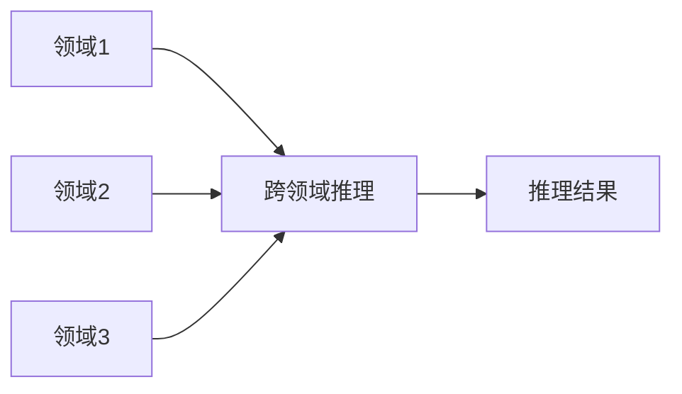
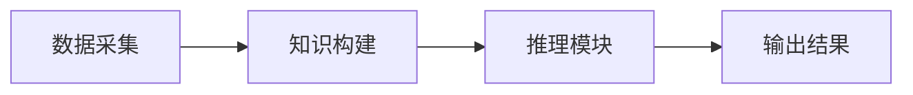
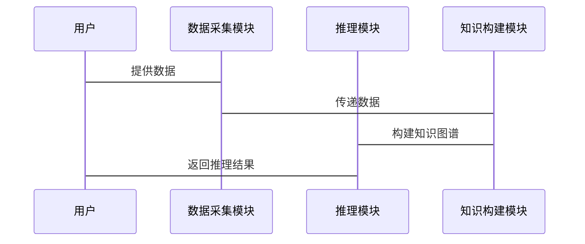
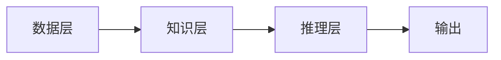

                 


# 开发具有跨领域推理能力的AI Agent

> **关键词**：AI Agent、跨领域推理、知识图谱、多模态数据、领域自适应  
> **摘要**：本文探讨如何开发具有跨领域推理能力的AI Agent，涵盖背景、核心概念、算法原理、系统架构、实战项目及最佳实践，详细解析跨领域推理的关键技术与实现路径。

---

## 第1章 背景介绍

### 1.1 问题背景
AI Agent（人工智能代理）是一种能够感知环境并采取行动以实现目标的智能体。随着技术进步，AI Agent已广泛应用于自然语言处理、计算机视觉等领域。然而，现有AI Agent通常局限于单一领域，难以处理跨领域问题，这限制了其应用范围。

#### 1.1.1 AI Agent的发展历程
AI Agent的概念最早可追溯至20世纪70年代，经历了专家系统、机器学习到深度学习的发展。当前，AI Agent在自动驾驶、智能助手等领域表现出色，但跨领域推理仍是一个挑战。

#### 1.1.2 跨领域推理的重要性
跨领域推理能力使AI Agent能够结合不同领域的知识，解决复杂问题。例如，在医疗领域，AI Agent可能需要结合医学知识和患者数据，提供更精准的诊断建议。

#### 1.1.3 当前的局限性
现有的AI Agent往往受限于单一数据源或领域，难以处理跨领域信息，导致推理结果不够准确或适用范围受限。

### 1.2 问题描述
跨领域推理是指AI Agent能够理解并整合不同领域的信息，从而做出更全面的推理。这需要AI Agent具备多模态数据处理能力和跨领域知识整合能力。

#### 1.2.1 跨领域推理的定义
跨领域推理是指AI Agent能够从多个相关领域中获取信息，并综合这些信息进行推理和决策。

#### 1.2.2 核心挑战
- 数据异构性：不同领域数据格式、语义差异大。
- 知识整合：如何有效整合多领域知识。
- 跨领域推理模型构建：如何设计模型以处理跨领域信息。

#### 1.2.3 应用场景
- 智能助手：结合天气、日历、地理位置等信息，提供更智能的服务。
- 跨领域问答：回答涉及多个领域的复杂问题。
- 多任务学习：在同一模型中处理多种任务。

### 1.3 问题解决
为实现跨领域推理，AI Agent需要融合多模态数据，构建跨领域知识图谱，并采用领域自适应学习方法。

#### 1.3.1 技术路径
1. 数据采集与预处理：整合多领域数据，进行清洗和标准化。
2. 知识建模：构建跨领域的知识图谱。
3. 模型设计：设计支持跨领域推理的深度学习模型。

#### 1.3.2 关键技术
- 多模态数据处理：整合文本、图像、语音等多种数据类型。
- 知识图谱构建：将多领域知识组织成图结构，便于推理。
- 领域自适应：使模型在不同领域间迁移，提升跨领域推理能力。

### 1.4 边界与外延
跨领域推理的边界在于不同领域的数据和知识，而外延则涉及如何扩展到更多领域。

#### 1.4.1 边界条件
- 数据范围：限定于特定领域数据。
- 知识范围：限定于已构建的知识图谱。

#### 1.4.2 外延范围
- 数据范围扩展：增加更多领域数据。
- 知识范围扩展：扩展知识图谱覆盖的领域。

#### 1.4.3 技术区别
跨领域推理不同于多任务学习，它更关注于跨领域知识的整合与推理。

### 1.5 概念结构与核心要素
跨领域推理的核心要素包括多模态数据、知识图谱和推理模型。

#### 1.5.1 概念框架
跨领域推理通过整合多模态数据和知识图谱，构建推理模型，实现跨领域推理。

#### 1.5.2 核心要素
- 多模态数据：文本、图像、语音等。
- 知识图谱：结构化的知识表示。
- 推理模型：深度学习模型，支持跨领域推理。

#### 1.5.3 实现模型
基于知识图谱的跨领域推理模型，结合多模态数据进行推理。

---

## 第2章 跨领域推理的核心概念与联系

### 2.1 跨领域推理的原理
跨领域推理通过整合多模态数据和知识图谱，构建统一的推理框架。

#### 2.1.1 基本原理
AI Agent通过多模态数据融合和知识图谱推理，实现跨领域信息的整合与推理。

#### 2.1.2 实现机制
1. 数据融合：整合多模态数据，消除数据异构性。
2. 知识推理：基于知识图谱进行跨领域推理。

#### 2.1.3 数学模型
跨领域推理模型的数学表达式如下：
$$P(y|x) = \prod_{i=1}^{n} P(y|x_i)$$
其中，$x_i$表示不同领域的特征。

### 2.2 核心概念对比
通过对比分析，明确跨领域推理与其他技术的区别。

#### 2.2.1 多任务学习对比
| 特性       | 跨领域推理                     | 多任务学习                     |
|------------|-------------------------------|-------------------------------|
| 目标       | 跨领域推理                     | 多任务学习                     |
| 方法       | 整合多领域知识                | 同时学习多个任务               |
| 应用场景   | 跨领域问题                   | 多任务环境                   |

#### 2.2.2 知识图谱对比
知识图谱是跨领域推理的重要基础，其构建和应用需结合具体场景。

#### 2.2.3 ER实体关系图


---

## 第3章 跨领域推理的算法原理

### 3.1 算法原理概述
跨领域推理算法包括多模态融合、知识图谱推理和领域自适应学习。

#### 3.1.1 多模态数据融合
多模态数据融合算法通过整合文本、图像等多种数据，提升模型的表达能力。

##### 3.1.1.1 数据预处理
- 数据清洗：去除噪声数据。
- 数据标准化：统一数据格式。

##### 3.1.1.2 数据融合方法
- 晚融合：在特征层进行融合。
- 中融合：在语义层进行融合。
- 早融合：在原始数据层进行融合。

##### 3.1.1.3 Python代码示例
```python
import pandas as pd
import numpy as np

# 文本数据
text_data = pd.DataFrame({'text': ['hello', 'world']})

# 图像数据
image_data = np.random.randn(2, 100)

# 数据融合
merged_data = pd.concat([text_data, pd.DataFrame(image_data)], axis=1)
```

#### 3.1.2 知识图谱推理
知识图谱推理算法基于图结构进行推理。

##### 3.1.2.1 知识图谱构建
- 数据抽取：从文本中抽取实体和关系。
- 知识表示：使用图结构表示知识。

##### 3.1.2.2 推理算法
- 基于规则的推理：使用逻辑规则进行推理。
- 基于学习的推理：使用深度学习模型进行推理。

##### 3.1.2.3 推理过程
1. 数据抽取：从文本中提取实体和关系。
2. 知识表示：构建知识图谱。
3. 推理：基于知识图谱进行推理。

#### 3.1.3 领域自适应学习
领域自适应学习算法使模型能够适应不同领域。

##### 3.1.3.1 领域自适应方法
- 基于样本的领域自适应：通过样本分布调整模型。
- 基于特征的领域自适应：通过特征变换使不同领域数据对齐。

##### 3.1.3.2 领域自适应挑战
- 数据分布差异：不同领域数据分布差异大。
- 标签空间差异：不同领域的标签空间可能不同。

##### 3.1.3.3 Python代码示例
```python
import torch
import torch.nn as nn

# 定义领域自适应模型
class Adapter(nn.Module):
    def __init__(self, input_size, output_size):
        super(Adapter, self).__init__()
        self.adapter = nn.Linear(input_size, output_size)

    def forward(self, x):
        return self.adapter(x)

# 初始化模型
adapter = Adapter(100, 50)
```

### 3.2 算法实现细节

#### 3.2.1 多模态数据融合算法
- 晚融合：特征级融合。
- 中融合：语义级融合。
- 早融合：数据级融合。

#### 3.2.2 知识图谱推理算法
- 基于规则的推理：使用逻辑规则进行推理。
- 基于学习的推理：使用深度学习模型进行推理。

#### 3.2.3 领域自适应学习算法
- 样本的领域自适应：调整样本分布。
- 特征的领域自适应：对齐特征空间。

---

## 第4章 系统分析与架构设计方案

### 4.1 系统分析
系统需要支持多领域数据的接入、处理和推理。

#### 4.1.1 项目介绍
开发一个支持跨领域推理的AI Agent系统，涵盖数据处理、知识构建和推理模块。

#### 4.1.2 系统功能设计
- 数据采集模块：接入多领域数据。
- 知识构建模块：构建跨领域知识图谱。
- 推理模块：实现跨领域推理。

#### 4.1.3 系统架构设计


#### 4.1.4 系统接口设计
- 数据接口：提供API用于数据接入。
- 推理接口：提供API用于推理请求。

#### 4.1.5 系统交互


### 4.2 系统架构
系统架构包括数据层、知识层和推理层。

#### 4.2.1 系统架构图


#### 4.2.2 系统实现
- 数据层：存储多领域数据。
- 知识层：构建知识图谱。
- 推理层：实现跨领域推理。

---

## 第5章 项目实战

### 5.1 环境安装
安装必要的Python库，如TensorFlow、PyTorch、NetworkX。

#### 5.1.1 安装命令
```bash
pip install tensorflow torch networkx
```

### 5.2 系统核心实现
实现数据采集、知识构建和推理模块。

#### 5.2.1 核心代码
```python
import networkx as nx

# 数据采集
def collect_data():
    # 从不同领域采集数据
    pass

# 知识构建
def build_kg():
    G = nx.DiGraph()
    G.add_edge('领域1', '领域2')
    G.add_edge('领域2', '推理结果')
    return G

# 推理模块
def cross_domain_inference():
    G = build_kg()
    # 基于知识图谱进行推理
    pass
```

#### 5.2.2 代码解读
- 数据采集：从不同领域采集数据。
- 知识构建：构建知识图谱。
- 推理模块：基于知识图谱进行推理。

### 5.3 实际案例分析
通过具体案例展示系统的应用。

#### 5.3.1 案例描述
AI Agent在医疗领域的应用，结合医学知识和患者数据进行推理。

#### 5.3.2 分析过程
1. 数据采集：收集患者数据和医学知识。
2. 知识构建：构建医疗知识图谱。
3. 推理：基于知识图谱进行诊断推理。

#### 5.3.3 结果展示
推理结果展示，如诊断建议。

---

## 第6章 最佳实践、小结、注意事项与拓展阅读

### 6.1 最佳实践
- 数据预处理：确保数据质量。
- 知识构建：构建高质量的知识图谱。
- 模型优化：优化跨领域推理模型。

### 6.2 小结
本文详细探讨了开发具有跨领域推理能力的AI Agent的关键技术与实现方法，涵盖背景、核心概念、算法原理、系统架构、项目实战及最佳实践。

### 6.3 注意事项
- 数据异构性处理：不同领域的数据格式和语义差异大，需进行预处理。
- 知识整合：跨领域知识图谱的构建需要考虑数据的多样性和关联性。
- 领域适应：领域自适应学习需解决数据分布差异和标签空间差异。

### 6.4 拓展阅读
- 多模态数据处理：研究如何更有效地整合多种数据类型。
- 知识图谱推理：探索更高效的推理算法。
- 领域自适应学习：研究更先进的领域自适应方法。

---

## 总结
开发具有跨领域推理能力的AI Agent是一项复杂的任务，涉及多模态数据处理、知识图谱构建和领域自适应学习等关键技术。通过本文的探讨，读者可以深入了解跨领域推理的核心概念、算法原理和系统架构，为实际应用提供理论支持和实践指导。未来，随着技术的进步，跨领域推理能力的AI Agent将在更多领域展现出其强大的应用潜力。

