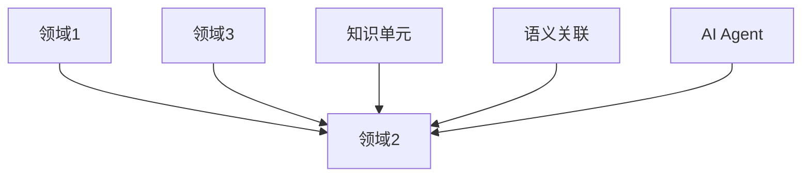
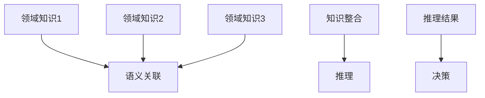
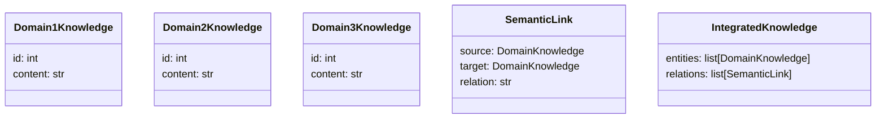
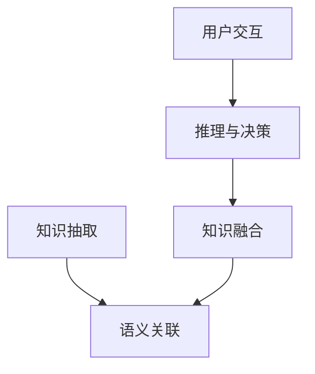
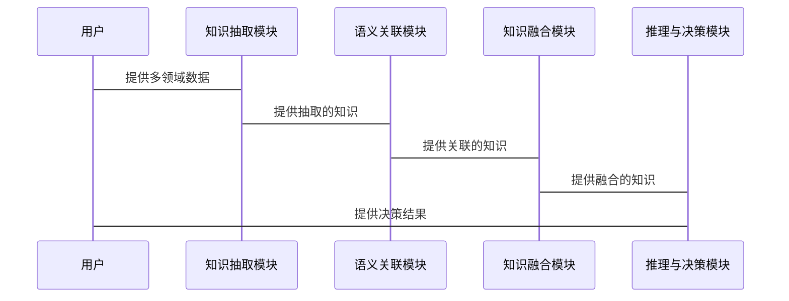

                 


# 开发具有跨领域知识整合能力的AI Agent

## 关键词：AI Agent, 跨领域知识整合, 知识图谱, 机器学习, 自然语言处理

## 摘要：  
随着人工智能技术的快速发展，AI Agent（智能体）在跨领域知识整合中的应用日益广泛。本文将深入探讨如何开发具有跨领域知识整合能力的AI Agent，从背景介绍、核心概念、算法原理、系统架构设计到项目实战，全面解析其实现方法和应用场景。通过本文的学习，读者将能够理解并掌握跨领域知识整合的核心技术，为实际项目开发提供理论支持和实践指导。

---

# 第一部分: AI Agent与跨领域知识整合的背景与概念

## 第1章: 背景介绍

### 1.1 问题背景
#### 1.1.1 当前AI技术的发展现状
人工智能（AI）技术近年来取得了显著进展，尤其是在自然语言处理（NLP）、机器学习（ML）、计算机视觉（CV）等领域。然而，现有的AI系统往往局限于单一领域，难以处理跨领域的问题。例如，一个医疗AI系统可能无法直接整合医疗、法律或金融领域的知识，这限制了其应用场景和能力。

#### 1.1.2 跨领域知识整合的必要性
在现实世界中，问题通常是跨领域的。例如，在医疗领域，医生可能需要结合医学知识和法律知识来制定合规的治疗方案。因此，开发能够整合多领域知识的AI Agent具有重要意义。

#### 1.1.3 AI Agent在跨领域整合中的角色
AI Agent作为智能体，能够通过感知环境、处理信息、执行任务来实现跨领域知识的整合。其核心任务是将不同领域的知识进行语义关联、融合和推理，从而为用户提供更全面、更智能的服务。

### 1.2 问题描述
#### 1.2.1 跨领域知识整合的核心挑战
跨领域知识整合的主要挑战包括：
1. **语义鸿沟**：不同领域之间的术语和概念可能存在差异，导致语义理解困难。
2. **数据异构性**：多领域数据来源、格式和结构差异较大，难以统一处理。
3. **知识关联复杂性**：跨领域知识的关联需要复杂的推理机制。

#### 1.2.2 AI Agent在知识整合中的目标与任务
AI Agent的目标是通过整合多领域知识，提供更智能、更准确的决策支持。其主要任务包括：
1. 知识抽取：从多个领域中提取有用的知识。
2. 语义关联：建立跨领域知识之间的语义联系。
3. 知识融合：将多个领域的知识进行融合，形成统一的知识表示。
4. 推理与决策：基于整合的知识进行推理和决策。

#### 1.2.3 当前技术的局限性与改进方向
当前技术在跨领域知识整合方面存在以下局限性：
1. 知识表示缺乏统一性。
2. 跨领域推理能力有限。
3. 数据整合效率较低。

改进方向包括：
1. 提高知识表示的统一性。
2. 增强跨领域推理能力。
3. 提升数据整合效率。

### 1.3 问题解决
#### 1.3.1 跨领域知识整合的解决方案
通过结合知识图谱、自然语言处理和机器学习技术，构建跨领域知识整合的解决方案。

#### 1.3.2 AI Agent在整合中的具体实现方式
AI Agent通过以下步骤实现跨领域知识整合：
1. 知识抽取：从多领域数据中提取知识。
2. 语义关联：建立知识之间的语义联系。
3. 知识融合：将多领域知识进行融合。
4. 推理与决策：基于融合的知识进行推理和决策。

#### 1.3.3 技术路线与实现路径
技术路线包括：
1. 数据预处理：清洗和标注多领域数据。
2. 知识抽取：使用NLP技术提取知识。
3. 语义关联：构建知识图谱。
4. 知识融合：整合多领域知识。
5. 推理与决策：基于知识图谱进行推理。

### 1.4 边界与外延
#### 1.4.1 跨领域知识整合的边界
跨领域知识整合的边界包括：
1. 知识的深度：仅整合浅层知识，不涉及领域内部的复杂逻辑。
2. 领域的数量：限制在特定数量的领域内。
3. 知识的类型：仅整合结构化知识，不涉及非结构化知识。

#### 1.4.2 AI Agent的能力边界
AI Agent的能力边界包括：
1. 知识整合范围：仅限于特定领域的知识。
2. 推理能力：仅能处理简单的推理任务。
3. 决策能力：仅能提供基于知识的决策建议。

#### 1.4.3 相关领域与技术的外延
相关领域包括：
1. 知识图谱构建。
2. 多领域NLP。
3. 跨领域机器学习。

### 1.5 概念结构与核心要素
#### 1.5.1 跨领域知识整合的核心要素
核心要素包括：
1. 多领域数据源。
2. 知识表示模型。
3. 语义关联规则。
4. 知识融合算法。
5. 推理引擎。

#### 1.5.2 AI Agent的能力结构
能力结构包括：
1. 知识抽取能力。
2. 语义关联能力。
3. 知识融合能力。
4. 推理与决策能力。

#### 1.5.3 知识整合的逻辑框架
逻辑框架包括：
1. 数据输入：多领域数据。
2. 知识抽取：提取领域知识。
3. 语义关联：建立知识联系。
4. 知识融合：整合知识。
5. 推理与决策：基于知识进行推理和决策。

### 1.6 本章小结
本章介绍了跨领域知识整合的背景、问题背景、核心概念、技术挑战以及解决方案。通过本章的学习，读者可以理解跨领域知识整合的重要性和基本实现方法。

---

## 第2章: 跨领域知识整合的核心概念与联系

### 2.1 核心概念原理
#### 2.1.1 跨领域知识整合的原理
跨领域知识整合的原理包括：
1. 知识抽取：从多领域数据中提取有用的知识。
2. 语义关联：建立知识之间的语义联系。
3. 知识融合：将多领域知识进行融合，形成统一的知识表示。

#### 2.1.2 AI Agent的知识表示与推理机制
知识表示包括：
1. 实体表示：使用图结构表示实体及其属性。
2. 关系表示：使用关系图表示实体之间的关系。

推理机制包括：
1. 前向推理：基于知识图谱进行推理。
2. 反向推理：从目标出发进行推理。

#### 2.1.3 跨领域知识的语义关联与融合
语义关联包括：
1. 基于相似度的关联：通过计算术语的相似度进行关联。
2. 基于上下文的关联：通过分析上下文进行关联。

知识融合包括：
1. 基于规则的融合：使用预定义规则进行融合。
2. 基于学习的融合：使用机器学习模型进行融合。

### 2.2 概念属性特征对比表格

| 概念 | 属性 | 特征 |
|------|------|------|
| 跨领域知识 | 来源 | 多领域、多维度 |
| AI Agent | 能力 | 知识整合、推理、执行 |
| 知识整合 | 方法 | 语义关联、知识融合 |

### 2.3 ER实体关系图



### 2.4 本章小结
本章详细介绍了跨领域知识整合的核心概念、原理和实现方法。通过本章的学习，读者可以理解跨领域知识整合的基本原理和实现步骤。

---

## 第3章: AI Agent的知识整合算法原理

### 3.1 算法原理讲解
#### 3.1.1 跨领域知识整合的基本算法
跨领域知识整合的基本算法包括：
1. 基于图的语义关联算法。
2. 知识融合算法。
3. 推理算法。

#### 3.1.2 基于图的语义关联算法
基于图的语义关联算法通过构建知识图谱来建立实体之间的语义关联。算法步骤包括：
1. 数据预处理：清洗和标注数据。
2. 实体识别：识别实体及其属性。
3. 关系抽取：抽取实体之间的关系。
4. 知识图谱构建：构建知识图谱。

#### 3.1.3 知识融合与推理算法
知识融合算法通过将多个领域的知识进行融合，形成统一的知识表示。推理算法基于知识图谱进行推理，生成新的知识。

### 3.2 算法mermaid流程图



### 3.3 算法实现代码

```python
def integrate_knowledge(domain1, domain2, domain3):
    # 数据预处理
    knowledge = []
    for d in [domain1, domain2, domain3]:
        knowledge.extend(extract_knowledge(d))
    # 语义关联
    graph = build_graph(knowledge)
    # 知识融合
    integrated_knowledge = fuse_knowledge(graph)
    return integrated_knowledge

def extract_knowledge(domain):
    # 知识抽取逻辑
    pass

def build_graph(knowledge):
    # 图构建逻辑
    pass

def fuse_knowledge(graph):
    # 知识融合逻辑
    pass
```

### 3.4 本章小结
本章详细介绍了跨领域知识整合的基本算法，包括基于图的语义关联算法、知识融合算法和推理算法。通过本章的学习，读者可以理解跨领域知识整合的算法实现方法。

---

# 第四部分: 系统分析与架构设计

## 第4章: 系统分析

### 4.1 问题场景介绍
跨领域知识整合的系统主要用于处理多领域数据，提供智能决策支持。例如，在医疗领域，系统可以整合医学、法律和金融领域的知识，为医生提供合规的治疗方案。

### 4.2 系统功能设计
系统功能设计包括：
1. 知识抽取模块：从多领域数据中提取知识。
2. 语义关联模块：建立知识之间的语义关联。
3. 知识融合模块：将多领域知识进行融合。
4. 推理与决策模块：基于融合的知识进行推理和决策。

### 4.3 领域模型类图



### 4.4 系统架构图



### 4.5 系统接口设计
系统接口设计包括：
1. 数据接口：提供多领域数据输入接口。
2. 知识接口：提供知识提取和关联接口。
3. 推理接口：提供基于知识的推理接口。

### 4.6 系统交互流程图



### 4.7 本章小结
本章详细介绍了跨领域知识整合系统的功能设计、系统架构和交互流程。通过本章的学习，读者可以理解系统的整体架构和实现步骤。

---

## 第5章: 系统架构设计

### 5.1 问题场景介绍
跨领域知识整合系统的架构设计需要考虑多领域数据的处理、知识的抽取、语义的关联以及推理的实现。

### 5.2 系统功能设计
系统功能设计包括：
1. 知识抽取模块：从多领域数据中提取知识。
2. 语义关联模块：建立知识之间的语义关联。
3. 知识融合模块：将多领域知识进行融合。
4. 推理与决策模块：基于融合的知识进行推理和决策。

### 5.3 系统架构图


### 5.4 系统模块设计
系统模块设计包括：
1. 知识抽取模块：负责从多领域数据中提取知识。
2. 语义关联模块：负责建立知识之间的语义关联。
3. 知识融合模块：负责将多领域知识进行融合。
4. 推理与决策模块：负责基于融合的知识进行推理和决策。

### 5.5 系统接口设计
系统接口设计包括：
1. 数据接口：提供多领域数据输入接口。
2. 知识接口：提供知识提取和关联接口。
3. 推理接口：提供基于知识的推理接口。

### 5.6 本章小结
本章详细介绍了跨领域知识整合系统的架构设计，包括系统功能、模块设计和接口设计。通过本章的学习，读者可以理解系统的整体架构和实现步骤。

---

## 第6章: 系统接口与交互设计

### 6.1 API接口设计
API接口设计包括：
1. 数据接口：提供多领域数据输入接口。
2. 知识接口：提供知识提取和关联接口。
3. 推理接口：提供基于知识的推理接口。

### 6.2 交互流程图


### 6.3 系统交互流程
系统交互流程包括：
1. 用户提供多领域数据。
2. 知识抽取模块从数据中提取知识。
3. 语义关联模块建立知识之间的语义关联。
4. 知识融合模块将多领域知识进行融合。
5. 推理与决策模块基于融合的知识进行推理和决策。
6. 系统向用户返回决策结果。

### 6.4 本章小结
本章详细介绍了跨领域知识整合系统的接口设计和交互流程。通过本章的学习，读者可以理解系统的交互设计和实现步骤。

---

# 第五部分: 项目实战

## 第7章: 项目实战

### 7.1 环境安装
项目实战需要以下环境：
1. Python 3.8+
2. 知识图谱构建工具（如Neo4j）。
3. 自然语言处理库（如spaCy）。
4. 机器学习库（如Scikit-learn）。

### 7.2 核心代码实现
核心代码实现包括：
1. 知识抽取模块：使用spaCy进行文本抽取。
2. 语义关联模块：使用Neo4j构建知识图谱。
3. 知识融合模块：使用Scikit-learn进行知识融合。
4. 推理与决策模块：基于知识图谱进行推理。

### 7.3 代码实现
以下是知识抽取模块的代码示例：

```python
import spacy

nlp = spacy.load("en_core_web_sm")

def extract_knowledge(text):
    doc = nlp(text)
    knowledge = []
    for token in doc:
        if token.lemma_ != "-PRON-":
            knowledge.append((token.text, token.pos_, token.lemma_))
    return knowledge
```

### 7.4 代码应用解读与分析
知识抽取模块使用spaCy对文本进行分词和词性标注，提取实体及其属性。

### 7.5 案例分析
案例分析包括：
1. 数据输入：多领域文本数据。
2. 知识抽取：提取实体及其属性。
3. 语义关联：建立实体之间的语义关联。
4. 知识融合：将多领域知识进行融合。
5. 推理与决策：基于融合的知识进行推理和决策。

### 7.6 项目总结
通过本章的学习，读者可以理解跨领域知识整合系统的实际应用和实现步骤。

### 7.7 本章小结
本章通过实际案例展示了跨领域知识整合系统的开发过程，包括环境安装、核心代码实现和案例分析。

---

## 第8章: 最佳实践与注意事项

### 8.1 最佳实践 tips
1. 在开发过程中，建议使用知识图谱构建工具（如Neo4j）来提高效率。
2. 知识融合时，建议使用基于规则的方法和基于学习的方法结合使用。
3. 推理时，建议使用前向推理和反向推理结合使用。

### 8.2 小结
通过本文的学习，读者可以理解并掌握跨领域知识整合的核心技术，为实际项目开发提供理论支持和实践指导。

### 8.3 注意事项
1. 在开发过程中，需要注意数据的异构性和语义的多样性。
2. 在知识融合时，需要注意知识的准确性和完整性。
3. 在推理时，需要注意推理的准确性和效率。

### 8.4 拓展阅读
建议读者进一步阅读以下文献：
1. 知识图谱构建的相关文献。
2. 多领域自然语言处理的相关文献。
3. 跨领域机器学习的相关文献。

### 8.5 本章小结
本章总结了跨领域知识整合系统的开发经验，提供了最佳实践和注意事项，为读者的项目开发提供了指导。

---

# 结语

通过本文的学习，读者可以全面理解并掌握跨领域知识整合的核心技术。从背景介绍、核心概念、算法原理、系统架构设计到项目实战，本文为读者提供了系统的知识体系和实践指导。希望本文能为读者在开发具有跨领域知识整合能力的AI Agent方面提供有价值的参考和启发。

---

**全文完**

