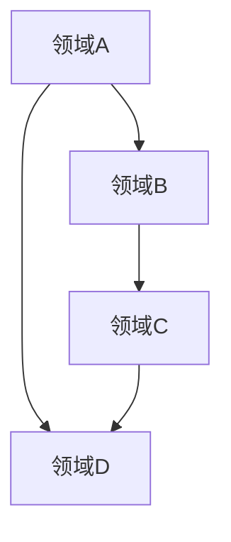
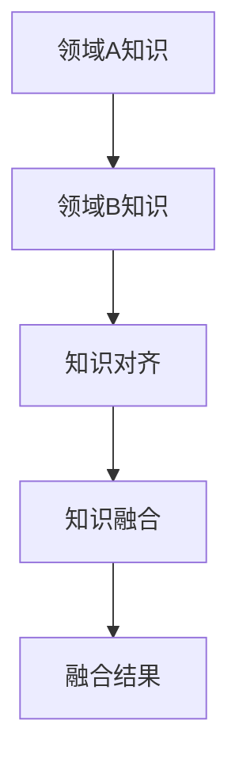
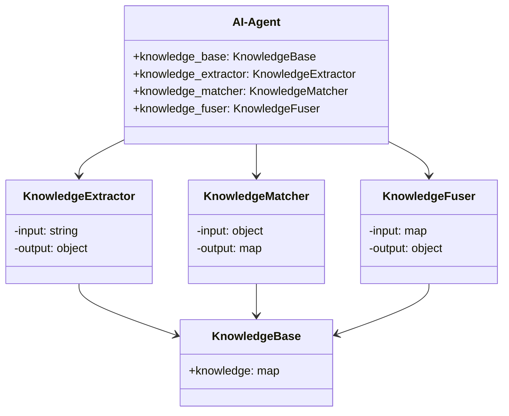
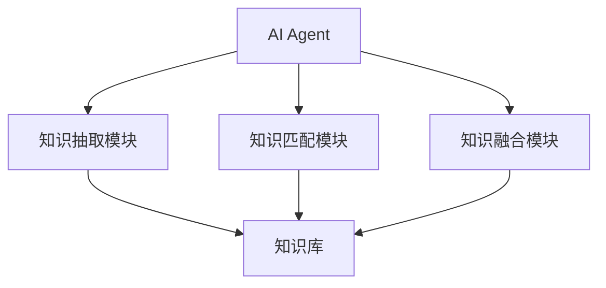
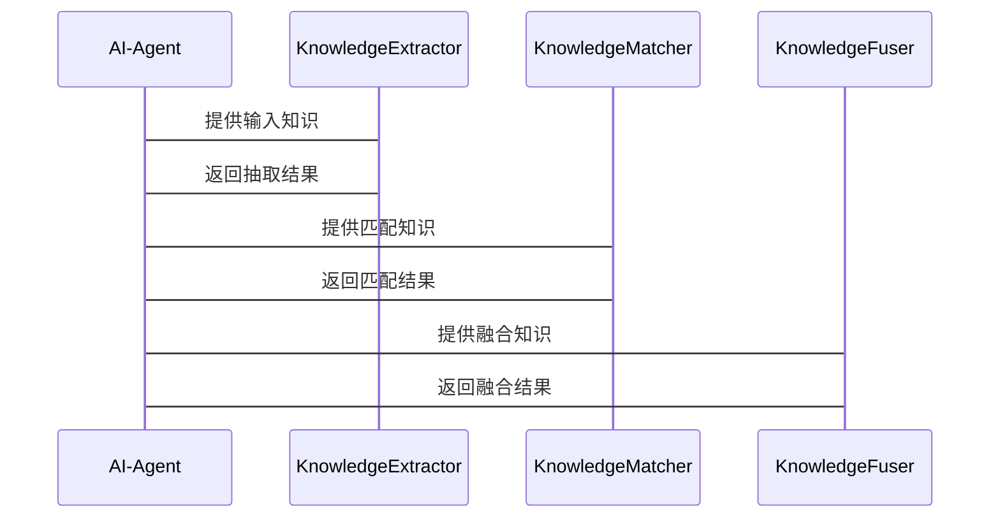

                 

# 开发具有跨领域知识融合能力的AI Agent

> 关键词：AI Agent，跨领域知识融合，知识表示，知识对齐，深度学习

> 摘要：  
本文详细探讨了开发具有跨领域知识融合能力的AI Agent的核心概念、算法原理和系统架构设计。从AI Agent的基本概念出发，分析了跨领域知识融合的背景、挑战和核心问题，深入讲解了知识表示与融合的数学模型、算法实现以及系统架构设计。通过实际案例分析和项目实战，帮助读者掌握跨领域知识融合在AI Agent中的应用，并提供了最佳实践和小结。

---

## 第1章: AI Agent与跨领域知识融合概述

### 1.1 AI Agent的基本概念与背景介绍

#### 1.1.1 什么是AI Agent
AI Agent（人工智能代理）是一种能够感知环境、自主决策并执行任务的智能实体。它通过传感器获取信息，利用推理能力分析信息，并通过执行器与环境交互。AI Agent的核心目标是通过智能化的方式解决复杂问题。

#### 1.1.2 AI Agent的核心要素
- **感知能力**：通过传感器获取环境信息。
- **推理能力**：基于知识库进行逻辑推理。
- **决策能力**：根据推理结果做出决策。
- **执行能力**：通过执行器与环境交互。

#### 1.1.3 跨领域知识融合的必要性
AI Agent的智能性依赖于知识的深度和广度。跨领域知识融合能够帮助AI Agent在多个领域之间建立联系，从而提升其解决问题的能力。

### 1.2 跨领域知识融合的背景与问题背景

#### 1.2.1 当前AI Agent的发展现状
AI Agent已广泛应用于自动驾驶、智能客服、机器人等领域。然而，现有AI Agent的知识域通常局限于单一领域，难以应对跨领域的复杂问题。

#### 1.2.2 跨领域知识融合的挑战
- **知识异构性**：不同领域之间的知识表示方式不同。
- **知识不完备性**：跨领域知识可能存在冲突或不一致。
- **知识复杂性**：跨领域知识的整合需要复杂的推理逻辑。

#### 1.2.3 跨领域知识融合的必要性
跨领域知识融合是AI Agent实现更高智能水平的关键。通过整合多个领域的知识，AI Agent能够更好地理解和解决复杂问题。

### 1.3 跨领域知识融合的核心问题

#### 1.3.1 知识表示与整合的挑战
- **知识表示的多样性**：不同领域可能使用不同的符号或术语。
- **知识整合的复杂性**：需要解决符号冲突和语义歧义。

#### 1.3.2 不同领域知识的异构性问题
- **符号异构**：不同领域使用不同的符号表示。
- **语义异构**：不同领域对相同符号的语义理解不同。

#### 1.3.3 知识融合的目标与边界
- **目标**：通过整合多个领域的知识，形成统一的知识表示。
- **边界**：明确知识融合的范围和限制，避免信息冗余或遗漏。

### 1.4 本書的核心目标与结构安排

#### 1.4.1 本书的核心目标
本书旨在帮助读者理解跨领域知识融合的核心概念，并掌握其在AI Agent中的实现方法。

#### 1.4.2 本书的结构安排
- **第1章**：AI Agent与跨领域知识融合概述。
- **第2章**：跨领域知识融合的核心概念与联系。
- **第3章**：跨领域知识融合的算法原理。
- **第4章**：系统分析与架构设计。

#### 1.4.3 学习本书的前置知识
- 基础的AI知识。
- 熟悉深度学习和自然语言处理技术。

---

## 第2章: 跨领域知识融合的核心概念与联系

### 2.1 跨领域知识融合的原理

#### 2.1.1 知识表示的基本原理
知识表示是跨领域知识融合的基础。通过符号、语义网络等方式表示知识，以便后续的对齐和融合。

#### 2.1.2 跨领域知识的异构表示
- **符号表示**：使用符号表示知识。
- **语义表示**：通过语义网络表示知识的语义关系。

#### 2.1.3 知识融合的数学模型
知识融合的数学模型描述了如何将不同领域的知识整合到一个统一的表示中。

### 2.2 跨领域知识融合的实现方法

#### 2.2.1 基于符号逻辑的知识融合
- **符号逻辑表示**：使用逻辑符号表示知识。
- **知识对齐**：通过符号对齐实现跨领域知识的整合。

#### 2.2.2 基于概率统计的知识融合
- **概率表示**：通过概率分布表示知识的不确定性。
- **统计对齐**：基于统计方法对齐知识。

#### 2.2.3 基于深度学习的知识融合
- **深度学习表示**：通过神经网络表示知识。
- **端到端融合**：基于深度学习模型实现知识的自动融合。

### 2.3 跨领域知识融合的对比分析

#### 2.3.1 不同知识融合方法的优缺点对比
| 方法              | 优点                          | 缺点                          |
|-------------------|-------------------------------|-------------------------------|
| 符号逻辑          | 精确性高，可解释性强          | 难以处理复杂语义              |
| 概率统计          | 能处理不确定性，鲁棒性高      | 计算复杂，可解释性差          |
| 深度学习          | 自动学习能力强，语义表示丰富  | 可解释性差，难以调试          |

#### 2.3.2 符号逻辑与深度学习的结合
符号逻辑提供明确的语义，深度学习提供强大的表示能力。两者的结合可以充分发挥各自的优势。

### 2.4 跨领域知识融合的ER实体关系图

---

## 第3章: 跨领域知识融合的算法原理

### 3.1 跨领域知识融合的算法概述

#### 3.1.1 算法的输入与输出
- **输入**：多个领域的知识表示。
- **输出**：统一的跨领域知识表示。

#### 3.1.2 算法的基本步骤
1. 知识抽取与表示。
2. 知识对齐与匹配。
3. 知识融合与整合。

#### 3.1.3 算法的复杂度分析
算法复杂度主要取决于知识的规模和领域数量。

### 3.2 跨领域知识融合的具体实现

#### 3.2.1 知识抽取与表示
通过自然语言处理技术从文本中抽取知识，并表示为符号或语义向量。

#### 3.2.2 知识对齐与匹配
基于符号逻辑或统计方法，对齐不同领域的知识。

#### 3.2.3 知识融合与整合
将对齐后的知识进行融合，形成统一的知识表示。

### 3.3 跨领域知识融合的数学模型

#### 3.3.1 知识表示的数学模型
$$
\text{知识表示} = \bigcup_{i=1}^{n} \{k_i\}
$$

#### 3.3.2 知识融合的数学公式
$$
\text{融合结果} = f(\text{领域A知识}, \text{领域B知识})
$$

### 3.4 跨领域知识融合的算法流程图

---

## 第4章: 系统分析与架构设计

### 4.1 系统功能需求分析

#### 4.1.1 系统目标
开发一个能够实现跨领域知识融合的AI Agent系统。

#### 4.1.2 系统功能模块
- 知识抽取模块。
- 知识对齐模块。
- 知识融合模块。

#### 4.1.3 系统输入与输出
- **输入**：多领域知识表示。
- **输出**：统一的跨领域知识表示。

### 4.2 系统架构设计

#### 4.2.1 系统架构类图

#### 4.2.2 系统架构图

#### 4.2.3 系统接口设计
- **API接口**：提供RESTful API接口，供其他系统调用。
- **数据格式**：使用JSON格式进行数据交换。

#### 4.2.4 系统交互流程图

---

## 总结

通过以上章节的详细讲解，我们全面探讨了开发具有跨领域知识融合能力的AI Agent的核心概念、算法原理和系统架构设计。从理论到实践，帮助读者掌握跨领域知识融合的关键技术，并能够将其应用到实际项目中。后续章节将通过具体案例和项目实战，进一步深入讲解跨领域知识融合的实现细节。

