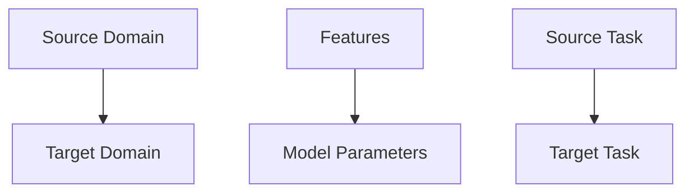
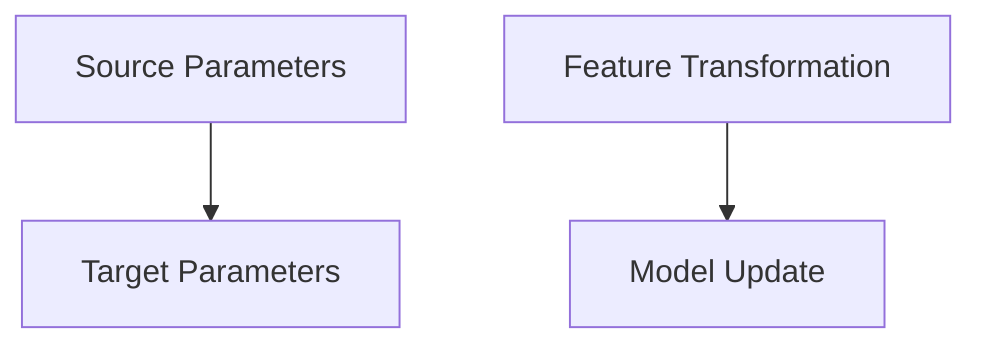
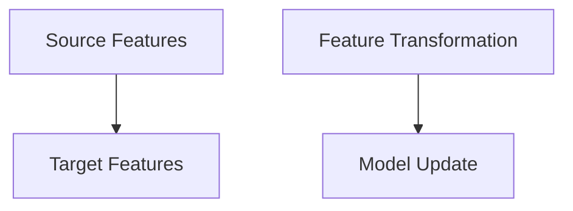
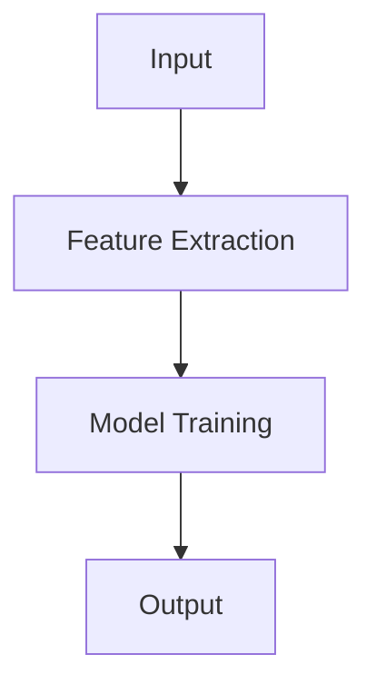
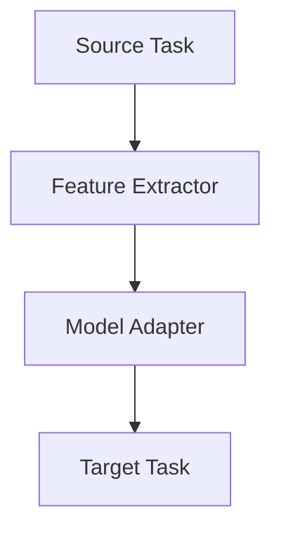

                 


# 开发具有迁移学习能力的AI Agent

## 关键词
迁移学习, AI Agent, 机器学习, 系统架构, 项目实战

## 摘要
本文系统地探讨了如何在AI Agent中实现迁移学习能力，涵盖从理论基础到实际应用的完整流程。通过分析迁移学习的核心概念、算法原理、系统架构设计以及项目实战，本文为读者提供了全面的技术指导。文章详细讲解了如何将迁移学习应用于AI Agent的开发，包括环境安装、代码实现、案例分析等，帮助读者掌握迁移学习的实际应用技巧。最后，本文总结了开发过程中需要注意的问题和未来的研究方向。

---

# 目录大纲

## 第一部分：迁移学习与AI Agent概述

### 第1章：迁移学习的背景与概念

#### 1.1 迁移学习的定义与背景
- 1.1.1 传统机器学习的局限性
- 1.1.2 迁移学习的提出与核心思想
- 1.1.3 迁移学习的应用场景与优势

#### 1.2 AI Agent的基本概念
- 1.2.1 AI Agent的定义与特点
- 1.2.2 AI Agent的核心功能与分类
- 1.2.3 迁移学习在AI Agent中的作用

## 第二部分：迁移学习的核心概念与原理

### 第2章：迁移学习的核心概念与原理

#### 2.1 迁移学习的核心概念
- 2.1.1 迁移学习的三要素：任务、特征空间、知识表示
- 2.1.2 迁移学习的两种主要范式：基于特征的迁移与基于参数的迁移
- 2.1.3 迁移学习的四种主要方法：直接迁移、领域适配、共同学习、自适应学习

#### 2.2 迁移学习的数学模型与公式
- 2.2.1 迁移学习的特征空间表示
$$ x_{i} \in \mathbb{R}^{d} $$
- 2.2.2 迁移学习的目标函数
$$ L_{\text{transfer}}(f) = \lambda L_{\text{source}}(f) + (1-\lambda) L_{\text{target}}(f) $$
- 2.2.3 迁移学习的领域适配公式
$$ D_{\text{source}}(x) \rightarrow D_{\text{target}}(x') $$

#### 2.3 迁移学习的ER实体关系图


## 第三部分：AI Agent的迁移学习算法原理

### 第3章：AI Agent的迁移学习算法原理

#### 3.1 基于参数迁移的核心算法
- 3.1.1 参数迁移的数学模型
$$ \theta_{\text{target}} = \theta_{\text{source}} + \alpha (x_{\text{target}} - x_{\text{source}}) $$
- 3.1.2 参数迁移的实现步骤


#### 3.2 基于特征迁移的核心算法
- 3.2.1 特征迁移的数学模型
$$ f_{\text{transfer}}(x) = W_{\text{source}} x + b_{\text{source}} + \Delta W x + \Delta b $$
- 3.2.2 特征迁移的实现步骤


## 第四部分：AI Agent的系统架构设计

### 第4章：AI Agent的系统架构设计

#### 4.1 系统功能设计
- 4.1.1 系统功能模块划分
- 4.1.2 系统功能流程图


#### 4.2 系统架构设计
- 4.2.1 系统架构图


## 第五部分：项目实战

### 第5章：迁移学习在AI Agent中的项目实战

#### 5.1 环境安装与配置
- 5.1.1 开发工具安装
- 5.1.2 数据集准备
- 5.1.3 环境配置代码示例

#### 5.2 核心算法实现
- 5.2.1 参数迁移算法实现
```python
def parameter_transfer(source_model, target_model, alpha=0.1):
    for param_t, param_s in zip(target_model.parameters(), source_model.parameters()):
        param_t.data = param_s.data * alpha + (1 - alpha) * param_t.data
```
- 5.2.2 特征迁移算法实现
```python
def feature_transfer(source_features, target_features):
    # 实现特征变换矩阵
    transform_matrix = torch.randn(source_features.size(-1), target_features.size(-1))
    target_features = target_features @ transform_matrix
    return target_features
```

#### 5.3 系统功能实现
- 5.3.1 系统功能代码实现
```python
class AI_Agent:
    def __init__(self, source_model, target_task):
        self.source_model = source_model
        self.target_task = target_task
        # 初始化迁移学习模块
        self.transfer_layer = nn.Linear(source_model.out_features, target_task.in_features)
    
    def forward(self, input):
        features = self.source_model(input)
        transferred_features = self.transfer_layer(features)
        output = self.target_task(transferred_features)
        return output
```

## 第六部分：总结与展望

### 第6章：总结与展望

#### 6.1 开发经验总结
- 6.1.1 关键技术总结
- 6.1.2 开发注意事项
- 6.1.3 最佳实践 tips

#### 6.2 未来研究方向
- 6.2.1 迁移学习的优化与改进
- 6.2.2 新兴技术对迁移学习的影响
- 6.2.3 迁移学习的跨领域应用探索

---

通过以上目录结构，我们可以系统地学习和理解如何开发具有迁移学习能力的AI Agent。每一部分都详细介绍了相关概念、算法原理、系统设计和实际应用，帮助读者从理论到实践全面掌握迁移学习在AI Agent开发中的应用。

