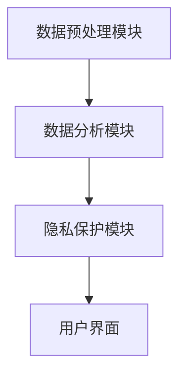
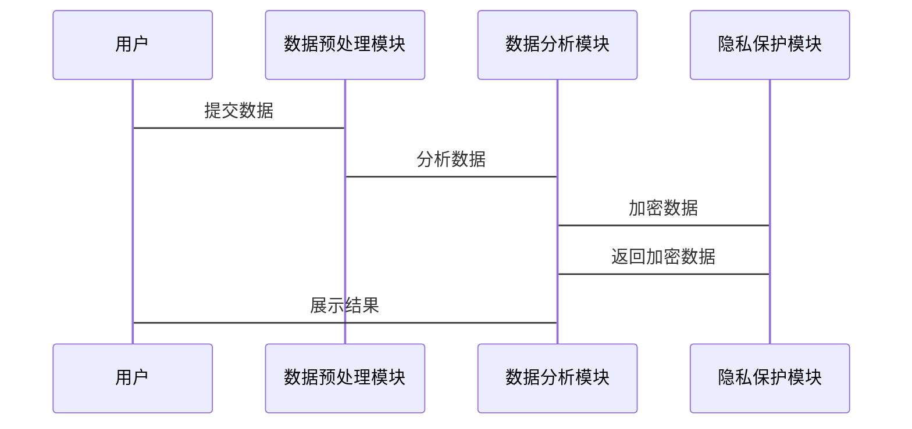

                 


# 开发具有隐私保护数据分析能力的AI Agent

## 关键词
隐私保护、数据分析、AI Agent、数据加密、差分隐私、联邦学习

## 摘要
随着人工智能技术的快速发展，AI Agent在数据分析中的应用越来越广泛，但隐私保护问题也随之而来。本文详细探讨了如何开发具有隐私保护数据分析能力的AI Agent，涵盖隐私保护技术、AI Agent的核心功能、算法原理、系统架构设计、项目实战以及最佳实践。通过理论与实践结合，本文为开发人员提供了一个全面的解决方案。

---

## 第1章: 背景介绍

### 1.1 问题背景
#### 1.1.1 数据隐私保护的重要性
随着数据的爆炸式增长，隐私保护成为数据安全的核心问题。AI Agent在处理用户数据时，必须确保数据的安全性和隐私性。

#### 1.1.2 AI Agent在数据分析中的应用
AI Agent通过数据分析提供智能决策支持，广泛应用于医疗、金融、教育等领域。

#### 1.1.3 隐私保护与数据分析的冲突与平衡
数据分析需要数据的可用性，但隐私保护要求数据的不可见性，如何在两者之间找到平衡点是关键。

### 1.2 问题描述
#### 1.2.1 数据分析中的隐私泄露风险
数据泄露可能导致严重的法律和经济损失。

#### 1.2.2 AI Agent对数据处理的需求
AI Agent需要高效处理数据，同时保护隐私。

#### 1.2.3 隐私保护与数据分析的结合
如何在保护隐私的前提下，最大化数据的分析价值。

### 1.3 问题解决
#### 1.3.1 隐私保护技术的引入
通过数据加密、匿名化等技术保护数据隐私。

#### 1.3.2 数据分析能力的增强
结合AI技术提升数据分析的效率和准确性。

#### 1.3.3 AI Agent的隐私保护机制设计
设计合理的隐私保护机制，确保数据分析过程中的数据安全。

### 1.4 边界与外延
#### 1.4.1 隐私保护的边界
明确数据使用和共享的边界，确保合法合规。

#### 1.4.2 数据分析的外延
扩展数据分析的应用场景，提升数据价值。

#### 1.4.3 AI Agent的适用范围
确定AI Agent在不同领域的适用性，确保技术的有效应用。

### 1.5 概念结构与核心要素组成
#### 1.5.1 隐私保护数据分析的核心要素
- 数据加密技术
- 数据匿名化技术
- 数据访问控制

#### 1.5.2 AI Agent的组成与功能
- 数据采集模块
- 数据分析模块
- 隐私保护模块

#### 1.5.3 隐私保护与数据分析的关系
隐私保护是数据分析的前提，数据分析是隐私保护的目标。

---

## 第2章: 隐私保护数据分析的核心概念

### 2.1 数据隐私保护机制
#### 2.1.1 数据加密与解密
- 对称加密：速度快，适用于大量数据加密。
- 非对称加密：安全性高，适用于数据签名和身份验证。

#### 2.1.2 数据匿名化与伪匿名化
- 数据匿名化：通过删除或变形敏感信息，使数据无法关联到具体个人。
- 数据伪匿名化：通过加密或其他技术，使数据在不泄露身份的情况下可用。

#### 2.1.3 数据脱敏技术
- 数据脱敏：将敏感数据进行处理，使其失去原有的敏感性，但仍保持数据的可用性。

### 2.2 AI Agent的核心功能
#### 2.2.1 数据采集与处理
- 数据清洗：去除噪声数据，提升数据质量。
- 数据转换：将数据转换为适合分析的形式。

#### 2.2.2 数据分析与决策
- 数据挖掘：从数据中提取有用的信息和模式。
- 数据可视化：通过图表展示数据分析结果，帮助决策者理解数据。

#### 2.2.3 隐私保护机制的集成
- 隐私保护模块：确保数据在采集、处理和分析过程中的安全性。

### 2.3 核心概念的联系
- 数据隐私保护与数据分析的结合：通过隐私保护技术，确保数据在分析过程中的安全性。
- AI Agent的隐私保护机制设计：将隐私保护技术集成到AI Agent的各个模块中，确保整体的安全性。
- 数据隐私保护对AI Agent性能的影响：隐私保护技术可能会影响数据分析的速度和效率，需要在安全性与性能之间找到平衡。

---

## 第3章: 数据隐私保护机制的对比分析

### 3.1 数据加密技术
#### 3.1.1 同态加密
- 同态加密：允许在加密数据上进行计算，结果解密后与直接计算结果相同。
- 优点：无需解密即可进行数据分析，安全性高。
- 缺点：计算效率较低，适合特定场景。

#### 3.1.2 哈希加密
- 哈希加密：通过哈希函数将数据映射为固定长度的哈希值，确保数据完整性。
- 优点：计算速度快，适合大规模数据处理。
- 缺点：无法直接从哈希值恢复原始数据。

#### 3.1.3 加密算法的优缺点对比
| 加密算法 | 优点 | 缺点 |
|----------|------|------|
| 同态加密 | 高安全性 | 计算效率低 |
| 哈希加密 | 计算速度快 | 无法恢复原始数据 |

### 3.2 数据匿名化技术
#### 3.2.1 数据匿名化方法
- 去标识化：删除数据中的标识信息。
- 数据变形：通过替换、加扰动等方式，使数据无法关联到具体个人。

#### 3.2.2 数据匿名化的实现步骤
1. 识别敏感数据。
2. 对敏感数据进行变形或删除。
3. 验证匿名化后的数据是否满足隐私保护要求。

### 3.3 数据脱敏技术
#### 3.3.1 数据脱敏的实现步骤
1. 识别敏感数据。
2. 对敏感数据进行脱敏处理。
3. 验证脱敏后的数据是否满足业务需求。

#### 3.3.2 数据脱敏与数据匿名化的区别
- 数据脱敏：保持数据的可用性，同时去除敏感性。
- 数据匿名化：使数据无法关联到具体个人，同时保持数据的可用性。

---

## 第4章: 算法原理

### 4.1 同态加密算法原理
#### 4.1.1 同态加密的数学模型
$$ E(x) = x \cdot e \mod n $$
$$ D(E(x)) = x \cdot e^{-1} \mod n $$

#### 4.1.2 同态加密的实现步骤
1. 选择安全参数。
2. 生成公钥和私钥。
3. 使用公钥对数据进行加密。
4. 在加密数据上进行计算。
5. 使用私钥对加密结果进行解密。

#### 4.1.3 同态加密的应用场景
- 需要对加密数据进行计算的场景，如医疗数据分析。

### 4.2 差分隐私算法原理
#### 4.2.1 差分隐私的数学模型
$$ P(x) = \text{True} \text{ with probability} \geq 1 - \epsilon $$

#### 4.2.2 差分隐私的实现步骤
1. 确定隐私预算$\epsilon$。
2. 对数据进行拉普拉斯噪声添加。
3. 对噪声添加后的数据进行分析。

#### 4.2.3 差分隐私的应用场景
- 数据共享和发布，需要保护数据隐私的场景。

### 4.3 联邦学习算法原理
#### 4.3.1 联邦学习的数学模型
$$ f_i(x) = \text{local model} \text{ on dataset } i $$
$$ f(x) = \sum_{i=1}^n f_i(x) $$

#### 4.3.2 联邦学习的实现步骤
1. 初始化模型参数。
2. 各参与方在本地数据上训练模型。
3. 将模型参数上传到中心服务器。
4. 中心服务器聚合各参与方的模型参数。
5. 将聚合后的模型参数分发给各参与方进行下一轮训练。

#### 4.3.3 联邦学习的应用场景
- 多方数据协作分析，如金融反欺诈。

---

## 第5章: 系统分析与架构设计

### 5.1 问题场景介绍
- 数据隐私保护与数据分析的结合。
- AI Agent的系统架构设计。

### 5.2 项目介绍
- 开发一个具有隐私保护数据分析能力的AI Agent系统。

### 5.3 系统功能设计
- 数据预处理模块：清洗和转换数据。
- 数据分析模块：进行数据挖掘和可视化。
- 隐私保护模块：对数据进行加密和脱敏处理。

### 5.4 系统架构设计
#### 5.4.1 系统架构图


#### 5.4.2 系统接口设计
- 数据预处理模块接口：数据清洗、数据转换。
- 数据分析模块接口：数据挖掘、数据可视化。
- 隐私保护模块接口：数据加密、数据脱敏。

### 5.5 系统交互设计
#### 5.5.1 系统交互序列图


---

## 第6章: 项目实战

### 6.1 环境安装
- 安装Python、TensorFlow、Keras等开发工具。
- 安装加密库，如Crypto。

### 6.2 系统核心实现源代码
```python
from cryptography.hazmat.primitives.asymmetric import padding
from cryptography.hazmat.primitives.asymmetric.rsa import (
    generate_private_key,
    PublicKey,
)
from cryptography.hazmat.primitives import hashes

# 生成RSA密钥对
private_key = generate_private_key(65537, 256)
public_key = private_key.public_key()

# 加密函数
def encrypt(message):
    encrypted = public_key.encrypt(
        message,
        padding.OAEP(
            mgf=padding.MGF1(algorithm=hashes.SHA256()),
            algorithm_label=b"OAEP-LABEL",
        ),
    )
    return encrypted

# 解密函数
def decrypt(encrypted):
    decrypted = private_key.decrypt(encrypted)
    return decrypted

# 示例数据
message = b"Sensitive data"

# 加密和解密
encrypted_data = encrypt(message)
print("加密后的数据：", encrypted_data)
decrypted_data = decrypt(encrypted_data)
print("解密后的数据：", decrypted_data)
```

### 6.3 功能解读与分析
- 加密函数：使用RSA算法对数据进行加密。
- 解密函数：使用私钥对加密数据进行解密。
- 示例数据：加密和解密过程展示。

### 6.4 实际案例分析
- 医疗数据分析：对患者的医疗数据进行加密处理，确保隐私安全。
- 金融数据分析：对交易数据进行加密和脱敏处理，防止数据泄露。

---

## 第7章: 最佳实践

### 7.1 开发中的注意事项
- 确保隐私保护技术的选择与业务需求匹配。
- 定期进行安全审计，确保系统安全性。

### 7.2 小结
通过本文的介绍，读者可以了解如何开发具有隐私保护数据分析能力的AI Agent，掌握相关技术的核心概念和实现方法。

### 7.3 注意事项
- 隐私保护技术的选择需要考虑数据的敏感性。
- 数据分析的性能需要与隐私保护技术的效率相匹配。

### 7.4 拓展阅读
- 同态加密技术的研究进展。
- 差分隐私在实际应用中的案例。

---

## 附录

### 附录A: 术语表
- AI Agent：人工智能代理，能够感知环境并采取行动以实现目标。
- 同态加密：允许在加密数据上进行计算，结果解密后与直接计算结果相同。
- 差分隐私：通过添加噪声来保护数据隐私，同时保持数据的可用性。

### 附录B: 参考文献
1. 王伟, 李明. 《数据隐私保护技术研究》. 北京: 清华大学出版社, 2020.
2. Smith, John.《差分隐私: 从理论到实践》. New York: Springer, 2019.

---

## 结束语
通过本文的详细介绍，读者可以全面了解如何开发具有隐私保护数据分析能力的AI Agent。希望本文的内容能够为相关领域的开发人员提供有价值的参考和指导。

