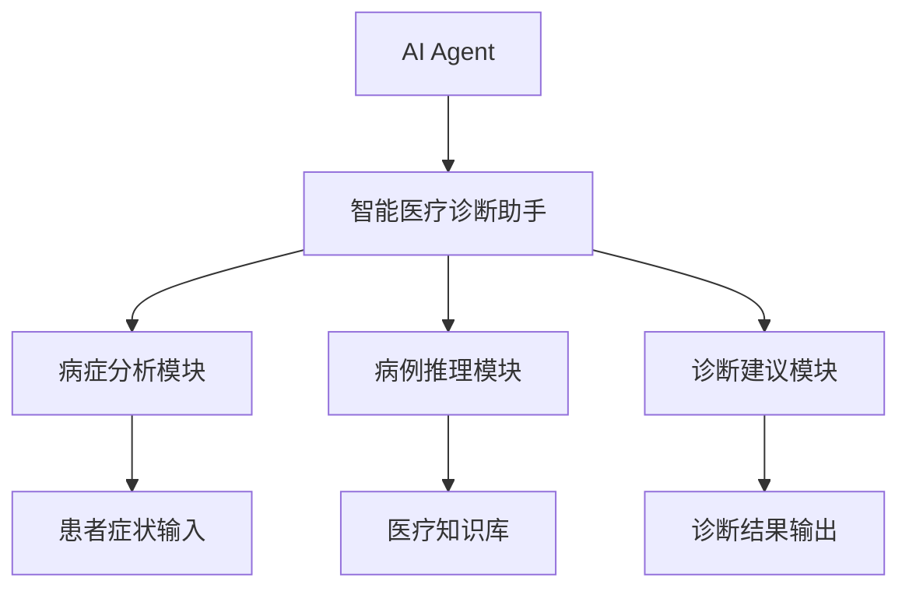
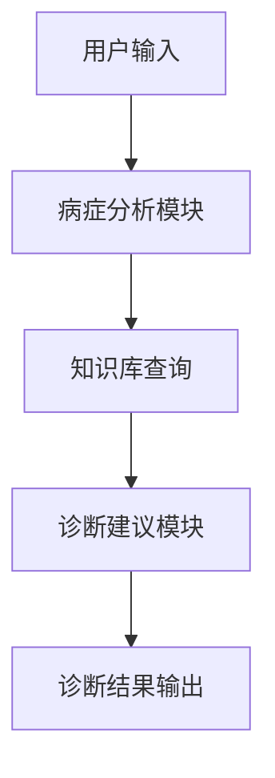
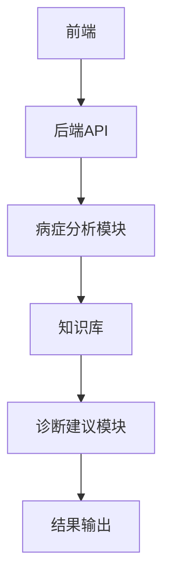
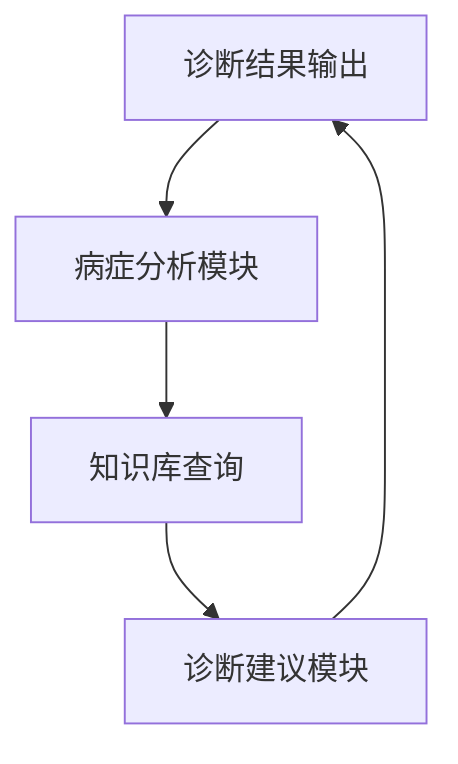

                 


# 开发基于AI Agent的智能医疗诊断助手

---

## 关键词

AI Agent, 智能医疗, 诊断助手, 生成式AI, 医疗诊断

---

## 摘要

医疗诊断是一项复杂且责任重大的任务，传统的诊断方式依赖于医生的经验和知识，而随着人工智能技术的快速发展，AI Agent（智能体）在医疗诊断中的应用逐渐成为可能。本文将从AI Agent的核心概念出发，详细探讨其在智能医疗诊断助手中的应用价值，分析其算法原理与数学模型，并结合实际案例，深入讲解智能医疗诊断助手的系统设计与实现过程。通过本文的分析，读者将能够理解AI Agent在医疗诊断中的独特优势，掌握其在智能医疗诊断助手中的具体应用，并为未来的医疗AI技术创新提供有价值的参考。

---

## 第一部分：AI Agent与智能医疗诊断助手的背景与概念

### 第1章：AI Agent与智能医疗诊断助手的背景介绍

#### 1.1 AI Agent的核心概念

##### 1.1.1 从传统AI到AI Agent的演进

人工智能（AI）技术的发展经历了多个阶段，从传统的基于规则的AI到现在的生成式AI，每一次技术的进步都为AI Agent的出现奠定了基础。AI Agent是一种能够感知环境、自主决策并执行任务的智能体，它结合了自然语言处理（NLP）、机器学习（ML）和知识图谱等技术，能够以人类可理解的方式与用户交互，并提供个性化的解决方案。

##### 1.1.2 AI Agent的定义与特点

AI Agent可以被定义为一种智能系统，它能够通过传感器或用户输入感知环境，利用内部的知识库和算法进行推理和决策，并通过执行器或输出模块与外部环境交互。AI Agent的核心特点包括：

- **自主性**：能够在没有人工干预的情况下自主运行。
- **反应性**：能够实时感知环境变化并做出响应。
- **学习能力**：能够通过数据不断优化自身的决策能力。
- **可解释性**：能够提供人类可理解的决策过程和结果。

##### 1.1.3 AI Agent在医疗领域的应用背景

医疗领域对AI Agent的需求日益增长。医生每天需要处理大量的患者数据，包括病史、症状、检查结果等，而AI Agent能够帮助医生快速分析这些数据，提供诊断建议和治疗方案。特别是在面对复杂病例时，AI Agent可以通过其强大的数据处理能力和知识库，辅助医生做出更准确的诊断。

#### 1.2 智能医疗诊断助手的定义与目标

##### 1.2.1 智能医疗诊断助手的定义

智能医疗诊断助手是一种基于AI Agent技术的医疗辅助工具，它能够通过自然语言处理和机器学习算法，分析患者的症状、病史和检查结果，提供可能的诊断建议和治疗方案。智能医疗诊断助手的目标是帮助医生提高诊断效率和准确性，同时为患者提供个性化的医疗建议。

##### 1.2.2 智能医疗诊断助手的目标与价值

智能医疗诊断助手的主要目标包括：

- **提高诊断效率**：通过自动化分析患者的症状和病史，缩短诊断时间。
- **提高诊断准确性**：利用大数据和机器学习算法，减少人为错误。
- **辅助医生决策**：为医生提供多维度的诊断建议，帮助其做出更明智的决策。
- **改善患者体验**：通过个性化的医疗建议和即时反馈，提升患者的满意度。

##### 1.2.3 医疗诊断助手的边界与外延

智能医疗诊断助手的应用范围不仅限于诊断阶段，还可能扩展到治疗方案制定、药物推荐、病情监测等领域。然而，目前的智能医疗诊断助手主要专注于诊断阶段，未来可能会进一步扩展其功能，涵盖整个医疗过程。

#### 1.3 问题背景与解决方案

##### 1.3.1 医疗诊断中的痛点与挑战

医疗诊断是一个复杂的过程，医生需要考虑大量的因素，包括患者的症状、病史、实验室检查结果、影像学检查结果等。然而，医生的时间有限，尤其是在繁忙的医疗环境中，医生往往需要快速做出决策，这可能导致误诊或漏诊。

##### 1.3.2 AI Agent如何解决医疗诊断问题

AI Agent能够通过自然语言处理和机器学习算法，快速分析患者的症状和病史，并结合知识库中的医学知识，提供可能的诊断建议。AI Agent不仅能够提高诊断效率，还能够减少人为错误，从而提高诊断准确性。

##### 1.3.3 智能医疗诊断助手的核心要素组成

智能医疗诊断助手的核心要素包括：

- **自然语言处理模块**：用于理解和解析患者的症状描述。
- **知识库**：包含医学知识、疾病症状、药物信息等。
- **推理引擎**：用于根据输入的信息和知识库进行推理，生成诊断建议。
- **用户界面**：用于与用户交互，输出诊断结果。

### 第2章：AI Agent与智能医疗诊断助手的核心概念与联系

#### 2.1 AI Agent的核心原理

##### 2.1.1 生成式AI的基本原理

生成式AI是一种基于深度学习的技术，其核心是生成对抗网络（GAN）和变体自编码器（VAE）。生成式AI能够通过训练数据生成新的数据，例如文本、图像等。在医疗诊断中，生成式AI可以用于生成诊断报告或模拟患者的症状描述。

##### 2.1.2 监督式学习与无监督学习的对比

监督式学习是一种基于标记数据的机器学习方法，其核心是通过训练数据中的标签信息，学习输入与输出之间的映射关系。无监督学习则是在没有标签数据的情况下，通过数据的内在结构进行学习。在医疗诊断中，监督式学习适用于有标签的数据，例如已知诊断结果的病例；无监督学习适用于无标签的数据，例如患者的症状描述。

##### 2.1.3 AI Agent的决策机制与推理能力

AI Agent的决策机制基于其内部的知识库和推理引擎。知识库包含了丰富的医学知识，例如疾病症状、药物信息等。推理引擎通过逻辑推理和模式匹配，生成可能的诊断建议。

#### 2.2 智能医疗诊断助手的功能模块

##### 2.2.1 病症分析模块

病症分析模块是智能医疗诊断助手的核心模块之一。它通过自然语言处理技术，分析患者的症状描述，提取关键信息，并结合知识库中的医学知识，生成初步的诊断建议。

##### 2.2.2 病例推理模块

病例推理模块负责根据患者的症状和病史，结合知识库中的疾病症状，进行逻辑推理，生成可能的诊断结果。该模块通常采用基于规则的推理或基于机器学习的推理。

##### 2.2.3 诊断建议模块

诊断建议模块根据推理结果，生成具体的诊断建议，包括可能的疾病名称、诊断概率、进一步检查建议等。该模块通常需要结合知识库中的诊断标准和临床指南。

#### 2.3 AI Agent与智能医疗诊断助手的实体关系图



---

## 第二部分：AI Agent的算法原理与数学模型

### 第3章：AI Agent的算法原理与数学模型

#### 3.1 生成式AI的算法原理

##### 3.1.1 大语言模型的基本原理

大语言模型（LLM）是一种基于Transformer架构的生成式模型，其核心是通过自注意力机制（Self-Attention）捕捉文本中的语义信息，并通过解码器生成目标输出。大语言模型的核心公式如下：

$$
\text{Attention}(Q, K, V) = \text{softmax}\left(\frac{QK^T}{\sqrt{d_k}}\right)V
$$

其中，$Q$ 是查询向量，$K$ 是键向量，$V$ 是值向量，$d_k$ 是键向量的维度。

##### 3.1.2 Transformer模型的结构与特点

Transformer模型由编码器和解码器两部分组成，编码器负责将输入序列映射到一个中间表示，解码器负责根据编码器的输出生成目标序列。Transformer模型的核心公式如下：

$$
\text{Encoder} = \text{LayerNorm}( \text{MultiHeadAttention}(\text{Input}) + \text{Input} )
$$

$$
\text{Decoder} = \text{LayerNorm}( \text{MultiHeadAttention}(\text{Encoder}, \text{Decoder}) + \text{Decoder} )
$$

##### 3.1.3 梯度下降与损失函数的优化

生成式AI的训练过程通常采用梯度下降优化算法，通过最小化损失函数来优化模型参数。常用的损失函数包括交叉熵损失和KL散度损失。

交叉熵损失的公式为：

$$
\text{Loss} = -\sum_{i=1}^{n} y_i \log(p_i) + (1 - y_i)\log(1 - p_i)
$$

其中，$y_i$ 是标签，$p_i$ 是模型的预测概率。

#### 3.2 AI Agent的数学模型与公式

##### 3.2.1 概率分布与条件概率

在生成式AI中，条件概率是一个重要的概念。条件概率公式为：

$$
P(y|x) = \frac{P(x|y)P(y)}{P(x)}
$$

其中，$P(y|x)$ 是在给定$x$的情况下，$y$的概率。

##### 3.2.2 损失函数的计算

在训练生成式AI模型时，损失函数通常采用交叉熵损失。对于二分类问题，交叉熵损失的公式为：

$$
\text{Loss} = -\sum_{i=1}^{n} y_i \log(p_i) + (1 - y_i)\log(1 - p_i)
$$

##### 3.2.3 模型训练的数学推导

生成式AI的训练过程通常采用最大似然估计（MLE）或最大后验概率估计（MAP）。MLE的目标是最大化训练数据的条件概率：

$$
\theta = \arg\max \sum_{i=1}^{n} \log P_\theta(x_i, y_i)
$$

---

## 第三部分：智能医疗诊断助手的系统分析与架构设计

### 第4章：智能医疗诊断助手的系统分析与架构设计

#### 4.1 系统功能设计

##### 4.1.1 系统功能模块划分

智能医疗诊断助手的功能模块包括：

- **用户输入模块**：接收患者的症状描述。
- **病症分析模块**：分析症状，提取关键信息。
- **病例推理模块**：结合知识库，生成诊断建议。
- **诊断建议模块**：输出诊断结果和进一步检查建议。

##### 4.1.2 系统功能流程图



#### 4.2 系统架构设计

##### 4.2.1 系统架构图

智能医疗诊断助手的系统架构包括前端和后端两部分。前端负责与用户交互，后端负责处理业务逻辑和数据存储。



##### 4.2.2 接口设计

智能医疗诊断助手的接口设计包括：

- **输入接口**：接收患者的症状描述。
- **输出接口**：输出诊断结果和建议。
- **知识库接口**：与医学知识库进行交互。

#### 4.3 交互设计

##### 4.3.1 交互流程图

智能医疗诊断助手的交互流程如下：

1. 用户输入症状描述。
2. 系统调用病症分析模块，提取关键信息。
3. 系统查询知识库，生成诊断建议。
4. 系统输出诊断结果和建议。



---

## 第四部分：项目实战

### 第5章：项目实战

#### 5.1 环境安装与配置

要运行智能医疗诊断助手，需要安装以下环境和工具：

- **Python 3.8+**
- **TensorFlow或PyTorch**
- **Hugging Face Transformers库**
- **Jupyter Notebook**

#### 5.2 系统核心实现

##### 5.2.1 病症分析模块的实现

以下是病症分析模块的Python代码示例：

```python
import transformers

model_name = "bert-base-uncased"
tokenizer = transformers.AutoTokenizer.from_pretrained(model_name)
model = transformers.AutoModelForPreTraining.from_pretrained(model_name)

def analyze_symptoms(symptoms):
    inputs = tokenizer.encode_plus(symptoms, return_tensors="pt", padding=True, truncation=True)
    outputs = model(**inputs)
    return outputs.last_hidden_state
```

##### 5.2.2 病例推理模块的实现

以下是病例推理模块的Python代码示例：

```python
from transformers import AutoModelForSeq2Seq

model_name = "facebook/m2m-100-base"
model = AutoModelForSeq2Seq.from_pretrained(model_name)

def infer_diagnosis(symptoms):
    inputs = tokenizer.encode_plus(symptoms, return_tensors="pt", padding=True, truncation=True)
    outputs = model.generate(inputs.input_ids, max_length=50)
    return tokenizer.decode(outputs[0], skip_special_tokens=True)
```

#### 5.3 代码应用解读与分析

##### 5.3.1 病症分析模块的代码解读

上述代码使用了BERT模型对患者的症状描述进行编码，并提取其语义向量。这些向量可以用于后续的诊断推理。

##### 5.3.2 病例推理模块的代码解读

上述代码使用了Facebook的M2M模型，对患者的症状描述进行翻译和推理，生成可能的诊断结果。

#### 5.4 实际案例分析与详细讲解

##### 5.4.1 案例背景

假设患者描述症状为“持续咳嗽、发热、胸痛”，系统需要分析这些症状，并生成可能的诊断建议。

##### 5.4.2 系统分析过程

1. 病症分析模块提取关键信息：咳嗽、发热、胸痛。
2. 病例推理模块结合知识库，推理可能的诊断：肺炎、肺结核、肺癌等。
3. 诊断建议模块根据推理结果，生成诊断建议：建议进行胸部X光检查、痰液检查等。

#### 5.5 项目小结

通过上述实现，智能医疗诊断助手能够快速分析患者的症状，并结合医学知识生成诊断建议，大大提高了诊断效率和准确性。

---

## 第五部分：总结与展望

### 第6章：总结与展望

#### 6.1 总结

本文详细探讨了AI Agent在智能医疗诊断助手中的应用，分析了其算法原理与系统架构，并通过实际案例展示了系统的实现过程。AI Agent的引入为医疗诊断带来了新的可能性，能够显著提高诊断效率和准确性。

#### 6.2 展望

未来，随着AI技术的不断进步，智能医疗诊断助手的功能将更加完善，可能扩展到治疗方案制定、药物推荐等领域。同时，AI Agent的可解释性问题也将得到进一步研究，以提高其在医疗领域的可信度和应用范围。

---

## 致谢

感谢读者的耐心阅读，希望本文能够为AI Agent在医疗诊断中的应用提供有价值的参考。

